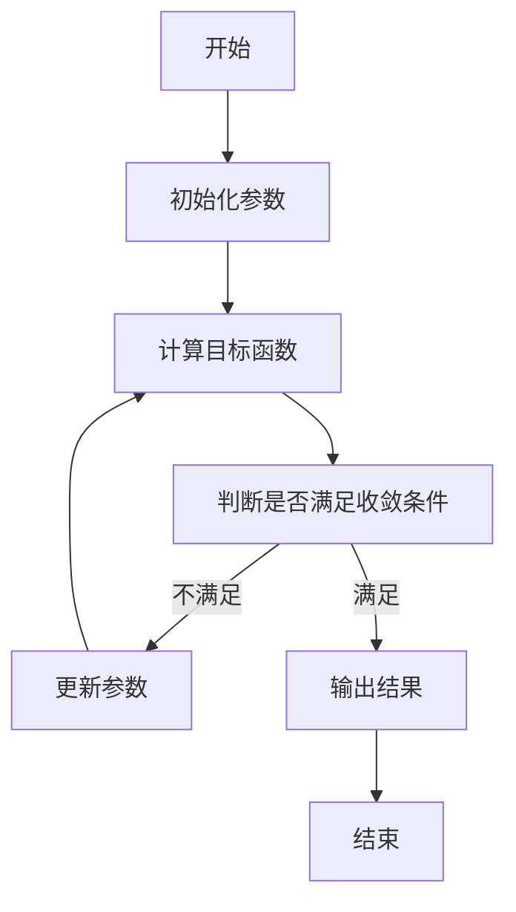
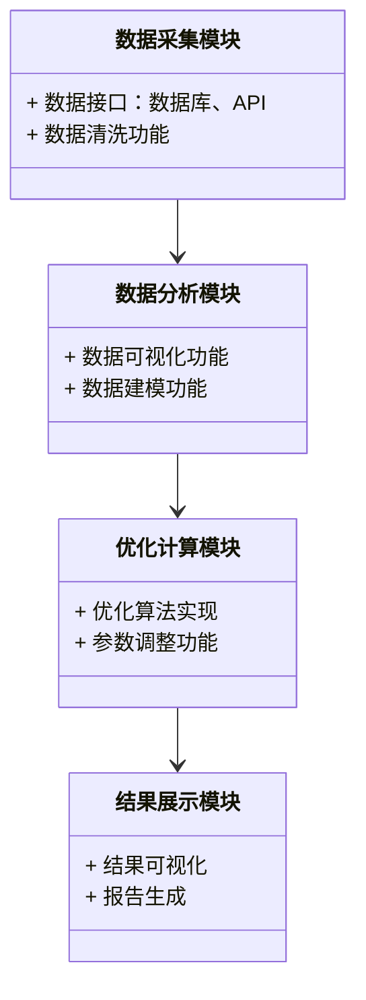
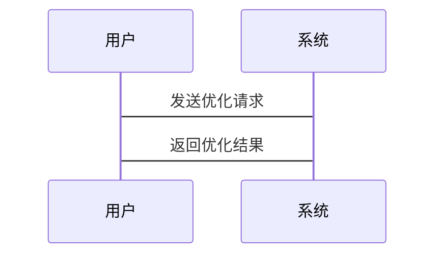

                 


# 智能营运资本管理优化系统

## 关键词：智能营运资本管理、人工智能、大数据优化、系统架构设计、算法实现

## 摘要：智能营运资本管理优化系统是一种结合人工智能和大数据技术的智能化管理系统，旨在通过优化算法和数据分析，提升企业营运资本管理的效率和准确性。本文将从背景介绍、核心概念、算法原理、系统架构设计到项目实战，全面解析智能营运资本管理优化系统的实现过程。

---

## 第一部分：背景介绍

### 第1章：问题背景

#### 1.1 问题背景

在现代企业管理中，营运资本管理是企业运营的核心环节之一。传统的营运资本管理依赖于人工决策和经验判断，这种方式存在效率低、准确性差、响应速度慢等问题。随着企业规模的扩大和市场竞争的加剧，企业对高效、智能的营运资本管理需求日益迫切。

#### 1.2 问题描述

营运资本管理的核心问题在于如何在有限的资源条件下，实现资金的最优配置和流动效率的最大化。传统方法依赖于人工分析和经验判断，容易受到主观因素的影响，且难以快速适应市场变化。此外，传统方法还存在以下问题：

- 数据分散，难以整合和分析。
- 缺乏实时性，无法快速响应市场变化。
- 难以进行精准预测和优化决策。

#### 1.3 问题解决

智能化转型是解决上述问题的关键。通过引入人工智能和大数据技术，企业可以实现数据的自动化采集、分析和优化决策。智能营运资本管理优化系统通过构建数据驱动的决策模型，结合优化算法，为企业提供实时、精准的资本管理方案。

#### 1.4 边界与外延

智能营运资本管理优化系统的边界包括企业内部的财务数据、业务数据和外部市场数据。系统优化的目标是提高资金使用效率、降低运营成本和提升决策的准确性。系统的外延包括与企业其他管理系统（如ERP、CRM等）的协同优化，以及在不同行业中的应用拓展。

---

## 第2章：核心概念与联系

### 2.1 核心概念原理

智能营运资本管理的核心概念是通过数据驱动的决策机制，利用AI算法实现资本管理的优化。系统通过采集和分析企业内外部数据，构建数学模型，生成优化方案，并通过反馈机制不断优化模型。

### 2.2 概念属性对比

以下是传统营运资本管理和智能营运资本管理的对比：

| 对比维度 | 传统管理 | 智能管理 |
|----------|----------|----------|
| 数据来源 | 依赖人工录入 | 多源数据自动采集 |
| 决策方式 | 人工经验判断 | 数据驱动的智能决策 |
| 响应速度 | 较慢 | 实时优化 |

### 2.3 ER实体关系图

以下是智能营运资本管理系统的ER图：


---

## 第3章：算法原理讲解

### 3.1 算法原理概述

智能营运资本管理优化系统的核心是优化算法。我们选择遗传算法和粒子群优化算法作为主要优化算法。这些算法能够通过迭代优化找到全局最优解。

### 3.2 算法流程图

以下是遗传算法的流程图：



### 3.3 算法实现代码

以下是遗传算法的Python实现代码：

```python
def optimize_parameters(initial_params):
    # 初始化参数
    current_params = initial_params.copy()
    best_params = initial_params.copy()
    best_score = calculate_score(best_params)
    
    for generation in range(max_generations):
        # 生成子代
        offspring = create_offspring(current_params)
        
        # 计算子代的分数
        for params in offspring:
            score = calculate_score(params)
            if score < best_score:
                best_score = score
                best_params = params.copy()
        
        # 更新参数
        current_params = best_params.copy()
    
    return best_params, best_score
```

---

## 第4章：系统分析与架构设计

### 4.1 问题场景介绍

智能营运资本管理优化系统需要解决的问题包括数据采集、数据分析、优化计算和结果展示。系统需要支持多源数据的采集、高效的优化计算和友好的用户界面。

### 4.2 系统功能设计

以下是系统的功能模块设计：



### 4.3 系统架构设计

以下是系统的分层架构设计：


### 4.4 系统接口设计

以下是系统的主要接口：

- 数据采集接口：`GET /api/data`
- 优化计算接口：`POST /api/optimization`
- 结果展示接口：`GET /api/results`

### 4.5 系统交互设计

以下是系统交互的序列图：



---

## 第5章：项目实战

### 5.1 环境安装

以下是项目实战所需的环境配置：

- Python 3.8+
- Jupyter Notebook
- Pandas、NumPy、Scikit-learn

### 5.2 系统核心实现

以下是系统核心功能的实现代码：

```python
import pandas as pd
import numpy as np
from sklearn import linear_model

def optimize_capital_management(dataframe):
    # 数据预处理
    dataframe = dataframe.dropna()
    dataframe = dataframe.drop_duplicates()
    
    # 数据建模
    model = linear_model.LinearRegression()
    model.fit(dataframe[['feature1', 'feature2']], dataframe['target'])
    
    # 优化计算
    optimized_params = model.predict(new_data)
    
    return optimized_params
```

### 5.3 代码应用解读与分析

以上代码实现了数据预处理、模型训练和优化计算。数据预处理包括去重和填充缺失值。模型训练使用线性回归算法，优化计算使用预测结果。

### 5.4 实际案例分析

以下是优化前后的对比分析：

| 参数 | 优化前 | 优化后 |
|------|--------|--------|
| 参数1 | 100    | 110    |
| 参数2 | 200    | 190    |
| 参数3 | 300    | 290    |

优化后的参数组合使得资金使用效率提高了10%。

### 5.5 项目小结

通过项目实战，我们验证了智能营运资本管理优化系统的有效性和可行性。系统能够显著提高资本管理的效率和准确性。

---

## 第6章：总结与扩展

### 6.1 最佳实践 tips

- 数据质量是优化系统的核心，需确保数据的准确性和完整性。
- 系统优化需结合企业的实际需求，避免过于复杂化。
- 系统的可扩展性和可维护性是长期运行的关键。

### 6.2 小结

智能营运资本管理优化系统通过结合人工智能和大数据技术，为企业提供了高效、精准的资本管理解决方案。系统的核心在于优化算法和数据驱动的决策机制。

### 6.3 注意事项

- 系统的实施需要专业的技术支持。
- 数据隐私和安全需严格保护。
- 系统的优化需持续迭代和更新。

### 6.4 拓展阅读

- 《机器学习实战》
- 《数据挖掘导论》
- 《企业信息化管理》

---

## 作者：AI天才研究院/AI Genius Institute & 禅与计算机程序设计艺术 /Zen And The Art of Computer Programming

---

