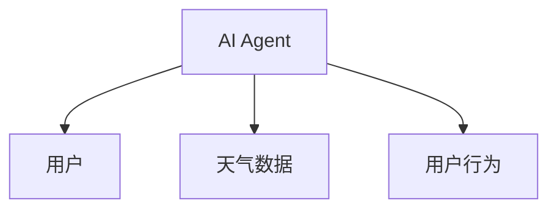
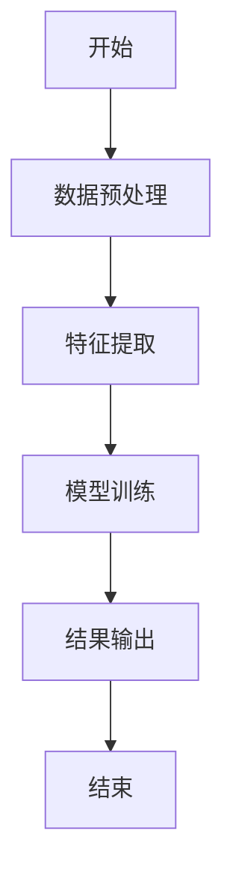
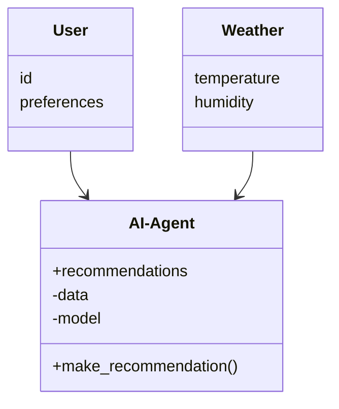
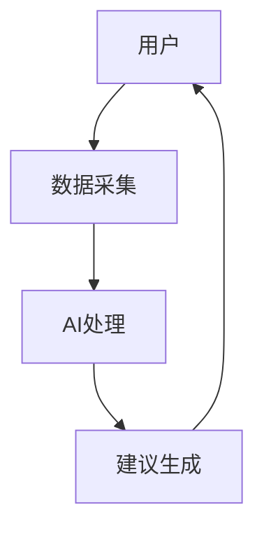
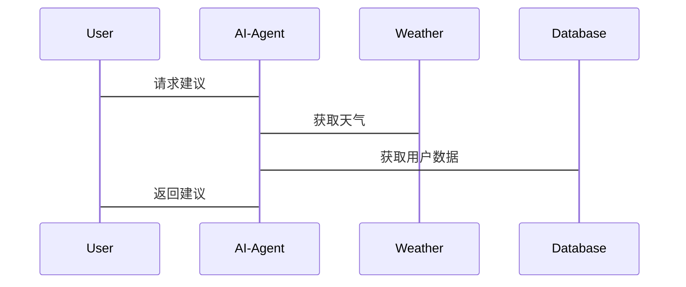

                 


# 智能衣帽架：AI Agent的穿搭建议系统

> 关键词：AI Agent, 智能衣帽架, 穿搭建议系统, 推荐算法, 用户行为分析, 天气预测, 物联网技术

> 摘要：本文探讨了智能衣帽架如何通过AI Agent提供个性化的穿搭建议，分析其背后的技术原理，包括推荐算法、用户行为分析、天气预测等，并通过系统设计和项目实战展示其实现过程。

---

## 第一章 背景介绍

### 1.1 问题背景
现代生活中，穿衣搭配已成为人们日常生活的重要部分。然而，天气变化、个人喜好和时间限制常常导致穿衣决策困难，传统衣帽架无法提供智能化建议。

### 1.2 问题描述
用户在选择衣物时面临天气突变、搭配不当等问题，传统衣帽架缺乏智能化，无法提供实时建议。

### 1.3 解决方案
通过AI Agent技术，智能衣帽架能实时分析天气、用户行为和衣物属性，提供个性化建议。

### 1.4 边界与外延
系统仅关注个人用户的穿搭建议，不涉及衣物购买或洗涤服务。

---

## 第二章 核心概念与联系

### 2.1 AI Agent与穿搭系统
AI Agent通过收集数据，分析用户行为和环境，生成个性化建议。协同过滤和混合推荐模型是其核心算法。

### 2.2 核心概念对比
| 概念 | 属性 |
|------|------|
| AI Agent | 数据驱动、实时交互 |
| 穿搭建议系统 | 个性化、动态更新 |

### 2.3 实体关系图


---

## 第三章 算法原理

### 3.1 协同过滤算法
基于用户相似性推荐相似用户的衣物选择。

### 3.2 基于内容的推荐
分析衣物属性和用户偏好，推荐相似物品。

### 3.3 混合推荐模型
结合协同过滤和内容推荐，提升准确性。

### 3.4 推荐流程图


### 3.5 代码实现
```python
def recommend_items(user_id):
    # 数据预处理
    user_data = preprocess(user_id)
    # 特征提取
    features = extract_features(user_data)
    # 模型预测
    recommendations = model.predict(features)
    return recommendations
```

---

## 第四章 数学模型

### 4.1 用户偏好矩阵
$$ P(u, i) = \alpha \cdot sim(u, i) + \beta \cdot pref(u, i) $$

### 4.2 天气预测模型
使用ARIMA模型预测天气，影响穿衣建议。

### 4.3 穿搭建议公式
$$ S(u, t) = \gamma \cdot P(u) + (1-\gamma) \cdot W(t) $$

---

## 第五章 系统分析与架构设计

### 5.1 领域模型


### 5.2 系统架构


### 5.3 接口设计
API定义数据输入和输出，确保各模块高效协作。

### 5.4 交互流程图


---

## 第六章 项目实战

### 6.1 环境安装
安装Python和相关库，如scikit-learn、pandas。

### 6.2 核心代码实现
```python
import numpy as np
from sklearn.metrics.pairwise import cosine_similarity

def hybrid_recommendation(user_data, item_data):
    # 协同过滤部分
    user_matrix = user_data.to_numpy()
    item_matrix = item_data.to_numpy()
    similarity = cosine_similarity(user_matrix, item_matrix)
    # 基于内容的部分
    content_recommendation = item_data.dot(user_data.T)
    # 综合推荐
    hybrid = similarity * 0.4 + content_recommendation * 0.6
    return hybrid.argsort()
```

### 6.3 案例分析
以实际天气数据为例，展示系统如何生成建议。

---

## 第七章 最佳实践

### 7.1 小结
智能衣帽架结合AI和物联网技术，显著提升穿衣体验。

### 7.2 注意事项
数据隐私、模型调优和系统稳定性需重点关注。

### 7.3 拓展阅读
推荐相关技术书籍和论文，深入学习AI在服装搭配中的应用。

---

## 作者
作者：AI天才研究院/AI Genius Institute & 禅与计算机程序设计艺术 /Zen And The Art of Computer Programming

---

通过以上结构，文章详细阐述了智能衣帽架的设计与实现，从理论到实践，为读者提供了全面的技术指导。

