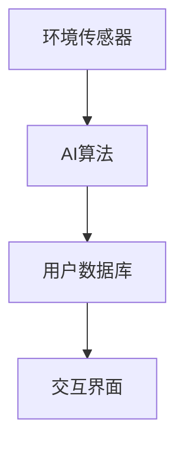
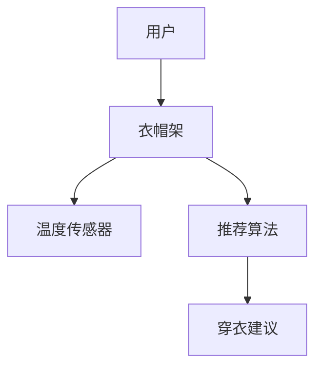
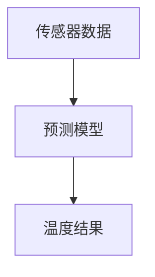
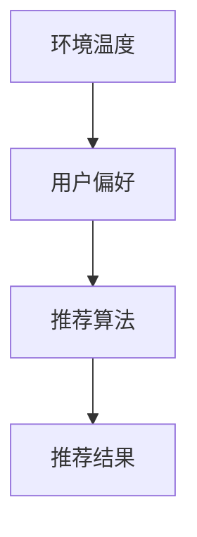
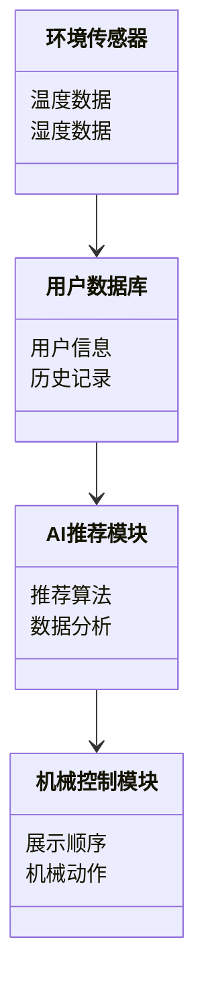
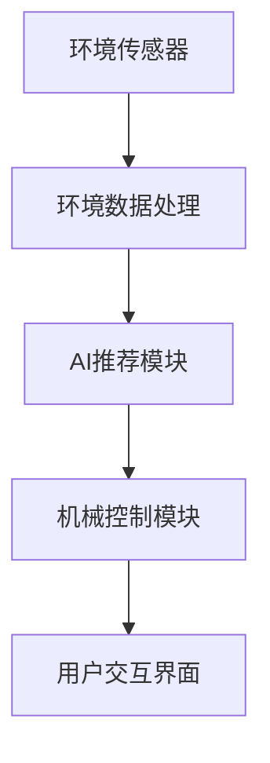
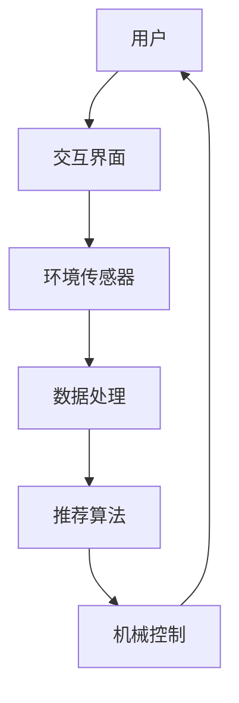

                 


# 智能衣帽架：AI Agent的穿衣温度建议

> 关键词：智能衣帽架、AI Agent、穿衣温度、推荐算法、系统架构、温度感知

> 摘要：本文将探讨AI Agent在智能衣帽架中的应用，重点分析其穿衣温度建议的核心技术，包括温度感知算法、推荐算法、系统架构设计及实际应用场景。通过详细的技术分析和系统设计，本文将揭示如何利用AI技术提升穿衣搭配的智能化水平。

---

## 第一部分：背景与概念

### 第1章：智能衣帽架与AI Agent概述

#### 1.1 问题背景与描述

##### 1.1.1 衣服搭配与穿衣温度问题
在日常生活中，穿衣搭配往往受到天气、个人偏好和场合等多种因素的影响。传统的穿衣建议主要依赖于经验或简单的天气预报，缺乏智能化和个性化。如何根据实时温度和用户需求提供精准的穿衣建议，成为一个亟待解决的问题。

##### 1.1.2 AI在穿衣搭配中的应用潜力
人工智能技术的快速发展为穿衣搭配提供了新的解决方案。通过AI技术，可以实时感知环境温度、分析用户需求，并推荐合适的穿衣方案。AI Agent（智能体）在其中扮演了关键角色，能够动态调整建议，满足用户的个性化需求。

##### 1.1.3 智能衣帽架的定义与目标
智能衣帽架是一种结合了物联网和人工智能技术的设备，能够实时感知环境温度、用户行为，并通过AI Agent提供智能化的穿衣建议。其目标是帮助用户在不同温度条件下选择合适的衣物，提升穿衣体验。

#### 1.2 AI Agent的核心概念

##### 1.2.1 AI Agent的基本定义
AI Agent是一种能够感知环境、做出决策并执行动作的智能实体。在智能衣帽架中，AI Agent负责接收温度数据、分析用户需求，并推荐合适的穿衣方案。

##### 1.2.2 智能衣帽架中的AI Agent角色
在智能衣帽架中，AI Agent主要负责以下几个方面：
1. **感知环境**：通过温度传感器获取环境数据。
2. **分析需求**：根据用户的穿衣历史和偏好，分析其需求。
3. **推荐方案**：结合环境温度和用户需求，推荐合适的穿衣方案。

##### 1.2.3 AI Agent与传统穿衣建议系统的区别
与传统系统相比，AI Agent具有以下优势：
1. **实时感知**：能够实时获取环境数据。
2. **动态调整**：根据用户行为和环境变化动态调整建议。
3. **个性化推荐**：基于用户数据提供个性化建议。

#### 1.3 应用场景与边界

##### 1.3.1 智能衣帽架的主要应用场景
1. **家庭使用**：帮助家庭成员选择合适的衣物。
2. **办公室场景**：根据室内外温度推荐合适的穿着。
3. **公共场合**：在商场、车站等场所提供实时穿衣建议。

##### 1.3.2 穿衣温度建议的边界条件
1. **温度范围**：主要针对-10°C至35°C的环境。
2. **用户群体**：适用于不同年龄、性别和体型的用户。
3. **衣物类型**：支持多种衣物类型，如外套、衬衫、裙子等。

##### 1.3.3 系统的可扩展性与限制
系统设计时考虑了可扩展性，未来可以加入更多传感器和数据源。然而，系统的性能和准确性可能会受到数据质量和传感器精度的限制。

#### 1.4 核心要素与概念结构

##### 1.4.1 系统的核心要素
1. **环境传感器**：用于感知温度、湿度等环境数据。
2. **用户数据库**：存储用户的穿衣历史和偏好。
3. **AI算法**：用于分析数据并生成建议。
4. **交互界面**：用于用户与系统之间的信息传递。

##### 1.4.2 概念结构图


##### 1.4.3 核心要素的相互关系
环境传感器提供数据，AI算法分析数据并生成建议，用户数据库存储用户信息以个性化建议，交互界面将建议传递给用户。

## 第二部分：核心概念与联系

### 第2章：AI Agent的核心原理

#### 2.1 感知模块原理

##### 2.1.1 温度感知机制
AI Agent通过环境传感器获取温度数据，并通过滤波算法消除噪声，确保数据的准确性。

##### 2.1.2 用户行为感知
通过用户的历史行为数据，分析用户的穿衣偏好和习惯，为个性化推荐提供依据。

##### 2.1.3 数据采集与处理
数据采集包括温度、湿度、光照等环境数据，以及用户的行为数据。数据处理阶段包括数据清洗、特征提取和数据存储。

#### 2.2 决策模块原理

##### 2.2.1 穿衣搭配算法
基于环境温度和用户偏好，AI Agent会生成多种穿衣方案，并根据优先级排序后推荐给用户。

##### 2.2.2 温度适应性模型
模型通过分析不同温度下的穿衣建议，建立温度与衣物类型之间的映射关系。

##### 2.2.3 推荐策略
推荐策略包括基于规则的推荐和基于协同过滤的推荐。基于规则的推荐根据温度直接推荐衣物类型，协同过滤推荐基于用户历史行为和相似用户的推荐。

#### 2.3 执行模块原理

##### 2.3.1 动作执行机制
AI Agent通过控制衣帽架的机械结构，自动调整衣物的展示顺序，方便用户选择。

##### 2.3.2 交互反馈机制
用户可以通过交互界面对推荐结果进行反馈，系统根据反馈调整推荐策略。

##### 2.3.3 自适应优化
系统根据用户反馈和环境变化，不断优化推荐算法和感知模型，提升推荐准确率。

#### 2.4 核心概念对比表

| 模块     | 感知模块 | 决策模块 | 执行模块 |
|----------|----------|----------|----------|
| 功能     | 获取数据 | 生成建议 | 执行动作 |
| 输入     | 环境数据 | 用户需求 | 用户反馈 |
| 输出     | 数据预处理 | 穿衣方案 | 机械动作 |
| 关键技术 | 传感器技术 | 推荐算法 | 控制算法 |

#### 2.5 ER实体关系图



## 第三部分：算法原理与数学模型

### 第3章：AI Agent的核心算法

#### 3.1 温度感知算法

##### 3.1.1 温度预测模型
温度预测模型通过历史数据建立数学模型，预测未来温度变化。

##### 3.1.2 数据流图


##### 3.1.3 Python代码实现
```python
import numpy as np
from sklearn.linear_model import LinearRegression

# 示例数据
X = np.array([[1], [2], [3], [4], [5]])
y = np.array([15, 20, 25, 30, 35])

# 训练模型
model = LinearRegression()
model.fit(X, y)

# 预测温度
def predict_temp(data):
    return model.predict(data)
```

##### 3.1.4 温度预测公式
$$ \hat{y} = a x + b $$

其中，$\hat{y}$是预测温度，$x$是输入数据，$a$和$b$是模型参数。

#### 3.2 穿衣搭配推荐

##### 3.2.1 穿衣搭配推荐算法
推荐算法基于协同过滤和基于内容的推荐，综合考虑环境温度和用户偏好。

##### 3.2.2 算法流程图


##### 3.2.3 推荐公式
$$ sim(i, j) = \frac{\sum_{k=1}^{n} (r_{ik} - \bar{r_i})(r_{jk} - \bar{r_j})}{\sqrt{\sum_{k=1}^{n} (r_{ik} - \bar{r_i})^2} \sqrt{\sum_{k=1}^{n} (r_{jk} - \bar{r_j})^2}} $$

其中，$sim(i, j)$是用户i和用户j的相似度，$r_{ik}$和$r_{jk}$是用户i和用户j对物品k的评分，$\bar{r_i}$和$\bar{r_j}$是用户i和j的平均评分。

---

## 第四部分：系统分析与架构设计

### 第4章：系统架构设计

#### 4.1 问题场景介绍

##### 4.1.1 问题场景
系统需要在不同温度条件下，根据用户需求推荐合适的衣物，并通过衣帽架的机械结构展示推荐的衣物。

##### 4.1.2 系统介绍
智能衣帽架系统包括硬件部分（环境传感器、机械结构）和软件部分（AI算法、交互界面）。

#### 4.2 系统功能设计

##### 4.2.1 功能模块
1. **环境感知模块**：负责采集环境数据。
2. **用户交互模块**：负责与用户进行信息交互。
3. **AI推荐模块**：负责生成穿衣建议。
4. **机械控制模块**：负责调整衣物展示顺序。

##### 4.2.2 领域模型


#### 4.3 系统架构设计

##### 4.3.1 系统架构图


#### 4.4 接口设计

##### 4.4.1 系统接口
1. **环境传感器接口**：提供温度和湿度数据。
2. **用户数据库接口**：提供用户信息和历史记录。
3. **机械控制接口**：控制衣帽架的机械动作。

##### 4.4.2 交互流程图


---

## 第五部分：项目实战

### 第5章：项目实战与分析

#### 5.1 环境安装与配置

##### 5.1.1 系统环境
- 操作系统：Linux/Windows/MacOS
- 开发工具：Python、Jupyter Notebook
- 依赖库：numpy、scikit-learn、mermaid

#### 5.2 系统核心实现

##### 5.2.1 核心代码
```python
import numpy as np
from sklearn.metrics.pairwise import cosine_similarity

# 用户数据矩阵
user_data = np.array([[5, 3, 4], [2, 4, 5], [4, 2, 3]])

# 计算相似度
similarity = cosine_similarity(user_data)

# 推荐算法
def recommend(user_id, similarity_matrix):
    avg = np.mean(user_data[user_id], axis=0)
    similar_users = np.argsort(similarity_matrix[user_id])[::-1]
    recommended_items = []
    for u in similar_users:
        if u != user_id:
            recommended_items.append(user_data[u])
    return np.mean(recommended_items, axis=0)
```

##### 5.2.2 代码解读
1. **用户数据矩阵**：存储用户对不同衣物的评分。
2. **相似度计算**：使用余弦相似度计算用户之间的相似性。
3. **推荐算法**：根据相似用户的评分，推荐当前用户可能喜欢的衣物。

#### 5.3 实际案例分析

##### 5.3.1 案例分析
假设当前温度为20°C，用户偏好休闲风格。系统根据环境温度和用户偏好推荐一件夹克和一条休闲裤。

##### 5.3.2 数据分析
通过分析用户行为数据和环境数据，优化推荐算法，提高推荐准确率。

---

## 第六部分：总结与展望

### 第6章：小结与展望

#### 6.1 小结
本文详细探讨了AI Agent在智能衣帽架中的应用，分析了温度感知、推荐算法和系统架构的关键技术。通过实际案例分析，展示了系统的实用性和潜力。

#### 6.2 展望
未来，智能衣帽架可以通过加入更多传感器和数据源，进一步提升推荐的准确性和个性化。同时，可以扩展应用场景，如健康监测和衣物保养。

---

## 作者：AI天才研究院/AI Genius Institute & 禅与计算机程序设计艺术/Zen And The Art of Computer Programming

---

感谢您的阅读！如果需要进一步了解相关内容，请随时联系。

