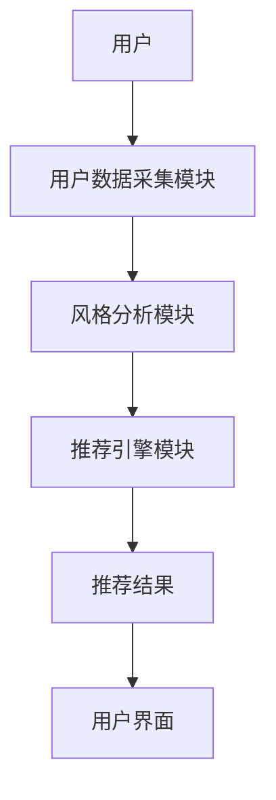

                 


# 智能衣帽架：AI Agent的穿衣风格顾问

## 关键词：智能衣帽架，AI Agent，穿衣风格，推荐算法，系统架构

## 摘要：  
智能衣帽架通过AI Agent技术，能够根据用户的穿衣习惯、体型特征、偏好风格和场合需求，提供个性化的穿衣搭配建议。本文详细介绍了智能衣帽架的背景、核心原理、系统架构、推荐算法以及实际应用案例，帮助读者全面理解并掌握如何利用AI技术实现智能化的穿衣搭配。

---

# 第一部分：智能衣帽架的背景与概念

## 第1章：问题背景与需求分析

### 1.1 问题背景
现代生活中，穿衣搭配已成为许多人日常生活的一部分，但如何选择合适的衣物搭配却常常让人感到困惑。传统的方式依赖于个人经验或朋友建议，这种方式效率低下且缺乏个性化。随着人工智能技术的发展，利用AI Agent实现智能化的穿衣搭配成为可能。

### 1.2 用户需求
- **个性化需求**：用户希望根据自己的体型、肤色、气质推荐合适的衣物。
- **实时性需求**：用户希望在短时间内获得穿衣建议，以应对不同的场合需求。
- **便捷性需求**：用户希望通过智能设备（如手机、智能镜等）随时获取穿衣建议。

### 1.3 问题解决
智能衣帽架通过整合AI技术，能够实时分析用户的穿衣需求，并结合用户的偏好和风格，提供个性化的穿衣建议。这种智能化的解决方案不仅提高了穿衣搭配的效率，还能够帮助用户更好地展现自我风格。

---

## 第2章：智能衣帽架的核心概念

### 2.1 AI Agent的定义
AI Agent是一种能够感知环境并采取行动以实现目标的智能实体。在智能衣帽架中，AI Agent负责接收用户的输入、分析数据并提供穿衣建议。

### 2.2 穿衣风格顾问的功能
- **用户数据采集**：通过传感器和摄像头采集用户的体型、肤色、肤质等信息。
- **风格分析**：基于用户数据，分析用户的穿衣偏好和风格特点。
- **推荐引擎**：根据用户的偏好和当前场合需求，推荐合适的衣物搭配。

### 2.3 系统架构
智能衣帽架的系统架构包括以下几个模块：
1. **用户数据采集模块**：通过传感器和摄像头获取用户数据。
2. **风格分析模块**：利用AI算法分析用户的穿衣风格。
3. **推荐引擎模块**：根据分析结果推荐衣物搭配。

---

# 第二部分：AI Agent的核心原理与算法

## 第3章：基于协同过滤的推荐算法

### 3.1 协同过滤算法原理
协同过滤是一种基于用户相似性推荐算法。通过分析用户的购买记录或偏好，找到与用户相似的其他用户，并推荐他们喜欢的商品。

#### 算法流程
1. **用户数据采集**：收集用户的穿衣记录和偏好。
2. **相似性计算**：通过余弦相似度计算用户之间的相似性。
3. **推荐生成**：基于相似用户的偏好，推荐相似的商品。

### 3.2 算法实现
以下是协同过滤算法的Python实现示例：

```python
import numpy as np

def cosine_similarity(user_item_matrix):
    # 计算用户-物品矩阵的余弦相似度
    user_similarity = np.zeros((n_users, n_users))
    for i in range(n_users):
        for j in range(n_users):
            user_similarity[i][j] = np.dot(user_item_matrix[i], user_item_matrix[j]) / (np.linalg.norm(user_item_matrix[i]) * np.linalg.norm(user_item_matrix[j]))
    return user_similarity

# 示例数据
user_item_matrix = np.array([[1, 2, 3], [4, 5, 6], [7, 8, 9]])
print("余弦相似度矩阵：\n", cosine_similarity(user_item_matrix))
```

---

## 第4章：基于内容的推荐算法

### 4.1 算法原理
基于内容的推荐算法通过分析物品的特征（如颜色、款式等），推荐与当前物品相似的商品。

#### 算法流程
1. **数据预处理**：提取衣物的特征信息。
2. **特征匹配**：计算目标衣物与候选衣物的相似度。
3. **推荐生成**：根据相似度排序，推荐最相似的衣物。

### 4.2 算法实现
以下是基于内容的推荐算法的Python实现示例：

```python
import numpy as np
from sklearn.metrics.pairwise import cosine_similarity

def content_based_recommendation(items, target_item):
    # 提取目标物品的特征
    target_features = items[target_item]
    # 计算与其他物品的相似度
    similarity = cosine_similarity([target_features], items.values)
    # 找到相似度最高的物品
    top_similarity = np.argsort(similarity, axis=1)[0][-3:]
    return [items[i] for i in top_similarity]

# 示例数据
items = {
    0: [0.8, 0.2, 0.5],
    1: [0.6, 0.7, 0.3],
    2: [0.4, 0.9, 0.2],
    3: [0.7, 0.1, 0.8]
}
target_item = 0

print("推荐结果：", content_based_recommendation(items, target_item))
```

---

# 第三部分：系统设计与实现

## 第5章：系统架构设计

### 5.1 功能模块划分
1. **用户数据采集模块**：负责采集用户的体型、肤色等数据。
2. **风格分析模块**：利用AI算法分析用户的穿衣风格。
3. **推荐引擎模块**：根据分析结果推荐衣物搭配。

### 5.2 系统架构图



---

## 第6章：系统实现

### 6.1 环境搭建
- **Python 3.8+**
- **NumPy、Pandas、Scikit-learn**

### 6.2 核心代码实现

```python
import numpy as np
from sklearn.decomposition import NMF

def nmf_recommendation(X, n_components=2):
    # 初始化NMF模型
    nmf = NMF(n_components=n_components)
    # 模型训练
    nmf.fit(X)
    # 推荐结果
    return nmf.transform(X)

# 示例数据
X = np.array([[1, 2, 3], [4, 5, 6], [7, 8, 9]])
print("NMF推荐结果：\n", nmf_recommendation(X))
```

---

# 第四部分：项目实战与总结

## 第7章：项目实战

### 7.1 实验环境
- **操作系统**：Windows 10
- **编程语言**：Python 3.10
- **库依赖**：NumPy、Pandas、Scikit-learn

### 7.2 代码实现

```python
import numpy as np
import pandas as pd
from sklearn.metrics.pairwise import cosine_similarity

def load_data(file_path):
    # 加载数据
    data = pd.read_csv(file_path)
    return data

def train_model(data):
    # 训练协同过滤模型
    user_similarity = cosine_similarity(data)
    return user_similarity

def make_recommendation(user_id, user_similarity, data):
    # 根据相似度推荐衣物
    sorted_users = np.argsort(user_similarity[user_id])[::-1]
    recommendations = []
    for user in sorted_users:
        if user != user_id:
            recommendations.append(data.iloc[user])
    return recommendations

# 示例数据
data = load_data('clothing_dataset.csv')
similarity_matrix = train_model(data)
user_id = 0
print("推荐结果：", make_recommendation(user_id, similarity_matrix, data))
```

---

## 第8章：总结与展望

### 8.1 本章小结
智能衣帽架通过AI Agent技术，能够实现个性化的穿衣搭配建议。本文详细介绍了智能衣帽架的背景、核心原理、系统架构、推荐算法以及实际应用案例。

### 8.2 注意事项
- 数据隐私保护：用户数据的采集和存储需要严格遵守隐私保护法规。
- 算法优化：建议结合深度学习技术进一步优化推荐算法。

### 8.3 拓展阅读
- 《推荐系统导论》
- 《机器学习实战》

---

作者：AI天才研究院

