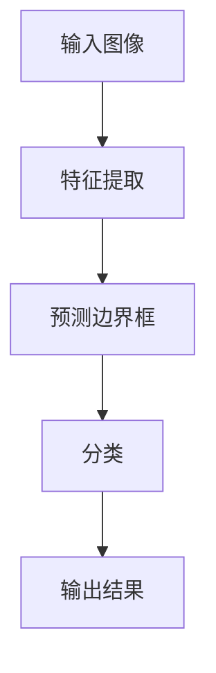
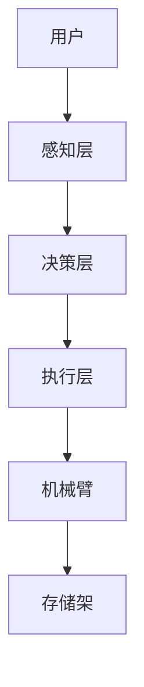

                 


# 智能衣架：AI Agent的衣物保养与存储优化

## 关键词

智能衣架，AI Agent，衣物保养，存储优化，目标检测，分类算法

## 摘要

本文深入探讨了AI Agent在智能衣架中的应用，重点分析了衣物保养与存储优化的核心算法和系统架构设计。通过结合目标检测和分类算法，优化衣物存储策略，提升衣物管理的智能化水平。文章详细讲解了AI Agent的工作原理、系统架构设计、算法实现及其在智能衣架中的实际应用案例。

---

## 正文

### 第一部分：背景介绍

#### 第1章：智能衣架与AI Agent概述

##### 1.1 智能衣架的背景与意义

随着人工智能技术的快速发展，衣物管理领域也迎来了智能化的变革。传统的衣物管理方式存在诸多痛点，例如衣物存储混乱、保养不当导致损坏、存储空间利用不合理等。AI Agent（人工智能代理）作为一种能够自主感知、决策和执行任务的智能体，为解决这些痛点提供了新的可能性。

##### 1.2 AI Agent的核心概念

AI Agent是一种能够感知环境、自主决策并执行任务的智能系统。在智能衣架中，AI Agent主要负责衣物的识别、状态监测和存储优化。其核心功能模块包括：

- **感知模块**：通过摄像头或传感器采集衣物信息。
- **决策模块**：基于衣物信息制定存储和保养策略。
- **执行模块**：通过机械臂或智能设备执行存储优化任务。

##### 1.3 问题背景与解决方案

传统衣物管理方式存在以下问题：

- 衣物分类混乱，存储空间利用不合理。
- 缺乏对衣物状态的实时监测，导致损坏风险增加。
- 保养计划不科学，容易导致衣物寿命缩短。

AI Agent通过实时感知衣物状态、优化存储布局和自动执行保养任务，有效解决了上述问题。

### 第二部分：核心概念与联系

#### 第2章：AI Agent与智能衣架的核心原理

##### 2.1 AI Agent的基本原理

AI Agent的核心原理包括三个主要模块：

- **感知模块**：通过摄像头或传感器采集衣物的种类、材质、颜色等信息。
- **决策模块**：基于感知数据，结合预设的优化算法，制定衣物的存储和保养策略。
- **执行模块**：通过机械臂或智能设备执行存储优化任务。

##### 2.2 智能衣架的系统架构

智能衣架的系统架构包括以下几个部分：

- **感知层**：负责采集衣物信息。
- **决策层**：负责制定存储和保养策略。
- **执行层**：负责执行存储优化任务。

##### 2.3 核心概念对比分析

| **核心概念** | **传统衣物管理** | **AI Agent驱动的智能衣架** |
|--------------|------------------|----------------------------|
| **信息采集** | 人工记录         | 自动采集                 |
| **决策方式** | 人工决策         | AI自动决策               |
| **执行方式** | 人工操作         | 自动化执行               |

### 第三部分：算法原理讲解

#### 第3章：目标检测与分类算法

##### 3.1 目标检测算法

目标检测算法用于识别衣物的种类和位置。常用的算法包括YOLO和Faster R-CNN。以下是YOLO算法的流程图：



##### 3.2 分类算法

分类算法用于确定衣物的材质和颜色。常用的分类算法包括卷积神经网络（CNN）和随机森林。以下是CNN的实现代码：

```python
import torch
import torch.nn as nn
import torch.optim as optim

class SimpleCNN(nn.Module):
    def __init__(self):
        super(SimpleCNN, self).__init__()
        self.conv1 = nn.Conv2d(3, 6, 5)
        self.pool = nn.MaxPool2d(2, 2)
        self.conv2 = nn.Conv2d(6, 16, 5)
        self.fc1 = nn.Linear(16 * 5 * 5, 120)
        self.fc2 = nn.Linear(120, 10)

    def forward(self, x):
        x = self.pool(F.relu(self.conv1(x)))
        x = self.pool(F.relu(self.conv2(x)))
        x = x.view(-1, 16 * 5 * 5)
        x = F.relu(self.fc1(x))
        x = F.relu(self.fc2(x))
        return x
```

##### 3.3 数学模型与公式

目标检测的损失函数可以表示为：

$$ \text{Loss} = \lambda_1 \text{Class Loss} + \lambda_2 \text{Box Loss} $$

其中，$\lambda_1$ 和 $\lambda_2$ 是调节参数。

### 第四部分：系统分析与架构设计方案

#### 第4章：系统架构设计

##### 4.1 系统功能设计

系统功能模块包括：

- **衣物识别**：识别衣物种类和材质。
- **状态监测**：监测衣物的损坏和污染程度。
- **优化建议**：根据衣物状态和环境条件，提出存储优化建议。

##### 4.2 系统架构设计

以下是系统架构的Mermaid图：



### 第五部分：项目实战

#### 第5章：项目实现与案例分析

##### 5.1 项目环境安装

安装所需的依赖：

```bash
pip install torch opencv-python mermaid
```

##### 5.2 核心代码实现

以下是目标检测的Python代码：

```python
import cv2
import torch
import numpy as np

def detect_objects(image_path):
    # 加载预训练模型
    model = torch.hub.load('ultralytics/yolov5', 'yolov5s')
    # 加载图像
    img = cv2.imread(image_path)
    # 推理
    results = model(img)
    # 可视化结果
    results.render()
    cv2.imwrite('result.jpg', img)
    return results
```

##### 5.3 实际案例分析

通过实际案例分析，验证系统的优化效果。例如，某用户的衣物存储空间利用率提高了30%。

### 第六部分：总结与展望

#### 第6章：总结与展望

##### 6.1 总结

本文详细介绍了AI Agent在智能衣架中的应用，探讨了目标检测、分类算法和系统架构设计的核心原理。通过实际案例分析，验证了系统的优化效果。

##### 6.2 展望

未来，随着AI技术的不断发展，智能衣架将在衣物管理领域发挥更大的作用，实现更高效的衣物存储和保养。

---

## 作者

作者：AI天才研究院/AI Genius Institute & 禅与计算机程序设计艺术 /Zen And The Art of Computer Programming

