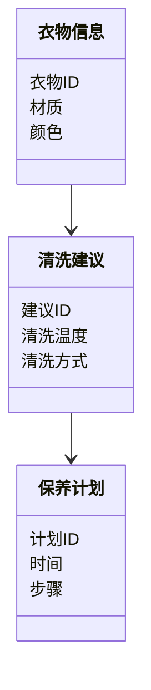
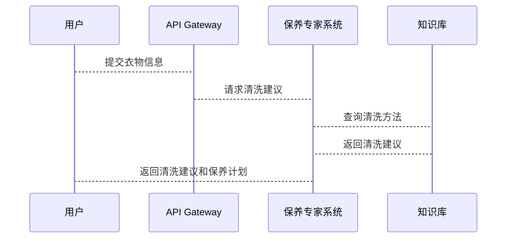

                 


# 智能衣架：AI Agent的衣物保养专家系统

> 关键词：智能衣架，AI Agent，衣物保养，推荐算法，系统架构

> 摘要：本文详细介绍了智能衣架的设计与实现，从问题背景、核心概念到算法原理、系统架构，再到项目实战和最佳实践，全面解析了如何利用AI技术优化衣物保养流程。通过本文，读者可以掌握智能衣架的核心原理和实现方法，为衣物保养领域提供新的解决方案。

---

## 第一部分: 背景介绍与核心概念

### 第1章: 智能衣架的背景与问题背景

#### 1.1 问题背景

- **1.1.1 衣物保养的重要性**
  - 衣物保养是延长衣物使用寿命的关键。
  - 不正确的保养方式可能导致衣物损坏或褪色。
  - 高端衣物的保养需要专业知识和工具。

- **1.1.2 现有衣物保养方式的痛点**
  - 用户缺乏专业的保养知识。
  - 现有保养方法效率低下，难以满足个性化需求。
  - 缺乏智能化的解决方案。

- **1.1.3 智能化衣物保养的需求**
  - 提供个性化的保养建议。
  - 实现智能化的保养计划管理。
  - 结合AI技术优化保养流程。

#### 1.2 问题描述

- **1.2.1 衣物保养过程中的关键问题**
  - 如何高效识别衣物材质和颜色。
  - 如何制定适合不同衣物的清洗方式。
  - 如何优化保养计划以提高效率。

- **1.2.2 用户需求分析**
  - 用户希望获得个性化的保养建议。
  - 用户需要简便的操作界面和高效的管理工具。
  - 用户期望系统能够自动优化保养计划。

- **1.2.3 智能衣架的目标与边界**
  - 目标：提供智能化的衣物保养解决方案。
  - 边界：专注于衣物保养，不涉及衣物购买和存储管理。

---

## 第2章: 智能衣架的核心概念与问题解决

#### 2.1 智能衣架的核心概念

- **2.1.1 AI Agent的基本概念**
  - AI Agent是一种智能体，能够感知环境并采取行动。
  - 在智能衣架中，AI Agent负责接收用户输入并生成建议。

- **2.1.2 衣物保养专家系统的定义**
  - 专家系统是一种基于知识库和推理引擎的智能系统。
  - 保养专家系统用于提供专业的衣物保养建议。

- **2.1.3 智能衣架的功能架构**
  - 输入处理：接收用户输入的衣物信息。
  - 知识库：存储衣物材质、颜色、保养方法等知识。
  - 推理引擎：根据输入生成清洗建议和保养计划。
  - 输出展示：以用户友好的形式展示建议。

#### 2.2 核心问题解决

- **2.2.1 AI Agent在衣物保养中的应用**
  - 状态感知：实时感知衣物的状态。
  - 行为决策：基于感知状态生成清洗建议。
  - 优化策略：根据历史数据优化保养计划。

- **2.2.2 智能推荐算法的实现**
  - 使用协同过滤和基于内容的推荐算法。
  - 根据用户习惯和衣物特性生成个性化建议。

- **2.2.3 系统的可扩展性设计**
  - 系统支持新增衣物类型和保养方法。
  - 知识库可以动态更新和扩展。

---

## 第三部分: 核心概念与联系

### 第3章: AI Agent与衣物保养系统的核心原理

#### 3.1 AI Agent的核心原理

- **3.1.1 状态感知与行为决策**
  - 状态感知：通过传感器或用户输入获取衣物状态。
  - 行为决策：基于感知状态和知识库生成清洗建议。

- **3.1.2 多目标优化算法**
  - 使用多目标优化算法平衡多个目标，如清洗效率和衣物保护。

- **3.1.3 知识图谱构建与推理**
  - 构建衣物材质、颜色、保养方法的知识图谱。
  - 使用推理引擎生成清洗建议和保养计划。

#### 3.2 衣物保养系统的核心原理

- **3.2.1 衣物材质识别与分类**
  - 使用图像识别技术识别衣物材质。
  - 根据材质分类建议清洗方式。

- **3.2.2 清洗建议生成算法**
  - 基于衣物材质和颜色生成清洗建议。
  - 考虑衣物品牌和特殊要求。

- **3.2.3 保养计划的自动生成**
  - 根据用户习惯和衣物特性生成保养计划。
  - 自动生成清洗、存放和维护步骤。

#### 3.3 核心概念的属性对比表

| 核心概念 | 属性 | 描述 |
|----------|------|------|
| AI Agent | 状态感知 | 实时感知衣物状态 |
| 衣物保养系统 | 分类算法 | 基于材质分类建议清洗方式 |
| 多目标优化 | 决策算法 | 综合多个目标优化保养计划 |

#### 3.4 ER实体关系图

```mermaid
erd
    衣物保养系统
    ----> 衣物信息表: 衣物ID, 材质, 颜色
    衣物信息表
    ----> 清洗建议表: 建议ID, 清洗温度, 清洗方式
    清洗建议表
    ----> 保养计划表: 计划ID, 时间, 步骤
```

---

## 第四部分: 算法原理讲解

### 第4章: 推荐算法原理

#### 4.1 推荐算法概述

- **4.1.1 协同过滤推荐算法**
  - 基于用户相似性推荐。
  - 计算用户之间的相似度，推荐相似用户的衣物保养方法。

- **4.1.2 基于内容的推荐算法**
  - 基于衣物属性推荐。
  - 根据衣物材质、颜色等属性生成清洗建议。

- **4.1.3 混合推荐算法**
  - 综合协同过滤和基于内容的推荐。
  - 根据用户行为和衣物属性生成个性化建议。

#### 4.2 推荐算法的数学模型

- **4.2.1 协同过滤的相似度计算**
  $$相似度 = \frac{\sum (x_i - \mu)(y_i - \mu)}{\sqrt{\sum (x_i - \mu)^2} \sqrt{\sum (y_i - \mu)^2}}$$

- **4.2.2 基于内容的相似度计算**
  $$相似度 = \sum_{i=1}^{n} w_i \cdot x_i$$
  其中，$w_i$是权重，$x_i$是衣物属性的特征向量。

---

## 第五章: 系统分析与架构设计

### 5.1 问题场景介绍

- **5.1.1 系统功能**
  - 用户输入衣物信息。
  - 系统生成清洗建议和保养计划。
  - 用户反馈优化系统。

### 5.2 项目介绍

- **5.2.1 项目目标**
  - 提供智能化的衣物保养解决方案。
  - 实现个性化的保养建议生成。

### 5.3 系统功能设计

#### 5.3.1 领域模型类图



#### 5.3.2 系统架构图


#### 5.3.3 系统接口设计

- **输入接口**
  - 用户输入衣物信息（材质、颜色、品牌）。
- **输出接口**
  - 清洗建议（温度、方式）。
  - 保养计划（时间、步骤）。

#### 5.3.4 系统交互流程



---

## 第六章: 项目实战

### 6.1 环境安装

- **6.1.1 安装Python和依赖库**
  - 使用`pip install`安装`numpy`, `scikit-learn`, `mermaid`, `matplotlib`。

### 6.2 核心代码实现

#### 6.2.1 数据预处理代码

```python
import numpy as np

def preprocess_data(data):
    # 数据预处理
    pass
```

#### 6.2.2 推荐算法实现

```python
from sklearn.metrics.pairwise import cosine_similarity

def collaborative_filtering(users, items):
    similarity = cosine_similarity(users)
    return similarity
```

#### 6.2.3 系统交互代码

```python
class AIAssistant:
    def __init__(self):
        self.knowledge_base = {}

    def receive_input(self, input_data):
        # 处理输入数据
        pass

    def generate_recommendation(self, input_data):
        # 生成推荐
        pass
```

### 6.3 案例分析

- **案例分析**
  - 用户输入：一件羊毛外套。
  - 系统建议：手洗，水温不超过30℃，使用中性洗涤剂。

### 6.4 项目小结

- 通过代码实现，展示了智能衣架的核心功能。
- 系统能够根据用户输入生成清洗建议和保养计划。

---

## 第七章: 最佳实践

### 7.1 总结

- 智能衣架结合了AI Agent和专家系统，提供了智能化的衣物保养解决方案。
- 系统通过推荐算法和知识库优化了保养流程。

### 7.2 小结

- 本文详细介绍了智能衣架的设计与实现。
- 从背景、核心概念到算法原理、系统架构，再到项目实战和最佳实践，全面解析了智能衣架的实现过程。

### 7.3 注意事项

- 数据隐私保护。
- 系统的可扩展性设计。
- 用户反馈的及时处理。

### 7.4 拓展阅读

- 推荐阅读相关AI和专家系统的书籍。
- 关注衣物保养领域的最新技术动态。

---

## 作者信息

作者：AI天才研究院/AI Genius Institute & 禅与计算机程序设计艺术 /Zen And The Art of Computer Programming

---

通过本文，读者可以全面了解智能衣架的设计与实现，掌握其核心原理和实现方法，为衣物保养领域提供新的解决方案。

