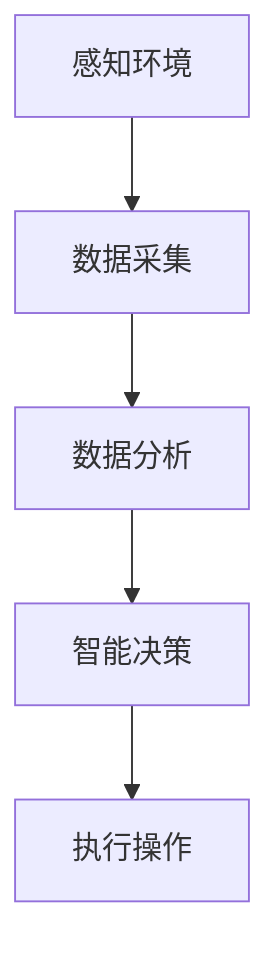
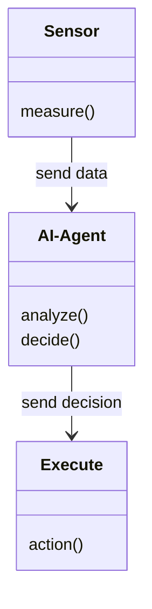
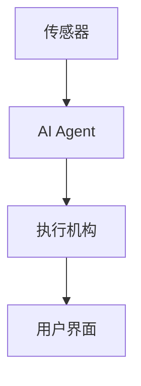
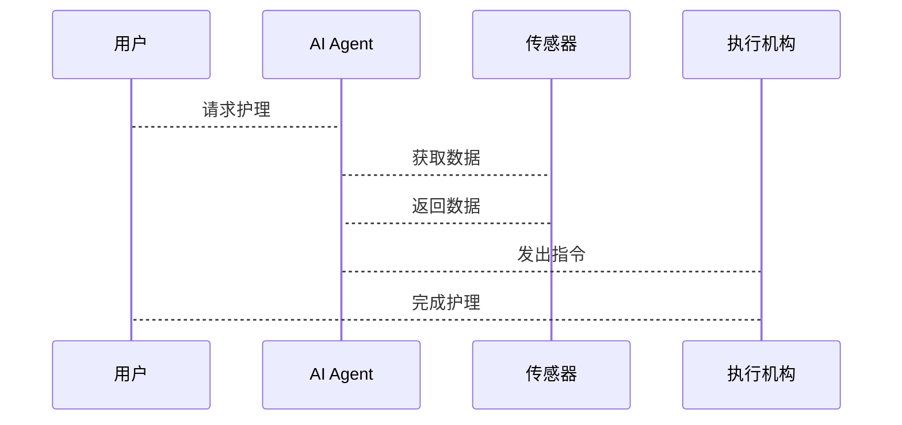

                 


# 智能衣架：AI Agent的衣物护理与除皱系统

> **关键词**：智能衣架，AI Agent，衣物护理，除皱技术，人工智能，系统架构

> **摘要**：本文深入探讨了智能衣架的设计与实现，结合AI Agent技术，通过衣物护理和除皱系统的优化，展示了如何利用人工智能提升衣物管理效率。文章从背景介绍、核心概念、算法原理到系统架构、项目实战和最佳实践，全面解析了智能衣架的技术细节与实际应用。

---

## 第一部分：背景介绍

### 第1章：智能衣架的背景与问题背景

#### 1.1 问题背景

- **1.1.1 衣物护理与除皱的现状**  
  衣物护理和除皱是日常生活中的重要环节，但传统方法效率低下，难以满足快节奏生活的需求。

- **1.1.2 现有技术的不足**  
  - 手工护理耗时费力，效率低。  
  - 传统除皱方法效果有限，难以彻底解决衣物褶皱问题。  
  - 缺乏智能化手段，无法实现个性化护理。

- **1.1.3 智能衣架的出现与意义**  
  智能衣架通过AI技术实现了衣物护理的智能化和高效化，为现代生活提供了新的解决方案。

#### 1.2 问题描述

- **1.2.1 衣物护理中的常见问题**  
  - 衣物材质多样，护理方法不同。  
  - 环境因素（如湿度、温度）影响护理效果。  
  - 用户需求多样化，难以统一满足。

- **1.2.2 除皱技术的挑战**  
  - 传统除皱方法依赖人工经验，效率低。  
  - 无法实时监测衣物状态，难以实现精准除皱。  
  - 缺乏智能化手段，难以满足个性化需求。

- **1.2.3 用户需求的多样性**  
  - 不同用户对衣物护理的需求不同。  
  - 高端衣物需要特殊护理，普通衣物则需要日常维护。  
  - 用户期望智能化、便捷化的解决方案。

#### 1.3 问题解决

- **1.3.1 AI Agent的核心作用**  
  AI Agent能够实时监测衣物状态，智能决策护理方案，实现自动化除皱。

- **1.3.2 智能衣架的解决方案**  
  智能衣架通过传感器和AI算法，实现衣物状态的实时监测、智能护理和精准除皱。

- **1.3.3 技术实现的可行性分析**  
  - 传感器技术成熟，能够实时监测衣物状态。  
  - AI算法在图像识别和决策优化方面取得显著进展。  
  - 系统架构设计合理，能够实现高效运行。

#### 1.4 边界与外延

- **1.4.1 系统功能的边界**  
  智能衣架专注于衣物护理和除皱，不涉及其他功能。

- **1.4.2 相关领域的外延**  
  - 可扩展到智能家居领域，与其他设备联动。  
  - 可应用于其他衣物护理设备，如洗衣机、烘干机等。

- **1.4.3 技术实现的限制**  
  - 传感器精度有限，可能影响监测结果。  
  - AI算法对复杂场景的适应性有待提升。  
  - 系统运行依赖稳定的网络环境。

#### 1.5 概念结构与核心要素

- **1.5.1 智能衣架的核心要素**  
  - 传感器：监测衣物状态。  
  - AI Agent：智能决策护理方案。  
  - 执行机构：执行除皱操作。

- **1.5.2 AI Agent的功能模块**  
  - 数据采集：传感器数据采集。  
  - 数据分析：图像识别和状态分析。  
  - 决策优化：智能决策护理方案。  
  - 执行控制：控制执行机构工作。

- **1.5.3 系统的组成结构**  
  - 硬件部分：传感器、执行机构、通信模块。  
  - 软件部分：AI算法、系统控制、用户界面。

---

## 第二部分：核心概念与联系

### 第2章：AI Agent的核心概念

#### 2.1 AI Agent的定义与原理

- **2.1.1 AI Agent的定义**  
  AI Agent是一种能够感知环境、自主决策并执行任务的智能体，广泛应用于各个领域。

- **2.1.2 AI Agent的核心原理**  
  AI Agent通过感知环境、分析数据、决策优化和执行操作，实现智能化任务处理。

- **2.1.3 AI Agent与传统算法的区别**  
  AI Agent具有自主性和适应性，能够根据环境变化动态调整行为，而传统算法通常基于固定规则。

#### 2.2 核心概念的联系

- **2.2.1 AI Agent与衣物护理的结合**  
  AI Agent通过传感器实时监测衣物状态，智能决策护理方案。

- **2.2.2 除皱技术的实现方式**  
  除皱技术基于AI算法，通过图像识别和优化算法实现精准除皱。

- **2.2.3 智能衣架的系统架构**  
  系统由传感器、AI Agent、执行机构和用户界面组成，各部分协同工作实现智能化护理。

#### 2.3 核心概念的对比分析

- **2.3.1 不同AI Agent的对比**  
  | 特征 | 基于规则的AI Agent | 基于学习的AI Agent | 基于推理的AI Agent |
  |------|---------------------|---------------------|---------------------|
  | 数据依赖 | 需要大量规则 | 需要大量数据 | 需要逻辑推理 |
  | 灵活性 | 低 | 高 | 中 |

- **2.3.2 各种除皱技术的优缺点**  
  | 技术 | 优点 | 缺点 |
  |------|------|------|
  | 传统除皱 | 成本低 | 效率低 |
  | 热风除皱 | 效果好 | 能耗高 |
  | AI优化除皱 | 高效精准 | 成本高 |

- **2.3.3 智能衣架与其他衣物护理设备的对比**  
  | 设备 | 智能衣架 | 普通衣架 | 智能洗衣机 |
  |------|---------|-----------|-------------|
  | 功能 | 智能护理 | 简单悬挂 | 全自动洗涤 |

---

## 第三部分：算法原理讲解

### 第3章：AI Agent的算法原理

#### 3.1 AI Agent的算法原理

- **3.1.1 算法原理概述**  
  AI Agent通过感知环境、分析数据、决策优化和执行操作，实现智能化任务处理。

- **3.1.2 算法流程图（Mermaid）**



- **3.1.3 算法实现代码**

```python
# 智能决策算法实现
def ai_decision(data):
    # 数据预处理
    processed_data = preprocess(data)
    
    # 图像识别
    result = image_recognition(processed_data)
    
    # 决策优化
    decision = optimize_decision(result)
    
    return decision
```

- **3.1.4 数学模型与公式**

$$ \text{决策结果} = f(\text{输入数据}) $$

其中，$f$ 是 AI Agent 的决策函数，基于输入数据进行分析和优化。

---

## 第四部分：系统分析与架构设计

### 第4章：智能衣架的系统架构设计

#### 4.1 问题场景介绍

智能衣架需要在复杂环境中实时监测衣物状态，智能决策护理方案，并执行除皱操作。

#### 4.2 项目介绍

智能衣架是一个基于AI Agent的衣物护理系统，通过传感器、AI算法和执行机构实现智能化护理。

#### 4.3 系统功能设计

- **4.3.1 领域模型类图（Mermaid）**



#### 4.4 系统架构设计

- **4.4.1 系统架构图（Mermaid）**



- **4.4.2 系统接口设计**

  - 传感器接口：负责数据采集。  
  - AI Agent接口：负责数据分析和决策。  
  - 执行机构接口：负责执行操作。  
  - 用户界面接口：负责用户交互。

- **4.4.3 系统交互设计（Mermaid）**



---

## 第五部分：项目实战

### 第5章：智能衣架的项目实现

#### 5.1 环境安装

- **安装Python**：确保Python 3.8以上版本。  
- **安装库和工具**：安装TensorFlow、OpenCV、Mermaid CLI等。

#### 5.2 系统核心实现

- **5.2.1 核心代码实现**

```python
# 图像识别模块
import cv2
import numpy as np

def image_recognition(image):
    # 图像预处理
    gray = cv2.cvtColor(image, cv2.COLOR_BGR2GRAY)
    # 使用OpenCV进行图像识别
    result = cv2.threshold(gray, 127, 255, cv2.THRESH_BINARY)
    return result

# 决策优化模块
def optimize_decision(result):
    # 基于结果的优化决策
    if result > 0.8:
        return "高温除皱"
    elif result > 0.6:
        return "中温除皱"
    else:
        return "低温除皱"
```

#### 5.3 代码应用解读与分析

- **代码解读**  
  图像识别模块使用OpenCV进行图像处理，决策优化模块基于识别结果进行决策。

- **代码分析**  
  图像识别模块实现了二值化处理，决策优化模块根据识别结果选择合适的除皱方案。

#### 5.4 实际案例分析

- **案例1**：识别出衣物有明显褶皱，系统决定高温除皱。  
- **案例2**：识别出衣物材质为丝绸，系统调整除皱温度以避免损坏。

#### 5.5 项目小结

通过项目实战，我们验证了智能衣架系统的可行性和有效性。系统能够准确识别衣物状态，智能决策护理方案，并执行精准的除皱操作。

---

## 第六部分：最佳实践

### 第6章：智能衣架的最佳实践

#### 6.1 小结

智能衣架通过AI Agent技术实现了衣物护理的智能化和高效化，为现代生活提供了新的解决方案。

#### 6.2 注意事项

- **传感器校准**：定期校准传感器以保证数据准确性。  
- **系统维护**：定期更新AI算法以提升性能。  
- **用户教育**：提供用户教育以确保正确使用系统。

#### 6.3 拓展阅读

- **AI Agent的最新进展**：了解AI Agent在其他领域的应用。  
- **衣物护理技术的发展**：探索衣物护理技术的未来发展方向。

---

## 作者信息

作者：AI天才研究院/AI Genius Institute & 禅与计算机程序设计艺术 /Zen And The Art of Computer Programming

---

通过以上思考，我逐步构建了《智能衣架：AI Agent的衣物护理与除皱系统》的详细目录和内容框架。接下来将按照上述结构撰写完整的文章。

