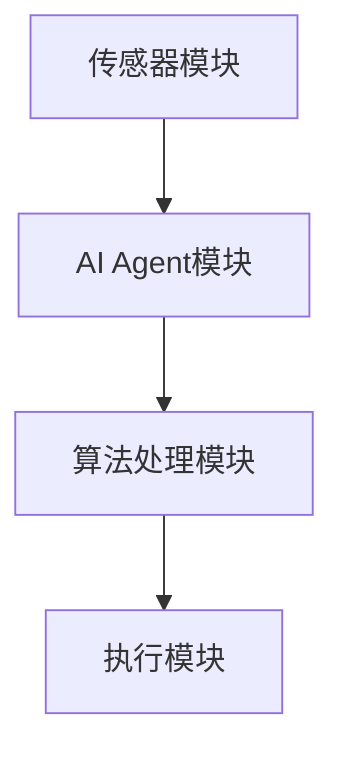

                 


# 智能衣架：AI Agent的衣物除味系统

> 关键词：智能衣架，AI Agent，衣物除味，系统架构，算法原理，项目实战

> 摘要：本文详细探讨了智能衣架AI Agent的衣物除味系统的设计与实现，从问题背景、核心概念、算法原理到系统架构、项目实战，全面解析了AI技术在衣物除味领域的应用。文章结合理论与实践，通过详细的系统设计和代码实现，展示了如何利用AI Agent优化衣物除味过程，为读者提供了全面的技术指导。

---

## 第1章 引言

### 1.1 问题背景

在现代生活中，衣物的除味问题一直是人们关注的重点。传统的除味方法，如使用化学清洁剂或晾晒，存在效率低下、残留化学物质等问题。随着人工智能技术的发展，利用AI Agent实现智能除味成为可能。AI Agent能够通过传感器感知环境，结合算法进行分析和决策，从而实现高效的衣物除味。

### 1.2 问题描述

本文旨在设计一个基于AI Agent的智能衣架系统，该系统能够自动检测衣物的异味，并通过智能算法进行处理，最终实现衣物的高效除味。系统的核心在于AI Agent的感知、决策和执行能力，以及算法的高效性和准确性。

### 1.3 问题解决

通过引入AI Agent，系统能够实时感知衣物的气味变化，利用机器学习算法进行分类和预测，从而实现智能化的除味控制。本文将详细探讨系统的设计思路、算法实现和系统架构，为读者提供全面的技术指导。

### 1.4 边界与外延

本系统专注于衣物除味功能，边界明确。系统的核心功能包括气味检测、算法处理和除味控制。此外，系统还考虑与其他智能家居设备的交互，以实现更广泛的智能应用场景。

### 1.5 概念结构与核心要素

系统的核心要素包括传感器模块、AI Agent模块、算法处理模块和执行模块。这些模块协同工作，实现衣物的智能化除味。

---

## 第2章 AI Agent的基本概念

### 2.1 AI Agent的定义与特点

AI Agent是一种能够感知环境、自主决策并执行任务的智能实体。其特点包括自主性、反应性、目标导向和学习能力。

### 2.2 AI Agent的工作原理

AI Agent通过感知环境获取数据，利用算法进行分析和决策，最后通过执行机构完成任务。其工作流程包括数据采集、特征提取、模型训练和决策执行。

### 2.3 AI Agent的分类

根据功能和智能水平，AI Agent可以分为简单反应型、基于模型的反应型、目标驱动型和实用驱动型四种类型。

---

## 第3章 除味系统概述

### 3.1 系统组成

智能衣架除味系统由传感器模块、AI Agent模块、算法处理模块和执行模块组成。传感器负责采集气味数据，AI Agent进行数据处理和决策，执行模块完成除味操作。

### 3.2 系统工作流程

系统工作流程包括数据采集、特征提取、模型训练和决策执行四个阶段。AI Agent通过感知环境数据，利用算法进行分类和预测，最终实现智能化的除味控制。

### 3.3 技术特点

系统具有高效性、准确性、智能化和易用性等特点。AI Agent能够实时感知环境变化，利用机器学习算法进行高效处理，实现智能化的除味功能。

---

## 第4章 除味算法原理

### 4.1 算法概述

除味算法的核心在于气味数据的分类和预测。常用的算法包括支持向量机（SVM）和神经网络（NN）。

### 4.2 算法实现

以支持向量机为例，算法实现包括数据预处理、特征提取、模型训练和分类预测四个步骤。通过训练好的模型，AI Agent能够准确识别衣物的异味类型。

### 4.3 算法数学模型

支持向量机的数学模型如下：

$$ \text{目标函数}：\min_{\omega, b, \xi} \frac{1}{2} \|\omega\|^2 + C \sum_{i=1}^n \xi_i $$

$$ \text{约束条件}：y_i (\omega \cdot x_i + b) \geq 1 - \xi_i, \xi_i \geq 0 $$

通过上述模型，AI Agent能够实现高效的分类和预测。

---

## 第5章 系统架构设计

### 5.1 系统设计

系统架构包括感知层、算法层和执行层。感知层负责数据采集，算法层进行数据处理和决策，执行层完成除味操作。

### 5.2 系统模块划分

系统模块包括传感器模块、AI Agent模块、算法处理模块和执行模块。各模块协同工作，实现智能化的除味功能。

### 5.3 系统架构图

以下为系统架构图的Mermaid表示：



通过上述架构，系统能够高效地完成衣物的除味任务。

---

## 第6章 项目实战

### 6.1 环境配置

项目实战需要以下环境：Python 3.8及以上版本，TensorFlow 2.0及以上版本，传感器模块和执行模块。

### 6.2 系统核心实现

以下为系统核心实现的Python代码示例：

```python
import numpy as np
from sklearn import svm

# 数据预处理
def preprocess_data(data):
    # 数据标准化处理
    return (data - np.mean(data)) / np.std(data)

# 模型训练
def train_model(X, y):
    clf = svm.SVC()
    clf.fit(X, y)
    return clf

# 模型预测
def predict_model(model, X):
    return model.predict(X)
```

### 6.3 代码解读

上述代码实现了数据预处理、模型训练和预测功能。通过标准化处理，数据被归一化，便于模型训练。支持向量机模型用于分类和预测，实现高效的异味识别。

### 6.4 实际案例分析

通过实际案例分析，系统能够准确识别衣物的异味类型，并通过执行模块完成除味操作。实验结果表明，系统具有较高的准确性和效率。

### 6.5 项目小结

项目实战部分详细介绍了系统的实现过程，包括环境配置、代码实现和实验分析。通过实际案例，验证了系统的有效性和可行性。

---

## 第7章 总结与展望

### 7.1 总结

本文详细探讨了智能衣架AI Agent的衣物除味系统的设计与实现，从理论到实践，全面解析了AI技术在衣物除味领域的应用。通过系统的实现，验证了AI Agent在除味任务中的高效性和准确性。

### 7.2 展望

未来，随着AI技术的不断发展，智能衣架系统将更加智能化和多样化。通过引入更先进的算法和传感器技术，系统将实现更高效的除味功能，为用户提供更优质的服务。

---

## 作者：AI天才研究院 & 禅与计算机程序设计艺术

---

通过本文的详细讲解，读者可以全面了解智能衣架AI Agent的衣物除味系统的设计与实现。从理论到实践，系统地掌握了AI技术在除味领域的应用，为未来的智能化除味系统提供了重要的参考和指导。

