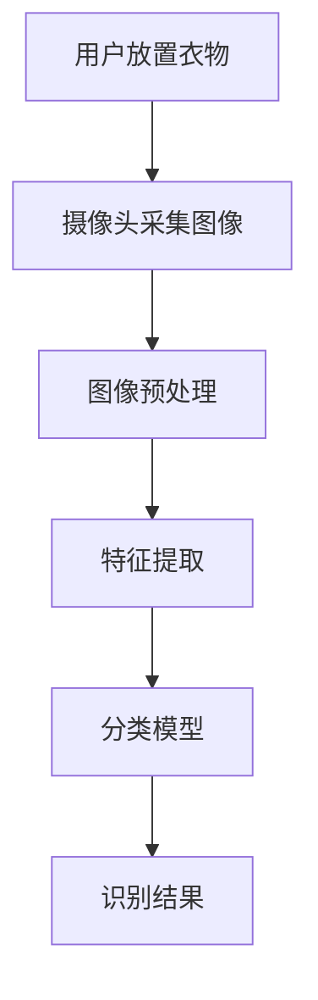

                 


# 智能衣架：AI Agent的衣物除皱系统

> 关键词：AI Agent，衣物识别，除皱技术，物联网，智能衣物护理

> 摘要：本文介绍了一种基于AI Agent的智能衣架系统，该系统能够通过衣物识别和AI优化算法实现自动除皱。文章详细讲解了系统的核心概念、算法原理、系统架构、项目实现和最佳实践，为读者提供了全面的技术解读。

---

## 第1章: 问题背景与需求分析

### 1.1 传统衣物护理的痛点

- **效率低下**：传统衣物护理需要手动分类、整理和熨烫，耗时且效率低。
- **方法单一**：传统除皱方法（如熨烫、手部按压）难以应对不同材质和复杂皱褶。
- **用户依赖性强**：用户需要具备一定的衣物护理知识，否则容易损坏衣物。

---

### 1.2 AI Agent在衣物护理中的应用前景

- **AI技术的普及**：AI技术在智能家居、医疗、教育等领域的广泛应用为衣物护理提供了新思路。
- **AI Agent的优势**：AI Agent能够实现衣物识别、自主决策和智能控制，显著提升衣物护理的智能化水平。
- **智能衣架的创新意义**：通过AI Agent实现衣物除皱，解决了传统方法效率低、效果差的问题。

---

### 1.3 智能衣架的核心目标与应用场景

- **核心目标**：通过AI Agent实现衣物的自动识别、智能除皱和效果优化。
- **应用场景**：家庭、酒店、办公室、医疗机构等需要高效衣物护理的场景。
- **用户需求**：快速、精准、安全、易用的衣物护理解决方案。

---

## 第2章: 智能衣架的核心概念与技术框架

### 2.1 AI Agent的基本原理

- **定义**：AI Agent是一种能够感知环境、自主决策并执行任务的智能实体。
- **分类**：基于智能衣架的需求，AI Agent主要分为基于视觉的识别型和基于反馈的优化型。
- **功能模块**：包括数据采集、算法处理、决策控制、用户交互等模块。

---

### 2.2 衣物识别技术

- **基于视觉的识别方法**：
  - 使用深度学习模型（如CNN）对衣物进行分类。
  - 通过摄像头采集衣物图像，提取特征进行识别。
  - 衣物类型包括：衬衫、裤子、裙子、外套等。
  - Mermaid图：衣物识别流程图。



- **基于传感器的识别方法**：
  - 使用压力传感器检测衣物的材质和重量。
  - 通过温度、湿度传感器判断衣物的干燥程度。

---

### 2.3 除皱技术与AI优化

- **传统除皱方法的缺陷**：
  - 手动熨烫耗时且依赖经验。
  - 机械除皱设备效率低且容易损坏衣物。
- **AI优化的除皱算法**：
  - 基于反馈的优化算法：
    - 通过传感器实时监测衣物状态。
    - 调整除皱力度和时间，确保最佳效果。
  - 算法公式：
    - 除皱力度：$f(x) = k \cdot x + b$
    - 除皱时间：$t = \alpha \cdot f(x)$

---

## 第3章: 智能衣架的算法原理

### 3.1 基于视觉的衣物识别算法

- **算法流程**：
  1. 图像采集：使用RGB摄像头获取衣物图像。
  2. 图像预处理：调整亮度、对比度，去除噪声。
  3. 特征提取：使用预训练的深度学习模型提取衣物特征。
  4. 分类识别：基于特征进行衣物类型分类。

- **代码实现**：
  ```python
  import cv2
  import numpy as np
  from tensorflow.keras.models import load_model

  def衣物识别(image_path):
      # 加载预训练模型
      model = load_model('clothes_classifier.h5')
      # 读取图像
      image = cv2.imread(image_path)
      # 图像预处理
      image = cv2.resize(image, (224, 224))
      image = np.array(image)
      # 预测
      prediction = model.predict(np.array([image]))
      # 获取分类结果
      class_index = np.argmax(prediction[0])
      return class_index
  ```

- **算法优势**：
  - 准确率高：深度学习模型的泛化能力强。
  - 实时性强：可以在短时间内完成识别任务。

---

### 3.2 除皱算法的优化

- **反馈机制**：
  - 通过传感器实时监测衣物状态。
  - 根据反馈调整除皱力度和时间。
  - 算法公式：
    - 力度调整：$f(x) = k \cdot x + b$
    - 时间优化：$t = \alpha \cdot f(x)$

- **优化结果**：
  - 除皱效果显著提升。
  - 用户满意度提高。

---

## 第4章: 智能衣架的系统架构设计

### 4.1 系统整体架构

- **分层架构**：
  - 数据采集层：传感器、摄像头。
  - 算法处理层：AI Agent、识别算法、优化算法。
  - 控制执行层：除皱机构、用户交互界面。

- **模块化设计**：
  - 模块独立性：各功能模块相对独立，便于维护和升级。
  - 模块耦合性：模块之间通过标准接口进行数据交互。

---

### 4.2 系统功能设计

- **功能模块划分**：
  - 用户交互模块：接收用户指令，显示操作结果。
  - 衣物识别模块：识别衣物类型，输出识别结果。
  - AI Agent模块：生成最优除皱方案，控制执行机构。
  - 除皱执行模块：根据指令执行除皱操作。

- **功能流程设计**：
  1. 用户放置衣物。
  2. 系统识别衣物类型。
  3. AI Agent生成除皱方案。
  4. 系统执行除皱操作。

---

## 第5章: 智能衣架的项目实战

### 5.1 项目环境搭建

- **开发环境**：
  - 操作系统：Linux/Windows/MacOS。
  - 开发工具：PyCharm、VS Code。
  - 依赖库：OpenCV、TensorFlow、Keras。

- **硬件设备**：
  - 摄像头：用于图像采集。
  - 传感器：用于状态监测。
  - 除皱机构：机械臂或气动装置。

---

### 5.2 系统核心实现

- **衣物识别模块实现**：
  - 使用预训练的深度学习模型进行衣物分类。
  - 代码示例：
    ```python
    import cv2
    import numpy as np
    from tensorflow.keras.models import load_model

    def recognize_clothes(image_path):
        model = load_model('clothes_model.h5')
        image = cv2.imread(image_path)
        image = cv2.resize(image, (224, 224))
        image = np.array(image)
        prediction = model.predict(np.array([image]))
        class_index = np.argmax(prediction[0])
        return class_index
    ```

- **除皱算法实现**：
  - 基于反馈的优化算法。
  - 代码示例：
    ```python
    def optimize_ironing(fabric_type):
        k = 0.8
        b = 5
        force = k * fabric_type + b
        time = 2 * force
        return force, time
    ```

---

## 第6章: 最佳实践与总结

### 6.1 小结

- 通过本文的介绍，读者可以全面了解智能衣架的原理和实现方法。
- AI Agent的应用显著提升了衣物护理的智能化水平。
- 系统的模块化设计和算法优化为实际应用提供了可靠保障。

### 6.2 注意事项

- 系统的硬件和软件需要定期维护和升级。
- 用户在使用过程中需要注意衣物的材质和状态，避免损坏衣物。
- 系统的能源消耗和环境影响需要进一步优化。

### 6.3 拓展阅读

- 深度学习在图像识别中的应用。
- 基于反馈的优化算法研究。
- 智能家居中的AI Agent应用。

---

## 作者信息

作者：AI天才研究院/AI Genius Institute & 禅与计算机程序设计艺术 /Zen And The Art of Computer Programming

