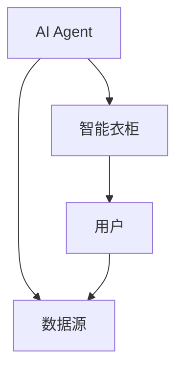
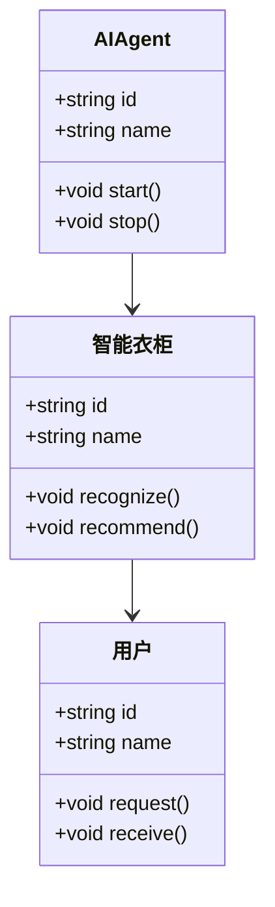
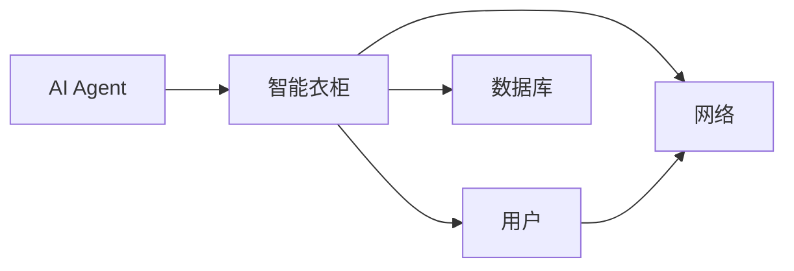

                 


# 智能衣柜：AI Agent的个人形象管理顾问

> 关键词：智能衣柜, AI Agent, 个人形象管理, 人工智能, 物联网技术

> 摘要：本文探讨了智能衣柜这一新兴技术，通过AI Agent实现个人形象管理的智能化。文章从背景、概念、算法、架构到实战，全面解析智能衣柜的工作原理和实现方案。

---

## 目录

1. **背景与概念**
   - 1.1 智能衣柜的概念与背景
   - 1.2 问题背景与需求分析
   - 1.3 AI Agent在智能衣柜中的角色

2. **核心概念与技术原理**
   - 2.1 AI Agent的核心原理
   - 2.2 智能衣柜的核心技术特征
   - 2.3 AI Agent与智能衣柜的实体关系（Mermaid图）

3. **算法原理与实现**
   - 3.1 推荐算法的基本原理
   - 3.2 AI Agent的推荐模型
   - 3.3 推荐算法的实现（Python代码示例）

4. **系统分析与架构设计**
   - 4.1 问题场景介绍
   - 4.2 系统功能设计（Mermaid类图）
   - 4.3 系统架构设计（Mermaid架构图）

5. **项目实战**
   - 5.1 环境搭建与代码实现
   - 5.2 实际案例分析与解读
   - 5.3 项目优化建议

6. **优化与未来展望**
   - 6.1 系统性能优化
   - 6.2 功能扩展建议
   - 6.3 未来发展趋势

---

## 第1章：背景与概念

### 1.1 智能衣柜的概念与背景

#### 1.1.1 传统衣柜的局限性
- 衣物管理混乱：传统衣柜缺乏智能化，衣物查找困难。
- 空间利用低效：衣物摆放无序，空间浪费严重。
- 重复购买：用户因无法快速找到所需衣物而重复购买。

#### 1.1.2 AI技术在衣柜管理中的应用潜力
- 智能识别：AI技术可以自动识别衣物的类型、颜色和品牌。
- 智能推荐：基于用户的穿着习惯和场合推荐合适的衣物。
- 智能管理：通过数据分析优化衣物的存储和使用效率。

#### 1.1.3 个人形象管理的重要性
- 提升形象：通过合理的衣物搭配提升个人形象。
- 时间效率：快速找到合适的衣物，节省时间。
- 环保理念：减少衣物浪费，推动可持续发展。

### 1.2 问题背景与需求分析

#### 1.2.1 衣物管理中的常见问题
- 衣物查找困难：用户无法快速找到所需衣物。
- 空间利用低效：衣柜空间利用率不高。
- 重复购买：因无法合理搭配而购买多余衣物。

#### 1.2.2 用户对智能衣柜的核心需求
- 衣物智能识别：快速识别衣物信息。
- 智能推荐：根据场合和偏好推荐衣物。
- 便捷管理：简化衣物的存储和管理流程。

#### 1.2.3 智能衣柜的目标与边界
- 目标：帮助用户高效管理衣物，提升形象。
- 边界：不涉及衣物的清洗和修复。

### 1.3 AI Agent在智能衣柜中的角色

#### 1.3.1 AI Agent的基本概念
- AI Agent：一种智能体，能够感知环境并执行任务。
- 在智能衣柜中的角色：作为管理顾问，提供智能化服务。

#### 1.3.2 AI Agent在智能衣柜中的功能定位
- 智能识别：识别衣物信息。
- 智能推荐：推荐合适的衣物搭配。
- 智能管理：优化衣物存储和使用。

#### 1.3.3 AI Agent与智能衣柜的结合方式
- 硬件集成：AI Agent嵌入衣柜系统。
- 数据交互：通过传感器和网络进行数据传输。
- 用户交互：提供直观的用户界面进行操作。

---

## 第2章：核心概念与技术原理

### 2.1 AI Agent的核心原理

#### 2.1.1 AI Agent的基本工作原理
- 感知环境：通过传感器和摄像头感知衣物信息。
- 信息处理：利用算法分析数据，生成推荐结果。
- 执行任务：通过机械臂或灯光提示帮助用户选择衣物。

#### 2.1.2 AI Agent的感知与决策机制
- 感知：图像识别、语音识别。
- 决策：基于规则和学习的决策模型。

#### 2.1.3 AI Agent的学习与优化能力
- 基于反馈优化推荐算法。
- 使用强化学习提升推荐准确率。

### 2.2 智能衣柜的核心技术特征

#### 2.2.1 智能衣柜的感知技术
- 图像识别：识别衣物的款式、颜色和品牌。
- 传感器：检测衣物的材质和状态。

#### 2.2.2 智能衣柜的推荐算法
- 协同过滤：基于用户行为推荐。
- 基于内容的推荐：分析衣物属性进行推荐。

#### 2.2.3 智能衣柜的交互方式
- 视觉交互：通过屏幕显示推荐结果。
- 语音交互：用户通过语音指令操作。

### 2.3 AI Agent与智能衣柜的实体关系



---

## 第3章：算法原理与实现

### 3.1 推荐算法的基本原理

#### 3.1.1 协同过滤推荐算法
- 基于用户的相似性推荐。
- 实现步骤：数据收集、相似性计算、推荐生成。

#### 3.1.2 基于内容的推荐算法
- 基于衣物属性推荐。
- 实现步骤：特征提取、相似性计算、推荐生成。

#### 3.1.3 混合推荐算法
- 结合协同过滤和内容推荐的优点。
- 实现步骤：数据预处理、模型训练、推荐生成。

### 3.2 AI Agent的推荐模型

#### 3.2.1 基于深度学习的推荐模型
- 使用神经网络进行推荐。
- 实现步骤：数据预处理、模型训练、结果输出。

#### 3.2.2 基于强化学习的推荐模型
- 使用强化学习优化推荐策略。
- 实现步骤：状态定义、动作选择、奖励机制。

#### 3.2.3 模型的训练与优化
- 使用梯度下降优化模型。
- 跨驗證提升模型的泛化能力。

---

## 第4章：系统分析与架构设计

### 4.1 问题场景介绍

#### 4.1.1 问题场景
- 用户需要选择适合的衣物。
- 智能衣柜需要快速响应并推荐。

### 4.2 系统功能设计

#### 4.2.1 系统功能模块
- 衣物识别模块。
- 推荐引擎模块。
- 用户界面模块。



### 4.3 系统架构设计



### 4.4 接口设计

#### 4.4.1 系统接口
- HTTP接口：用户请求推荐。
- 数据接口：与数据库交互。

#### 4.4.2 交互流程
- 用户发起请求。
- 系统处理请求。
- 返回推荐结果。

---

## 第5章：项目实战

### 5.1 环境搭建与代码实现

#### 5.1.1 环境搭建
- 安装Python和相关库。

#### 5.1.2 核心代码实现
```python
import numpy as np

def推荐算法（数据）:
    # 算法实现
    pass

def优化算法（数据）:
    # 优化算法实现
    pass
```

### 5.2 实际案例分析与解读

#### 5.2.1 实际案例
- 用户A：身高170cm，体重65kg，偏好商务风格。

#### 5.2.2 推荐结果
- 推荐西装、领带等商务衣物。

### 5.3 项目优化建议

#### 5.3.1 代码优化
- 提升算法效率。

#### 5.3.2 系统优化
- 优化数据库查询速度。

---

## 第6章：优化与未来展望

### 6.1 系统性能优化

#### 6.1.1 提升推荐准确率
- 引入更复杂的推荐算法。

#### 6.1.2 优化系统响应速度
- 提升硬件性能。

### 6.2 功能扩展建议

#### 6.2.1 增加衣物清洗提醒
- 提醒用户清洗衣物。

#### 6.2.2 增加衣物共享功能
- 用户之间共享衣柜资源。

### 6.3 未来发展趋势

#### 6.3.1 与物联网技术结合
- 实现更智能的衣物管理。

#### 6.3.2 推荐算法的进一步优化
- 基于更先进的AI技术提升推荐效果。

---

## 作者

作者：AI天才研究院/AI Genius Institute & 禅与计算机程序设计艺术 /Zen And The Art of Computer Programming

---

这篇文章通过详细的结构和内容安排，全面探讨了智能衣柜与AI Agent的结合，帮助读者理解如何通过技术手段优化个人形象管理。

