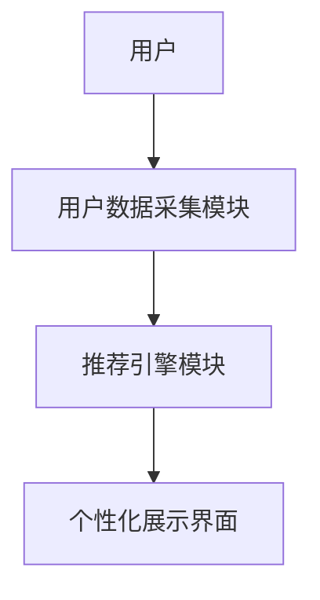

                 


# 智能衣柜：AI Agent的穿搭推荐系统

## 关键词：
智能衣柜，AI Agent，穿搭推荐，个性化推荐，人工智能

## 摘要：
本文探讨了智能衣柜中AI Agent的穿搭推荐系统，从背景介绍、算法原理到系统架构设计，再到项目实战和最佳实践，详细分析了如何利用人工智能技术实现个性化的服装搭配推荐。

---

# 第1章: 智能衣柜的发展背景

## 1.1 智能衣柜的定义与特点

### 1.1.1 智能衣柜的定义
智能衣柜是一种结合了人工智能技术的智能服装存储和推荐系统，能够根据用户的穿着习惯、身材特点、天气状况以及时尚趋势，为用户提供个性化的服装搭配建议。

### 1.1.2 智能衣柜的核心特点
- **智能化**：通过AI算法分析用户数据，提供智能推荐。
- **个性化**：根据用户的个人风格和需求，定制推荐方案。
- **实时性**：结合实时天气和时尚趋势，提供及时的穿搭建议。
- **便捷性**：通过智能设备和应用程序，用户可以随时随地获取推荐。

### 1.1.3 智能衣柜与传统衣柜的区别
- **数据驱动**：智能衣柜利用用户数据进行分析，而传统衣柜仅作为存储工具。
- **推荐功能**：智能衣柜具备智能推荐功能，传统衣柜不具备。
- **互动性**：智能衣柜与用户有交互，传统衣柜仅为存储空间。

## 1.2 AI Agent的基本概念

### 1.2.1 AI Agent的定义
AI Agent（人工智能代理）是指能够感知环境并采取行动以实现目标的智能实体。在智能衣柜中，AI Agent主要用于收集用户数据、分析需求并提供推荐服务。

### 1.2.2 AI Agent的核心功能
- **数据采集**：收集用户的身高、体重、穿衣风格、颜色偏好等信息。
- **需求分析**：通过分析用户数据，确定用户的穿衣需求。
- **推荐服务**：根据需求，为用户提供个性化的服装搭配建议。
- **交互反馈**：与用户进行互动，根据反馈优化推荐结果。

### 1.2.3 AI Agent在智能衣柜中的应用
AI Agent在智能衣柜中的应用主要体现在数据采集、需求分析和推荐服务三个环节。通过AI Agent，用户能够获得更加精准和个性化的穿搭建议。

## 1.3 穿搭推荐系统的背景与目标

### 1.3.1 穿搭推荐系统的定义
穿搭推荐系统是一种基于用户数据和需求，利用AI算法为用户提供服装搭配建议的系统。

### 1.3.2 穿搭推荐系统的应用场景
- **个人用户**：帮助用户选择每日穿搭，提升穿衣品味。
- **服装品牌**：通过推荐系统吸引用户，提升品牌忠诚度。
- **电商平台**：为用户提供个性化购物推荐，提高销售转化率。

### 1.3.3 穿搭推荐系统的目标与价值
目标：
- 提供精准的穿搭建议，满足用户需求。
- 通过数据分析，优化推荐算法，提升推荐准确率。
- 提供多样化的推荐选项，满足用户的个性化需求。

价值：
- 提升用户体验，增强用户粘性。
- 帮助服装品牌和电商平台提升销售业绩。
- 通过智能化服务，降低用户选择成本。

## 1.4 本章小结
本章介绍了智能衣柜的定义和特点，阐述了AI Agent的基本概念及其在智能衣柜中的应用，并分析了穿搭推荐系统的背景与目标。通过这些内容，读者可以对智能衣柜及其AI Agent推荐系统有一个全面的了解。

---

# 第2章: 智能衣柜穿搭推荐系统的算法原理

## 2.1 协同过滤算法

### 2.1.1 协同过滤的定义
协同过滤是一种基于用户相似性或物品相似性的推荐算法。通过分析用户的行为数据，找到与目标用户相似的用户，或者与目标物品相似的物品，从而进行推荐。

### 2.1.2 基于用户的协同过滤
基于用户的协同过滤通过分析用户的行为数据，找到与目标用户相似的用户群体，然后将这些用户喜欢的物品推荐给目标用户。

### 2.1.3 基于物品的协同过滤
基于物品的协同过滤通过分析物品的属性和用户行为数据，找到与目标物品相似的物品，然后将这些物品推荐给目标用户。

## 2.2 基于内容的推荐算法

### 2.2.1 基于内容的推荐定义
基于内容的推荐算法通过分析物品的属性特征，找到与目标物品相似的物品进行推荐。

### 2.2.2 基于服装属性的内容推荐
通过分析服装的颜色、款式、材质等属性，找到与目标服装相似的服装进行推荐。

### 2.2.3 基于用户喜好的内容推荐
通过分析用户的喜好和风格，找到与用户喜好匹配的服装进行推荐。

## 2.3 混合推荐模型

### 2.3.1 混合推荐的定义
混合推荐模型是一种结合协同过滤和基于内容的推荐算法的推荐模型，能够充分利用两种推荐方法的优势，提升推荐准确率。

### 2.3.2 协同过滤与内容推荐的结合
通过将协同过滤和基于内容的推荐算法结合起来，利用协同过滤找到相似用户或物品，再结合内容推荐分析物品属性，进行综合推荐。

### 2.3.3 混合推荐的优势与挑战
优势：
- 能够结合用户行为数据和物品属性特征，提升推荐的准确性和多样性。
- 能够充分利用两种推荐方法的优势，避免单一推荐方法的局限性。

挑战：
- 混合推荐模型的复杂性较高，实现难度较大。
- 需要处理大量的数据，对计算能力要求较高。

## 2.4 本章小结
本章详细介绍了智能衣柜穿搭推荐系统的算法原理，包括协同过滤、基于内容的推荐和混合推荐模型。通过这些算法的结合，能够实现更加精准和个性化的穿搭推荐。

---

# 第3章: 智能衣柜穿搭推荐系统的系统架构

## 3.1 系统模块划分

### 3.1.1 用户数据采集模块
用户数据采集模块负责采集用户的身高、体重、穿衣风格、颜色偏好等数据。

### 3.1.2 穿搭推荐引擎模块
穿搭推荐引擎模块负责根据用户数据和算法模型，生成个性化的穿搭推荐。

### 3.1.3 个性化展示界面模块
个性化展示界面模块负责将推荐结果以直观的方式展示给用户，提升用户体验。

## 3.2 系统功能设计

### 3.2.1 用户数据采集功能
通过用户输入或传感器数据，采集用户的身高、体重、穿衣风格、颜色偏好等信息。

### 3.2.2 穿搭推荐功能
根据用户数据和算法模型，生成个性化的穿搭推荐。

### 3.2.3 个性化展示功能
将推荐结果以图表、列表等形式展示给用户，方便用户查看和选择。

## 3.3 系统架构图



## 3.4 系统接口设计

### 3.4.1 用户数据接口
负责接收和处理用户的身高、体重、穿衣风格等数据。

### 3.4.2 推荐结果接口
负责将推荐结果传递给个性化展示界面模块。

### 3.4.3 展示界面接口
负责接收推荐结果并展示给用户。

## 3.5 系统交互流程图

```mermaid
sequenceDiagram
    par

----------------------------------------------------------------

## 3.6 本章小结
本章详细介绍了智能衣柜穿搭推荐系统的系统架构，包括模块划分、功能设计、架构图和接口设计。通过系统的架构设计，能够更好地理解和实现智能衣柜的穿搭推荐功能。

---

# 作者：AI天才研究院/AI Genius Institute & 禅与计算机程序设计艺术 /Zen And The Art of Computer Programming

---

通过以上内容，希望为读者提供一个全面且详细的关于智能衣柜穿搭推荐系统的介绍，从背景、算法到系统架构，再到项目实战和小结，帮助读者深入了解这一领域的核心技术与实践。

