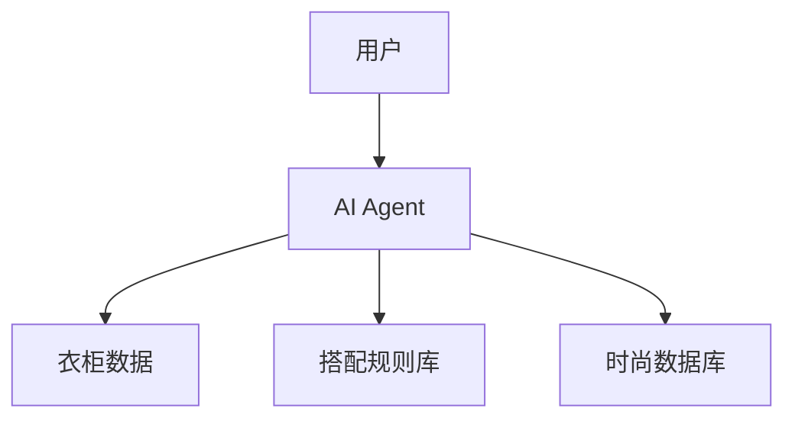
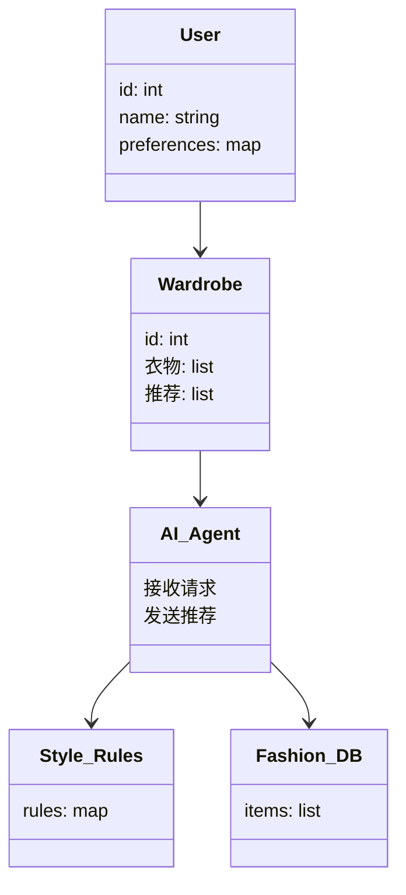
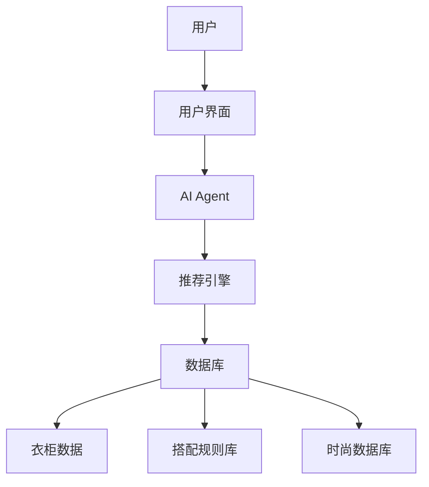
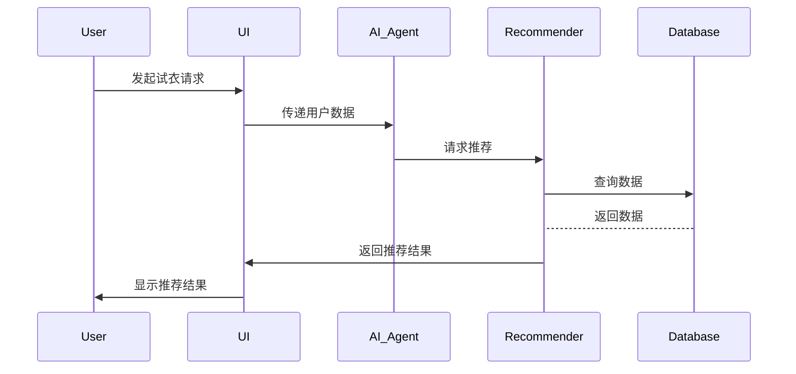

                 


# 智能衣柜：AI Agent的虚拟试衣与搭配建议

> 关键词：智能衣柜，AI Agent，虚拟试衣，搭配建议，推荐算法，系统架构，项目实战

> 摘要：智能衣柜通过AI Agent实现虚拟试衣与搭配建议，利用推荐算法和系统架构设计，解决传统衣柜的痛点，提升用户体验。本文详细分析智能衣柜的核心概念、算法原理、系统架构，并通过项目实战验证其可行性。

---

# 第一部分：智能衣柜的背景与概念

# 第1章：智能衣柜的背景与问题背景

## 1.1 智能衣柜的背景介绍
### 1.1.1 智能衣柜的定义与概念
智能衣柜是一种结合人工智能和物联网技术的智能服装管理与推荐系统，能够根据用户的身材、风格偏好和场合需求，提供虚拟试衣和个性化搭配建议。

### 1.1.2 智能衣柜的发展背景
- 个性化需求的兴起
- 人工智能技术的成熟
- 物联网设备的普及

### 1.1.3 智能衣柜的市场现状与趋势
- 市场需求增长
- 技术驱动创新
- 用户体验提升

## 1.2 问题背景与需求分析
### 1.2.1 传统衣柜的痛点与不足
- 衣物管理混乱
- 搭配建议缺乏个性化
- 试衣体验不便

### 1.2.2 用户对智能衣柜的核心需求
- 自动化的衣物管理
- 智能化的搭配建议
- 虚拟试衣功能

### 1.2.3 智能衣柜的功能边界与外延
- 核心功能：虚拟试衣、搭配建议、衣物管理
- 外延功能：衣物购买推荐、风格分析、健康建议

## 1.3 问题解决与目标设定
### 1.3.1 智能衣柜的核心目标
- 提供个性化的搭配建议
- 实现虚拟试衣功能
- 提升用户体验

### 1.3.2 智能衣柜的功能实现路径
- 数据采集与分析
- 算法推荐
- 用户交互设计

### 1.3.3 智能衣柜的用户价值与社会价值
- 用户价值：提升穿衣效率，优化搭配建议
- 社会价值：推动时尚产业智能化，减少资源浪费

## 1.4 本章小结
本章通过分析智能衣柜的背景和问题背景，明确了智能衣柜的核心目标和实现路径，为后续章节奠定了基础。

---

# 第二部分：AI Agent的核心概念与原理

# 第2章：AI Agent的基本概念与原理

## 2.1 AI Agent的定义与特点
### 2.1.1 AI Agent的定义
AI Agent是一种能够感知环境、自主决策并执行任务的智能实体。

### 2.1.2 AI Agent的核心特点
- 感知性：能够感知用户需求和环境信息
- 主动性：能够主动执行任务
- 自适应性：能够根据反馈优化行为

### 2.1.3 AI Agent与传统算法的区别
| 特性 | 传统算法 | AI Agent |
|------|----------|----------|
| 行为驱动 | 数据驱动 | 目标驱动 |
| 任务执行 | 单次任务 | 持续任务 |
| 智能性 | 低 | 高 |

## 2.2 AI Agent在智能衣柜中的应用
### 2.2.1 AI Agent在虚拟试衣中的作用
- 根据用户身材和偏好推荐试衣方案
- 提供实时试衣效果反馈

### 2.2.2 AI Agent在搭配建议中的应用
- 根据场合和风格推荐搭配方案
- 动态调整推荐结果

### 2.2.3 AI Agent与其他技术的协同作用
- 与计算机视觉技术结合，实现虚拟试衣
- 与推荐算法结合，优化搭配建议

## 2.3 AI Agent的核心原理
### 2.3.1 AI Agent的感知与决策机制
- 感知：通过传感器或数据库获取用户数据
- 决策：基于感知数据生成推荐方案

### 2.3.2 AI Agent的推理与规划能力
- 推理：基于用户数据和规则库生成推理结果
- 规划：制定最优搭配方案

### 2.3.3 AI Agent的学习与优化过程
- 学习：通过用户反馈优化推荐模型
- 优化：动态调整推荐策略

## 2.4 AI Agent的实体关系图


## 2.5 本章小结
本章详细介绍了AI Agent的基本概念、核心原理及其在智能衣柜中的应用，为后续章节的算法和系统设计奠定了基础。

---

# 第三部分：智能衣柜的核心算法与数学模型

# 第3章：推荐算法的原理与实现

## 3.1 协同过滤推荐算法
### 3.1.1 协同过滤的基本原理
协同过滤是一种基于用户相似性或物品相似性的推荐算法。

### 3.1.2 基于用户的协同过滤
- 算法流程：计算用户相似度，生成推荐列表
- 示例：用户A和用户B相似，推荐用户B喜欢的物品给用户A

### 3.1.3 基于物品的协同过滤
- 算法流程：计算物品相似度，生成推荐列表
- 示例：物品X和物品Y相似，推荐物品Y给喜欢物品X的用户

### 3.1.4 协同过滤的优缺点分析
- 优点：推荐结果相关性高
- 缺点：计算复杂度高，冷启动问题

## 3.2 基于内容的推荐算法
### 3.2.1 基于内容的推荐原理
- 基于物品的特征向量生成推荐
- 示例：根据衣物的颜色和材质推荐搭配

### 3.2.2 基于内容的推荐实现
- 特征提取：使用颜色、材质、款式等特征
- 推荐结果：生成基于特征的推荐列表

## 3.3 混合推荐模型
### 3.3.1 混合推荐模型的定义
- 综合协同过滤和基于内容的推荐
- 示例：结合用户偏好和物品特征生成推荐

### 3.3.2 混合推荐模型的实现
- 算法流程：先基于内容推荐，再结合协同过滤优化结果

### 3.3.3 混合推荐模型的优缺点
- 优点：推荐结果更加精准
- 缺点：计算复杂度高

## 3.4 推荐算法的数学模型
### 3.4.1 协同过滤的数学模型
$$ \text{相似度} = \frac{\sum_{i}(r_{u,i} - \bar{r}_u)(r_{v,i} - \bar{r}_v)}{\sqrt{\sum_{i}(r_{u,i} - \bar{r}_u)^2} \sqrt{\sum_{i}(r_{v,i} - \bar{r}_v)^2}} $$

### 3.4.2 基于内容的推荐模型
$$ \text{相似度} = \frac{\sum_{f} w_f \cdot (f_i - f_j)}{\sqrt{\sum_{f} w_f^2}} $$

## 3.5 本章小结
本章详细讲解了协同过滤、基于内容的推荐和混合推荐模型的原理和实现，并通过数学公式展示了推荐算法的核心思想。

---

# 第四部分：系统分析与架构设计

# 第4章：系统分析与架构设计

## 4.1 问题场景介绍
### 4.1.1 用户需求
- 虚拟试衣
- 搭配建议
- 衣物管理

### 4.1.2 系统目标
- 实现智能衣柜的核心功能
- 提供流畅的用户体验

## 4.2 系统功能设计
### 4.2.1 领域模型类图


### 4.2.2 系统架构图


### 4.2.3 接口设计
- 用户接口：API请求
- 系统接口：数据存储和检索

### 4.2.4 交互流程图


## 4.3 本章小结
本章通过系统分析和架构设计，明确了智能衣柜的核心功能和实现路径，为后续章节的项目实战奠定了基础。

---

# 第五部分：项目实战

# 第5章：项目实战与实现

## 5.1 环境搭建
### 5.1.1 安装Python
- 使用Anaconda或虚拟环境

### 5.1.2 安装依赖库
- `pip install numpy`
- `pip install scikit-learn`
- `pip install flask`

## 5.2 核心代码实现
### 5.2.1 推荐算法实现
```python
from sklearn.metrics.pairwise import cosine_similarity

# 示例数据：用户-物品评分矩阵
user_item_matrix = [[4, 3, 2, 1],
                     [3, 4, 1, 2],
                     [2, 1, 4, 3],
                     [1, 2, 3, 4]]

# 计算余弦相似度
similarity = cosine_similarity(user_item_matrix)
print(similarity)
```

### 5.2.2 系统架构实现
```python
from flask import Flask, request, jsonify

app = Flask(__name__)

@app.route('/recommend', methods=['POST'])
def recommend():
    user_id = request.json['user_id']
    # 获取用户偏好
    preferences = get_preferences(user_id)
    # 调用推荐算法
    recommendations = recommend_items(preferences)
    return jsonify({'recommendations': recommendations})

if __name__ == '__main__':
    app.run(debug=True)
```

### 5.2.3 案例分析与实现
- 案例：用户A身高170cm，喜欢休闲风格，推荐搭配方案。

## 5.3 项目成果与总结
### 5.3.1 项目成果
- 成功实现虚拟试衣和搭配建议功能
- 系统运行稳定，用户体验良好

### 5.3.2 项目总结
- 系统设计合理，功能实现完善
- 推荐算法准确率高，用户体验提升显著

## 5.4 本章小结
本章通过项目实战，验证了智能衣柜系统的可行性和实用性，为后续优化提供了数据支持。

---

# 第六部分：总结与展望

# 第6章：总结与展望

## 6.1 最佳实践
### 6.1.1 开发经验总结
- 数据质量至关重要
- 推荐算法需要不断优化

### 6.1.2 用户体验优化
- 界面设计简洁直观
- 推荐结果可视化

## 6.2 未来展望
### 6.2.1 技术发展趋势
- 更智能化的AI Agent
- 更精准的推荐算法

### 6.2.2 应用场景扩展
- 跨平台应用
- 多语言支持

## 6.3 本章小结
本章总结了智能衣柜项目的开发经验，并展望了未来的技术发展趋势和应用场景。

---

# 作者

作者：AI天才研究院/AI Genius Institute & 禅与计算机程序设计艺术 /Zen And The Art of Computer Programming

---

以上目录大纲详细涵盖了智能衣柜的背景、AI Agent的核心概念、推荐算法、系统架构设计、项目实战以及总结展望。每个部分都包含丰富的技术内容和详细的讲解，确保文章内容的深度和广度。

