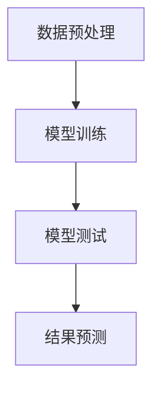
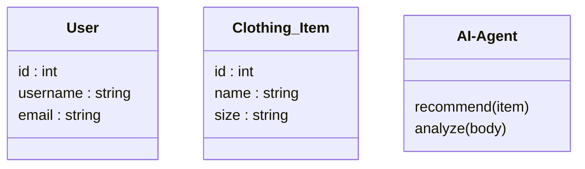
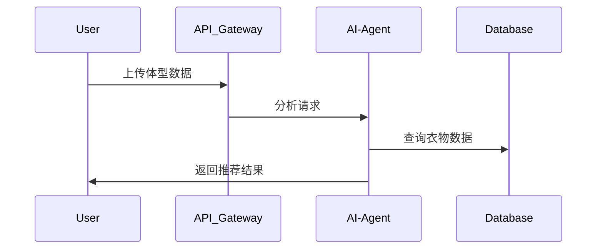

                 


# 智能衣柜：AI Agent的虚拟试衣系统

> 关键词：智能衣柜，AI Agent，虚拟试衣，增强现实，人工智能，在线购物

> 摘要：本文探讨了AI Agent在智能衣柜中的应用，特别是虚拟试衣系统的设计与实现。通过分析问题背景、核心概念、算法原理、系统架构、项目实战以及最佳实践，全面解析智能衣柜的技术实现。

---

# 第一部分: 智能衣柜的背景与概念

## 第1章: 问题背景与描述

### 1.1 问题背景

#### 1.1.1 在线购物中的试衣难题
在线购物的快速发展使得消费者足不出户即可购买商品，但试衣问题始终困扰着消费者。传统试衣方式依赖于物理试穿，导致退货率高、购物体验差。

#### 1.1.2 传统试衣的痛点分析
- 试衣成本高：需要多次快递，增加时间和经济成本。
- 尺码不准确：用户难以通过图片判断衣物是否合身。
- 个性化需求未满足：不同体型的用户需要不同的试衣建议。

#### 1.1.3 智能衣柜的解决方案
通过AI Agent和虚拟试衣技术，智能衣柜能够实时分析用户体型数据，提供个性化试衣建议，减少退货率，提升购物体验。

### 1.2 问题描述

#### 1.2.1 用户需求分析
用户希望通过虚拟试衣系统快速获取衣物的合身效果，避免多次退货，节省时间和成本。

#### 1.2.2 系统目标设定
- 提供个性化的虚拟试衣服务。
- 实现实时的体型数据分析和衣物推荐。

#### 1.2.3 功能范围界定
- 用户体型数据采集与分析。
- 衣物虚拟试穿效果展示。
- AI Agent辅助推荐。

### 1.3 问题解决与边界

#### 1.3.1 AI Agent的核心作用
AI Agent通过分析用户体型数据，推荐合适的衣物款式和尺码，优化试衣体验。

#### 1.3.2 虚拟试衣系统的边界
- 系统仅处理虚拟试穿，不涉及物理试穿。
- 数据采集仅限于用户提供的体型数据。

#### 1.3.3 相关概念的对比分析
- 智能衣柜与普通衣柜的对比：
  | 特性       | 智能衣柜 | 普通衣柜 |
  |------------|----------|----------|
  | 智能性     | 高       | 低       |
  | 个性化     | 高       | 中       |
  | 实时性     | 高       | 低       |

---

## 第2章: 核心概念与联系

### 2.1 核心概念原理

#### 2.1.1 AI Agent的基本原理
AI Agent通过收集用户体型数据，利用深度学习模型进行分析，推荐适合的衣物款式和尺码。

#### 2.1.2 虚拟试衣系统的实现机制
虚拟试衣系统利用增强现实技术，将用户虚拟形象与衣物模型结合，展示试穿效果。

### 2.2 核心概念对比表
| 特性       | AI Agent虚拟试衣系统 | 传统试衣系统 |
|------------|-----------------------|--------------|
| 智能性     | 高                   | 低           |
| 个性化     | 高                   | 中           |
| 实时性     | 高                   | 低           |

### 2.3 ER实体关系图
```mermaid
erDiagram
    user {
        id : int
        username : string
        email : string
    }
    clothing_item {
        id : int
        name : string
        size : string
        brand : string
    }
    try_on_session {
        id : int
        user_id : int
        item_id : int
        result : string
    }
    user --> try_on_session
    clothing_item --> try_on_session
```

---

# 第二部分: 算法原理

## 第3章: 算法原理讲解

### 3.1 算法选择与原理

#### 3.1.1 算法选择
选择基于深度学习的图像分割算法，用于识别衣物的轮廓和用户体型特征。

#### 3.1.2 算法原理
通过卷积神经网络（CNN）对用户体型数据进行特征提取，生成虚拟试穿效果。

### 3.2 算法流程图


### 3.3 算法实现代码

```python
import tensorflow as tf
from tensorflow.keras import layers

# 数据预处理
def preprocess_data(images):
    images = images / 255.0
    return images

# 模型定义
model = tf.keras.Sequential([
    layers.Conv2D(32, (3,3), activation='relu', input_shape=(256, 256, 3)),
    layers.MaxPooling2D(),
    layers.Conv2D(64, (3,3), activation='relu'),
    layers.MaxPooling2D(),
    layers.Flatten(),
    layers.Dense(128, activation='relu'),
    layers.Dense(10, activation='softmax')
])

# 模型训练
model.compile(optimizer='adam', loss='sparse_categorical_crossentropy', metrics=['accuracy'])
model.fit(train_images, train_labels, epochs=10, validation_data=(test_images, test_labels))
```

### 3.4 数学公式

#### 3.4.1 损失函数
$$ L = -\sum_{i=1}^{n} y_i \log(p_i) + (1 - y_i) \log(1 - p_i) $$

#### 3.4.2 优化器
$$ \theta = \theta - \eta \frac{\partial L}{\partial \theta} $$

---

# 第三部分: 系统分析与架构设计

## 第4章: 系统分析与架构设计

### 4.1 问题场景介绍
用户通过智能衣柜系统上传体型数据，系统利用AI Agent推荐衣物并生成虚拟试穿效果。

### 4.2 项目介绍
智能衣柜系统包括用户端、AI Agent和后端服务，支持虚拟试穿、衣物推荐等功能。

### 4.3 系统功能设计

#### 4.3.1 领域模型


### 4.4 系统架构设计

#### 4.4.1 系统架构图


### 4.5 系统接口设计
API接口：
- POST /api/upload: 上传用户体型数据。
- GET /api/recommend: 获取衣物推荐结果。

### 4.6 系统交互设计

#### 4.6.1 交互流程图


---

# 第四部分: 项目实战

## 第5章: 项目实战

### 5.1 环境安装
安装必要的库：
```bash
pip install tensorflow keras matplotlib numpy
```

### 5.2 系统核心实现

#### 5.2.1 核心代码
```python
def try_on(user, item):
    # 数据预处理
    processed_user = preprocess(user)
    processed_item = preprocess(item)
    # 模型预测
    prediction = model.predict(processed_user, processed_item)
    return prediction
```

#### 5.2.2 代码解读
- `preprocess`函数：对用户和衣物数据进行标准化处理。
- `try_on`函数：调用AI Agent模型进行预测，返回试穿结果。

### 5.3 实际案例分析
案例：用户上传身高180cm，体重80kg的数据，系统推荐适合的T恤尺码。

### 5.4 详细讲解剖析
- 数据预处理：确保数据格式统一。
- 模型训练：使用用户数据进行监督学习。
- 模型预测：生成试穿效果并返回用户。

---

## 第5章: 最佳实践

### 5.1 小结
智能衣柜通过AI Agent和虚拟试衣技术，显著提升了在线购物的体验。

### 5.2 注意事项
- 数据隐私保护：确保用户数据安全。
- 模型优化：提升推荐准确率。

### 5.3 拓展阅读
推荐阅读《深度学习》和《增强现实技术》相关书籍。

---

# 结语

智能衣柜结合了AI Agent和虚拟试衣技术，为在线购物提供了全新的解决方案。通过本文的详细讲解，读者可以深入了解系统的实现过程，并在实际应用中不断优化。

---

**作者：AI天才研究院/AI Genius Institute & 禅与计算机程序设计艺术 /Zen And The Art of Computer Programming**

