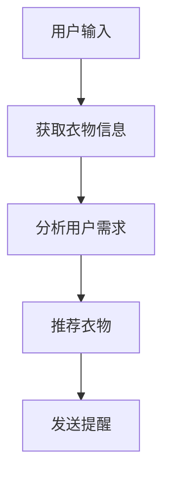
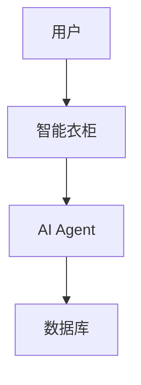
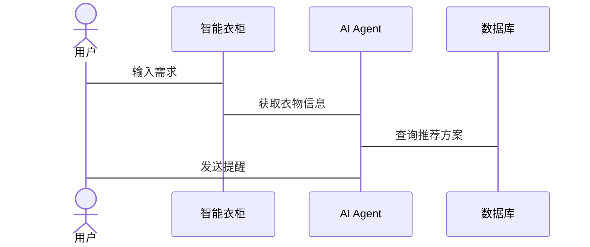

                 


# 智能衣柜：AI Agent的衣物保养提醒

## 关键词：智能衣柜，AI Agent，衣物保养，推荐算法，系统架构，物联网

## 摘要：  
随着人工智能和物联网技术的快速发展，智能衣柜逐渐成为现代生活中不可或缺的一部分。本文将从AI Agent的核心原理出发，详细探讨智能衣柜在衣物保养提醒中的应用。通过分析AI Agent的算法原理、系统架构设计以及实际项目实现，本文旨在为读者提供一个全面的技术视角，帮助他们理解如何利用AI技术提升衣物管理效率。

---

# 第1章: 智能衣柜与AI Agent的背景介绍

## 1.1 智能衣柜的定义与特点  
智能衣柜是一种结合物联网技术和人工智能的智能设备，能够通过传感器、摄像头等硬件感知衣物的状态，并通过AI算法为用户提供智能化的衣物管理服务。  

### 1.1.1 智能衣柜的定义  
智能衣柜是基于物联网和人工智能技术的智能设备，能够自动识别衣物的种类、材质、颜色等信息，并根据用户的使用习惯和衣物的状态提供智能化的管理服务。  

### 1.1.2 智能衣柜的核心特点  
- **智能感知**：通过传感器和摄像头感知衣物的状态，如是否需要清洗、是否需要干燥、是否有褶皱等。  
- **智能推荐**：基于用户的使用习惯和衣物的属性，推荐最优的保养方案。  
- **智能提醒**：当衣物需要保养时，系统会主动提醒用户，并提供具体的保养建议。  

### 1.1.3 智能衣柜与传统衣柜的对比  
| 对比维度 | 传统衣柜 | 智能衣柜 |  
|----------|----------|----------|  
| 智能化程度 | 无 | 高 |  
| 功能 | 储存衣物 | 储存、管理、保养提醒 |  
| 用户交互 | 简单 | 复杂（语音、App等） |  

## 1.2 AI Agent的基本概念  
AI Agent（人工智能代理）是一种能够感知环境、做出决策并执行任务的智能实体，能够帮助用户完成各种任务。  

### 1.2.1 AI Agent的定义  
AI Agent是指能够感知环境、理解用户需求，并通过执行一系列动作来满足用户需求的智能实体。  

### 1.2.2 AI Agent的核心功能  
- **感知环境**：通过传感器、摄像头等设备获取环境信息。  
- **理解需求**：通过自然语言处理技术理解用户的意图。  
- **做出决策**：基于获取的信息和用户需求，做出最优决策。  
- **执行任务**：通过执行动作（如发送提醒、控制设备等）完成任务。  

### 1.2.3 AI Agent在智能衣柜中的应用  
在智能衣柜中，AI Agent主要用于以下几个方面：  
- **衣物识别**：通过图像识别技术识别衣物的种类、材质和颜色。  
- **用户行为分析**：通过分析用户的使用习惯，推荐最优的衣物保养方案。  
- **智能提醒**：当衣物需要清洗、晾晒或保养时，AI Agent会主动提醒用户。  

## 1.3 衣物保养提醒的背景与需求  
随着生活水平的提高，人们对衣物的保养需求也在不断增加。然而，传统的衣物管理方式效率低下，容易导致衣物损坏或浪费。  

### 1.3.1 衣物保养的重要性  
- 衣物保养可以延长衣物的使用寿命。  
- 正确的保养方式可以保持衣物的光泽和形状。  

### 1.3.2 用户对衣物管理的需求  
- 用户希望衣物管理更加智能化。  
- 用户希望衣物管理更加便捷。  

### 1.3.3 智能衣柜解决的问题  
- 解决传统衣物管理效率低的问题。  
- 提供个性化的衣物保养建议。  

## 1.4 本章小结  
本章主要介绍了智能衣柜和AI Agent的基本概念，以及AI Agent在智能衣柜中的应用。通过对比传统衣柜和智能衣柜的特点，读者可以更好地理解智能衣柜的优势和价值。

---

# 第2章: 核心概念与联系  

## 2.1 AI Agent的核心原理  
AI Agent的核心原理包括感知、决策和执行三个模块。  

### 2.1.1 AI Agent的感知模块  
感知模块通过传感器和摄像头获取环境信息，并通过图像识别技术识别衣物的种类、材质和颜色。  

### 2.1.2 AI Agent的决策模块  
决策模块基于获取的信息和用户的使用习惯，通过推荐算法为用户提供最优的衣物保养方案。  

### 2.1.3 AI Agent的执行模块  
执行模块通过控制智能衣柜的硬件设备（如灯光、传感器等）完成任务。  

## 2.2 智能衣柜的系统架构  
智能衣柜的系统架构包括前端、后端和数据库三个部分。  

### 2.2.1 智能衣柜的硬件架构  
硬件架构包括传感器、摄像头、控制模块和通信模块。  

### 2.2.2 智能衣柜的软件架构  
软件架构包括数据处理模块、推荐算法模块和用户界面模块。  

### 2.2.3 系统的核心模块与功能  
- 数据处理模块：负责处理衣物的识别和保养建议。  
- 推荐算法模块：基于用户需求和衣物属性推荐最优的保养方案。  
- 用户界面模块：为用户提供友好的交互界面。  

## 2.3 核心概念对比与ER实体关系图  
通过对比分析，我们可以更好地理解智能衣柜和传统衣柜的区别。  

### 2.3.1 衣物管理系统的对比分析  
| 功能 | 传统衣柜 | 智能衣柜 |  
|------|----------|----------|  
| 衣物识别 | 无 | 有 |  
| 保养提醒 | 无 | 有 |  
| 用户交互 | 简单 | 复杂 |  

### 2.3.2 ER实体关系图的构建  
```mermaid
er
actor 用户
actor 智能衣柜
actor AI Agent
```

---

# 第3章: 算法原理讲解  

## 3.1 AI Agent的推荐算法  
AI Agent的推荐算法包括协同过滤、基于内容的推荐和混合推荐三种类型。  

### 3.1.1 基于协同过滤的推荐算法  
协同过滤算法通过分析用户的行为和偏好，推荐相似的衣物。  

### 3.1.2 基于内容的推荐算法  
基于内容的推荐算法通过分析衣物的属性，推荐相似的衣物。  

### 3.1.3 混合推荐算法  
混合推荐算法结合协同过滤和基于内容的推荐算法，推荐更精准的衣物。  

## 3.2 算法流程图  
推荐算法的流程图如下：  


## 3.3 算法实现代码  
以下是推荐算法的核心代码：  

```python
def collaborative_filtering(user_id, items):
    # 获取用户的历史行为数据
    user_data = get_user_data(user_id)
    # 计算相似用户的相似度
    similar_users = find_similar_users(user_id, user_data)
    # 推荐物品
    recommendations = []
    for user in similar_users:
        for item in items:
            if user in item.recommended_users:
                recommendations.append(item)
    return recommendations
```

---

# 第4章: 数学模型与公式  

## 4.1 推荐算法的数学模型  
推荐算法的数学模型包括协同过滤和基于内容的推荐模型。  

### 4.1.1 协同过滤算法的数学公式  
协同过滤算法的相似度计算公式如下：  
$$ \text{相似度} = \frac{\sum_{i=1}^{n}(r_{u,i} - \bar{r}_u)(r_{v,i} - \bar{r}_v)}{\sqrt{\sum_{i=1}^{n}(r_{u,i} - \bar{r}_u)^2} \sqrt{\sum_{i=1}^{n}(r_{v,i} - \bar{r}_v)^2}} $$  

### 4.1.2 基于内容的推荐算法公式  
基于内容的推荐算法的相似度计算公式如下：  
$$ \text{相似度} = \frac{\sum_{i=1}^{n}w_i \cdot x_i \cdot y_i}{\sqrt{\sum_{i=1}^{n}w_i \cdot x_i^2} \sqrt{\sum_{i=1}^{n}w_i \cdot y_i^2}} $$  

---

# 第5章: 系统分析与架构设计  

## 5.1 问题场景分析  
问题场景分析包括用户需求分析、系统功能分析和系统性能分析。  

### 5.1.1 用户需求分析  
用户需求分析包括用户的使用习惯和衣物的属性。  

### 5.1.2 系统功能分析  
系统功能分析包括衣物识别、用户行为分析和保养提醒。  

### 5.1.3 系统性能分析  
系统性能分析包括系统的响应时间和处理能力。  

## 5.2 系统架构设计  
系统架构设计包括系统功能模块划分、系统架构图和系统接口设计。  

### 5.2.1 系统功能模块划分  
系统功能模块包括数据处理模块、推荐算法模块和用户界面模块。  

### 5.2.2 系统架构图  


### 5.2.3 系统接口设计  
系统接口设计包括用户与智能衣柜的交互接口、智能衣柜与AI Agent的通信接口和AI Agent与数据库的交互接口。  

## 5.3 系统交互流程图  
系统交互流程图包括用户与系统交互流程和系统内部交互流程。  

### 5.3.1 用户与系统交互流程  


---

# 第6章: 项目实战  

## 6.1 环境搭建与配置  
项目实战包括环境安装与配置、依赖库安装和数据集准备。  

### 6.1.1 开发环境安装  
开发环境安装包括Python和相关库的安装。  

### 6.1.2 依赖库安装  
依赖库安装包括numpy、pandas、scikit-learn等库的安装。  

### 6.1.3 数据集准备  
数据集准备包括衣物属性数据和用户行为数据的准备。  

## 6.2 系统核心实现  
系统核心实现包括数据处理模块实现、推荐算法模块实现和系统交互模块实现。  

### 6.2.1 数据处理模块实现  
数据处理模块实现包括衣物属性的提取和用户行为数据的分析。  

### 6.2.2 推荐算法模块实现  
推荐算法模块实现包括协同过滤算法和基于内容的推荐算法的实现。  

### 6.2.3 系统交互模块实现  
系统交互模块实现包括用户与智能衣柜的交互和智能衣柜与AI Agent的通信。  

## 6.3 代码实现与解读  
代码实现与解读包括系统核心代码的实现和代码运行与测试。  

### 6.3.1 系统核心代码  
以下是推荐算法的核心代码：  

```python
def collaborative_filtering(user_id, items):
    user_data = get_user_data(user_id)
    similar_users = find_similar_users(user_id, user_data)
    recommendations = []
    for user in similar_users:
        for item in items:
            if user in item.recommended_users:
                recommendations.append(item)
    return recommendations
```

---

# 作者：AI天才研究院/AI Genius Institute & 禅与计算机程序设计艺术 /Zen And The Art of Computer Programming

