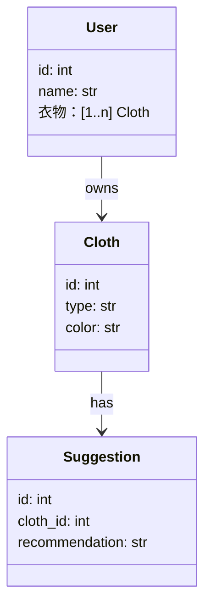
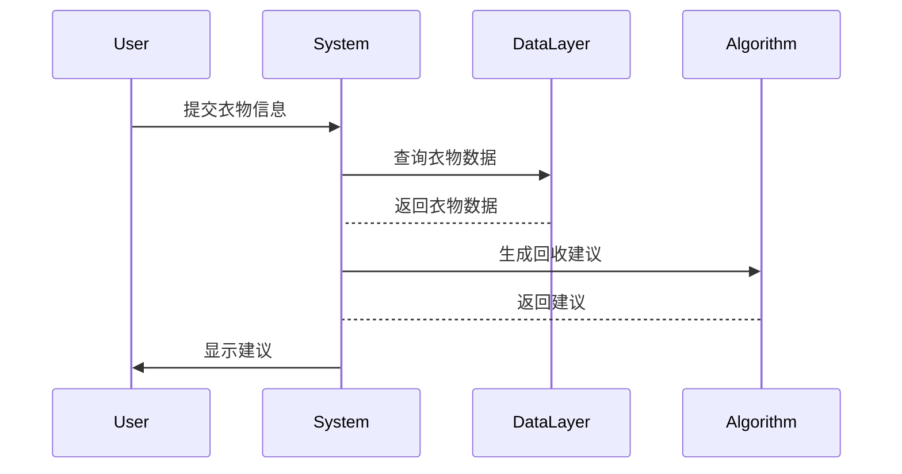

                 


# 智能衣柜：AI Agent的衣物回收建议系统

> **关键词**：智能衣柜、AI Agent、衣物回收、数据挖掘、机器学习、系统架构

> **摘要**：随着人工智能技术的快速发展，衣物管理与回收系统智能化成为趋势。本文详细探讨了基于AI Agent的衣物回收建议系统的构建，从背景分析、核心概念、算法原理、系统架构到项目实战，全面解析该系统的实现过程和应用价值。

---

# 第一部分: 背景介绍

## 第1章: 问题背景与需求分析

### 1.1 问题背景
#### 1.1.1 衣物管理的现状与挑战
现代人衣柜中常常积攒大量衣物，却难以高效管理。衣物分类混乱、利用率低、回收渠道不畅等问题普遍存在。AI Agent技术的应用可以有效解决这些问题。

#### 1.1.2 衣物回收的痛点与机会
传统衣物回收方式效率低、成本高，难以满足用户需求。AI Agent可以通过智能化推荐，优化衣物回收流程，降低资源浪费。

#### 1.1.3 AI技术在衣物管理中的应用潜力
AI技术在图像识别、自然语言处理等方面的优势，为衣物分类、推荐提供了新的解决方案。

### 1.2 问题描述
#### 1.2.1 衣物分类与管理的需求
用户需要根据衣物的材质、颜色、使用频率等属性进行分类管理。

#### 1.2.2 衣物回收的智能化需求
用户希望系统能够智能推荐适合回收的衣物，并提供回收渠道建议。

#### 1.2.3 用户行为分析的必要性
通过分析用户的穿衣习惯，AI Agent可以优化衣物推荐和回收建议。

### 1.3 问题解决思路
#### 1.3.1 AI Agent在衣物管理中的角色
AI Agent作为智能助手，负责数据采集、分析和建议生成。

#### 1.3.2 系统目标与功能定位
系统目标是优化衣物管理效率，降低资源浪费。功能定位包括衣物分类、回收建议、用户行为分析等。

#### 1.3.3 解决方案的可行性分析
通过AI技术实现衣物管理的智能化是可行且高效的。

### 1.4 边界与外延
#### 1.4.1 系统功能的边界
系统仅关注衣物管理与回收，不涉及其他生活领域。

#### 1.4.2 系统应用的场景外延
系统适用于个人用户和小型服装企业。

#### 1.4.3 与其他系统的接口关系
系统可与其他物流平台、电商平台等进行数据对接。

---

## 第2章: 核心概念与系统架构

### 2.1 AI Agent的核心原理
#### 2.1.1 AI Agent的基本概念
AI Agent是一种智能实体，能够感知环境并执行任务。

#### 2.1.2 AI Agent的分类与特点
根据智能水平，AI Agent可分为简单反射型、基于模型的 reactive 型等。

#### 2.1.3 AI Agent在衣物管理中的应用
AI Agent可以执行衣物分类、回收推荐等任务。

### 2.2 衣物回收建议系统的功能模块
#### 2.2.1 数据采集模块
通过图像识别采集衣物信息。

#### 2.2.2 数据处理模块
对衣物数据进行清洗和预处理。

#### 2.2.3 智能建议模块
基于机器学习模型生成回收建议。

#### 2.2.4 用户交互模块
为用户提供友好的操作界面。

### 2.3 系统架构设计
#### 2.3.1 分层架构设计
系统分为数据层、业务逻辑层和用户界面层。

#### 2.3.2 微服务架构设计
采用微服务架构，提高系统的可扩展性和灵活性。

#### 2.3.3 数据流与交互流程
数据从采集到处理，最终生成建议并反馈给用户。

### 2.4 核心概念与ER实体关系图
#### 2.4.1 用户与衣物的关系
用户拥有衣物，可以通过系统管理衣物。

#### 2.4.2 衣物与建议的关系
每件衣物对应多个回收建议。

#### 2.4.3 用户与建议的关系
用户可以查看和选择回收建议。

---

## 第3章: 算法原理与实现

### 3.1 AI Agent的核心算法
#### 3.1.1 机器学习算法
使用随机森林或支持向量机对衣物进行分类。

#### 3.1.2 自然语言处理算法
通过NLP技术分析用户的穿衣习惯。

#### 3.1.3 群智算法
结合用户行为数据，优化回收建议。

### 3.2 算法实现流程
#### 3.2.1 数据采集与预处理
采集衣物图像数据，进行清洗和标注。

#### 3.2.2 特征提取与模型训练
提取衣物的纹理、颜色等特征，训练分类模型。

#### 3.2.3 模型部署与优化
将模型部署到系统中，并进行调优。

### 3.3 算法的数学模型与公式
#### 3.3.1 机器学习模型的数学表达
随机森林模型的分类公式：$$f(x) = \sum_{i=1}^{n} \text{Tree}(x)$$

#### 3.3.2 自然语言处理模型的数学公式
词嵌入模型的向量表示：$$\text{Word2Vec}(x) = W x$$

#### 3.3.3 群智算法的数学推导
协同过滤的相似度计算：$$\text{sim}(u, v) = \frac{\sum_{i=1}^{n} r_{ui} r_{vi}}{\sqrt{\sum_{i=1}^{n} r_{ui}^2} \sqrt{\sum_{i=1}^{n} r_{vi}^2}}$$

### 3.4 算法的实现代码
#### 3.4.1 数据处理代码
```python
import cv2
import numpy as np

def process_image(image_path):
    image = cv2.imread(image_path)
    gray = cv2.cvtColor(image, cv2.COLOR_BGR2GRAY)
    return gray
```

#### 3.4.2 模型训练代码
```python
from sklearn.ensemble import RandomForestClassifier

model = RandomForestClassifier(n_estimators=100)
model.fit(X_train, y_train)
```

---

## 第4章: 系统分析与架构设计

### 4.1 系统功能分析
#### 4.1.1 用户需求分析
用户需要高效的衣物管理工具。

#### 4.1.2 系统功能分析
系统需要实现衣物分类、回收建议、用户交互等功能。

#### 4.1.3 业务流程分析
用户上传衣物信息，系统生成回收建议。

### 4.2 系统架构设计
#### 4.2.1 系统功能模块的类图


#### 4.2.2 系统交互流程的序列图


---

## 第5章: 项目实战

### 5.1 环境安装与配置
#### 5.1.1 开发环境
Python 3.8+, OpenCV, Scikit-learn

#### 5.1.2 依赖安装
```bash
pip install opencv-python scikit-learn
```

### 5.2 核心代码实现
#### 5.2.1 数据采集与处理
```python
import cv2
import numpy as np

def collect_cloth_images(cloth_paths):
    images = []
    for path in cloth_paths:
        img = cv2.imread(path)
        images.append(img)
    return images
```

#### 5.2.2 模型训练与部署
```python
from sklearn.ensemble import RandomForestClassifier

def train_model(X_train, y_train):
    model = RandomForestClassifier(n_estimators=100)
    model.fit(X_train, y_train)
    return model
```

### 5.3 实际案例分析
#### 5.3.1 案例背景
用户上传了一批旧衣物，系统需要推荐适合回收的衣物。

#### 5.3.2 数据处理与分析
系统提取衣物的特征，训练模型，生成回收建议。

#### 5.3.3 代码实现与结果展示
```python
# 示例代码
model = train_model(X_train, y_train)
y_pred = model.predict(X_test)
print("准确率：", accuracy_score(y_test, y_pred))
```

---

## 第6章: 总结与展望

### 6.1 总结
本文详细介绍了基于AI Agent的衣物回收建议系统的构建过程，从背景分析、核心概念到算法实现，系统地探讨了该系统的可行性与应用价值。

### 6.2 展望
未来可以进一步优化算法，拓展系统的应用场景，提升用户体验。

### 6.3 最佳实践
- 数据隐私保护至关重要。
- 系统优化建议包括模型调优和功能扩展。

### 6.4 小结
通过AI技术实现衣物管理的智能化是未来趋势，本文为相关研究提供了参考。

---

**作者：AI天才研究院 & 禅与计算机程序设计艺术**

