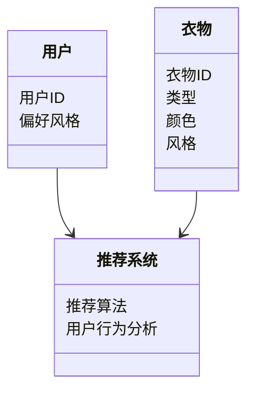
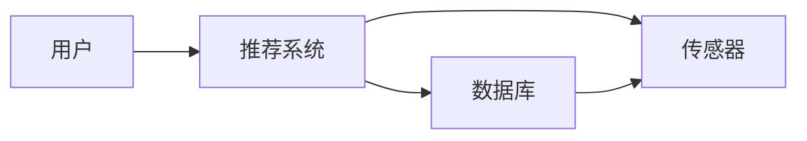
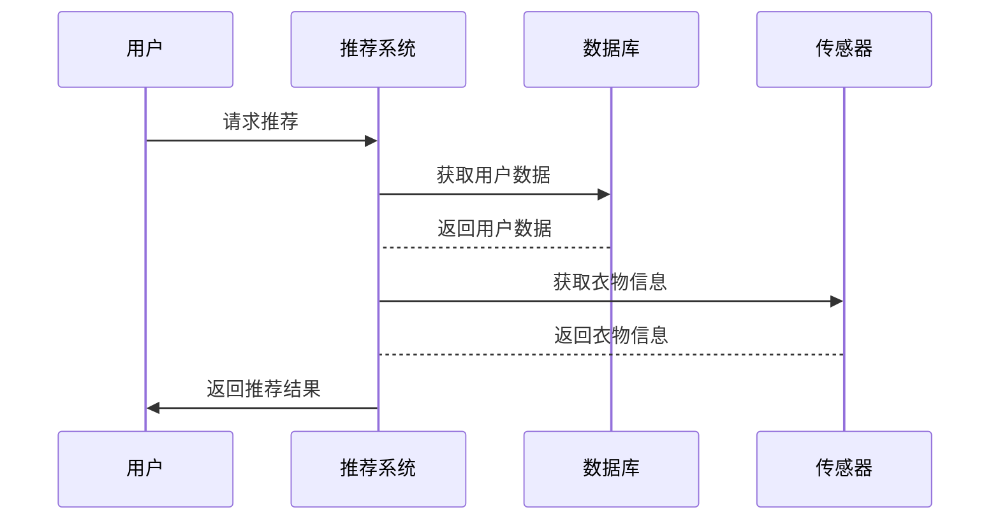

                 


# 智能衣柜：AI Agent的衣物搭配推荐

> 关键词：智能衣柜，AI Agent，衣物搭配，推荐系统，协同过滤，物联网，机器学习

> 摘要：智能衣柜通过AI Agent技术实现衣物的智能推荐与搭配，利用协同过滤算法和物联网技术，为用户提供个性化的穿衣方案。本文从背景、原理到实现，全面解析智能衣柜的设计与应用。

---

# 第一部分: 智能衣柜的背景与概念

# 第1章: 智能衣柜的背景与问题背景

## 1.1 智能衣柜的背景介绍

### 1.1.1 智能衣柜的概念与定义
智能衣柜是一种结合人工智能和物联网技术的智能服装收纳与推荐系统。通过传感器、摄像头和AI算法，智能衣柜能够识别衣物的种类、颜色和风格，并为用户提供个性化的穿衣建议。

### 1.1.2 智能衣柜的发展历程
- **早期阶段**：智能衣柜的概念起源于智能家居的发展，最初仅具备基本的收纳和提醒功能。
- **智能化阶段**：随着AI技术的进步，智能衣柜开始具备衣物识别和推荐功能。
- **个性化阶段**：通过深度学习和用户行为分析，智能衣柜能够提供更加精准的搭配建议。

### 1.1.3 智能衣柜的市场现状与趋势
目前，智能衣柜市场呈现快速增长态势，消费者对个性化穿衣需求的增加是推动市场发展的主要动力。未来，智能衣柜将更加注重用户体验和数据隐私保护。

## 1.2 问题背景与问题描述

### 1.2.1 衣物搭配推荐的痛点分析
- **用户需求多样化**：不同用户有不同的穿衣风格和需求。
- **信息不对称**：用户难以快速找到合适的搭配方案。
- **数据孤岛**：衣物信息分散，难以整合。

### 1.2.2 智能衣柜的目标与应用场景
智能衣柜的目标是通过AI技术，帮助用户快速找到合适的衣物搭配，提升穿衣效率和时尚感。应用场景包括日常穿搭、重要场合搭配、季节性穿搭等。

### 1.2.3 问题解决的必要性与可行性
- **必要性**：解决用户穿衣搭配难题，提升生活质量。
- **可行性**：通过AI技术和物联网设备，实现衣物识别和推荐。

## 1.3 智能衣柜的核心功能与边界

### 1.3.1 核心功能模块概述
- **衣物识别**：通过图像识别技术识别衣物种类、颜色和风格。
- **推荐系统**：基于协同过滤算法推荐搭配方案。
- **用户交互**：通过手机APP或语音助手与用户交互。

### 1.3.2 系统边界与外延
- **边界**：仅限于衣物搭配推荐，不涉及衣物购买和清洗功能。
- **外延**：可扩展至家庭成员的衣物管理。

### 1.3.3 用户需求分析与场景描述
- **用户类型**：个人用户、家庭用户。
- **典型场景**：用户打开衣柜，系统推荐当天的穿搭方案。

## 1.4 本章小结
本章介绍了智能衣柜的背景、问题背景和核心功能，为后续的AI Agent设计和推荐算法实现奠定了基础。

---

# 第二部分: AI Agent与推荐系统的核心概念

# 第2章: AI Agent的基本原理与实现

## 2.1 AI Agent的定义与核心概念

### 2.1.1 AI Agent的定义与特征
AI Agent是一种能够感知环境并采取行动以实现目标的智能体。其核心特征包括自主性、反应性、目标导向和社会能力。

### 2.1.2 AI Agent的核心要素与组成
- **感知层**：通过传感器感知环境。
- **推理层**：通过算法进行决策。
- **执行层**：通过执行机构采取行动。

### 2.1.3 AI Agent的分类与应用场景
- **简单反射型AI Agent**：基于规则的简单响应。
- **基于模型的反应式AI Agent**：基于环境模型进行决策。
- **目标驱动型AI Agent**：以目标为导向进行行动。

## 2.2 AI Agent与推荐系统的联系

### 2.2.1 AI Agent在推荐系统中的角色
AI Agent作为推荐系统的核心，负责接收用户需求、分析数据并输出推荐结果。

### 2.2.2 AI Agent与传统推荐算法的区别
| 特性       | AI Agent推荐 | 传统推荐算法 |
|------------|--------------|--------------|
| 决策方式   | 自主决策     | 基于规则     |
| 知识表示   | 知识图谱     | 矩阵或列表   |
| 适应性     | 高度动态     | 静态或低动态 |

### 2.2.3 AI Agent在智能衣柜中的具体应用
- **衣物识别**：通过AI Agent识别衣物的类型和风格。
- **搭配推荐**：基于用户行为和环境数据推荐搭配方案。

## 2.3 核心概念的属性特征对比

### 2.3.1 AI Agent与传统推荐算法的对比表格
（见上文）

### 2.3.2 实体关系图（ER图）的Mermaid流程图


## 2.4 本章小结
本章详细介绍了AI Agent的基本原理及其在智能衣柜中的应用，为后续的推荐算法实现提供了理论基础。

---

# 第三部分: 推荐系统的算法原理与数学模型

# 第3章: 基于协同过滤的推荐算法

## 3.1 协同过滤算法的原理

### 3.1.1 基于用户的协同过滤
基于用户的行为相似性推荐物品。

### 3.1.2 基于物品的协同过滤
基于物品的相似性推荐相关物品。

### 3.1.3 混合协同过滤的优缺点
优点：结合了用户和物品的特征。缺点：计算复杂度高。

## 3.2 协同过滤的数学模型与公式

### 3.2.1 协同过滤的矩阵表示
用户-物品评分矩阵：

$$
R = [r_{ij}]
$$

其中，$r_{ij}$表示用户$i$对物品$j$的评分。

### 3.2.2 交替最小二乘法公式
通过交替最小化用户和物品的参数来优化矩阵分解：

$$
(X^T X + \lambda I)u = X^T y
$$

其中，$X$是用户-物品的交互矩阵，$u$是用户因子，$y$是物品因子，$\lambda$是正则化参数。

## 3.3 协同过滤的实现流程

### 3.3.1 数据预处理
- **数据清洗**：去除无效数据。
- **数据标准化**：将评分数据归一化处理。

### 3.3.2 模型训练
- **矩阵分解**：将用户-物品矩阵分解为用户因子和物品因子。
- **相似性计算**：计算用户或物品的相似性。

### 3.3.3 推荐生成
- **相似用户推荐**：找到与目标用户相似的其他用户，推荐他们喜欢的物品。
- **相似物品推荐**：找到与目标物品相似的其他物品，推荐给用户。

## 3.4 本章小结
本章详细介绍了协同过滤算法的原理与实现流程，为智能衣柜的推荐系统提供了算法基础。

---

# 第四部分: 智能衣柜的系统架构设计

# 第4章: 智能衣柜的系统分析与架构设计

## 4.1 问题场景介绍
智能衣柜需要实现衣物识别、推荐和用户交互三大功能。

## 4.2 系统功能设计

### 4.2.1 领域模型类图


### 4.2.2 系统架构设计


## 4.3 系统接口设计

### 4.3.1 API接口
- `/api/register`：用户注册接口。
- `/api/recommend`：获取推荐结果接口。

## 4.4 系统交互流程图



## 4.5 本章小结
本章详细描述了智能衣柜的系统架构设计，包括功能模块、数据流和接口设计。

---

# 第五部分: 项目实战

# 第5章: 智能衣柜的实现与案例分析

## 5.1 环境安装

### 5.1.1 安装Python环境
```bash
pip install numpy
pip install scikit-learn
```

## 5.2 核心代码实现

### 5.2.1 数据预处理代码
```python
import numpy as np
from sklearn.metrics.pairwise import pairwise_distances

# 用户-物品评分矩阵
R = np.array([
    [4, 3, 0],
    [2, 0, 3],
    [1, 5, 2],
    [0, 3, 1]
])

# 计算相似性矩阵
similarity = pairwise_distances(R.T, metric='cosine')
```

### 5.2.2 矩阵分解代码
```python
from sklearn.decomposition import NMF

# 矩阵分解
model = NMF(n_components=2, random_state=42)
model.fit(R)
```

## 5.3 代码解读与分析

### 5.3.1 数据预处理部分
- 使用`pairwise_distances`计算相似性矩阵。
- 采用余弦相似性作为距离度量。

### 5.3.2 矩阵分解部分
- 使用非负矩阵分解（NMF）对评分矩阵进行分解。
- 分解后得到用户因子和物品因子。

## 5.4 实际案例分析

### 5.4.1 案例背景
用户A偏好休闲风格，数据库中有以下衣物信息：

| 衣物ID | 类型 | 颜色 | 风格 |
|--------|------|------|------|
| 1      | 衬衣 | 蓝色 | 休闲 |
| 2      | 裤子 | 灰色 | 正装 |
| 3      | 西装 | 黑色 | 正装 |

### 5.4.2 推荐结果
推荐系统为用户A推荐搭配方案：

- **上衣**：蓝色衬衫
- **下装**：灰色裤子
- **鞋子**：休闲鞋

## 5.5 本章小结
本章通过实际案例展示了智能衣柜的实现过程，从数据预处理到模型训练，再到结果展示，完整呈现了推荐系统的应用。

---

# 第六部分: 最佳实践与总结

# 第6章: 智能衣柜的最佳实践

## 6.1 小结
智能衣柜通过AI Agent和协同过滤算法实现了衣物的智能推荐，为用户提供了个性化的穿衣方案。

## 6.2 注意事项
- **数据隐私**：确保用户数据的安全性。
- **算法优化**：持续优化推荐算法以提升推荐精度。
- **用户体验**：注重用户交互设计，提升用户体验。

## 6.3 拓展阅读
- 《推荐系统实战》
- 《AI Agent原理与应用》

## 6.4 本章小结
本章总结了智能衣柜的设计与实现经验，提出了未来发展的建议。

---

# 作者

作者：AI天才研究院/AI Genius Institute & 禅与计算机程序设计艺术 /Zen And The Art of Computer Programming

