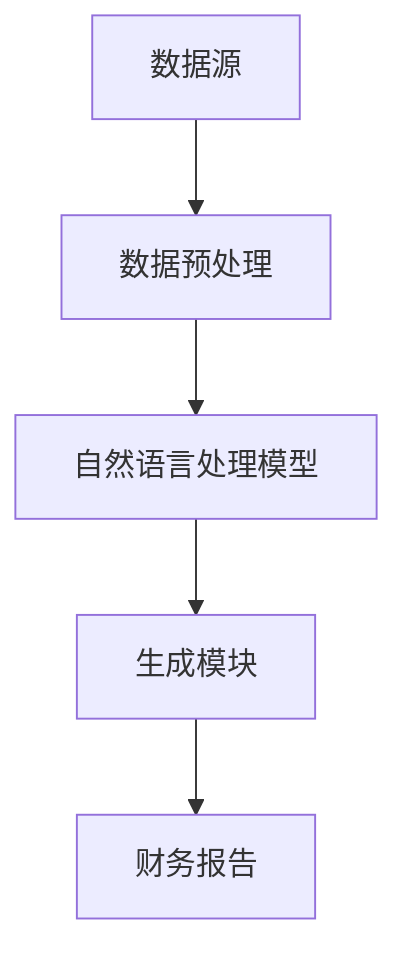
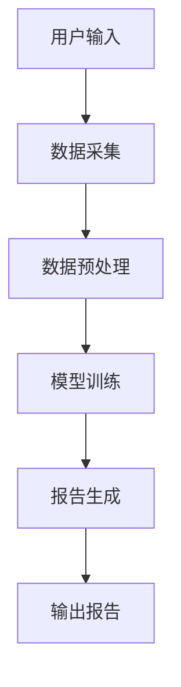

                 

# 智能财务报告自动生成系统

## 关键词：智能财务报告，自动生成，自然语言处理，生成算法，系统架构

## 摘要：本文详细探讨了智能财务报告自动生成系统的实现原理、系统架构和项目实战。通过分析传统财务报告生成的痛点，提出了一种基于自然语言处理和生成算法的智能解决方案，并通过具体的系统架构设计和项目案例，展示了如何高效、准确地生成财务报告。

---

## 第1章: 背景与问题背景

### 1.1 什么是智能财务报告自动生成系统

#### 1.1.1 财务报告的传统生成方式
传统的财务报告生成过程通常依赖人工操作，包括数据收集、数据整理、数据分析和报告撰写。这种方式效率低下，容易出错，且难以适应大数据时代的海量数据需求。

#### 1.1.2 传统财务报告生成的痛点
1. **效率低下**：人工生成报告耗时长，尤其在数据量大的情况下。
2. **错误率高**：人为操作容易出错，特别是在复杂的数据处理过程中。
3. **缺乏灵活性**：传统报告生成方式难以快速适应不同的数据格式和报告需求。

#### 1.1.3 智能财务报告自动生成的定义
智能财务报告自动生成系统是一种基于人工智能技术的系统，能够自动从结构化数据中生成符合要求的财务报告。它结合了自然语言处理（NLP）和生成算法，能够高效、准确地完成报告生成任务。

---

## 第2章: 核心概念与原理

### 2.1 智能财务报告自动生成系统的组成要素

#### 2.1.1 数据源
数据源是智能财务报告生成的基础，通常包括财务数据（如收入、支出、利润等）和相关业务数据（如订单、客户信息等）。

#### 2.1.2 自然语言处理技术
自然语言处理技术用于理解和生成自然语言文本，是智能财务报告生成的关键技术。常用的技术包括词嵌入（Word Embedding）、编码器-解码器（Encoder-Decoder）结构和注意力机制（Attention Mechanism）。

#### 2.1.3 生成算法
生成算法用于将结构化数据转换为自然语言文本。常用的算法包括基于规则的生成算法、统计模型和深度学习模型（如变分自编码器VAE和生成对抗网络GAN）。

### 2.2 核心概念的实体关系图

---

## 第3章: 算法原理与数学模型

### 3.1 自然语言处理模型的数学基础

#### 3.1.1 词嵌入表示
词嵌入是一种将单词或短语映射到高维向量空间的技术。常用的词嵌入方法包括Word2Vec和GloVe。

公式：
$$
\text{Word2Vec}：\quad w_i = \arg\max_{w} P(w_i|w)
$$

#### 3.1.2 编码器-解码器结构
编码器将输入数据编码为一个固定长度的向量，解码器将该向量解码为输出文本。

公式：
$$
\text{编码器}：\quad h = f(x) \\
\text{解码器}：\quad y = g(h)
$$

#### 3.1.3 注意力机制
注意力机制用于在生成文本时关注输入数据中的重要部分。

公式：
$$
\text{注意力权重}：\quad a_{ij} = \frac{\exp(s_{ij})}{\sum_{k} \exp(s_{kj})}
$$

### 3.2 生成模型的数学公式

#### 3.2.1 概率生成模型
概率生成模型通过计算生成文本的概率分布来生成文本。

公式：
$$
P(y|x) = \prod_{i=1}^{n} P(y_i | y_{<i}, x)
$$

#### 3.2.2 贝叶斯网络
贝叶斯网络是一种基于概率图模型的生成方法。

公式：
$$
P(y|x) = \frac{P(x|y)P(y)}{P(x)}
$$

#### 3.2.3 变分自编码器
变分自编码器通过优化变分下界来生成文本。

公式：
$$
\mathcal{L} = \mathbb{E}_{q(z|x)}[\log p(x|z)] - \text{KL}(q(z|x) || p(z))
$$`

### 3.3 生成过程中的数学推导

#### 3.3.1 解码器的前向传播
解码器通过前向传播生成文本。

公式：
$$
h_i = \text{tanh}(W_{hh}h_{i-1} + W_{hx}x + b_h)
$$

#### 3.3.2 注意力权重计算
注意力权重用于确定生成文本时关注输入数据的哪些部分。

公式：
$$
\alpha_{ij} = \frac{\exp(e_{ij})}{\sum_{k} \exp(e_{kj})}
$$

#### 3.3.3 损失函数优化
损失函数用于衡量生成文本的质量。

公式：
$$
\mathcal{L} = -\sum_{i=1}^{n} \log P(y_i | y_{<i}, x)
$$`

---

## 第4章: 系统架构与设计

### 4.1 系统功能模块划分

#### 4.1.1 数据采集模块
数据采集模块负责从数据源获取数据。

#### 4.1.2 数据预处理模块
数据预处理模块对数据进行清洗和转换，以适应模型的输入要求。

#### 4.1.3 模型训练模块
模型训练模块负责训练自然语言处理模型和生成模型。

#### 4.1.4 报告生成模块
报告生成模块根据输入数据生成财务报告。

### 4.2 系统架构设计

### 4.3 系统接口设计

#### 4.3.1 数据接口
数据接口用于与数据源进行交互。

#### 4.3.2 模型接口
模型接口用于与训练好的模型进行交互。

#### 4.3.3 报告输出接口
报告输出接口用于将生成的报告输出给用户。

---

## 第5章: 项目实战与实现

### 5.1 项目概述

#### 5.1.1 项目目标
项目目标是开发一个能够自动生成财务报告的系统。

#### 5.1.2 项目需求
项目需求包括数据采集、数据预处理、模型训练和报告生成。

### 5.2 项目实现

#### 5.2.1 环境安装
需要安装Python、TensorFlow、Keras等工具。

#### 5.2.2 数据预处理
对数据进行清洗和转换，例如处理缺失值和异常值。

#### 5.2.3 模型训练
使用自然语言处理模型和生成算法进行模型训练。

#### 5.2.4 报告生成
根据训练好的模型生成财务报告。

### 5.3 实际案例分析

#### 5.3.1 案例背景
假设我们有一个公司的财务数据，包括收入、支出和利润。

#### 5.3.2 案例实现
使用训练好的模型生成财务报告。

#### 5.3.3 案例结果
生成的财务报告包括收入分析、支出分析和利润分析。

---

## 第6章: 最佳实践与小结

### 6.1 最佳实践

#### 6.1.1 数据质量的重要性
数据质量直接影响生成报告的准确性。

#### 6.1.2 模型调优的必要性
模型调优可以提高生成报告的质量。

#### 6.1.3 人机协作的必要性
人机协作可以提高生成报告的效率和准确性。

### 6.2 小结

智能财务报告自动生成系统是一种高效、准确的报告生成方式。通过结合自然语言处理技术和生成算法，可以显著提高财务报告的生成效率和准确性。未来的研究方向包括多语言支持、多格式输出和自适应学习。

---

## 作者：AI天才研究院/AI Genius Institute & 禅与计算机程序设计艺术 /Zen And The Art of Computer Programming

---

通过以上思考过程，我逐步构建了《智能财务报告自动生成系统》的技术博客文章。文章内容涵盖了背景介绍、核心概念、算法原理、系统架构和项目实战等方面，旨在为读者提供一个全面、深入的技术视角。

