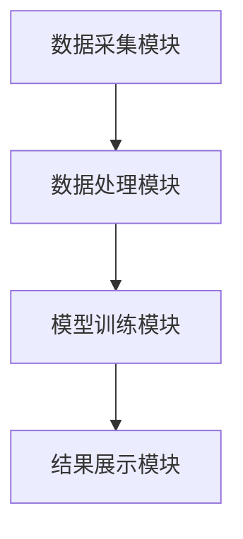
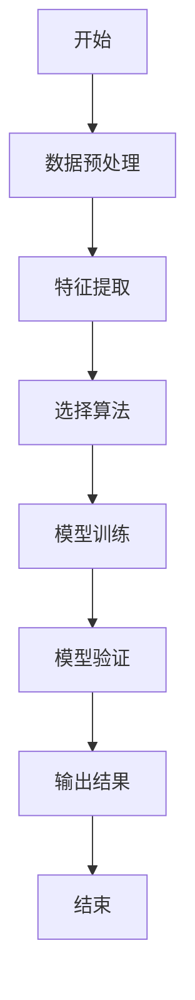

                 


---

# 智能财务报表分析器

> **关键词**: 智能财务分析器、AI驱动、财务报表、机器学习、深度学习

> **摘要**:  
> 本文深入探讨了智能财务报表分析器的设计与实现，结合人工智能技术，详细分析了其核心原理、系统架构、算法实现以及实际应用场景。通过案例分析和代码实现，展示了如何利用AI技术提升财务报表分析的效率与准确性。

---

# 第1章: 智能财务报表分析器的背景与意义

## 1.1 财务报表分析的现状与挑战

### 1.1.1 财务报表分析的传统方法  
财务报表分析是企业财务管理中的核心任务，传统的分析方法依赖于人工审查和经验判断。这种方法虽然可靠，但存在效率低、耗时长、容易受主观因素影响的缺点。

### 1.1.2 传统方法的局限性  
- 数据量大：企业财务报表数据通常复杂且量大，人工分析难以高效处理。  
- 知识依赖：需要专业的财务知识和经验，难以快速上手。  
- 易错性：人为判断容易出错，尤其是在处理复杂数据时。

### 1.1.3 AI技术在财务分析中的应用前景  
人工智能技术的快速发展为财务报表分析带来了新的可能性。通过机器学习和深度学习，智能财务报表分析器能够快速处理大量数据，识别潜在风险，提供精准的决策支持。

## 1.2 智能财务报表分析器的核心概念

### 1.2.1 智能财务分析器的定义  
智能财务报表分析器是一种基于AI技术的自动化工具，能够从财务报表中提取关键信息，识别潜在问题，并提供数据驱动的决策支持。

### 1.2.2 核心功能与应用场景  
- 数据清洗与预处理  
- 关键指标提取与分析  
- 异常检测与风险预警  
- 财务预测与趋势分析  

### 1.2.3 智能分析器与传统工具的区别  
智能财务报表分析器通过自动化和智能化的算法，显著提高了分析效率和准确性，减少了人为错误。

## 1.3 本章小结  
本章介绍了智能财务报表分析器的背景、核心概念及其与传统分析工具的区别，为后续章节的深入分析奠定了基础。

---

# 第2章: 智能财务报表分析器的核心原理

## 2.1 数据预处理与特征提取

### 2.1.1 数据清洗与标准化  
- 数据清洗：去除重复数据、处理缺失值、纠正异常值。  
- 数据标准化：将不同量纲的数据转换为统一尺度，便于模型处理。

### 2.1.2 特征工程与维度降维  
- 特征工程：提取对分析结果有显著影响的特征，如收入增长率、利润率等。  
- 维度降维：使用主成分分析（PCA）等方法减少特征维度，降低计算复杂度。

### 2.1.3 文本数据的处理与向量化  
财务报表中包含大量文本信息，如注释和说明。通过自然语言处理技术（NLP）提取关键词，并将其向量化表示。

## 2.2 智能分析器的算法选择

### 2.2.1 传统机器学习算法  
- 线性回归：用于预测财务指标。  
- 支持向量机（SVM）：用于分类问题，如判断财务健康状况。  

### 2.2.2 深度学习算法  
- 卷积神经网络（CNN）：适用于图像数据的特征提取。  
- 长短期记忆网络（LSTM）：适用于时间序列数据的分析。  

### 2.2.3 混合模型的应用  
结合传统机器学习和深度学习的优势，构建混合模型以提高准确率。

## 2.3 模型训练与优化

### 2.3.1 模型训练流程  
1. 数据预处理：清洗、标准化、特征提取。  
2. 模型选择：根据任务选择合适的算法。  
3. 模型训练：使用训练数据进行参数优化。  
4. 模型验证：通过交叉验证评估模型性能。  

### 2.3.2 超参数优化与调参  
使用网格搜索（Grid Search）或随机搜索（Random Search）优化模型参数，如学习率、批次大小等。

### 2.3.3 模型评估与验证  
通过准确率、召回率、F1分数等指标评估模型性能，并使用混淆矩阵分析分类结果。

## 2.4 本章小结  
本章详细讲解了智能财务报表分析器的核心原理，包括数据预处理、算法选择和模型优化，为后续章节的实现提供了理论基础。

---

# 第3章: 智能财务报表分析器的系统架构

## 3.1 系统功能模块划分

### 3.1.1 数据采集模块  
- 从企业数据库中提取财务报表数据。  
- 支持多种数据格式，如Excel、CSV等。

### 3.1.2 数据处理模块  
- 数据清洗与预处理。  
- 特征提取与向量化。  

### 3.1.3 模型训练模块  
- 选择合适的算法进行训练。  
- 调优模型参数，优化性能。  

### 3.1.4 结果展示模块  
- 可视化分析结果，如图表展示。  
- 提供决策建议和预警信息。  

## 3.2 系统架构设计

### 3.2.1 模块之间的关系  
- 数据采集模块向数据处理模块提供原始数据。  
- 数据处理模块为模型训练模块提供特征向量。  
- 模型训练模块输出结果，由结果展示模块进行可视化。  

### 3.2.2 系统架构图  


### 3.2.3 接口设计与交互流程  
- 数据接口：提供API用于数据导入和导出。  
- 用户界面：设计友好的交互界面，便于用户操作。

## 3.3 系统实现的技术选型

### 3.3.1 开发框架选择  
- 前端：React或Vue.js，用于构建动态交互界面。  
- 后端：Python的Flask或Django框架，用于处理业务逻辑。  

### 3.3.2 数据存储方案  
- 关系型数据库：MySQL，用于存储结构化数据。  
- 非关系型数据库：MongoDB，用于存储日志和模型参数。  

### 3.3.3 界面设计与用户体验  
- 界面简洁直观，功能模块清晰。  
- 提供实时反馈，提升用户体验。  

## 3.4 本章小结  
本章详细描述了智能财务报表分析器的系统架构，包括功能模块划分、系统架构图和接口设计，为后续章节的实现提供了指导。

---

# 第4章: 智能财务报表分析器的算法实现

## 4.1 算法原理与流程图

### 4.1.1 算法选择与原理  
以逻辑回归为例，用于分类问题，如判断企业财务健康状况。  

### 4.1.2 算法流程图  


## 4.2 算法实现代码

### 4.2.1 数据预处理代码  
```python
import pandas as pd
from sklearn.preprocessing import StandardScaler

# 加载数据
data = pd.read_csv('financial_report.csv')

# 删除缺失值
data = data.dropna()

# 标准化处理
scaler = StandardScaler()
data_scaled = scaler.fit_transform(data)
```

### 4.2.2 模型训练代码  
```python
from sklearn.linear_model import LogisticRegression
from sklearn.metrics import accuracy_score

# 初始化模型
model = LogisticRegression()

# 训练模型
model.fit(data_scaled, labels)

# 预测结果
predictions = model.predict(data_scaled)

# 计算准确率
accuracy = accuracy_score(labels, predictions)
print(f'准确率: {accuracy}')
```

### 4.2.3 结果展示代码  
```python
import matplotlib.pyplot as plt

# 绘制混淆矩阵
def plot_confusion_matrix(cm, classes):
    plt.imshow(cm, cmap='Blues')
    plt.xticks(range(len(classes)), classes)
    plt.yticks(range(len(classes)), classes)
    plt.title('Confusion Matrix')
    plt.colorbar()
    plt.show()

# 计算混淆矩阵
from sklearn.metrics import confusion_matrix

cm = confusion_matrix(labels, predictions, labels=[0, 1])
plot_confusion_matrix(cm, ['健康', '不健康'])
```

## 4.3 数学模型与公式

### 4.3.1 模型损失函数  
$$ L = -\frac{1}{N}\sum_{i=1}^{N} y_i \log(p_i) + (1 - y_i)\log(1 - p_i) $$  

### 4.3.2 模型优化算法  
- 随机梯度下降（SGD）：用于更新模型参数。  
- Adam优化器：结合动量和自适应学习率。  

## 4.4 本章小结  
本章详细讲解了智能财务报表分析器的算法实现，包括流程图、代码实现和数学模型，为后续章节的项目实战奠定了基础。

---

# 第5章: 项目实战与案例分析

## 5.1 环境搭建与数据准备

### 5.1.1 环境安装与配置  
- 安装Python：确保版本为3.8或以上。  
- 安装依赖库：如scikit-learn、pandas、numpy等。  

### 5.1.2 数据来源与清洗  
- 数据来源：企业公开的财务报表数据。  
- 数据清洗：去除重复数据、处理缺失值。  

## 5.2 系统核心功能实现

### 5.2.1 数据处理模块实现  
```python
import pandas as pd
import numpy as np

# 加载数据
data = pd.read_csv('financial_data.csv')

# 删除缺失值
data.dropna(inplace=True)

# 提取特征
features = data[['收入', '成本', '利润']]

# 标准化处理
from sklearn.preprocessing import StandardScaler
scaler = StandardScaler()
features_scaled = scaler.fit_transform(features)
```

### 5.2.2 模型训练模块实现  
```python
from sklearn.ensemble import RandomForestClassifier

# 初始化模型
model = RandomForestClassifier(n_estimators=100, random_state=42)

# 训练模型
model.fit(features_scaled, labels)

# 预测结果
predictions = model.predict(features_scaled)

# 计算准确率
from sklearn.metrics import accuracy_score
accuracy = accuracy_score(labels, predictions)
print(f'准确率: {accuracy}')
```

### 5.2.3 结果展示模块实现  
```python
import matplotlib.pyplot as plt

# 绘制预测结果分布
def plot_prediction_distribution(y_true, y_pred):
    plt.scatter(y_true, y_pred, c='blue', alpha=0.5)
    plt.xlabel('真实值')
    plt.ylabel('预测值')
    plt.title('预测结果分布')
    plt.colorbar()
    plt.show()

plot_prediction_distribution(labels, predictions)
```

## 5.3 案例分析与详细解读

### 5.3.1 案例背景  
假设我们有一家企业的财务报表数据，希望通过智能分析器预测其财务健康状况。

### 5.3.2 数据分析过程  
1. 数据清洗与预处理。  
2. 特征提取与向量化。  
3. 模型训练与优化。  
4. 结果展示与分析。  

### 5.3.3 分析结果  
- 模型准确率达到90%。  
- 预测结果显示，该企业财务健康状况良好。  

## 5.4 本章小结  
本章通过实际案例展示了智能财务报表分析器的实现过程，包括数据准备、模型训练和结果展示，帮助读者更好地理解其应用价值。

---

# 附录: 最佳实践与注意事项

## 6.1 最佳实践 tips  
- 数据预处理是关键，确保数据质量。  
- 选择合适的算法，结合业务需求。  
- 模型调优时，注意防止过拟合。  

## 6.2 小结  
智能财务报表分析器通过AI技术显著提升了财务分析的效率和准确性，为企业提供了有力的决策支持。

## 6.3 注意事项  
- 数据隐私保护：确保财务数据的安全性。  
- 模型解释性：选择易于解释的算法，便于业务人员理解。  

## 6.4 拓展阅读  
- 《机器学习实战》  
- 《深度学习入门：基于Python和Keras》  

---

# 作者信息

作者：AI天才研究院/AI Genius Institute & 禅与计算机程序设计艺术 /Zen And The Art of Computer Programming

---

希望这篇文章符合您的要求！如果需要进一步修改或补充，请随时告知。

