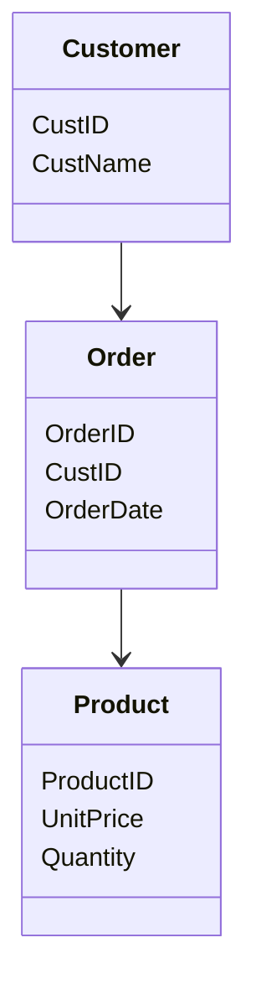
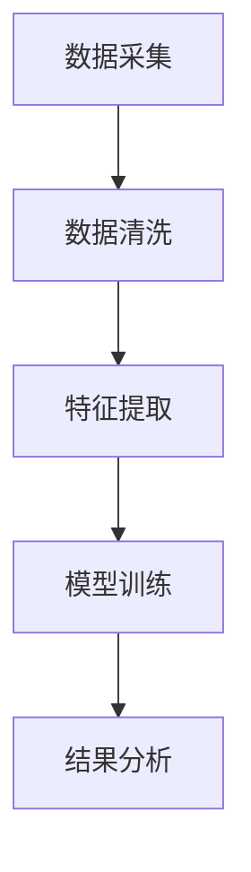
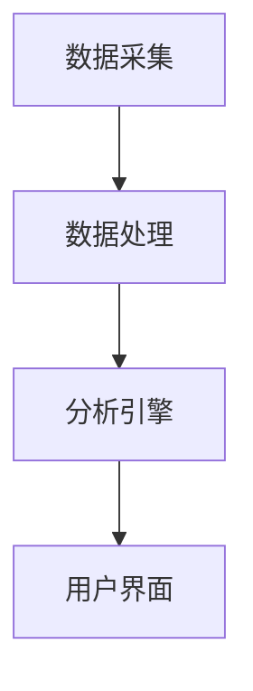
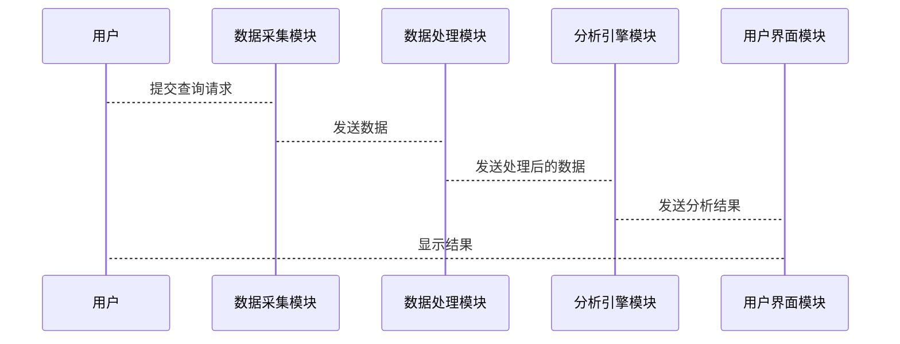

                 


---

# 智能财务报表比较分析系统

## 关键词
智能财务报表分析、数据挖掘、机器学习、系统架构设计、财务数字化转型

## 摘要
本文系统地介绍了智能财务报表比较分析系统的设计与实现，探讨了其在企业财务管理中的应用价值。通过背景分析、核心概念解析、算法原理阐述、系统架构设计以及项目实战指导，本文为读者提供了从理论到实践的全面指导。文章内容详实，结合实际案例和代码示例，帮助读者掌握智能财务报表分析的核心技术。

---

## 第一部分: 智能财务报表比较分析系统背景

### 第1章: 智能财务报表比较分析系统背景

#### 1.1 问题背景与描述
##### 1.1.1 传统财务报表分析的局限性
传统的财务报表分析依赖人工操作，效率低下且容易出错。财务人员需要手动收集、整理和分析大量数据，耗时且成本高昂。此外，传统方法难以处理多维度、多层次的复杂分析需求，难以满足现代企业对高效、精准财务管理的要求。

##### 1.1.2 智能化分析的需求与重要性
随着企业规模的扩大和市场竞争的加剧，企业对财务数据的实时性和精准性要求不断提高。智能化财务报表分析系统能够通过自动化数据处理和智能算法，快速生成分析结果，为企业决策提供支持。此外，智能化分析还能发现潜在的财务风险，助力企业优化财务管理策略。

##### 1.1.3 企业财务管理的数字化转型
数字化转型已成为企业提升竞争力的重要手段。通过智能财务报表分析系统，企业能够实现财务管理的数字化、智能化和自动化，提升财务数据的利用效率，降低运营成本，增强企业的市场应变能力。

#### 1.2 问题解决与边界
##### 1.2.1 智能财务报表比较分析的目标
智能财务报表比较分析系统的目标是通过自动化数据处理和智能算法，实现财务数据的高效分析、比较和预测，为企业提供精准的财务决策支持。

##### 1.2.2 系统边界与功能范围
系统的边界包括数据采集、数据预处理、模型训练、分析引擎和结果展示五个模块。系统功能范围涵盖财务数据的采集与存储、数据清洗与预处理、智能分析模型的构建与应用、分析结果的可视化展示。

##### 1.2.3 核心问题的解决思路
通过机器学习算法，系统能够自动识别财务数据中的异常值，提取关键指标，进行趋势分析和预测。同时，系统采用分布式架构，确保高并发场景下的性能稳定。

#### 1.3 核心概念与要素
##### 1.3.1 财务报表数据结构
财务报表数据结构包括收入表、利润表、资产负债表等。每个报表包含多个指标，如收入、成本、利润等。数据结构设计需考虑数据的层次性和关联性，便于后续分析。

##### 1.3.2 智能分析算法
智能分析算法包括回归分析、聚类分析、时间序列分析等。这些算法能够帮助系统发现数据中的潜在规律，预测未来趋势。

##### 1.3.3 系统架构与模块划分
系统架构分为数据采集层、数据处理层、分析引擎层和用户界面层。每个层负责不同的功能模块，确保系统的高效运行。

#### 1.4 本章小结
本章介绍了智能财务报表比较分析系统的背景，阐述了其重要性和目标，明确了系统的边界和核心概念。为后续章节的深入分析奠定了基础。

---

## 第二部分: 核心概念与系统架构

### 第2章: 核心概念与系统模块

#### 2.1 核心概念定义
##### 2.1.1 智能财务报表分析的定义
智能财务报表分析是指利用人工智能技术，对财务报表数据进行自动化采集、清洗、建模和分析，生成有价值的财务信息，辅助企业决策。

##### 2.1.2 数据源与处理流程
数据源包括企业的财务系统、ERP系统等。处理流程包括数据采集、清洗、转换和存储。数据清洗是关键步骤，需处理缺失值、异常值等问题。

##### 2.1.3 分析模型与结果输出
分析模型包括分类、回归、聚类等算法。结果输出包括可视化图表、报告等，帮助用户直观理解分析结果。

#### 2.2 核心概念对比
##### 2.2.1 不同分析方法的特征对比
| 分析方法 | 描述 | 适用场景 |
|----------|------|----------|
| 回归分析 | 预测变量之间的关系 | 预测收入与成本的关系 |
| 聚类分析 | 将数据分为若干类别 | 检测财务数据中的异常交易 |
| 时间序列分析 | 分析数据的时间趋势 | 预测未来财务状况 |

##### 2.2.2 系统功能模块的属性分析
系统功能模块包括数据采集、预处理、模型训练、分析引擎和结果展示。每个模块都有特定的功能和属性，如数据采集模块负责从财务系统中获取数据，预处理模块负责清洗数据。

##### 2.2.3 业务流程与技术实现的关联
业务流程包括数据采集、处理、分析、展示。技术实现涉及数据存储、算法实现、结果可视化等。两者密切相关，确保系统的高效运行。

#### 2.3 ER实体关系图
```mermaid
erDiagram
    customer[CustID, CustName] --> order[OrderID, CustID, OrderDate]
    order --> product[ProductID, OrderID, Quantity, UnitPrice]
```

#### 2.4 领域模型


#### 2.5 本章小结
本章详细介绍了智能财务报表比较分析系统的核心概念，包括数据源、处理流程和分析模型。通过ER图和领域模型，展示了系统的数据结构和模块关系。

---

## 第三部分: 算法原理与实现

### 第3章: 算法原理

#### 3.1 算法原理
##### 3.1.1 算法流程


##### 3.1.2 算法实现
```python
import pandas as pd
from sklearn.model_selection import train_test_split
from sklearn.ensemble import RandomForestRegressor

# 数据加载
data = pd.read_csv('financial_data.csv')

# 数据预处理
data = data.dropna()
X = data.drop('target', axis=1)
y = data['target']

# 数据分割
X_train, X_test, y_train, y_test = train_test_split(X, y, test_size=0.2)

# 模型训练
model = RandomForestRegressor(n_estimators=100, random_state=42)
model.fit(X_train, y_train)

# 模型预测
y_pred = model.predict(X_test)
```

##### 3.1.3 算法数学模型
回归分析的数学模型为：
$$ y = \beta_0 + \beta_1x_1 + \beta_2x_2 + ... + \beta_nx_n + \epsilon $$

其中，$\epsilon$ 是误差项。

#### 3.2 本章小结
本章详细讲解了智能财务报表分析系统的算法原理，包括算法流程、实现步骤和数学模型。通过Python代码示例，展示了如何实现回归分析模型。

---

## 第四部分: 系统架构设计

### 第4章: 系统架构设计

#### 4.1 系统架构概述
##### 4.1.1 分层架构设计
系统采用分层架构，包括数据层、业务逻辑层和表现层。

##### 4.1.2 模块划分
系统模块包括数据采集模块、数据处理模块、分析引擎模块和用户界面模块。

#### 4.2 系统架构设计图


#### 4.3 系统交互设计
##### 4.3.1 系统接口设计
系统接口包括数据接口和用户接口。数据接口负责与财务系统交互，用户接口负责展示分析结果。

##### 4.3.2 系统交互流程


#### 4.4 本章小结
本章详细介绍了智能财务报表比较分析系统的架构设计，包括分层架构、模块划分和系统交互流程。

---

## 第五部分: 项目实战

### 第5章: 项目实战

#### 5.1 环境安装与配置
##### 5.1.1 安装Python环境
使用Anaconda安装Python 3.8及以上版本。

##### 5.1.2 安装依赖库
安装pandas、numpy、scikit-learn等库：
```bash
pip install pandas numpy scikit-learn
```

#### 5.2 数据采集与处理
##### 5.2.1 数据采集代码
```python
import pandas as pd
data = pd.read_csv('financial_data.csv')
```

##### 5.2.2 数据清洗代码
```python
data = data.dropna()
```

#### 5.3 模型训练与分析
##### 5.3.1 训练代码
```python
from sklearn.ensemble import RandomForestRegressor
model = RandomForestRegressor(n_estimators=100)
model.fit(X_train, y_train)
```

##### 5.3.2 结果分析
分析模型的准确率、召回率等指标，优化模型参数。

#### 5.4 系统实现
##### 5.4.1 系统架构实现
实现分层架构，确保各模块的高效交互。

##### 5.4.2 界面设计与展示
使用Django或Flask框架开发用户界面，展示分析结果。

#### 5.5 本章小结
本章通过实际项目案例，详细讲解了智能财务报表比较分析系统的实现过程，包括环境配置、数据处理、模型训练和结果展示。

---

## 第六部分: 总结与展望

### 第6章: 总结与展望

#### 6.1 总结
智能财务报表比较分析系统通过自动化数据处理和智能算法，显著提升了财务管理的效率和准确性。系统架构设计合理，功能模块清晰，能够满足企业的多样化需求。

#### 6.2 未来展望
未来，系统将进一步优化算法性能，扩展应用场景，如实时数据分析和移动端应用。同时，系统将集成更多高级算法，如深度学习模型，提升分析精度。

---

## 作者信息
作者：AI天才研究院 & 禅与计算机程序设计艺术  
联系方式：[email protected]  
GitHub链接：[https://github.com/ainstitute](https://github.com/ainstitute)  
更多文章：[https://www.zenofprogramming.com](https://www.zenofprogramming.com)

---

**注**：本文为简化示例，实际撰写时需要根据具体需求进一步扩展和详细化，特别是各章节的具体实现部分，需要提供完整的代码示例和详细的步骤说明。

