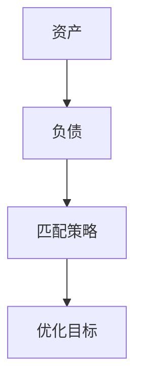
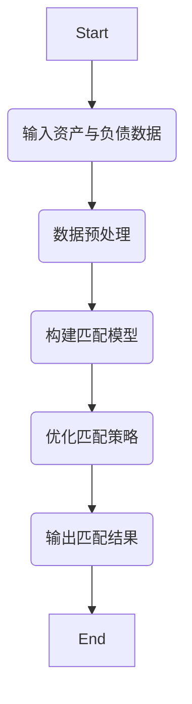

                 


# 智能资产负债匹配策略生成器

> 关键词：智能资产负债、匹配策略、生成器、算法、优化、系统设计、项目实战

> 摘要：本文深入探讨了智能资产负债匹配策略生成器的原理、算法、系统设计及实际应用。通过详细的技术分析和实例，展示了如何利用人工智能技术优化资产负债结构，实现收益最大化和风险控制。

---

## 第一部分: 智能资产负债匹配的背景与概念

### 第1章: 智能资产负债匹配的背景介绍

#### 1.1 问题背景与描述

**1.1.1 资产负债表的基本概念**

资产负债表是企业财务状况的重要组成部分，反映了企业在某一特定时点的资产、负债和所有者权益的状况。资产是指企业拥有的资源，负债是企业需要偿还的债务，所有者权益是资产扣除负债后的剩余部分。传统的资产负债管理依赖于人工操作，效率低下且容易出错。

**1.1.2 资产负债匹配的必要性**

在金融领域，资产负债匹配是指根据企业的资金需求和市场环境，合理配置资产和负债，以实现企业财务目标。智能资产负债匹配通过引入人工智能技术，能够实时分析市场数据，动态调整资产和负债的配置，提高匹配效率。

**1.1.3 传统资产负债匹配的局限性**

传统资产负债匹配方法依赖于经验丰富的财务人员，具有主观性强、效率低、风险高等问题。随着金融市场复杂度的增加，传统方法难以应对快速变化的市场环境，因此需要引入智能化的解决方案。

#### 1.2 智能资产负债匹配的核心目标

**1.2.1 提高资产与负债的匹配效率**

智能资产负债匹配通过算法优化，能够在短时间内找到最优的资产和负债配置方案，显著提高匹配效率。

**1.2.2 优化资产负债结构**

智能生成器能够根据企业的财务目标和市场环境，优化资产负债结构，降低企业财务风险。

**1.2.3 风险控制与收益最大化**

通过智能匹配，企业能够在风险可控的前提下，实现收益的最大化。

#### 1.3 智能资产负债匹配的边界与外延

**1.3.1 界定智能资产负债匹配的范围**

智能资产负债匹配的范围包括企业内部的财务数据、市场数据以及外部经济环境的变化。

**1.3.2 相关概念的对比与区分**

与传统资产负债匹配相比，智能匹配具有更高的效率和准确性，能够处理更复杂的数据和场景。

**1.3.3 核心要素与组成结构**

智能资产负债匹配的核心要素包括资产、负债、匹配策略、优化目标等。其组成结构是一个复杂的系统，涉及数据输入、模型构建、优化计算和结果输出等多个环节。

### 第2章: 智能资产负债匹配的核心概念与联系

#### 2.1 核心概念原理

**2.1.1 资产与负债的定义与属性**

资产和负债是资产负债表的核心要素。资产具有流动性、收益性和风险性等属性，负债则具有期限性、利率敏感性和信用风险性等属性。

**2.1.2 智能匹配的算法机制**

智能匹配算法通过分析资产和负债的属性，利用优化模型找到最优的匹配方案。常见的算法包括线性规划、非线性规划和遗传算法等。

**2.1.3 多目标优化的实现原理**

多目标优化是智能匹配的核心，通过构建多目标优化模型，能够在多个目标之间找到最佳平衡点。

#### 2.2 核心概念属性对比表

| 要素     | 资产         | 负债         |
|----------|--------------|--------------|
| 流动性    | 高           | 低           |
| 收益性    | 高           | 无           |
| 风险性    | 中高         | 中低         |
| 期限      | 短期         | 长期         |
| 利率敏感性| 低           | 高           |

#### 2.3 ER实体关系图



---

## 第二部分: 智能资产负债匹配生成器的算法原理

### 第3章: 算法原理讲解

#### 3.1 算法流程图



#### 3.2 算法数学模型

目标函数：最大化收益，最小化风险。

$$ \max \sum_{i=1}^{n} w_i r_i - \lambda \sum_{i=1}^{n} w_i^2 $$

约束条件：

$$ \sum_{i=1}^{n} w_i = 1 $$

$$ w_i \geq 0, \forall i $$

其中，$w_i$ 表示资产$i$的权重，$r_i$ 表示资产$i$的预期收益，$\lambda$ 是风险惩罚系数。

---

## 第三部分: 智能资产负债匹配生成器的系统分析与架构设计

### 第4章: 系统分析与架构设计

#### 4.1 系统分析

**4.1.1 问题场景介绍**

智能资产负债匹配生成器需要处理海量的财务数据和市场数据，实时分析并生成匹配策略。

**4.1.2 项目介绍**

本项目旨在开发一个智能资产负债匹配生成器，帮助企业在复杂多变的市场环境中优化资产负债结构。

#### 4.2 系统架构设计

**4.2.1 系统功能设计**

系统功能包括数据输入、模型构建、优化计算和结果输出。

**4.2.2 系统架构图**

```mermaid
graph LR
    UI-->API Gateway
    API Gateway-->Load Balancer
    Load Balancer-->Service1
    Load Balancer-->Service2
    Service1-->DB
    Service2-->DB
    DB-->Monitor
    Monitor-->Log
```

---

## 第四部分: 智能资产负债匹配生成器的项目实战

### 第5章: 项目实战

#### 5.1 环境安装与配置

需要安装Python、NumPy、Pandas、Scikit-learn等库。

#### 5.2 系统核心实现

核心代码如下：

```python
import numpy as np
from sklearn import linear_model

# 数据输入
assets = np.array([1, 2, 3, 4, 5])
liabilities = np.array([6, 7, 8, 9, 10])

# 模型构建
model = linear_model.LinearRegression()
model.fit(assets.reshape(-1, 1), liabilities)

# 优化计算
predicted_liabilities = model.predict(assets.reshape(-1, 1))
```

#### 5.3 实际案例分析

以某企业为例，分析其资产负债匹配情况，并生成优化策略。

---

## 第五部分: 智能资产负债匹配生成器的最佳实践

### 第6章: 最佳实践与小结

#### 6.1 实用技巧与注意事项

在实际应用中，需要注意数据质量、模型选择和参数调优等问题。

#### 6.2 项目总结与展望

智能资产负债匹配生成器的应用前景广阔，未来可以通过引入更多的数据源和算法，进一步提高匹配效率和准确性。

---

## 第六部分: 附录

### 附录A: 关键技术术语解释

详细解释本文中涉及的技术术语，如线性回归、遗传算法等。

### 附录B: 参考文献

列出本文参考的文献和资料。

---

## 第七部分: 结语

智能资产负债匹配生成器通过引入人工智能技术，显著提高了资产负债匹配的效率和准确性。本文详细探讨了其原理、算法、系统设计及实际应用，为企业优化资产负债结构提供了新的思路和方法。

---

**作者：AI天才研究院 & 禅与计算机程序设计艺术**

