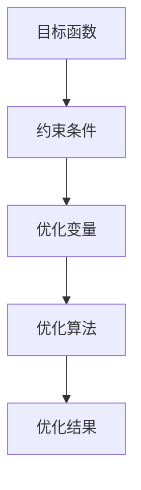
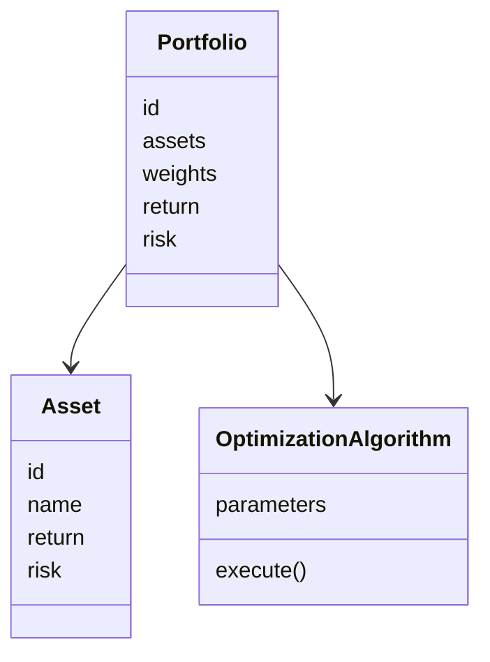
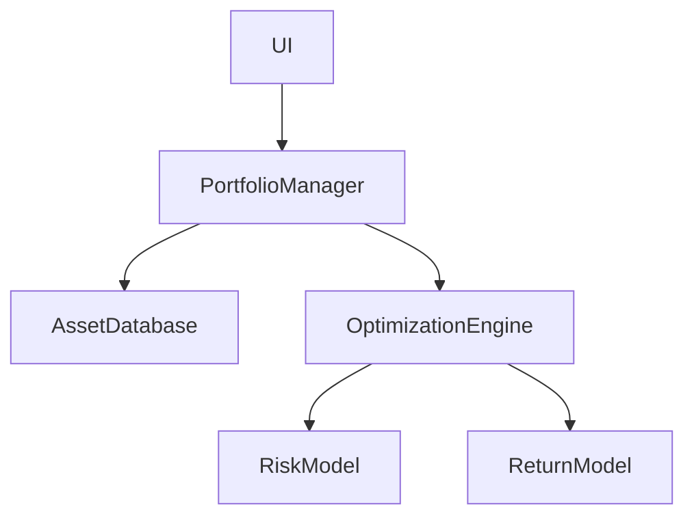
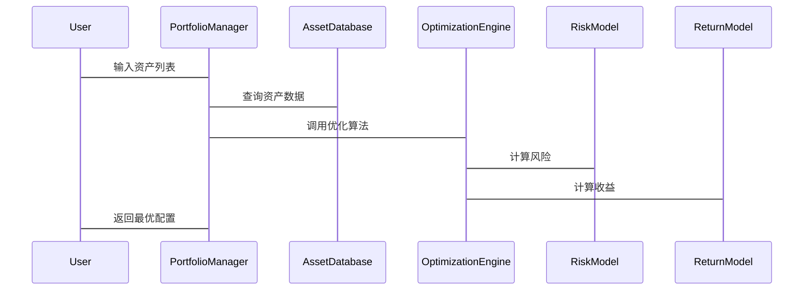

                 


# 智能资产配置优化器

## 关键词
- 智能资产配置
- 优化器
- 人工智能
- 算法
- 资产管理

## 摘要
智能资产配置优化器是一种利用先进的人工智能和优化算法技术，帮助投资者在复杂的金融市场环境中实现最优资产配置的工具。本文从背景介绍、核心概念、算法原理、系统架构、项目实战等多个角度，全面解析智能资产配置优化器的构建与应用，帮助读者理解其技术原理和实际应用价值。

---

## 目录大纲

### 第一部分：智能资产配置优化器的背景与核心概念

#### 第1章：智能资产配置优化器的背景与问题背景

##### 1.1 智能资产配置的背景
- 1.1.1 资产配置的传统方法与局限性
  - 简单的均分法、固定比例法的不足
  - 传统优化方法（如均值-方差模型）的局限性
- 1.1.2 智能优化技术的兴起
  - 人工智能与优化算法的结合
  - 机器学习在金融领域的应用
- 1.1.3 智能资产配置优化器的核心目标
  - 实现个性化、动态化的资产配置
  - 提高收益、降低风险

##### 1.2 问题背景与问题描述
- 1.2.1 资产配置中的核心问题
  - 如何在多资产类别中选择最优配置比例
  - 如何应对市场的不确定性和波动性
- 1.2.2 智能优化在资产配置中的应用
  - 使用机器学习模型预测资产收益
  - 使用优化算法寻找最优配置方案
- 1.2.3 问题的边界与外延
  - 优化范围：股票、债券、基金等多种资产
  - 优化目标：最大化收益、最小化风险、平衡风险收益

##### 1.3 问题解决与优化目标
- 1.3.1 传统资产配置方法的不足
  - 简单的均分法忽视市场波动
  - 固定比例法难以适应市场变化
- 1.3.2 智能优化算法的优势
  - 灵活性：适应市场变化
  - 高效性：快速计算最优解
  - 多目标优化：平衡风险与收益
- 1.3.3 优化目标的数学表达
  - 收益最大化：maximize return
  - 风险最小化：minimize risk
  - 风险-收益平衡：maximize Sharpe ratio

#### 第2章：智能资产配置优化器的核心概念与联系

##### 2.1 核心概念的定义与原理
- 2.1.1 目标函数
  - 收益函数：$f(x) = \sum w_i r_i$
  - 风险函数：$g(x) = \sum w_i^2 \sigma_i^2$
  - 多目标优化函数：$h(x) = \alpha f(x) + (1-\alpha) g(x)$
- 2.1.2 约束条件
  - 资产权重约束：$\sum w_i = 1$, $w_i \geq 0$
  - 风险约束：$\text{VaR} \leq \text{threshold}$
  - 收益约束：$\text{Return} \geq \text{target}$
- 2.1.3 优化变量
  - 资产权重：$w_1, w_2, ..., w_n$
  - 资产选择：选与不选的二进制变量

##### 2.2 核心概念的对比分析
- 2.2.1 传统优化方法与智能优化方法的对比
  | 方法       | 优点                     | 缺点                     |
  |------------|--------------------------|--------------------------|
  | 线性规划    | 易于实现                 | 仅适用于线性问题         |
  | 非线性规划  | 更灵活                   | 计算复杂度高             |
  | 遗传算法    | 适用于复杂非线性问题     | 计算效率较低             |
  | 模拟退火    | 全局最优能力强           | 易陷入局部最优           |
  | 粒子群优化  | 收敛速度快               | 参数敏感性高             |

##### 2.3 核心概念的ER实体关系图


---

### 第二部分：智能资产配置优化器的算法原理

#### 第3章：优化算法的原理与流程

##### 3.1 优化算法的原理与流程
- 3.1.1 遗传算法的原理
  - 初始化种群
  - 计算适应度
  - 选择、交叉、变异
  - 保留优秀个体
- 3.1.2 模拟退火算法的原理
  - 随机初始化
  - 计算能量
  - 扰动状态
  - 接受或拒绝新状态
- 3.1.3 粒子群优化算法的原理
  - 初始化粒子群
  - 计算个体最优
  - 更新全局最优
  - 更新粒子位置与速度

##### 3.2 优化算法的流程图
```mermaid
graph TD
    Start --> Initialize Parameters
    Initialize Parameters --> Loop
    Loop --> Calculate Fitness
    Calculate Fitness --> Selection/Update
    Selection/Update --> Check Termination
    Check Termination --> End
    Loop --> Loop
```

##### 3.3 优化算法的数学模型
- 遗传算法：
  - 适应度函数：$f(x) = \sum w_i r_i$
  - 交叉操作：$w_{new} = w_i \times \alpha + w_j \times (1-\alpha)$
- 模拟退火：
  - 能量函数：$E(x) = \sum w_i^2 \sigma_i^2$
  - 转移概率：$P = \exp(-\Delta E / T)$
- 粒子群优化：
  - 速度更新：$v_{i} = v_{i} \times \alpha + \beta_1 r_1 \times (p_{best} - x_i) + \beta_2 r_2 \times (g_{best} - x_i)$
  - 位置更新：$x_{i} = x_{i} + v_{i}$

##### 3.4 优化算法的Python实现示例
```python
def genetic_algorithm():
    # 初始化种群
    population = initialize_population()
    while not terminate:
        # 计算适应度
        fitness = calculate_fitness(population)
        # 选择
        selected = selection(population, fitness)
        # 交叉
        crossed = crossover(selected)
        # 变异
        mutated = mutate(crossed)
        population = crossed + mutated
    return best(population)
```

---

### 第三部分：智能资产配置优化器的系统分析与架构设计

#### 第4章：系统分析与架构设计

##### 4.1 系统分析
- 4.1.1 问题场景介绍
  - 多资产配置问题
  - 动态优化问题
  - 风险控制问题
- 4.1.2 项目介绍
  - 目标：构建智能资产配置优化器
  - 范围：股票、债券、基金等
  - 作用：帮助投资者实现最优资产配置

##### 4.2 系统功能设计
- 4.2.1 领域模型


##### 4.3 系统架构设计


##### 4.4 系统接口设计
- 用户接口：输入资产列表、目标收益、风险偏好
- 数据接口：获取资产收益、风险数据
- 优化接口：调用优化算法，返回最优配置

##### 4.5 系统交互流程


---

### 第四部分：智能资产配置优化器的项目实战

#### 第5章：项目实战

##### 5.1 环境安装与配置
- Python环境：安装Python 3.8+
- 库的安装：numpy、pandas、scipy、matplotlib

##### 5.2 核心算法实现
- 遗传算法实现：
```python
def genetic_algorithm(assets, target_return, max_risk):
    # 初始化种群
    population = [generate_random_portfolio(assets) for _ in range(POP_SIZE)]
    best_portfolio = None
    best_fitness = -float('inf')
    
    while not is_terminated():
        # 计算适应度
        fitness = [calculate_fitness(portfolio) for portfolio in population]
        # 选择
        selected = select_best(population, fitness, SELECT_RATE)
        # 交叉
        crossed = crossover(selected)
        # 变异
        mutated = mutate(crossed)
        population = crossed + mutated
        
        # 更新最优解
        current_best = max(population, key=lambda x: calculate_fitness(x))
        if calculate_fitness(current_best) > best_fitness:
            best_fitness = calculate_fitness(current_best)
            best_portfolio = current_best
    
    return best_portfolio
```

##### 5.3 项目实现与代码解读
- 数据准备：加载资产收益和风险数据
- 模型实现：实现遗传算法、模拟退火、粒子群优化算法
- 结果展示：可视化最优配置、收益与风险对比

##### 5.4 实际案例分析
- 案例1：股票与债券的配置优化
  - 数据来源：历史收益率和波动率
  - 目标：在收益和风险之间找到最优平衡点
- 案例2：多资产配置优化
  - 数据来源：多种资产的历史数据
  - 目标：动态调整配置比例

##### 5.5 项目小结
- 项目实现的关键点
  - 算法选择与参数调优
  - 数据处理与特征提取
  - 结果可视化与解释

---

### 第五部分：智能资产配置优化器的最佳实践与小结

#### 第6章：最佳实践与小结

##### 6.1 小结
- 本章总结了智能资产配置优化器的核心概念、算法原理和系统架构
- 强调了优化算法在实际应用中的重要性

##### 6.2 注意事项
- 数据质量的重要性
- 算法参数的敏感性
- 市场环境的动态变化

##### 6.3 未来趋势
- 更复杂的优化算法
- 多目标优化的应用
- 实时优化的可能性

##### 6.4 拓展阅读
- 推荐书籍：《Python优化算法实战》、《机器学习在金融中的应用》
- 推荐博客：[AI Genius Institute](https://github.com/AI-Genius-Institute)

---

### 作者：AI天才研究院/AI Genius Institute & 禅与计算机程序设计艺术 /Zen And The Art of Computer Programming

---

本文通过系统地介绍智能资产配置优化器的背景、核心概念、算法原理、系统架构和项目实战，帮助读者全面理解其技术原理和实际应用价值。希望本文能为金融领域的专业人士和研究人员提供有价值的参考和启发。

