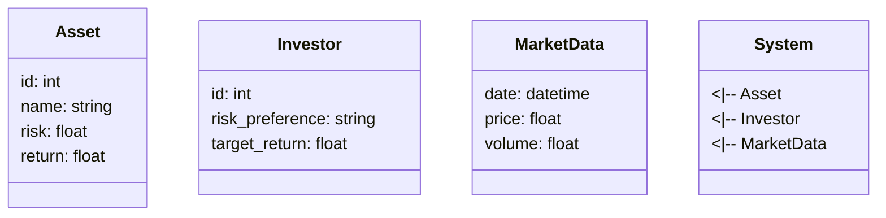

                 


# 智能资产配置动态调整机制

> 关键词：智能资产配置，动态调整，投资组合优化，算法模型，风险管理

> 摘要：智能资产配置动态调整机制是一种基于现代投资理论和人工智能技术的资产配置方法，通过实时数据分析和优化算法，根据市场变化和投资者需求，自动调整投资组合，以实现风险可控、收益最大化的目标。本文将从理论基础、算法模型、系统设计到项目实战，全面解析智能资产配置动态调整机制的实现与应用。

---

## 第1章：智能资产配置动态调整机制概述

### 1.1 资产配置的基本概念

#### 1.1.1 资产配置的定义
资产配置是指将资金分配到不同的资产类别（如股票、债券、房地产等）中，以实现投资目标（如最大化收益、最小化风险）的过程。资产配置的核心在于分散投资，避免过度依赖单一资产。

#### 1.1.2 资产配置的重要性
资产配置是投资成功的关键因素之一。合理的资产配置可以在市场波动中降低风险，同时抓住不同资产类别带来的收益机会。

#### 1.1.3 动态调整的必要性
市场环境和投资者需求会不断变化，静态的资产配置策略难以适应这些变化。动态调整可以根据市场波动和投资者目标的变化，实时优化投资组合。

### 1.2 智能资产配置的核心要素

#### 1.2.1 智能化配置的特点
智能资产配置通过数据驱动的算法模型，自动分析市场数据和投资者需求，实时优化资产配置。

#### 1.2.2 动态调整的机制
动态调整基于实时数据和优化算法，定期或实时调整投资组合的权重，以适应市场变化和投资者需求。

#### 1.2.3 相关技术的支撑
智能资产配置依赖于大数据分析、机器学习、优化算法等技术的支持，这些技术为动态调整提供了理论和实践基础。

### 1.3 本书的结构与目标

#### 1.3.1 本书的主要内容
本书将从理论基础、算法模型、系统设计到项目实战，全面解析智能资产配置动态调整机制的实现与应用。

#### 1.3.2 本书的目标读者
本书适合金融从业者、投资者、技术开发者以及对智能投资感兴趣的读者阅读。

#### 1.3.3 本书的章节安排
本书共分为七章，涵盖从理论到实践的完整内容，帮助读者全面理解智能资产配置动态调整机制。

---

## 第2章：资产配置的理论基础

### 2.1 现代投资组合理论

#### 2.1.1 投资组合理论的起源
现代投资组合理论（MPT）由哈里·马科维茨于1952年提出，强调通过分散投资降低风险。

#### 2.1.2 马科维茨的有效前沿
有效前沿是指在给定风险水平下，能够提供最高收益的投资组合的集合。投资者可以通过调整资产配置在有效前沿上找到最优解。

#### 2.1.3 现实中的投资组合理论
现实中的资产配置需要考虑交易成本、税收、市场流动性等实际因素。

### 2.2 资产配置的分类

#### 2.2.1 按资产类别划分
资产可以分为股票、债券、房地产、现金等类别，投资者可以根据风险偏好选择不同的资产组合。

#### 2.2.2 按时间跨度划分
资产配置可以分为短期、中期和长期配置，时间跨度影响投资策略的选择。

#### 2.2.3 按风险偏好划分
根据投资者的风险承受能力，资产配置可以分为保守型、稳健型和激进型。

### 2.3 动态资产配置的理论基础

#### 2.3.1 动态资产配置的定义
动态资产配置是指根据市场环境和投资者需求的变化，实时调整资产配置比例。

#### 2.3.2 动态资产配置的必要性
市场波动和投资者目标的变化要求资产配置策略不断调整，以保持最优状态。

#### 2.3.3 动态资产配置的实现方法
动态资产配置可以通过定期再平衡和实时优化两种方式实现，具体方法取决于市场环境和投资者需求。

---

## 第3章：智能资产配置的驱动因素

### 3.1 市场环境的变化

#### 3.1.1 经济周期的影响
经济周期的波动直接影响资产收益，投资者需要根据经济周期调整资产配置。

#### 3.1.2 市场波动的分析
市场波动性是资产配置的重要考虑因素，波动性高的资产需要更高的风险控制。

#### 3.1.3 宏观经济指标的作用
GDP、利率、通货膨胀等宏观经济指标为资产配置提供了重要的参考依据。

### 3.2 投资者需求的变化

#### 3.2.1 风险偏好的变化
投资者的风险偏好会影响资产配置的比例，风险厌恶的投资者更倾向于低风险资产。

#### 3.2.2 投资目标的调整
投资目标的变化（如从长期增值转向短期流动性）需要及时调整资产配置。

#### 3.2.3 生命周期的影响
投资者在不同生命周期阶段的需求不同，资产配置需要相应调整。

### 3.3 数据驱动的决策

#### 3.3.1 数据的重要性
数据是智能资产配置的核心，通过分析市场数据和投资者数据，优化资产配置策略。

#### 3.3.2 数据的来源与处理
数据来源包括市场数据、投资者数据、宏观经济指标等，需要清洗、整合和分析。

#### 3.3.3 数据驱动的决策模型
基于机器学习和统计分析的决策模型为资产配置提供了科学依据。

---

## 第4章：智能资产配置的算法与模型

### 4.1 优化算法

#### 4.1.1 线性规划
线性规划是一种优化方法，用于在约束条件下最大化或最小化目标函数。

#### 4.1.2 非线性规划
非线性规划用于处理目标函数或约束条件为非线性的情况，适用于复杂的资产配置问题。

#### 4.1.3 遗传算法
遗传算法是一种模拟生物进化过程的优化算法，适用于复杂的组合优化问题。

### 4.2 机器学习模型

#### 4.2.1 回归模型
回归模型用于预测资产收益，帮助投资者做出决策。

#### 4.2.2 分类模型
分类模型用于将资产分为不同类别，辅助资产配置决策。

#### 4.2.3 聚类模型
聚类模型用于将相似的资产分组，帮助投资者发现潜在的投资机会。

### 4.3 时间序列分析

#### 4.3.1 ARIMA模型
ARIMA模型用于预测资产收益的时间序列，帮助投资者捕捉市场趋势。

#### 4.3.2 GARCH模型
GARCH模型用于估计资产的波动性，帮助投资者进行风险控制。

#### 4.3.3 状态空间模型
状态空间模型用于分析复杂的市场动态，帮助投资者做出动态调整。

### 4.4 深度学习的应用

#### 4.4.1 卷积神经网络
卷积神经网络（CNN）用于处理图像和时间序列数据，帮助识别市场模式。

#### 4.4.2 循环神经网络
循环神经网络（RNN）用于处理序列数据，帮助预测资产收益。

#### 4.4.3 图神经网络
图神经网络用于分析资产之间的关系，帮助识别系统性风险。

---

## 第5章：数学模型与公式

### 5.1 均值-方差模型

#### 5.1.1 均值-方差模型的定义
均值-方差模型由马科维茨提出，用于优化投资组合的收益和风险。

#### 5.1.2 数学公式
目标函数：$\min_w \sigma^2$  
约束条件：
$$ \sum_{i=1}^n w_i = 1 $$
$$ w_i \geq 0 \quad (i=1,2,\dots,n) $$

---

## 第6章：系统架构设计

### 6.1 问题场景介绍
智能资产配置系统需要实时处理市场数据和投资者需求，动态调整资产配置。

### 6.2 项目介绍
本项目旨在开发一个智能资产配置系统，实现动态调整功能。

### 6.3 系统功能设计

#### 6.3.1 领域模型（Mermaid 类图）


#### 6.3.2 系统架构设计（Mermaid 架构图）
```mermaid
container 资产配置系统 {
    数据采集模块
    数据分析模块
    优化算法模块
    系统接口
}
```

#### 6.3.3 系统接口设计
系统接口包括数据输入、优化算法调用和结果输出。

#### 6.3.4 系统交互（Mermaid 序列图）
```mermaid
sequenceDiagram
   投资者->数据采集模块: 提供投资目标
   数据采集模块->市场数据源: 获取实时数据
    数据分析模块->优化算法模块: 调用优化算法
    优化算法模块->系统接口: 返回优化结果
    投资者<-系统接口: 获取调整后的配置
```

---

## 第7章：项目实战

### 7.1 环境安装
安装必要的开发工具和库，如Python、Pandas、NumPy、Scikit-learn等。

### 7.2 核心代码实现

#### 7.2.1 数据采集模块
```python
import pandas as pd
import requests

def get_market_data(ticker):
    url = f"https://api.example.com/stock/{ticker}"
    response = requests.get(url)
    data = response.json()
    return pd.DataFrame(data)
```

#### 7.2.2 优化算法模块
```python
from scipy.optimize import minimize

def optimize_portfolio(weights, returns, covariance):
    def objective(x):
        return (x.T @ covariance @ x).item()
    constraints = [{'type': 'eq', 'fun': lambda x: sum(x) - 1}]
    result = minimize(objective, weights, constraints=constraints)
    return result.x

weights = [0.2, 0.3, 0.5]
returns = [0.05, 0.07, 0.03]
covariance = [[0.02, 0.01, 0.01],
             [0.01, 0.03, 0.02],
             [0.01, 0.02, 0.04]]
optimized_weights = optimize_portfolio(weights, returns, covariance)
print(optimized_weights)
```

#### 7.2.3 案例分析
通过具体案例分析优化算法的实现和效果，展示智能资产配置动态调整机制的应用。

### 7.3 项目小结
总结项目实现的关键点和经验教训，为读者提供实践参考。

---

## 第8章：最佳实践与未来展望

### 8.1 小结
智能资产配置动态调整机制通过数据驱动和算法优化，帮助投资者实现风险可控、收益最大化的投资目标。

### 8.2 注意事项
投资者在使用智能资产配置系统时，需要注意数据质量和模型的适应性，避免过度依赖算法。

### 8.3 未来展望
未来，随着人工智能和大数据技术的发展，智能资产配置动态调整机制将更加智能化和个性化。

---

## 附录

### 附录A：数据来源
列出项目中使用到的数据来源和接口。

### 附录B：参考文献
列出本书中引用的相关文献和资料。

---

## 作者

作者：AI天才研究院/AI Genius Institute & 禅与计算机程序设计艺术/Zen And The Art of Computer Programming

---

感谢您的阅读！如需进一步了解智能资产配置动态调整机制，欢迎关注AI天才研究院的最新研究成果。

