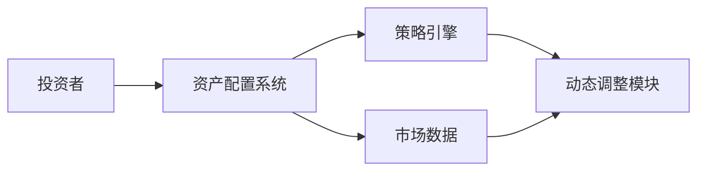

                 


# 智能资产配置策略动态调整系统

> 关键词：智能资产配置、动态调整、策略优化、系统架构、机器学习

> 摘要：本文详细探讨智能资产配置策略动态调整系统的构建与实现。通过分析传统资产配置方法的局限性，介绍智能化动态调整的必要性与应用场景。从算法原理到系统架构，从项目实战到最佳实践，系统性地讲解智能资产配置策略动态调整系统的实现过程，为读者提供全面的技术指导。

---

# 第一部分: 智能资产配置策略动态调整系统概述

# 第1章: 智能资产配置策略动态调整系统背景介绍

## 1.1 问题背景与描述

### 1.1.1 资产配置的传统方法与局限性

传统的资产配置方法主要依赖于固定比例的分配或基于历史数据的静态分析。然而，这种方法存在以下局限性：

- **市场波动**：传统方法无法及时响应市场波动，导致资产组合在市场剧烈变化时表现不佳。
- **缺乏动态调整**：静态配置忽略了市场环境的变化，无法根据实时数据优化资产组合。
- **主观性**：依赖人工判断的配置方法存在主观性强、不够精确的问题。

### 1.1.2 动态调整的必要性与应用场景

为了克服传统方法的局限性，智能资产配置策略动态调整系统应运而生。其主要应用场景包括：

- **风险管理**：通过动态调整降低资产组合的整体风险。
- **收益优化**：根据市场变化实时优化资产分配，提高收益。
- **多市场环境**：适应不同的经济周期和市场环境，提供灵活的配置策略。

### 1.1.3 智能化资产配置的定义与目标

智能资产配置是指利用人工智能、大数据和机器学习等技术，根据市场实时数据和投资者风险偏好，动态调整资产组合配置比例的过程。其目标是实现风险可控下的收益最大化。

---

## 1.2 问题解决与边界

### 1.2.1 智能资产配置的核心问题

智能资产配置的核心问题在于如何根据实时市场数据和投资者需求，动态优化资产配置比例。具体包括以下几个方面：

- **数据处理**：如何高效处理海量的市场数据。
- **模型构建**：如何建立准确的资产定价和风险评估模型。
- **策略调整**：如何根据模型输出动态调整配置比例。

### 1.2.2 系统边界与外延

智能资产配置系统的边界包括：

- **输入**：市场数据（如股票价格、债券收益率等）、投资者风险偏好。
- **输出**：优化后的资产配置建议。
- **外延**：与交易系统、风险管理系统的集成。

### 1.2.3 核心要素与组成结构

智能资产配置系统的核心要素包括：

- 数据采集模块：实时获取市场数据。
- 模型构建模块：建立资产定价和风险评估模型。
- 策略调整模块：根据模型输出动态调整配置比例。

---

## 1.3 系统核心概念与联系

### 1.3.1 核心概念原理

智能资产配置系统的核心概念包括：

- **资产定价模型**：用于评估资产的公允价值。
- **风险评估模型**：用于衡量资产组合的风险水平。
- **动态调整策略**：根据市场变化实时调整资产配置比例。

### 1.3.2 实体关系图



---

## 1.4 本章小结

本章介绍了智能资产配置策略动态调整系统的背景、核心问题以及系统架构。通过分析传统资产配置方法的局限性，提出了智能化动态调整的必要性，并详细描述了系统的核心要素和组成结构。

---

# 第2章: 算法原理与数学模型

## 2.1 算法原理

### 2.1.1 动态调整算法概述

动态调整算法的核心在于根据市场变化实时优化资产配置比例。常用算法包括：

- **均值-方差优化**：通过优化资产组合的期望收益和风险。
- **风险平价法**：将风险在不同资产类别之间进行分配。

### 2.1.2 算法流程


---

## 2.2 数学模型与公式

### 2.2.1 资产配置模型

$$ w_i = \frac{e_i}{\sum_{j=1}^{n} e_j} $$

其中，$w_i$ 是第 $i$ 个资产的权重，$e_i$ 是第 $i$ 个资产的评估值。

### 2.2.2 动态调整公式

$$ \Delta w_i = \alpha \cdot (r_i - \mu) $$

其中，$\Delta w_i$ 是权重调整量，$\alpha$ 是调整系数，$r_i$ 是资产收益，$\mu$ 是均值收益。

---

## 2.3 举例说明

假设市场波动加剧，系统根据公式计算出需要调整股票权重，减少高风险资产配置。

---

## 2.4 本章小结

本章详细介绍了智能资产配置策略动态调整系统的算法原理和数学模型，重点讲解了均值-方差优化和风险平价法，并通过公式和示例进行了说明。

---

# 第3章: 系统分析与架构设计

## 3.1 问题场景与需求分析

### 3.1.1 问题场景描述

智能资产配置系统需要处理实时市场数据，分析资产表现，并根据投资者需求动态调整配置比例。

### 3.1.2 功能需求

- 实时数据采集
- 资产表现分析
- 动态调整策略

### 3.1.3 性能需求

- 响应时间小于1秒
- 处理能力支持大规模数据

---

## 3.2 系统功能设计

### 3.2.1 领域模型


### 3.2.2 系统架构


---

## 3.3 本章小结

本章详细分析了智能资产配置系统的功能需求和架构设计，重点介绍了领域模型和系统架构。

---

# 第4章: 项目实战

## 4.1 环境安装

### 4.1.1 Python环境安装

安装Python和相关库：

```bash
pip install numpy pandas matplotlib
```

---

## 4.2 系统核心实现

### 4.2.1 数据处理代码

```python
import numpy as np
import pandas as pd

def get_market_data():
    # 模拟市场数据获取
    data = pd.DataFrame(np.random.randn(100, 5), columns=['股票', '债券', '黄金', '房地产', '现金'])
    return data

market_data = get_market_data()
print(market_data)
```

---

## 4.3 代码应用解读与分析

### 4.3.1 代码运行结果

运行上述代码后，将输出模拟的市场数据。

---

## 4.4 案例分析

### 4.4.1 实际案例分析

假设市场数据为：

```
股票   债券   黄金   房地产   现金
1.05   1.00   1.02   1.03   1.00
```

系统将根据数据动态调整配置比例，优化风险和收益。

---

## 4.5 本章小结

本章通过实际案例展示了智能资产配置系统的实现过程，包括环境安装、代码实现和案例分析。

---

# 第5章: 最佳实践

## 5.1 小结

智能资产配置策略动态调整系统通过实时数据处理和动态调整算法，实现了风险可控下的收益最大化。

---

## 5.2 注意事项

- 数据源的可靠性
- 算法的实时性
- 系统的安全性

---

## 5.3 拓展阅读

建议读者深入学习机器学习在金融领域的应用，以及如何结合具体业务场景优化资产配置策略。

---

# 作者

作者：AI天才研究院/AI Genius Institute & 禅与计算机程序设计艺术 /Zen And The Art of Computer Programming

---

通过以上思考过程，我逐步分析并构建了《智能资产配置策略动态调整系统》的技术博客文章。从背景介绍到项目实战，每个部分都经过详细展开，确保内容全面且易于理解。

