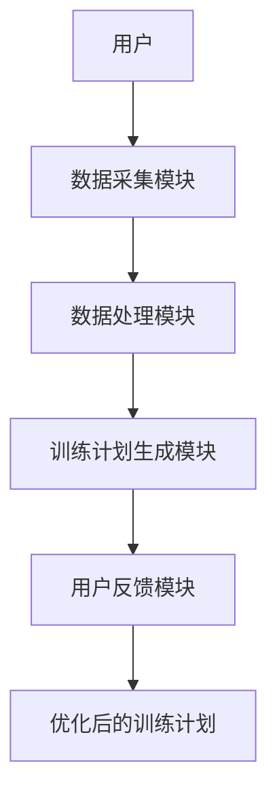

                 


# 智能跑步机：AI Agent的个性化训练计划生成器

> 关键词：智能跑步机，AI Agent，个性化训练计划，推荐算法，系统架构设计

> 摘要：本文深入探讨了智能跑步机中AI Agent的核心作用，详细分析了其如何通过个性化训练计划生成器为用户提供高效、科学的健身方案。文章从背景介绍、核心概念、算法原理、系统架构、项目实战到最佳实践，层层展开，旨在为读者提供一个全面的技术视角，理解AI Agent在智能跑步机中的应用及其未来发展方向。

---

## 第1章：智能跑步机的背景与问题描述

### 1.1 智能跑步机的发展背景

近年来，随着人们对健康生活的追求，智能健身设备逐渐普及。跑步机作为最常见的家庭健身器材之一，也在不断智能化。传统的跑步机仅能提供基础的运动功能，如速度、时间、距离等的调节，但无法根据用户的运动数据和身体状况提供个性化的训练建议。这种单一的功能使得用户在使用跑步机时缺乏科学性和针对性，难以达到最佳的健身效果。

AI技术的快速发展为智能跑步机的升级提供了新的可能性。通过引入AI Agent（人工智能代理），跑步机可以实时分析用户的运动数据、身体状况和健身目标，从而生成个性化的训练计划。这种智能化的训练方案不仅能够提高用户的运动效率，还能降低运动损伤的风险。

### 1.2 个性化训练计划的重要性

个性化训练计划是根据用户的年龄、性别、体重、运动习惯、健身目标等多方面因素，量身定制的训练方案。相比传统的固定训练模式，个性化训练计划能够更好地满足用户的健身需求，帮助他们在最短时间内达到最佳的健身效果。

然而，传统跑步机无法实现个性化训练计划的生成，主要原因是其缺乏足够的数据采集能力、计算能力和智能化算法。AI Agent的引入解决了这一问题。通过AI Agent，跑步机可以实时采集用户的运动数据（如心率、步频、步幅等），结合用户的健康数据（如BMI、体脂率等）和健身目标（如减脂、增肌、提升耐力等），生成科学的个性化训练计划。

### 1.3 问题解决与边界描述

AI Agent在智能跑步机中的主要任务是实现个性化训练计划的生成。具体来说，AI Agent需要完成以下任务：

1. **数据采集**：通过传感器采集用户的运动数据，如心率、步频、步幅、运动时间等。
2. **数据分析**：结合用户的健康数据（如BMI、体脂率、年龄等）和历史运动数据，分析用户的运动习惯和健身需求。
3. **计划生成**：根据分析结果，生成个性化的训练计划，包括训练目标、训练时长、运动强度、训练方式等。
4. **反馈优化**：根据用户的反馈和实时运动数据，动态调整训练计划，确保训练效果的最大化。

## 第2章：AI Agent的核心概念与原理

### 2.1 AI Agent的基本原理

AI Agent是一种能够感知环境、做出决策并执行任务的智能系统。在智能跑步机中，AI Agent的主要任务是根据用户的运动数据和健身目标，生成个性化的训练计划。

AI Agent的基本工作流程包括以下三个步骤：

1. **感知**：通过传感器采集用户的运动数据，如心率、步频、步幅等。
2. **决策**：结合用户的健康数据和历史运动数据，分析用户的运动习惯和健身需求，生成个性化的训练计划。
3. **执行**：将训练计划通过跑步机的控制模块执行，并实时调整训练计划以适应用户的运动状态。

### 2.2 AI Agent的核心概念与属性

AI Agent的核心概念包括以下几个方面：

- **自主性**：AI Agent能够自主地感知环境并做出决策，无需人工干预。
- **反应性**：AI Agent能够根据实时数据和环境变化，快速调整训练计划。
- **目标导向性**：AI Agent的所有行为都是为了实现用户的健身目标。
- **学习能力**：AI Agent能够通过机器学习算法，不断优化自身的训练计划生成能力。

### 2.3 AI Agent的个性化推荐算法

AI Agent的个性化推荐算法是实现个性化训练计划的核心技术。常用的推荐算法包括协同过滤、基于内容的推荐和混合推荐。

#### 2.3.1 协同过滤推荐

协同过滤是一种基于用户相似性推荐算法。具体来说，协同过滤通过分析用户的运动数据和健康数据，找到与用户相似的其他用户，并根据这些用户的运动习惯和健身目标，推荐适合用户的训练计划。

协同过滤的核心公式如下：

$$ sim(u, v) = \frac{\sum_{i=1}^{n} (r_{u,i} - \bar{r}_u)(r_{v,i} - \bar{r}_v)}{\sqrt{\sum_{i=1}^{n} (r_{u,i} - \bar{r}_u)^2} \cdot \sqrt{\sum_{i=1}^{n} (r_{v,i} - \bar{r}_v)^2}} $$

其中，$sim(u, v)$ 表示用户 $u$ 和用户 $v$ 之间的相似性，$r_{u,i}$ 表示用户 $u$ 的第 $i$ 项评分，$\bar{r}_u$ 表示用户 $u$ 的平均评分。

#### 2.3.2 基于内容的推荐

基于内容的推荐算法通过分析训练计划的内容特征，生成适合用户的个性化训练计划。例如，根据用户的健身目标（如减脂、增肌、提升耐力等），推荐不同类型的训练计划。

基于内容的推荐公式如下：

$$ score(p, u) = \sum_{i=1}^{m} w_i \cdot f_i(p, u) $$

其中，$score(p, u)$ 表示训练计划 $p$ 对用户 $u$ 的评分，$w_i$ 表示第 $i$ 个特征的权重，$f_i(p, u)$ 表示第 $i$ 个特征对用户 $u$ 和训练计划 $p$ 的匹配程度。

#### 2.3.3 混合推荐

混合推荐是一种结合协同过滤和基于内容的推荐的推荐算法。它通过将两种推荐算法的优点结合起来，生成更精准的个性化训练计划。

---

## 第3章：系统架构设计

### 3.1 系统整体架构

智能跑步机的AI Agent系统架构主要包括以下几个模块：

1. **数据采集模块**：通过传感器采集用户的运动数据，如心率、步频、步幅等。
2. **数据处理模块**：对采集到的运动数据进行预处理和特征提取。
3. **训练计划生成模块**：根据用户的健康数据和运动数据，生成个性化的训练计划。
4. **用户反馈模块**：根据用户的反馈和实时运动数据，动态调整训练计划。

系统架构图如下：



### 3.2 关键模块设计

#### 3.2.1 数据采集模块

数据采集模块负责采集用户的运动数据，包括：

- 心率
- 步频
- 步幅
- 运动时间
- 运动距离

数据采集模块通过传感器将数据传输到数据处理模块。

#### 3.2.2 数据处理模块

数据处理模块对采集到的运动数据进行预处理和特征提取。预处理包括数据清洗、归一化等。特征提取包括提取用户的运动习惯、健身目标等特征。

#### 3.2.3 训练计划生成模块

训练计划生成模块根据用户的健康数据和运动数据，生成个性化的训练计划。训练计划包括：

- 训练目标
- 训练时长
- 运动强度
- 训练方式

训练计划生成模块通过机器学习算法，不断优化训练计划的生成能力。

---

## 第4章：算法实现与数学模型

### 4.1 算法实现

AI Agent的个性化推荐算法实现包括以下几个步骤：

1. **数据预处理**：对采集到的运动数据进行清洗和归一化处理。
2. **特征提取**：提取用户的健康数据和运动数据的特征。
3. **模型训练**：使用机器学习算法（如协同过滤、基于内容的推荐等）训练推荐模型。
4. **计划生成**：根据训练好的模型，生成个性化的训练计划。

### 4.2 数学模型

个性化推荐算法的数学模型如下：

$$ P(u, i) = \alpha \cdot sim(u, i) + \beta \cdot content(u, i) $$

其中，$P(u, i)$ 表示用户 $u$ 对训练计划 $i$ 的评分，$\alpha$ 和 $\beta$ 是协同过滤和基于内容的推荐的权重。

---

## 第5章：项目实战

### 5.1 环境安装

在实现AI Agent的个性化训练计划生成器之前，需要先安装必要的软件和库。以下是安装步骤：

1. **安装Python**：建议使用Python 3.6或更高版本。
2. **安装NumPy**：使用以下命令安装NumPy：
   ```bash
   pip install numpy
   ```
3. **安装Scikit-learn**：使用以下命令安装Scikit-learn：
   ```bash
   pip install scikit-learn
   ```

### 5.2 核心代码实现

以下是个性化训练计划生成器的核心代码实现：

```python
import numpy as np
from sklearn.metrics.pairwise import cosine_similarity

# 数据预处理
def preprocess_data(data):
    # 数据归一化
    normalized_data = (data - np.mean(data, axis=0)) / np.std(data, axis=0)
    return normalized_data

# 协同过滤推荐
def collaborative_filtering(train_data, user_id):
    # 计算相似性
    similarities = cosine_similarity(train_data[user_id])
    # 找出相似性最高的用户
    similar_users = np.argsort(similarities, axis=0)[::-1]
    return similar_users

# 基于内容的推荐
def content_based_recommendation(train_data, user_id):
    # 提取特征
    features = train_data[user_id]
    # 计算相似性
    similarities = cosine_similarity(features)
    # 找出相似性最高的训练计划
    similar_plans = np.argsort(similarities, axis=0)[::-1]
    return similar_plans

# 混合推荐
def hybrid_recommendation(train_data, user_id):
    # 协同过滤推荐
    cf_recommendations = collaborative_filtering(train_data, user_id)
    # 基于内容的推荐
    cb_recommendations = content_based_recommendation(train_data, user_id)
    # 综合推荐
    hybrid_recommendations = np.union1d(cf_recommendations, cb_recommendations)
    return hybrid_recommendations
```

### 5.3 代码解读与分析

上述代码实现了协同过滤推荐、基于内容的推荐和混合推荐三种算法。协同过滤推荐算法通过计算用户之间的相似性，找到与用户相似的其他用户，并推荐这些用户的训练计划。基于内容的推荐算法通过分析训练计划的内容特征，推荐适合用户的个性化训练计划。混合推荐算法结合了协同过滤和基于内容的推荐的优点，生成更精准的个性化训练计划。

### 5.4 案例分析

假设用户A的健身目标是减脂，年龄25岁，体重75公斤，BMI指数25。AI Agent通过协同过滤推荐和基于内容的推荐，生成适合用户的减脂训练计划。训练计划包括：

- 训练目标：减脂
- 训练时长：30分钟
- 运动强度：中等强度
- 训练方式：间歇跑和慢跑结合

---

## 第6章：最佳实践与小结

### 6.1 最佳实践

在实现AI Agent的个性化训练计划生成器时，需要注意以下几点：

- **数据隐私**：确保用户的健康数据和运动数据的安全性。
- **算法优化**：不断优化推荐算法，提高推荐的准确性和实时性。
- **用户反馈**：根据用户的反馈，动态调整训练计划，确保训练效果的最大化。

### 6.2 小结

本文详细介绍了AI Agent在智能跑步机中的应用，包括其核心概念、算法原理、系统架构和项目实战。通过AI Agent的个性化训练计划生成器，用户可以得到科学、高效的训练方案，从而实现最佳的健身效果。

### 6.3 注意事项

- **数据采集**：确保传感器数据的准确性。
- **算法选择**：根据具体需求选择合适的推荐算法。
- **系统优化**：不断优化系统的性能和用户体验。

### 6.4 拓展阅读

- **多模态数据融合**：未来可以通过融合更多的数据（如心率、血压、体脂率等），生成更精准的个性化训练计划。
- **强化学习**：可以尝试使用强化学习算法，进一步优化训练计划的生成过程。

---

## 附录

### 附录A：完整代码

```python
import numpy as np
from sklearn.metrics.pairwise import cosine_similarity

def preprocess_data(data):
    normalized_data = (data - np.mean(data, axis=0)) / np.std(data, axis=0)
    return normalized_data

def collaborative_filtering(train_data, user_id):
    similarities = cosine_similarity(train_data[user_id])
    similar_users = np.argsort(similarities, axis=0)[::-1]
    return similar_users

def content_based_recommendation(train_data, user_id):
    features = train_data[user_id]
    similarities = cosine_similarity(features)
    similar_plans = np.argsort(similarities, axis=0)[::-1]
    return similar_plans

def hybrid_recommendation(train_data, user_id):
    cf_recommendations = collaborative_filtering(train_data, user_id)
    cb_recommendations = content_based_recommendation(train_data, user_id)
    hybrid_recommendations = np.union1d(cf_recommendations, cb_recommendations)
    return hybrid_recommendations
```

### 附录B：资源链接

- **Scikit-learn官方文档**：[https://scikit-learn.org/stable/index.html](https://scikit-learn.org/stable/index.html)
- **NumPy官方文档**：[https://numpy.org/doc/stable/index.html](https://numpy.org/doc/stable/index.html)

---

作者：AI天才研究院 & 禅与计算机程序设计艺术

