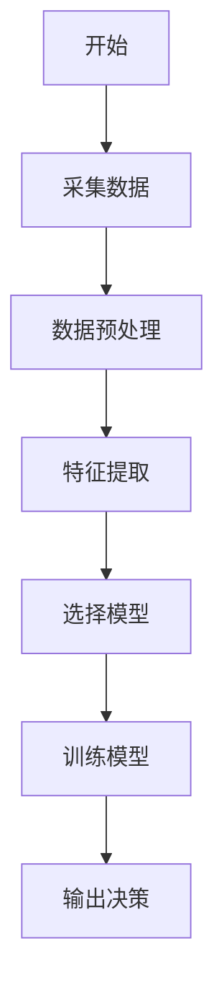
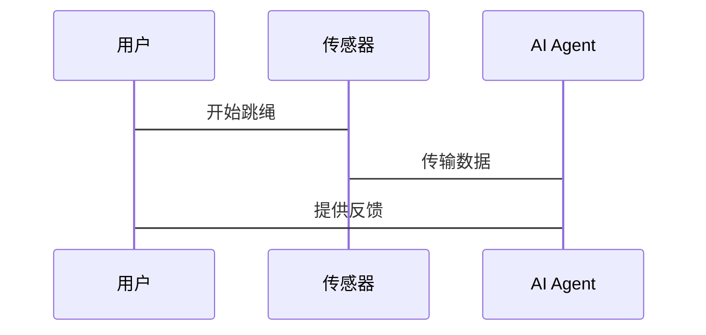
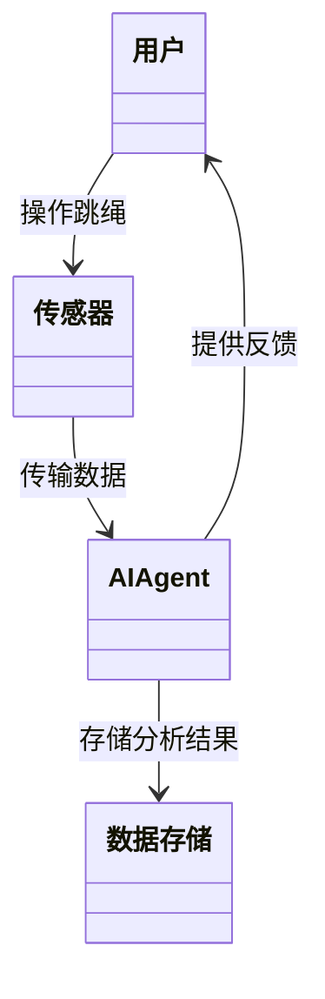

                 


# 智能跳绳：AI Agent的有氧运动效果分析

> 关键词：智能跳绳，AI Agent，有氧运动，运动效果分析，数据采集，机器学习，运动优化

> 摘要：本文将深入探讨智能跳绳与AI Agent在有氧运动中的结合，分析其对运动效果的提升作用。通过详细的技术分析和实际案例，本文揭示了AI Agent如何通过实时数据采集、智能决策和个性化反馈，帮助用户实现更高效的有氧运动目标。

---

# 第一部分: 背景与概述

## 第1章: 智能跳绳与AI Agent的背景介绍

### 1.1 智能跳绳的发展历程

#### 1.1.1 传统跳绳的局限性
传统跳绳是一种简单但高效的有氧运动工具，但其单一的运动模式和缺乏个性化指导的缺点逐渐显现。用户难以通过传统跳绳获得实时反馈和科学的运动建议。

#### 1.1.2 智能跳绳的出现与演变
随着科技的进步，智能跳绳应运而生。通过集成传感器、AI算法和物联网技术，智能跳绳能够实时采集用户的运动数据，并通过AI Agent提供个性化的运动建议。

#### 1.1.3 AI Agent在智能跳绳中的应用
AI Agent（智能代理）通过分析用户的运动数据，优化运动计划，提供实时反馈，帮助用户更高效地完成有氧运动目标。

### 1.2 AI Agent的基本概念

#### 1.2.1 什么是AI Agent
AI Agent是一种能够感知环境、自主决策并执行任务的智能实体。它通过数据采集、分析和学习，为用户提供智能化的服务。

#### 1.2.2 AI Agent的核心特征
- **自主性**：无需外部干预，自主完成任务。
- **反应性**：能够实时感知环境并做出反应。
- **学习能力**：通过数据学习和优化决策。

#### 1.2.3 AI Agent与传统算法的区别
| 特性       | AI Agent                     | 传统算法                     |
|------------|------------------------------|----------------------------|
| 决策能力   | 自主学习，动态调整           | 预先设定，固定流程           |
| 数据依赖   | 高度依赖实时数据             | 依赖历史数据或规则           |
| 灵活性     | 高，适应性强                 | 较低，适应性有限             |

### 1.3 有氧运动效果分析的背景

#### 1.3.1 有氧运动的基本概念
有氧运动是指需要氧气参与的运动，如跳绳、跑步等，旨在提升心肺功能和全身耐力。

#### 1.3.2 智能跳绳在有氧运动中的作用
智能跳绳通过实时数据采集和AI分析，帮助用户科学规划运动强度和时间，提升运动效果。

#### 1.3.3 有氧运动效果分析的意义
通过AI Agent分析运动数据，可以量化用户的运动效果，优化运动计划，预防运动损伤。

---

## 第2章: 智能跳绳与AI Agent的结合

### 2.1 智能跳绳的功能模块

#### 2.1.1 数据采集模块
智能跳绳通过内置传感器（如加速度计、陀螺仪）采集用户的跳绳速度、频率、幅度等数据。

#### 2.1.2 AI Agent决策模块
AI Agent基于采集的数据，分析用户的运动状态，优化运动计划。

#### 2.1.3 用户反馈模块
通过震动、灯光或手机App，向用户实时反馈运动数据和建议。

### 2.2 AI Agent在智能跳绳中的具体应用

#### 2.2.1 运动数据的实时分析
AI Agent实时分析用户的跳绳速度、心率等数据，判断运动强度是否适宜。

#### 2.2.2 个性化运动计划的制定
基于用户的健康数据和运动偏好，AI Agent制定个性化的运动计划。

#### 2.2.3 运动效果的智能反馈
AI Agent根据运动数据评估用户的进步，并提供针对性的改进建议。

### 2.3 有氧运动效果分析的核心要素

#### 2.3.1 心率监测
心率是衡量有氧运动强度的重要指标。AI Agent通过心率数据调整运动计划。

#### 2.3.2 跳绳速度与节奏
跳绳速度和节奏直接影响运动效果。AI Agent通过分析速度变化优化运动节奏。

#### 2.3.3 运动时间与强度
AI Agent根据用户的目标和身体状况，优化运动时间和强度，确保运动效果最大化。

---

# 第二部分: 核心概念与原理

## 第3章: AI Agent的核心概念与工作原理

### 3.1 AI Agent的基本原理

#### 3.1.1 感知层
AI Agent通过传感器和数据采集模块感知环境和用户行为。

#### 3.1.2 决策层
基于感知数据，AI Agent通过算法模型做出决策。

#### 3.1.3 执行层
AI Agent通过执行机构（如震动反馈）将决策转化为实际操作。

### 3.2 AI Agent的感知机制

#### 3.2.1 数据采集与预处理
智能跳绳通过传感器采集数据，并进行去噪和特征提取。

#### 3.2.2 数据特征提取
从原始数据中提取有用的特征（如跳绳频率、幅度），用于后续分析。

#### 3.2.3 数据分析与建模
使用机器学习算法（如支持向量机、神经网络）对数据进行建模，预测运动效果。

### 3.3 AI Agent的决策机制

#### 3.3.1 基于规则的决策
根据预设规则（如心率不超过最大心率的70%）做出决策。

#### 3.3.2 基于学习的决策
通过机器学习模型，AI Agent从历史数据中学习，优化决策策略。

#### 3.3.3 基于反馈的决策
根据用户反馈（如运动疲劳信号）动态调整决策。

---

## 第4章: AI Agent在智能跳绳中的算法原理

### 4.1 数据采集与处理

#### 4.1.1 数据采集流程
1. 传感器采集跳绳速度和幅度数据。
2. 数据预处理（去噪、归一化）。
3. 特征提取（频率、幅度）。

#### 4.1.2 数据分析与建模
使用回归分析或时间序列分析模型，预测运动效果。

### 4.2 AI Agent的决策算法

#### 4.2.1 机器学习模型
- **线性回归**：预测运动效果与运动时间的关系。
- **随机森林**：分类运动状态（如正常、疲劳）。

#### 4.2.2 算法流程图


### 4.3 反馈机制

#### 4.3.1 实时反馈
通过震动或声音提示用户调整运动节奏。

#### 4.3.2 延时反馈
运动结束后，通过App提供运动数据分析和改进建议。

---

## 第5章: 有氧运动效果的数学模型

### 5.1 运动效果评估指标
- 跳绳速度（次/分钟）。
- 心率（次/分钟）。
- 运动时间（分钟）。

### 5.2 运动效果的数学模型

#### 5.2.1 心率与运动强度的关系
$$ \text{运动强度} = \frac{\text{心率} - \text{静息心率}}{\text{最大心率} - \text{静息心率}} \times 100\% $$

#### 5.2.2 跳绳速度与运动效果的关系
$$ \text{运动效果} = a \times \text{速度} + b \times \text{时间} + c $$

---

# 第三部分: 系统分析与架构设计

## 第6章: 智能跳绳系统的架构设计

### 6.1 系统功能设计

#### 6.1.1 功能模块划分
- 数据采集模块。
- AI决策模块。
- 用户反馈模块。

#### 6.1.2 功能交互流程


### 6.2 系统架构设计

#### 6.2.1 模块划分
- 数据采集模块：负责采集运动数据。
- AI决策模块：负责分析数据并做出决策。
- 用户反馈模块：负责将决策结果反馈给用户。

#### 6.2.2 系统架构图


---

## 第7章: 系统接口设计

### 7.1 数据接口设计

#### 7.1.1 传感器接口
传感器通过蓝牙或Wi-Fi与智能跳绳连接，传输数据。

#### 7.1.2 用户界面设计
用户通过App查看运动数据和AI建议。

### 7.2 交互设计

#### 7.2.1 实时反馈接口
震动或声音提示用户调整运动节奏。

#### 7.2.2 延时反馈接口
运动结束后，App显示运动数据和建议。

---

# 第四部分: 项目实战

## 第8章: 环境安装与配置

### 8.1 环境需求

#### 8.1.1 硬件设备
- 智能跳绳（集成传感器）。
- 蓝牙/Wi-Fi模块。

#### 8.1.2 软件工具
- Python编程环境。
- 机器学习库（如Scikit-learn）。
- 数据可视化工具（如Matplotlib）。

## 第9章: 核心代码实现

### 9.1 数据采集与处理

#### 9.1.1 传感器数据采集
```python
import bluetooth

def connect_sensor():
    # 连接传感器并读取数据
    pass

data = connect_sensor()
```

#### 9.1.2 数据预处理
```python
import numpy as np

def preprocess(data):
    # 去噪和归一化处理
    return normalized_data

processed_data = preprocess(data)
```

### 9.2 AI Agent实现

#### 9.2.1 机器学习模型训练
```python
from sklearn.ensemble import RandomForestClassifier

model = RandomForestClassifier()
model.fit(processed_data, labels)
```

#### 9.2.2 决策逻辑实现
```python
def decision_logic(data, model):
    # 基于模型做出决策
    prediction = model.predict(data)
    return prediction
```

## 第10章: 案例分析与效果评估

### 10.1 实际案例分析
通过实际案例展示AI Agent在智能跳绳中的应用效果。

#### 10.1.1 案例背景
用户A，25岁，每周跳绳3次，目标是提高心肺功能。

#### 10.1.2 数据分析
通过AI Agent分析用户的跳绳速度和心率，优化运动计划。

### 10.2 效果评估
通过对比传统跳绳和智能跳绳的运动效果，验证AI Agent的有效性。

---

# 第五部分: 总结与展望

## 第11章: 总结与展望

### 11.1 核心成果与不足

#### 11.1.1 核心成果
AI Agent通过实时数据分析和个性化反馈，显著提升了有氧运动效果。

#### 11.1.2 不足之处
当前算法仍需优化，传感器精度有待提高。

### 11.2 未来展望
未来，随着AI技术的进步，智能跳绳将更加智能化，能够实现更多复杂功能。

---

## 第12章: 小结与注意事项

### 12.1 小结
本文详细分析了智能跳绳与AI Agent的结合，揭示了其在有氧运动中的巨大潜力。

### 12.2 注意事项
用户在使用智能跳绳时，应结合自身健康状况，避免过度运动。

---

## 第13章: 最佳实践与建议

### 13.1 最佳实践
- 定期校准传感器，确保数据准确性。
- 结合AI Agent的建议，制定个性化运动计划。

### 13.2 使用建议
- 初学者应从低强度运动开始，逐步增加强度。
- 运动前后进行充分的热身和放松。

---

## 第14章: 拓展阅读与学习资源

### 14.1 拓展阅读
推荐相关书籍和论文，帮助读者深入学习AI在运动健康中的应用。

### 14.2 学习资源
提供在线课程和工具资源，帮助读者进一步掌握相关技术。

---

# 作者：AI天才研究院/AI Genius Institute & 禅与计算机程序设计艺术 /Zen And The Art of Computer Programming

---

通过以上详细的内容框架和章节安排，我们可以系统地撰写一篇结构清晰、内容丰富的技术博客文章，全面分析智能跳绳与AI Agent在有氧运动中的应用与效果。

