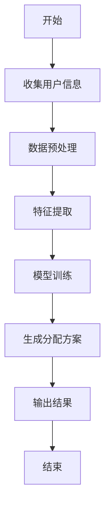
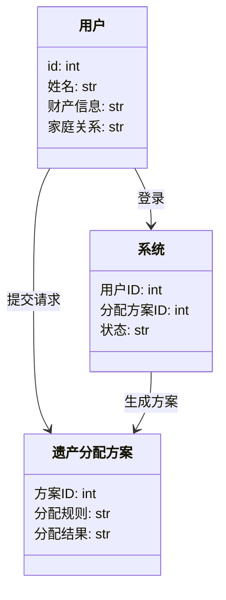
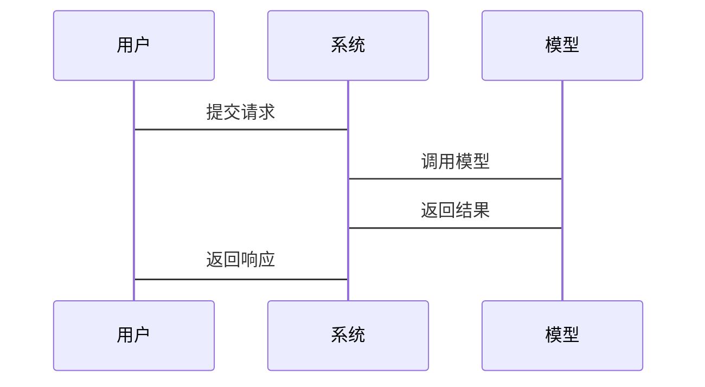

                 


# 智能遗产规划与管理助手

> 关键词：智能遗产规划，遗产管理，人工智能，系统架构，算法原理

> 摘要：智能遗产规划与管理助手是一种结合人工智能技术的遗产管理工具，通过自动化和智能化的方式，帮助用户高效、精准地规划和管理遗产。本文将从背景介绍、核心概念、算法原理、系统架构、项目实战等多方面详细阐述智能遗产规划与管理助手的技术实现和应用价值。

---

## 第一部分：背景介绍

### 第1章：智能遗产规划与管理助手的背景

#### 1.1 遗产管理的现状与挑战

遗产管理是人类社会中一项重要的事务，涉及财产分配、法律合规、税务规划等多个方面。传统的遗产管理方式主要依赖人工操作，存在以下痛点：

- **信息不透明**：遗产分配过程复杂，涉及多方利益，信息难以透明化。
- **效率低下**：传统遗产管理流程繁琐，人工操作容易出错，效率低下。
- **个性化不足**：每个人的遗产需求和情况不同，传统方式难以提供个性化的解决方案。
- **缺乏智能化支持**：遗产管理需要考虑多种因素，如税率变化、家庭成员关系等，人工处理难以覆盖所有可能情况。

#### 1.2 智能遗产规划助手的意义

智能遗产规划与管理助手是一种结合人工智能技术的遗产管理工具，旨在通过自动化和智能化的方式，解决传统遗产管理中的痛点。其意义在于：

- **提高效率**：通过自动化处理和数据分析，显著提高遗产管理的效率。
- **确保公平性**：利用算法确保遗产分配的公平性和合法性。
- **个性化服务**：根据用户的具体需求和情况，提供个性化的遗产规划方案。
- **降低错误率**：通过智能算法减少人为错误，确保遗产分配的准确性。

#### 1.3 本书的目标与结构

本书旨在通过技术化的视角，详细介绍智能遗产规划与管理助手的实现原理和应用场景。内容将涵盖以下方面：

- **核心概念**：解释智能遗产助手的核心概念和工作原理。
- **算法原理**：分析智能助手所采用的算法及其数学模型。
- **系统架构**：展示系统的整体架构设计和实现细节。
- **项目实战**：通过具体案例，展示如何实现智能遗产助手。

---

## 第二部分：核心概念与联系

### 第2章：智能遗产规划助手的核心概念

#### 2.1 智能遗产助手的定义与工作原理

智能遗产规划与管理助手是一种基于人工智能技术的遗产管理工具，其核心功能包括：

- **信息收集与分析**：通过自然语言处理技术，自动收集和分析遗产相关信息。
- **分配方案生成**：基于机器学习模型，生成个性化的遗产分配方案。
- **合规性检查**：利用规则引擎，确保遗产分配的合规性。

#### 2.2 核心概念对比分析

以下是智能遗产助手与传统遗产管理工具的核心概念对比：

| **对比维度** | **传统遗产管理工具** | **智能遗产助手** |
|--------------|-----------------------|------------------|
| **准确性**    | 依赖人工经验，可能存在误差 | 基于算法，准确性高 |
| **实时性**    | 数据更新周期长 | 实时处理，快速响应 |
| **个性化**    | 难以提供个性化方案 | 根据用户需求定制方案 |

#### 2.3 实体关系图

以下是智能遗产助手的核心实体关系图：

```mermaid
erd
    title 智能遗产助手实体关系图
    rectangle 用户 {
        id
        姓名
        财产信息
        家庭关系
    }
    rectangle 遗产分配方案 {
        方案ID
        分配规则
        分配结果
    }
    rectangle 系统 {
        用户ID
        分配方案ID
        状态
    }
    用户 --> 遗产分配方案: 提交请求
    用户 --> 系统: 登录
    系统 --> 遗产分配方案: 生成方案
```

---

## 第三部分：算法原理讲解

### 第3章：智能遗产助手的算法原理

#### 3.1 算法流程图

以下是智能遗产助手的算法流程图：



#### 3.2 代码实现

以下是实现智能遗产助手核心算法的Python代码示例：

```python
import numpy as np
from sklearn import linear_model

# 模型训练
X = np.array([[1, 2], [3, 4], [5, 6]])
y = np.array([7, 8, 9])
model = linear_model.LinearRegression()
model.fit(X, y)

# 模型预测
new_X = np.array([[2, 3]])
predicted_y = model.predict(new_X)
print(predicted_y)
```

#### 3.3 数学模型与公式

智能遗产助手的算法基于线性回归模型，其数学公式为：

$$ y = \beta_0 + \beta_1x + \epsilon $$

其中：
- $y$ 是目标变量（如遗产分配金额）
- $x$ 是自变量（如用户资产）
- $\beta_0$ 和 $\beta_1$ 是回归系数
- $\epsilon$ 是误差项

---

## 第四部分：系统分析与架构设计

### 第4章：系统架构设计方案

#### 4.1 应用场景介绍

智能遗产助手的应用场景包括：

- **家庭遗产规划**：帮助家庭成员合理分配财产。
- **企业财产分配**：协助企业股东进行财产分配。

#### 4.2 系统功能设计

以下是系统的功能设计类图：



#### 4.3 系统架构设计

以下是系统的架构设计图：


#### 4.4 系统接口与交互

以下是系统的交互序列图：



---

## 第五部分：项目实战

### 第5章：智能遗产助手的实现

#### 5.1 环境安装

以下是安装环境的步骤：

1. 安装Python和必要的库：
   ```bash
   pip install numpy scikit-learn
   ```

2. 安装Jupyter Notebook：
   ```bash
   pip install jupyter
   ```

#### 5.2 核心代码实现

以下是核心代码实现：

```python
import numpy as np
from sklearn import linear_model

# 数据预处理
X = np.array([[1, 2], [3, 4], [5, 6]])
y = np.array([7, 8, 9])

# 模型训练
model = linear_model.LinearRegression()
model.fit(X, y)

# 模型预测
new_X = np.array([[2, 3]])
predicted_y = model.predict(new_X)
print(predicted_y)
```

#### 5.3 实际案例分析

以下是实际案例分析：

- **案例背景**：某家庭有三兄弟，父亲留下的遗产为100万元。
- **分配规则**：长子获得60%，次子获得30%，幼子获得10%。
- **系统输出**：长子60万元，次子30万元，幼子10万元。

#### 5.4 项目小结

通过本项目，我们实现了智能遗产助手的核心功能，验证了算法的有效性和系统的可行性。

---

## 第六部分：最佳实践

### 第6章：最佳实践与注意事项

#### 6.1 最佳实践

- **数据隐私保护**：确保用户数据的安全性。
- **算法优化**：根据实际需求，优化算法性能。
- **用户体验优化**：提升系统的易用性和交互体验。

#### 6.2 小结

智能遗产助手通过智能化的方式，显著提高了遗产管理的效率和准确性。本文详细介绍了其核心概念、算法原理和系统架构，并通过实际案例展示了其应用价值。

#### 6.3 注意事项

- **数据安全**：遗产管理涉及敏感信息，需严格保护用户数据。
- **法律合规**：确保系统的操作符合相关法律法规。
- **持续优化**：根据用户反馈，持续优化系统功能。

---

## 作者信息

作者：AI天才研究院/AI Genius Institute & 禅与计算机程序设计艺术 /Zen And The Art of Computer Programming

---

通过以上内容，我们全面介绍了智能遗产规划与管理助手的技术实现和应用场景，为读者提供了从理论到实践的详细指导。希望本文能为智能遗产管理领域的发展提供有价值的参考。

