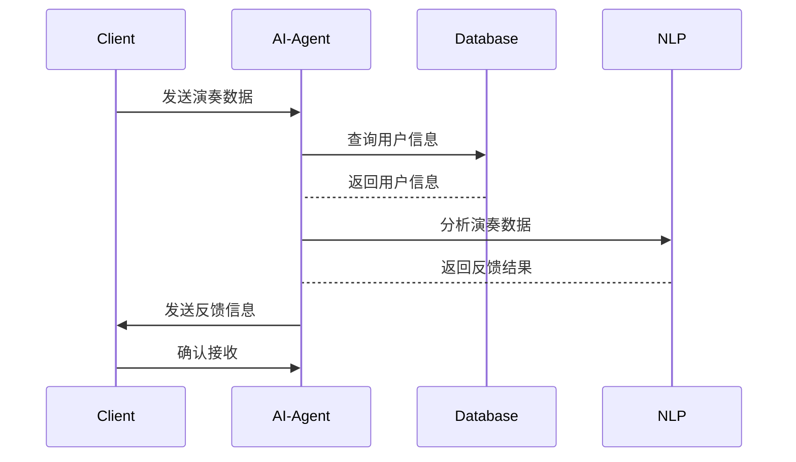

                 


# 智能钢琴：AI Agent的演奏技巧指导

## 关键词：
AI Agent，智能钢琴，演奏技巧，机器学习，自然语言处理，音乐生成

## 摘要：
随着人工智能技术的快速发展，智能钢琴与AI Agent的结合为钢琴演奏带来了革命性的变化。本文将深入探讨AI Agent在智能钢琴中的应用，从背景介绍到算法原理，从系统架构到项目实战，全面解析AI Agent如何助力钢琴演奏技巧的提升。通过本文，读者将了解AI Agent在智能钢琴中的核心功能、技术实现和实际应用，掌握如何利用AI技术优化钢琴演奏体验。

---

## 第一部分：智能钢琴与AI Agent的背景介绍

### 第1章：AI Agent与智能钢琴概述

#### 1.1 AI Agent的基本概念
- **AI Agent的定义与特点**
  - AI Agent是一种智能体，能够感知环境、自主决策并执行任务。
  - 具备学习能力、适应性和交互能力。
- **AI Agent的核心要素与功能**
  - 感知：通过传感器或数据输入感知环境。
  - 决策：基于感知信息进行推理和选择。
  - 执行：通过执行机构完成任务。
- **AI Agent与传统计算机程序的区别**
  - 传统程序基于规则，AI Agent具备自主性和学习能力。
  - 传统程序不适应环境变化，AI Agent能够动态调整策略。

#### 1.2 智能钢琴的发展历程
- **传统钢琴的数字化转型**
  - 从机械钢琴到电子钢琴，逐步实现数字化。
  - 数字化钢琴支持 MIDI 接口和音乐软件的连接。
- **智能钢琴的定义与应用场景**
  - 智能钢琴是结合了AI技术的电子钢琴，能够提供智能化的演奏指导和音乐创作支持。
  - 应用于音乐教育、专业演奏和音乐创作等领域。
- **智能钢琴的技术发展趋势**
  - 集成AI技术，实现智能化的演奏反馈和音乐生成。
  - 结合物联网技术，支持远程教学和音乐分享。

#### 1.3 AI Agent在智能钢琴中的作用
- **AI Agent在钢琴演奏中的核心功能**
  - 实时分析演奏者的技巧，提供反馈。
  - 自动生成伴奏和音乐变奏。
  - 提供个性化教学和演奏建议。
- **AI Agent如何提升钢琴演奏体验**
  - 通过实时反馈帮助演奏者纠正错误。
  - 提供多样化的音乐风格和演奏技巧建议。
  - 支持多人协作和远程教学。

---

### 第2章：智能钢琴与AI Agent的核心概念与联系

#### 2.1 AI Agent的核心概念
- **AI Agent的感知与决策机制**
  - 感知：通过麦克风和MIDI接口捕捉演奏者的动作和音乐数据。
  - 决策：基于感知数据，利用机器学习算法生成演奏建议。
- **AI Agent的学习与自适应能力**
  - 利用深度学习模型不断优化反馈算法。
  - 根据用户反馈调整推荐策略。
- **AI Agent的交互与反馈机制**
  - 提供自然语言交互，用户可以通过语音或文字提问。
  - 给出实时的视觉和听觉反馈。

#### 2.2 智能钢琴的技术特征
- **智能钢琴的硬件构成**
  - 高精度传感器：捕捉键位压力、速度和位置。
  - 高质量扬声器：支持高质量音频输出。
  - 网络接口：支持无线连接和数据传输。
- **智能钢琴的软件架构**
  - 数据采集模块：收集演奏数据。
  - AI处理模块：分析数据并生成反馈。
  - 用户界面模块：展示反馈信息和交互界面。
- **智能钢琴的用户交互界面**
  - 图形界面：展示演奏数据和建议。
  - 语音交互：支持自然语言查询和反馈。

#### 2.3 AI Agent与智能钢琴的实体关系分析
```mermaid
er
actor: 用户
agent: AI Agent
piano: 智能钢琴
piano_music: 曲目库
feedback: 用户反馈
```

---

### 第3章：AI Agent在智能钢琴中的算法原理

#### 3.1 自然语言处理与音乐理解
- **NLP技术在钢琴演奏中的应用**
  - 通过NLP技术分析用户的演奏反馈，生成个性化的建议。
  - 支持用户通过自然语言查询曲目信息和演奏技巧。
- **音乐语义分析的算法流程**
  - 数据采集：收集用户的演奏数据。
  - 数据预处理：清洗和标注数据。
  - 模型训练：利用深度学习模型进行语义分析。
  - 反馈生成：基于分析结果生成演奏建议。
- **音乐情感分析的实现原理**
  - 基于循环神经网络（RNN）的情感分类模型。
  - 通过分析音乐特征（如节奏、音高）生成情感标签。

#### 3.2 语音识别与演奏指导
- **语音识别技术在钢琴演奏中的应用**
  - 通过语音识别技术捕捉用户的演奏指令。
  - 支持用户通过语音查询曲目信息和演奏技巧。
- **基于AI的演奏反馈机制**
  - 利用语音识别技术分析用户的演奏问题。
  - 自动生成反馈报告，指导用户改进技巧。
- **现实案例分析与代码实现**
  - 使用Python的`speech_recognition`库实现语音识别。
  - 代码示例：
    ```python
    import speech_recognition as sr

    r = sr.Recognizer()
    with sr.Microphone() as source:
        print("请开始演奏...")
        audio = r.listen(source)
        try:
            print("AI Agent识别到您的演奏内容为：" + r.recognize_google(audio))
        except sr.UnknownValueError:
            print("无法识别您的演奏内容")
    ```

#### 3.3 基于深度学习的音乐生成
- **基于RNN的音乐生成模型**
  - 使用循环神经网络（RNN）生成音乐序列。
  - 通过训练音乐数据集，模型能够生成相似风格的音乐。
- **基于Transformer的音乐生成算法**
  - 使用Transformer架构，捕捉长距离依赖关系。
  - 通过自注意力机制生成更复杂的音乐结构。
- **深度学习在钢琴演奏中的创新应用**
  - 利用深度学习模型实时分析演奏技巧。
  - 自动生成个性化演奏建议和音乐变奏。

---

### 第4章：智能钢琴与AI Agent的系统分析与架构设计

#### 4.1 系统功能设计
- **问题场景介绍**
  - 演奏者在练习过程中缺乏实时反馈，难以发现技巧问题。
  - 需要个性化的演奏指导和音乐创作支持。
- **项目介绍**
  - 开发一个基于AI Agent的智能钢琴系统，提供实时反馈和个性化建议。
  - 系统架构：
    ```mermaid
    graph TD
    A[用户] --> B[智能钢琴]
    B --> C[AI Agent]
    C --> D[曲目库]
    C --> E[反馈]
    ```
- **系统功能设计**
  - 数据采集：收集用户的演奏数据。
  - 数据处理：分析演奏数据，生成反馈报告。
  - 用户交互：通过图形界面和语音交互提供反馈信息。
  - 系统优化：根据用户反馈优化AI算法。

#### 4.2 系统架构设计
- **领域模型的类图**
  ```mermaid
  classDiagram
  class User {
    + username: string
    + email: string
    - password: string
    ++ get_username()
  }
  class Piano {
    + model: string
    + brand: string
    - serial_number: string
    ++ play(note)
  }
  class AI-Agent {
    + model: string
    + version: string
    - data: list
    ++ analyze(data)
    ++ generate_feedback(data)
  }
  User --> Piano
  Piano --> AI-Agent
  AI-Agent --> User
  ```
- **系统架构图**
  ```mermaid
  architecture
  Client --> HTTP: 请求处理
  Client --> WebSocket: 实时反馈
  Client --> File: 数据存储
  Client --> Database: 用户信息
  ```
- **系统接口设计**
  - HTTP接口：用于用户注册和登录。
  - WebSocket接口：用于实时反馈和交互。
  - 文件接口：用于数据存储和传输。

#### 4.3 系统交互序列图


---

## 第五部分：项目实战

### 第5章：环境安装与系统核心实现

#### 5.1 环境安装
- **Python环境**
  - 安装Python 3.8及以上版本。
  - 安装必要的库：`speech_recognition`, `pyaudio`, `tensorflow`, `scikit-learn`。
- **硬件设备**
  - 配备MIDI接口的智能钢琴或电子钢琴。
  - 高质量麦克风（用于语音识别）。

#### 5.2 核心功能实现
- **演奏数据采集**
  ```python
  import pyaudio
  import numpy as np

  def record_audio():
      FORMAT = pyaudio.paInt16
      CHANNELS = 1
      RATE = 44100
      CHUNK = 1024
      p = pyaudio.PyAudio()
      stream = p.open(format=FORMAT, channels=CHANNELS, rate=RATE, input=True, frames_per_buffer=CHUNK)
      print("开始录音...")
      frames = []
      for _ in range(0, 32000, CHUNK):
          data = stream.read(CHUNK)
          frames.append(data)
      print("录音结束...")
      stream.stop_stream()
      stream.close()
      p.terminate()
      return frames
  ```

- **AI模型训练**
  ```python
  import tensorflow as tf
  from tensorflow.keras import layers

  model = tf.keras.Sequential([
      layers.Dense(64, activation='relu'),
      layers.Dense(1, activation='sigmoid')
  ])
  model.compile(optimizer='adam', loss='binary_crossentropy', metrics=['accuracy'])
  model.fit(X_train, y_train, epochs=10, batch_size=32)
  ```

#### 5.3 代码应用解读与分析
- **演奏数据采集**
  - 使用`pyaudio`库采集音频数据。
  - 数据存储为WAV格式，用于后续处理。
- **AI模型训练**
  - 使用Keras构建简单的分类模型。
  - 训练模型识别演奏技巧问题，如音准和节奏问题。

#### 5.4 实际案例分析
- **案例：实时演奏反馈**
  - 用户演奏一段曲目，AI Agent实时分析演奏数据。
  - 生成反馈报告，指出演奏中的技巧问题。
  - 提供个性化的改进建议。

---

## 第六部分：最佳实践与总结

### 第6章：最佳实践

#### 6.1 小结
- 本文详细介绍了AI Agent在智能钢琴中的应用，从背景到技术实现，再到实际应用，全面解析了AI Agent如何提升钢琴演奏技巧。
- 通过系统的架构设计和实际案例分析，展示了AI技术在音乐领域的巨大潜力。

#### 6.2 注意事项
- 在实际应用中，需要注意数据隐私和安全问题。
- 确保AI模型的准确性和稳定性，避免误反馈影响用户体验。

#### 6.3 拓展阅读
- 《深度学习入门：基于Python的理论与实现》
- 《自然语言处理实战：基于Python的机器学习与深度学习》
- 《音乐信息检索与生成技术》

---

## 作者信息

作者：AI天才研究院/AI Genius Institute & 禅与计算机程序设计艺术 /Zen And The Art of Computer Programming

---

通过本文，读者可以全面了解AI Agent在智能钢琴中的应用，掌握如何利用AI技术优化钢琴演奏体验。希望本文能够为音乐教育和音乐创作领域带来新的思路和启示。

