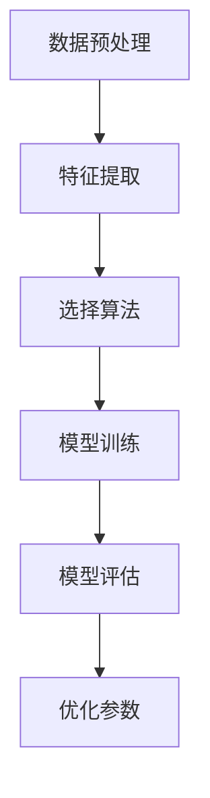
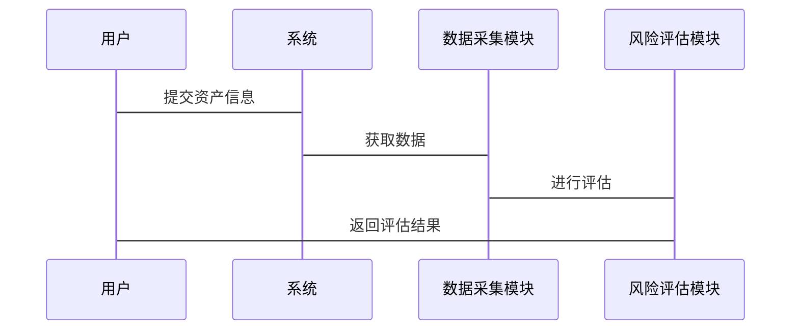

                 


# 智能银行不良资产管理系统

> 关键词：智能银行，不良资产，管理系统，机器学习，系统架构

> 摘要：本文详细探讨了智能银行不良资产管理系统的构建与实现，从系统背景、核心概念、算法原理、系统架构到项目实战，全面解析了如何利用人工智能技术提升不良资产的管理效率和准确性。通过实际案例分析和系统设计，本文为读者提供了从理论到实践的完整指南。

---

## 第1章: 智能银行不良资产管理系统背景与意义

### 1.1 什么是智能银行

智能银行是传统银行在数字化转型中的高级形态，利用人工智能、大数据和区块链等技术，实现业务流程的自动化、智能化和服务的个性化。与传统银行相比，智能银行具有以下核心特征：

- **自动化服务**：通过AI技术实现24/7的客户支持和自动化交易处理。
- **智能化决策**：利用机器学习和大数据分析，提升风险控制和决策能力。
- **客户体验优化**：通过个性化推荐和智能分析，为客户提供更优质的服务。

### 1.2 不良资产的定义与分类

不良资产是指借款人无法按时偿还贷款本息，或已资不抵债的资产。根据资产类型，不良资产主要分为以下几类：

| 资产类型 | 定义 | 特征 |
|----------|------|------|
| 贷款类资产 | 借款人无法偿还的贷款 | 包括个人贷款和企业贷款 |
| 投资类资产 | 无法收回投资的项目 | 如股权投资、债权投资 |
| 其他资产 | 包括抵质押物等 | 作为不良资产处置的辅助手段 |

### 1.3 不良资产管理系统的重要性

不良资产管理系统是银行管理和处置不良资产的关键工具，其重要性体现在以下几个方面：

- **风险控制**：通过实时监控和预警，降低资产损失风险。
- **效率提升**：自动化处理流程大幅提高了管理效率。
- **数据驱动决策**：利用数据分析，为不良资产处置提供科学依据。

### 1.4 本章小结

本章从智能银行的定义和特征入手，详细阐述了不良资产的定义、分类及其管理系统的必要性，为后续内容奠定了基础。

---

## 第2章: 智能银行不良资产管理系统的核心概念与联系

### 2.1 不良资产管理系统的核心概念

不良资产管理系统是一个复杂的系统，其核心概念包括：

- **数据采集**：通过API或爬虫技术获取不良资产的相关数据。
- **风险评估**：利用机器学习算法对资产的风险进行评估和分类。
- **处置管理**：根据评估结果制定处置策略并执行。

### 2.2 不良资产管理系统的核心要素

系统的实体关系图展示了各实体之间的关系，如图所示：

```mermaid
erDiagram
    customer[客户] {
        id : integer
        name : string
        phone : string
    }
    asset[资产] {
        id : integer
        type : string
        status : string
    }
    riskassessment[风险评估] {
        id : integer
        score : float
        date : date
    }
    transaction[交易] {
        id : integer
        amount : float
        date : date
    }
    customer --> asset : 拥有
    asset --> riskassessment : 评估
    riskassessment --> transaction : 引发
```

### 2.3 系统的实体关系图

实体关系图展示了系统的各个实体及其关系，帮助我们更好地理解系统的整体结构。

### 2.4 本章小结

本章通过核心概念和实体关系图，详细描述了智能银行不良资产管理系统的组成和各部分之间的关系。

---

## 第3章: 智能银行不良资产管理系统中的算法原理

### 3.1 机器学习在不良资产管理系统中的应用

机器学习算法在不良资产管理中的应用主要体现在风险评估和预测上。常见的算法包括：

- **线性回归**：用于预测资产的回收率。
- **支持向量机（SVM）**：用于分类资产的风险等级。
- **随机森林**：用于特征重要性分析和风险预测。

### 3.2 算法原理的数学模型

线性回归的数学模型如下：

$$ y = \beta_0 + \beta_1x_1 + \beta_2x_2 + ... + \beta_nx_n $$

其中，$y$ 是预测的回收率，$x_i$ 是各个特征变量，$\beta_i$ 是对应的系数。

### 3.3 算法实现的流程图

机器学习算法的实现流程如下：



### 3.4 本章小结

本章详细介绍了机器学习算法在不良资产管理中的应用，包括数学模型和实现流程。

---

## 第4章: 智能银行不良资产管理系统中的系统架构设计

### 4.1 系统架构的总体设计

系统的总体架构分为数据层、业务逻辑层和表现层，如下图所示：


### 4.2 系统功能模块的设计

系统的主要功能模块包括：

1. **数据采集模块**：负责收集不良资产的相关数据。
2. **风险评估模块**：对资产进行风险评估和分类。
3. **处置管理模块**：根据评估结果制定处置策略。

### 4.3 系统接口设计

系统的接口设计包括内部接口和外部接口：

- **内部接口**：数据采集模块与风险评估模块之间的接口。
- **外部接口**：系统与第三方数据源的接口。

### 4.4 系统交互流程图

系统的交互流程如下：



### 4.5 本章小结

本章详细描述了系统的架构设计，包括功能模块、接口设计和交互流程。

---

## 第5章: 智能银行不良资产管理系统项目实战

### 5.1 环境配置与安装

开发环境建议使用Python 3.8及以上版本，安装以下工具：

- **Python**：编程语言
- **Scikit-learn**：机器学习库
- **Pandas**：数据分析库

### 5.2 系统核心代码实现

以下是风险评估模块的核心代码：

```python
import pandas as pd
from sklearn.model_selection import train_test_split
from sklearn.ensemble import RandomForestClassifier

# 数据加载
data = pd.read_csv('assets.csv')

# 特征与标签分离
X = data.drop('status', axis=1)
y = data['status']

# 数据分割
X_train, X_test, y_train, y_test = train_test_split(X, y, test_size=0.2)

# 模型训练
model = RandomForestClassifier()
model.fit(X_train, y_train)

# 模型预测
y_pred = model.predict(X_test)
```

### 5.3 代码解读与分析

上述代码实现了以下功能：

1. 数据加载：从CSV文件中读取数据。
2. 特征与标签分离：将数据分为特征和标签两部分。
3. 数据分割：将数据分为训练集和测试集。
4. 模型训练：使用随机森林算法训练模型。
5. 模型预测：对测试集进行预测。

### 5.4 实际案例分析

以某银行的不良贷款数据为例，使用上述代码进行风险评估和分类。

---

## 第6章: 最佳实践与注意事项

### 6.1 小结

智能银行不良资产管理系统通过机器学习和系统架构设计，显著提升了不良资产的管理效率和准确性。

### 6.2 注意事项

- 数据隐私保护：确保数据的安全性和隐私性。
- 模型优化：定期更新和优化模型以提高准确率。
- 系统维护：定期检查和维护系统以确保其稳定运行。

### 6.3 拓展阅读

- 《机器学习实战》：深入理解机器学习算法。
- 《系统架构设计》：学习系统架构设计的更多方法。

---

## 作者

作者：AI天才研究院/AI Genius Institute & 禅与计算机程序设计艺术 /Zen And The Art of Computer Programming

---

通过以上内容，本文系统地介绍了智能银行不良资产管理系统的构建与实现，从理论到实践，为读者提供了全面的指导。

