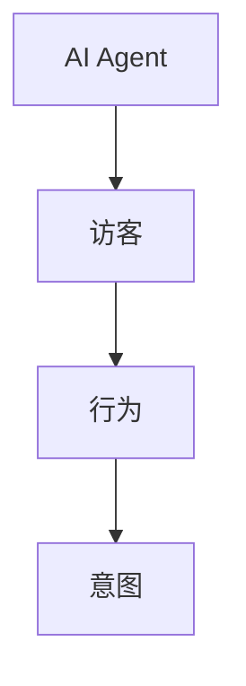
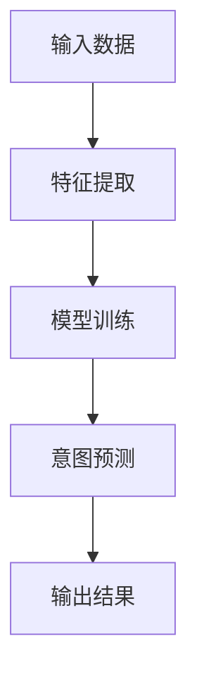

                 


# 智能门禁：AI Agent的访客意图识别

## 关键词：智能门禁、AI Agent、访客意图识别、深度学习、行为分析、门禁系统

## 摘要：智能门禁系统通过AI Agent实现访客意图识别，结合人脸识别和行为分析技术，提升安全性。本文详细探讨其原理、算法实现和系统设计，最后提供项目实战和优化建议。

---

# 第1章: 智能门禁与AI Agent的背景介绍

## 1.1 问题背景与描述

### 1.1.1 传统门禁系统的局限性
传统门禁系统主要依赖刷卡或密码，容易被伪造或丢失。安全性不足，难以识别非授权访问。

### 1.1.2 智能化门禁的需求与目标
提高安全性，实时识别异常行为，减少人为错误，提升访客管理效率。

### 1.1.3 AI Agent在门禁系统中的角色
AI Agent作为智能助手，实时监控和识别访客行为，提供高效安全的门禁管理。

## 1.2 访客意图识别的核心问题

### 1.2.1 访客行为分析的重要性
及时发现潜在威胁，如非法入侵或暴力行为。

### 1.2.2 意图识别的挑战与解决方案
数据多样性、环境干扰、模型泛化能力。

### 1.2.3 边界与外延的定义
明确意图识别的范围和适用场景。

## 1.3 核心概念与联系

### 1.3.1 AI Agent的定义与属性
- **定义**：AI Agent是具有感知、决策和执行能力的智能体。
- **属性**：自主性、反应性、目标导向。

### 1.3.2 实体关系图


---

# 第2章: AI Agent的原理与技术

## 2.1 AI Agent的核心原理

### 2.1.1 感知层：数据采集与处理
使用摄像头和传感器采集访客数据，数据预处理如去噪和特征提取。

### 2.1.2 计算层：特征提取与分析
应用深度学习模型进行特征提取，训练分类器识别不同行为特征。

### 2.1.3 决策层：意图预测与反馈
基于分析结果做出决策，如允许或禁止访问。

## 2.2 访客意图识别的关键技术

### 2.2.1 人脸识别技术
使用CNN进行人脸识别，验证访客身份。

### 2.2.2 行为分析技术
监测异常行为，如徘徊、尾随。

### 2.2.3 语义理解技术
分析对话内容，识别潜在威胁。

## 2.3 技术对比与选择

### 2.3.1 不同技术的优缺点对比
| 技术         | 优点               | 缺点                 |
|--------------|--------------------|----------------------|
| 人脸识别     | 准确性高           | 易受光线影响         |
| 行为分析     | 可识别复杂行为     | 计算资源消耗大       |
| 语义理解     | 可识别潜在威胁     | 数据依赖性强         |

### 2.3.2 技术选型的依据与策略
根据需求选择合适的技术组合，如人脸识别和行为分析结合使用。

---

# 第3章: 算法原理与实现

## 3.1 算法原理概述

### 3.1.1 基于深度学习的意图识别
使用卷积神经网络（CNN）进行特征提取。

### 3.1.2 算法流程图


## 3.2 深度学习模型实现

### 3.2.1 卷积神经网络（CNN）的应用
展示CNN的结构，包括卷积层、池化层和全连接层。

### 3.2.2 模型训练与优化
讨论训练策略，如数据增强、学习率调整。

### 3.2.3 模型推理与部署
介绍如何将模型部署到实际系统中，如使用Flask构建API。

## 3.3 算法实现代码示例

### 3.3.1 环境安装与配置
```python
pip install tensorflow numpy
```

### 3.3.2 核心代码实现
```python
import tensorflow as tf
from tensorflow.keras import layers

model = tf.keras.Sequential([
    layers.Conv2D(32, (3,3), activation='relu', input_shape=(64,64,3)),
    layers.MaxPooling2D((2,2)),
    layers.Flatten(),
    layers.Dense(128, activation='relu'),
    layers.Dense(num_classes, activation='softmax')
])
```

---

# 第4章: 系统分析与架构设计

## 4.1 问题场景介绍
描述一个典型的智能门禁系统，包括摄像头、传感器和后端服务器。

## 4.2 系统功能设计

### 4.2.1 领域模型类图
使用Mermaid绘制类图，展示系统中的主要类及其关系。

## 4.3 系统架构设计

### 4.3.1 模块划分
- **前端**：摄像头和传感器采集数据。
- **后端**：AI Agent处理数据，进行意图识别。
- **数据库**：存储访客信息和历史记录。

### 4.3.2 系统架构图
使用Mermaid绘制系统架构图，展示各模块之间的交互。

## 4.4 接口设计

### 4.4.1 API接口
定义RESTful API，如`POST /api/visitor`用于提交访客数据。

### 4.4.2 交互流程
使用Mermaid绘制序列图，展示访客请求访问、AI Agent处理和门禁系统响应的流程。

---

# 第5章: 项目实战

## 5.1 环境安装与配置
详细说明如何安装必要的库和工具，如TensorFlow、OpenCV、Flask。

## 5.2 核心功能实现

### 5.2.1 人脸识别实现
使用预训练模型，如FaceNet，进行人脸识别。

### 5.2.2 行为分析实现
使用姿态估计技术，如姿态检测模型，识别异常行为。

## 5.3 项目实战代码示例

### 5.3.1 训练数据准备
描述如何收集和标注训练数据，如使用ImageNet数据集。

### 5.3.2 模型训练与部署
展示训练循环的代码，如使用TensorFlow构建模型并训练。
```python
model.compile(optimizer=optimizer, loss=loss, metrics=['accuracy'])
model.fit(train_dataset, epochs=10, validation_data=val_dataset)
```

---

# 第6章: 系统优化与扩展

## 6.1 系统优化策略
提高模型的准确性和响应速度，优化数据预处理和特征提取步骤。

## 6.2 功能扩展
引入更多传感器数据，如温度和湿度，进行更全面的分析，集成更多AI技术，如自然语言处理。

## 6.3 最佳实践 tips
提供实际应用中的建议，如数据隐私保护、模型更新策略等。

---

# 第7章: 小结与展望

## 7.1 小结
总结全文，回顾智能门禁系统中AI Agent的访客意图识别的关键点。

## 7.2 未来展望
展望技术的发展，如更先进的AI算法、多模态数据融合等。

---

### 作者信息

作者：AI天才研究院 & 禅与计算机程序设计艺术

---

希望这篇文章能满足用户的需求，逻辑清晰，内容详实，技术深入浅出。

