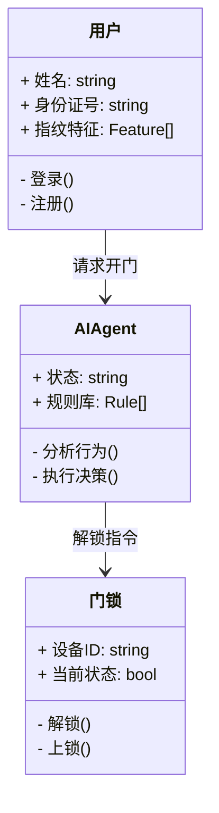
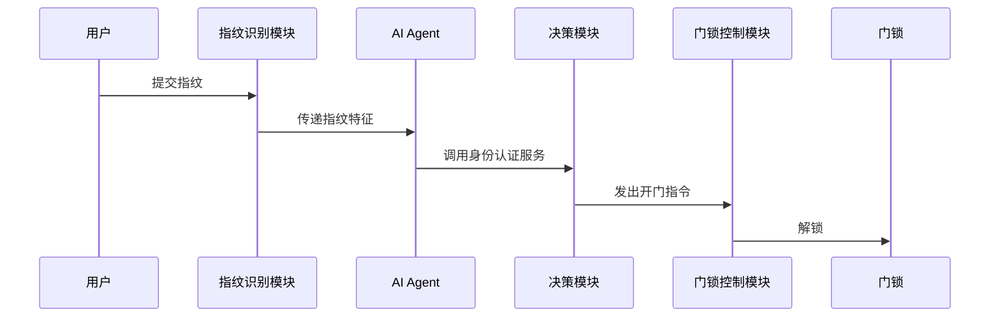

                 


```markdown
# 智能门锁：AI Agent的生物识别技术

> 关键词：智能门锁，AI Agent，生物识别技术，算法原理，系统架构

> 摘要：本文深入探讨了智能门锁中AI Agent与生物识别技术的结合，分析了生物识别技术的核心原理、AI Agent的行为决策机制，以及它们在智能门锁中的实际应用。文章从背景介绍、技术原理、系统架构到项目实战，全面解析了智能门锁的创新与发展。

---

## 第1章: 智能门锁与AI Agent的背景介绍

### 1.1 智能门锁的背景与现状
#### 1.1.1 传统门锁的局限性
传统门锁依赖物理钥匙，存在易复制、易丢失的风险，维护成本高且功能单一。

#### 1.1.2 智能门锁的发展历程
从机械锁到电子锁，再到集成AI和生物识别技术的智能锁，经历了功能的逐步升级。

#### 1.1.3 当前智能门锁的技术趋势
现代智能门锁结合物联网、AI和生物识别技术，实现远程控制、多因素认证和智能管理。

### 1.2 AI Agent的基本概念
#### 1.2.1 什么是AI Agent
AI Agent（智能体）是能够感知环境并采取行动以实现目标的实体，具备自主性和反应性。

#### 1.2.2 AI Agent的核心特征
- **自主性**：无需外部干预，自主决策。
- **反应性**：实时感知环境变化并调整行为。
- **目标导向**：所有行动基于明确的目标。
- **社会能力**：能与环境和其他智能体交互。

### 1.3 智能门锁中AI Agent的应用场景
#### 1.3.1 生物识别技术在门锁中的应用
通过指纹、人脸或声音识别来验证用户身份。

#### 1.3.2 AI Agent在智能门锁中的具体功能
- **身份认证**：实时验证用户身份。
- **异常检测**：监测异常行为并触发报警。
- **远程控制**：通过手机应用远程管理门锁。

#### 1.3.3 智能门锁与智能家居的融合
智能门锁作为智能家居的一部分，与其他设备协同工作，提升居住安全性和便利性。

### 1.4 本章小结
本章介绍了智能门锁的发展背景、AI Agent的基本概念及其在智能门锁中的应用场景，为后续的技术分析奠定了基础。

---

## 第2章: 生物识别技术的原理与实现

### 2.1 生物识别技术的分类
#### 2.1.1 指纹识别
- **优点**：高精度，稳定性好。
- **缺点**：易受磨损或污渍影响。

#### 2.1.2 人脸识别
- **优点**：非接触式，适用场景广。
- **缺点**：受光照和角度影响较大。

#### 2.1.3 声纹识别
- **优点**：识别精度高，难以伪造。
- **缺点**：采集环境要求较高。

#### 2.1.4 其他生物识别技术
如虹膜识别、掌纹识别等。

### 2.2 生物识别技术的实现流程
#### 2.2.1 数据采集
使用传感器采集指纹、图像或声音信号。

#### 2.2.2 数据处理与特征提取
对采集的数据进行预处理，提取关键特征，如指纹的脊线方向。

#### 2.2.3 特征匹配与识别
将提取的特征与数据库中的模板进行匹配，输出识别结果。

### 2.3 生物识别技术的优缺点对比
| 技术    | 优点                | 缺点                |
|---------|---------------------|--------------------|
| 指纹识别 | 高精度，稳定性好    | 易受磨损或污渍影响  |
| 人脸识别 | 非接触式，适用场景广 | 受光照和角度影响大 |
| 声纹识别 | 难以伪造，识别精度高 | 采集环境要求较高   |

### 2.4 本章小结
本章详细介绍了生物识别技术的分类及其实现流程，分析了各类技术的优缺点，为后续AI Agent的应用提供了技术基础。

---

## 第3章: AI Agent的算法实现

### 3.1 基于机器学习的生物特征识别
#### 3.1.1 机器学习的基本概念
机器学习是一种通过数据训练模型，使其能够进行预测或分类的技术。

#### 3.1.2 常见的机器学习算法在生物识别中的应用
- **支持向量机（SVM）**：用于分类任务。
- **随机森林**：用于特征选择和分类。
- **深度学习**：如卷积神经网络（CNN）用于图像识别。

#### 3.1.3 深度学习在生物识别中的应用
例如，使用CNN进行指纹图像的特征提取和分类。

### 3.2 基于规则的AI Agent行为决策
#### 3.2.1 规则引擎的定义与特点
规则引擎是一种用于定义、管理和执行规则的软件框架。

#### 3.2.2 基于规则的决策流程
1. **用户身份认证**：验证用户的生物特征。
2. **权限检查**：判断用户是否有开门权限。
3. **行为分析**：检测异常行为并触发报警。

#### 3.2.3 规则的动态更新与优化
规则可以根据实际使用情况动态调整，以提高系统的准确性和效率。

### 3.3 智能门锁中AI Agent的算法实现
#### 3.3.1 生物特征识别算法
使用指纹识别算法进行身份验证。

#### 3.3.2 行为决策算法
基于规则引擎进行权限管理和异常检测。

---

## 第4章: 系统分析与架构设计方案

### 4.1 问题场景
#### 4.1.1 用户身份认证
用户使用指纹开门时，系统需要快速验证身份。

#### 4.1.2 异常检测
检测非授权用户试图强行进入。

#### 4.1.3 远程控制
用户通过手机应用远程管理门锁状态。

### 4.2 项目介绍
本项目旨在开发一款基于AI Agent的智能门锁系统，结合生物识别技术和智能决策算法，提升安全性和用户体验。

### 4.3 系统功能设计
#### 4.3.1 领域模型类图


### 4.4 系统架构设计


### 4.5 接口设计
- **指纹识别接口**：提供指纹采集和识别功能。
- **权限管理接口**：管理用户的开门权限。

### 4.6 系统交互流程


---

## 第5章: 项目实战

### 5.1 环境安装
#### 5.1.1 安装Python环境
```bash
python --version
pip install --upgrade pip
```

#### 5.1.2 安装所需库
```bash
pip install numpy scikit-learn cv2
```

### 5.2 核心代码实现
#### 5.2.1 指纹识别代码
```python
import cv2
import numpy as np

# 加载指纹图像
image = cv2.imread('fingerprint.jpg', cv2.IMREAD_GRAYSCALE)
# 使用OpenCV进行边缘检测
edges = cv2.Canny(image, 100, 200)
cv2.imwrite('edges.jpg', edges)
```

#### 5.2.2 AI Agent决策代码
```python
class AI-Agent:
    def __init__(self, rules):
        self.rules = rules

    def analyze_behavior(self, input):
        for rule in self.rules:
            if rule.condition(input):
                return rule.action(input)
        return None
```

### 5.3 代码解读
指纹识别代码使用OpenCV进行边缘检测，AI Agent类定义了基于规则的决策逻辑。

### 5.4 实际案例分析
以酒店门锁系统为例，分析系统的部署和维护，强调生物识别技术的稳定性和安全性。

---

## 第6章: 最佳实践、小结、注意事项和拓展阅读

### 6.1 Tips
- **系统优化**：结合多因素认证提升安全性。
- **数据保护**：确保生物特征数据的加密存储。

### 6.2 小结
本文详细分析了智能门锁中AI Agent与生物识别技术的结合，从理论到实践，全面展示了系统的实现过程。

### 6.3 注意事项
- **隐私保护**：严格管理用户的生物特征数据。
- **系统安全**：防止未经授权的访问和数据泄露。

### 6.4 拓展阅读
推荐阅读《人工智能：现代方法》和《生物识别技术入门》。

---

## 作者信息

作者：AI天才研究院/AI Genius Institute & 禅与计算机程序设计艺术 /Zen And The Art of Computer Programming

---

本文通过系统化的分析和详细的代码实现，全面解析了智能门锁中AI Agent的生物识别技术，为读者提供了从理论到实践的完整指南。
```

