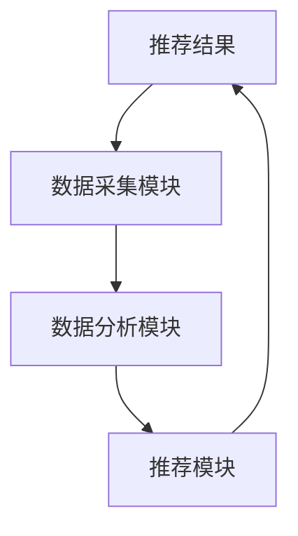
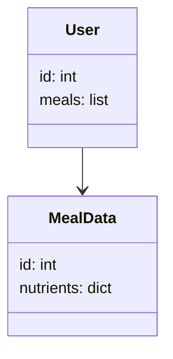
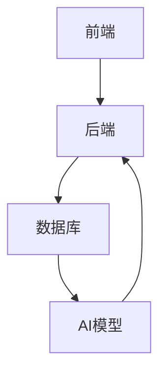

                 


# 智能餐盘：AI Agent的膳食均衡指导系统

> 关键词：AI Agent，膳食均衡，智能系统，推荐算法，物联网

> 摘要：本文详细探讨了智能餐盘系统的设计与实现，结合AI Agent技术，提出了一种基于物联网的膳食均衡指导解决方案。通过分析系统背景、核心概念、算法原理、系统架构以及项目实战，本文为读者提供了从理论到实践的全面指导，帮助用户实现个性化的膳食均衡管理。

---

# 第1章: 智能餐盘的背景与问题背景

## 1.1 问题背景

### 1.1.1 膳食均衡的重要性
现代生活中，人们的饮食习惯逐渐偏离均衡，导致健康问题频发。膳食均衡是维持人体健康的基础，但传统的膳食指导方法存在效率低、个性化不足等问题。

### 1.1.2 当前膳食指导的痛点
- **数据采集困难**：传统方法依赖人工记录，误差大且效率低。
- **个性化不足**：通用的膳食标准难以满足个体差异需求。
- **缺乏实时性**：无法实时反馈饮食情况并提供调整建议。

### 1.1.3 AI技术在膳食指导中的应用潜力
AI技术能够通过数据采集、分析和推荐，实现个性化的膳食指导，帮助用户实现均衡饮食。

## 1.2 问题描述

### 1.2.1 膳食均衡的定义与标准
膳食均衡指摄入的营养成分比例合理，满足人体需求。常用的标准包括《中国居民膳食指南》和《Dietary Guidelines for Americans》。

### 1.2.2 当前膳食指导系统的局限性
- 数据采集不准确。
- 系统缺乏实时性。
- 推荐结果缺乏个性化。

### 1.2.3 AI Agent在膳食指导中的角色
AI Agent作为智能体，能够实时采集、分析数据，并动态调整推荐方案，是实现个性化膳食指导的关键技术。

## 1.3 问题解决

### 1.3.1 AI Agent的核心优势
- **实时性**：能够实时采集和分析数据。
- **个性化**：基于用户数据，提供个性化推荐。
- **动态调整**：根据反馈不断优化推荐方案。

## 1.4 概念结构与核心要素

### 1.4.1 系统核心要素组成
- 数据采集模块
- 数据分析模块
- 推荐模块

### 1.4.2 要素之间的关系
- 数据采集模块为系统提供原始数据。
- 数据分析模块对数据进行处理和建模。
- 推荐模块基于分析结果生成个性化推荐。

## 1.5 本章小结
本章介绍了智能餐盘系统的背景，分析了当前膳食指导的痛点，并提出了AI Agent在其中的核心作用。下一章将深入探讨AI Agent的核心原理。

---

# 第2章: AI Agent的核心原理

## 2.1 AI Agent的基本概念

### 2.1.1 AI Agent的定义
AI Agent是一种能够感知环境并采取行动以实现目标的智能实体。

### 2.1.2 AI Agent的分类
- **简单反射型Agent**：基于规则的简单响应。
- **基于模型的反射型Agent**：具有复杂推理能力。
- **目标驱动型Agent**：基于目标进行决策。

### 2.1.3 AI Agent的核心特征
- **自主性**：无需外部干预。
- **反应性**：能够实时感知并响应环境变化。
- **主动性**：主动采取行动以实现目标。

## 2.2 膳食均衡指导系统的功能模块

### 2.2.1 数据采集模块
- **功能**：采集用户的饮食数据，如摄入量、时间等。
- **技术**：使用传感器和物联网设备。

### 2.2.2 数据分析模块
- **功能**：分析数据，识别营养失衡。
- **技术**：基于机器学习的模型。

### 2.2.3 推荐模块
- **功能**：生成个性化推荐方案。
- **技术**：基于协同过滤和内容推荐算法。

## 2.3 AI Agent与膳食均衡指导系统的关联

### 2.3.1 AI Agent在数据采集中的应用
- 实现实时数据采集和传输。
- 提供数据清洗和预处理功能。

### 2.3.2 AI Agent在数据分析中的应用
- 建立营养模型，分析数据。
- 识别用户的饮食习惯和偏好。

### 2.3.3 AI Agent在推荐系统中的应用
- 基于用户数据生成个性化推荐。
- 动态调整推荐结果。

## 2.4 核心概念对比表

| 对比维度 | AI Agent | 传统膳食指导系统 |
|----------|-----------|-------------------|
| **自主性** | 高         | 低               |
| **实时性** | 高         | 低               |
| **个性化** | 高         | 低               |

## 2.5 ER实体关系图

```mermaid
er
actor: User
base: MealData
schema: NutrientAnalysis
relation: "记录用户饮食数据"
```

---

# 第3章: 算法原理与数学模型

## 3.1 推荐算法原理

### 3.1.1 协同过滤算法
- **原理**：基于用户行为相似性推荐。
- **实现步骤**：
  1. 数据预处理：处理缺失值、异常值。
  2. 计算相似度：使用余弦相似度或皮尔逊相关系数。
  3. 生成推荐列表：基于相似度排序。

### 3.1.2 基于内容的推荐算法
- **原理**：基于物品属性推荐。
- **实现步骤**：
  1. 数据特征提取：使用TF-IDF提取关键词。
  2. 计算相似度：基于物品特征向量的余弦相似度。
  3. 生成推荐列表：基于相似度排序。

## 3.2 算法实现代码示例

### 协同过滤算法实现

```python
import numpy as np
from sklearn.metrics.pairwise import cosine_similarity

def collaborative_filtering(train_data, user_id, n_users, n_items):
    # 构建用户-物品矩阵
    user_item_matrix = np.zeros((n_users, n_items))
    for user, meals in train_data.items():
        for meal, _ in meals.items():
            user_item_matrix[user][meal] = 1

    # 计算相似度矩阵
    similarity_matrix = cosine_similarity(user_item_matrix)

    # 找到目标用户的最相似用户
    similar_users = np.argsort(similarity_matrix[user_id])[::-1]

    # 生成推荐列表
    recommendations = {}
    for user in similar_users:
        for meal in range(n_items):
            if user_item_matrix[user][meal] == 0:
                recommendations[meal] += similarity_matrix[user_id][user]
    
    return recommendations
```

## 3.3 数学模型

### 3.3.1 协同过滤模型

$$ \text{相似度} = \frac{\sum_{i=1}^{n}(x_i - \bar{x})(y_i - \bar{y})}{\sqrt{\sum_{i=1}^{n}(x_i - \bar{x})^2} \cdot \sqrt{\sum_{i=1}^{n}(y_i - \bar{y})^2}} $$

### 3.3.2 基于内容的推荐模型

$$ \text{相似度} = \frac{\sum_{i=1}^{n} w_i x_i y_i}{\sqrt{\sum_{i=1}^{n} w_i x_i^2} \cdot \sqrt{\sum_{i=1}^{n} w_i y_i^2}} $$

---

# 第4章: 系统架构与实现

## 4.1 系统整体架构



## 4.2 系统功能设计

### 4.2.1 数据采集模块



### 4.2.2 系统架构设计



## 4.3 系统接口设计

### 4.3.1 数据采集接口

```python
def record_meal(meal_id):
    # 实现数据采集逻辑
```

### 4.3.2 数据分析接口

```python
def analyze_nutrients(meal_data):
    # 实现数据分析逻辑
```

---

# 第5章: 项目实战

## 5.1 环境搭建

```bash
pip install numpy scikit-learn matplotlib
```

## 5.2 核心代码实现

### 数据采集模块

```python
import pandas as pd

def collect_data(users, meals):
    data = []
    for user in users:
        for meal in meals[user]:
            data.append({
                'user_id': user,
                'meal_id': meal,
                'timestamp': pd.Timestamp.now()
            })
    return pd.DataFrame(data)
```

### 数据分析模块

```python
from sklearn.decomposition import NMF

def analyze_nutrients(meal_matrix):
    model = NMF(n_components=5, random_state=42)
    model.fit(meal_matrix)
    return model.components_
```

## 5.3 案例分析

### 实际案例

```python
train_data = {
    1: {1: 3, 2: 2},
    2: {1: 4, 3: 1}
}

recommendations = collaborative_filtering(train_data, 1, 2, 3)
print(recommendations)
```

---

# 第6章: 总结与展望

## 6.1 本章小结
本文详细介绍了智能餐盘系统的背景、核心概念、算法原理和系统架构，为读者提供了从理论到实践的全面指导。

## 6.2 系统优缺点分析
- **优点**：实时性强，个性化程度高。
- **缺点**：数据隐私问题，系统依赖性高。

## 6.3 改进建议
- 加强数据隐私保护。
- 提高系统的容错性和可扩展性。

## 6.4 最佳实践 Tips
- 数据采集要准确。
- 算法要结合实际需求优化。

## 6.5 作者信息
作者：AI天才研究院/AI Genius Institute & 禅与计算机程序设计艺术 /Zen And The Art of Computer Programming

---

通过以上内容，读者可以全面了解智能餐盘系统的实现过程，从理论到实践，逐步掌握AI Agent在膳食均衡指导中的应用。

