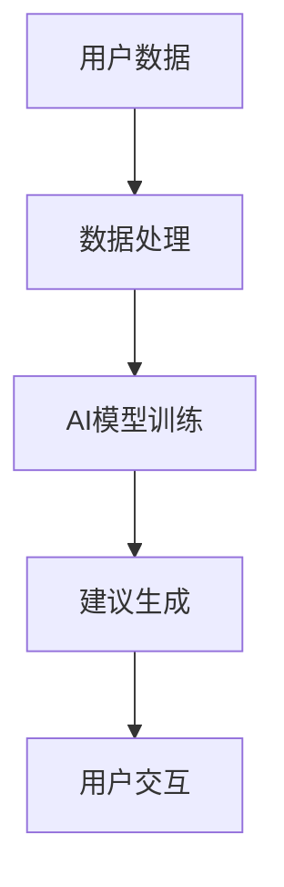
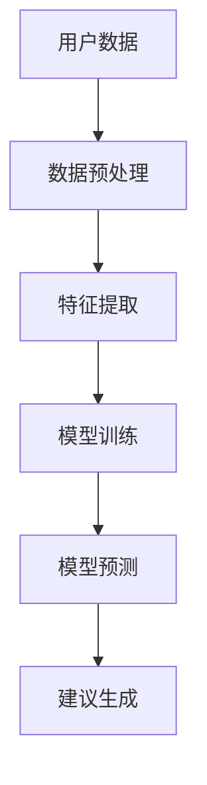
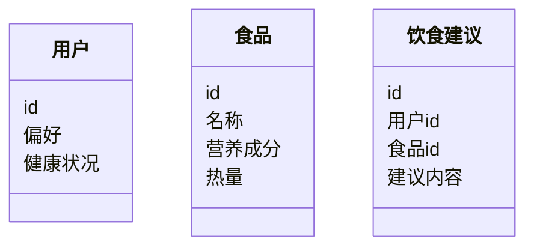
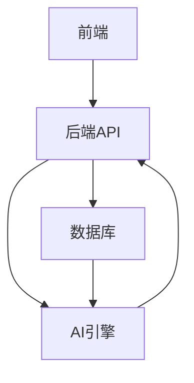
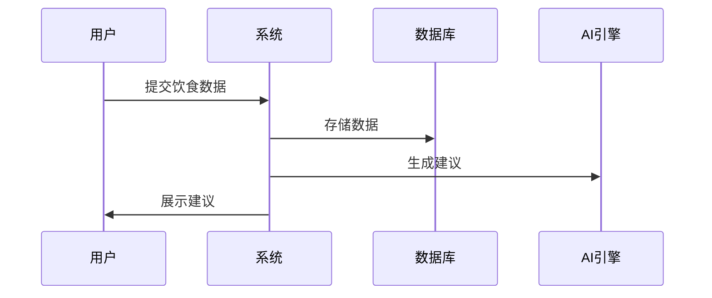

                 


# 智能餐盘：AI Agent的饮食均衡建议系统

> 关键词：AI Agent，饮食均衡，智能餐盘，系统架构，算法原理，项目实战

> 摘要：本文探讨了AI Agent在饮食均衡建议系统中的应用，从背景介绍、核心概念、算法原理、系统架构到项目实战，详细分析了智能餐盘的设计与实现。文章通过逻辑清晰的结构，结合理论与实践，为读者提供了一套完整的AI驱动的饮食均衡解决方案。

---

# 第一部分: 背景介绍与核心概念

## 第1章: 问题背景与需求分析

### 1.1 问题背景
#### 1.1.1 当前饮食问题与健康挑战
随着生活节奏的加快，人们的饮食习惯逐渐偏离均衡，导致肥胖、营养不良等问题日益严重。AI技术的发展为解决这一问题提供了新的可能性。

#### 1.1.2 智能技术在饮食健康中的应用潜力
智能设备和AI技术的结合，可以实时监测用户的饮食情况，并提供个性化的建议。AI Agent作为智能系统的核心，能够通过数据分析和决策优化，帮助用户实现饮食均衡。

#### 1.1.3 AI Agent在饮食均衡建议中的作用
AI Agent能够通过学习用户的饮食习惯、健康状况和偏好，提供个性化的饮食建议，帮助用户制定合理的饮食计划。

### 1.2 问题描述
#### 1.2.1 饮食不均衡的现状分析
现代人由于工作压力大、饮食不规律等原因，普遍存在饮食不均衡的问题。这不仅影响健康，还可能导致各种慢性疾病。

#### 1.2.2 用户需求与痛点
用户在饮食选择上面临诸多困难：如何快速获取营养均衡的餐谱？如何避免重复选择相似的食物？如何根据个人健康状况调整饮食？

#### 1.2.3 智能餐盘的目标与边界
智能餐盘的目标是通过AI技术提供个性化的饮食建议，帮助用户实现饮食均衡。其边界包括数据采集、分析、建议生成和用户交互。

### 1.3 问题解决思路
#### 1.3.1 AI Agent的核心作用
AI Agent通过数据采集、分析和决策，为用户提供智能化的饮食建议。

#### 1.3.2 数据驱动的饮食建议方法
利用大数据分析技术，结合用户的历史饮食数据、健康指标和偏好，生成个性化的饮食建议。

#### 1.3.3 系统设计的关键点
系统设计需要考虑数据的实时性、建议的准确性以及用户体验的优化。

### 1.4 核心概念与边界
#### 1.4.1 AI Agent的定义与特征
AI Agent是一种智能体，能够感知环境、自主决策并执行任务。在饮食建议系统中，AI Agent通过数据驱动的方式，为用户提供个性化的饮食建议。

#### 1.4.2 智能餐盘的功能边界
智能餐盘的核心功能包括数据采集、分析、建议生成和用户交互。其边界不包括食品的烹饪和配送。

#### 1.4.3 系统的外延与应用场景
系统的外延包括与智能厨房设备的联动、健康数据的整合等。应用场景涵盖家庭、办公室、健身房等。

### 1.5 系统核心要素组成
#### 1.5.1 数据来源与处理
数据来源包括用户的饮食记录、健康指标（如体重、血压）以及食品数据库。

#### 1.5.2 AI算法与模型
采用机器学习算法，如回归分析、聚类分析和神经网络，构建饮食建议模型。

#### 1.5.3 用户交互界面
通过移动应用或智能设备，为用户提供友好的交互界面，实时获取数据并展示建议。

---

## 第2章: AI Agent的核心原理

### 2.1 AI Agent的基本原理
#### 2.1.1 感知机制
AI Agent通过传感器、数据库等获取用户饮食数据，包括摄入量、时间、偏好等。

#### 2.1.2 决策机制
基于获取的数据，AI Agent通过机器学习模型生成饮食建议，如推荐食谱、提醒补充特定营养素。

#### 2.1.3 执行机制
AI Agent通过移动应用或智能设备，向用户推送建议或控制其他设备（如智能冰箱）执行任务。

### 2.2 AI Agent与饮食建议系统的结合
#### 2.2.1 数据采集与处理
系统通过用户的饮食记录、健康数据和食品数据库，构建个性化的饮食模型。

#### 2.2.2 知识库构建
基于营养学知识，构建包含各类食品的营养成分数据库，并结合用户数据进行动态调整。

#### 2.2.3 个性化建议生成
AI Agent根据用户数据和知识库，生成个性化的饮食建议，并通过用户交互界面展示。

### 2.3 核心概念对比与ER实体关系图

#### 2.3.1 AI Agent与传统算法对比
| 特性         | AI Agent                          | 传统算法                          |
|--------------|-----------------------------------|-----------------------------------|
| 学习能力     | 强学习能力，能够自主优化         | 依赖固定规则，无法自主优化       |
| 处理数据     | 处理非结构化数据                 | 主要处理结构化数据               |
| 应用场景     | 多场景应用，适应性强             | 适用于特定场景                   |

#### 2.3.2 ER实体关系图
```mermaid
er
entity 用户 {
  id: integer
  偏好: string
  健康状况: string
}
entity 食品 {
  id: integer
  名称: string
  营养成分: string
  热量: integer
}
entity 饮食建议 {
  id: integer
  用户id: integer
  食品id: integer
  建议内容: string
}
relationship 用户 -> 饮食建议: 提供建议
relationship 食品 -> 饮食建议: 推荐食品
```

---

## 第3章: 核心概念与联系

### 3.1 AI Agent的核心原理
#### 3.1.1 数据流分析
用户数据 → 数据处理 → AI模型 → 建议生成 → 用户交互。

#### 3.1.2 数据处理流程
数据清洗 → 特征提取 → 模型训练 → 模型优化。

#### 3.1.3 AI模型的选择与优化
采用随机森林或深度学习模型，通过交叉验证优化模型性能。

---

## 第4章: 核心概念对比与ER实体关系图

### 4.1 AI Agent与传统算法对比
（同上，见第2章）

### 4.2 ER实体关系图
（同上，见第2章）

---

# 第二部分: 算法原理讲解

## 第5章: 算法原理与数学模型

### 5.1 数据流与算法流程


### 5.2 个性化饮食建议模型


### 5.3 数学模型与公式
饮食均衡指数计算公式：
$$
E = \sum_{i=1}^{n} w_i \cdot x_i
$$
其中，$w_i$ 是营养成分 $i$ 的权重，$x_i$ 是摄入量。

---

## 第6章: 算法实现与优化

### 6.1 Python核心代码
```python
import numpy as np
from sklearn.ensemble import RandomForestRegressor

# 数据预处理
def preprocess(data):
    # 数据清洗和特征提取
    pass

# 模型训练
def train_model(X, y):
    model = RandomForestRegressor()
    model.fit(X, y)
    return model

# 模型预测
def predict(model, X):
    return model.predict(X)

# 应用示例
data = np.array([...])
X, y = preprocess(data)
model = train_model(X, y)
result = predict(model, X)
print(result)
```

---

## 第7章: 系统分析与架构设计

### 7.1 问题场景介绍
用户通过智能餐盘记录饮食，系统根据数据提供个性化建议。

### 7.2 系统功能设计


### 7.3 系统架构设计


### 7.4 接口与交互设计


---

## 第8章: 项目实战

### 8.1 环境安装
安装Python、TensorFlow、Scikit-learn等工具。

### 8.2 核心代码实现
```python
import pandas as pd
from sklearn.model_selection import train_test_split
from sklearn.metrics import accuracy_score

# 数据加载
data = pd.read_csv('diet_data.csv')

# 数据分割
X = data.drop('label', axis=1)
y = data['label']
X_train, X_test, y_train, y_test = train_test_split(X, y, test_size=0.2)

# 模型训练
from sklearn.svm import SVC
model = SVC()
model.fit(X_train, y_train)

# 模型预测
y_pred = model.predict(X_test)
print(accuracy_score(y_test, y_pred))
```

### 8.3 实际案例分析
通过实际数据，展示系统如何为用户生成个性化饮食建议。

### 8.4 项目小结
总结项目实现的关键点和经验教训。

---

## 第9章: 最佳实践与总结

### 9.1 最佳实践 tips
1. 数据隐私保护至关重要。
2. 模型需要不断优化和更新。
3. 用户交互设计要简洁易用。

### 9.2 小结
智能餐盘通过AI Agent实现了个性化的饮食建议，帮助用户实现饮食均衡。

### 9.3 注意事项
确保数据安全，避免用户隐私泄露。

### 9.4 拓展阅读
推荐相关书籍和资源，供读者深入学习。

---

# 作者

作者：AI天才研究院/AI Genius Institute & 禅与计算机程序设计艺术 /Zen And The Art of Computer Programming

