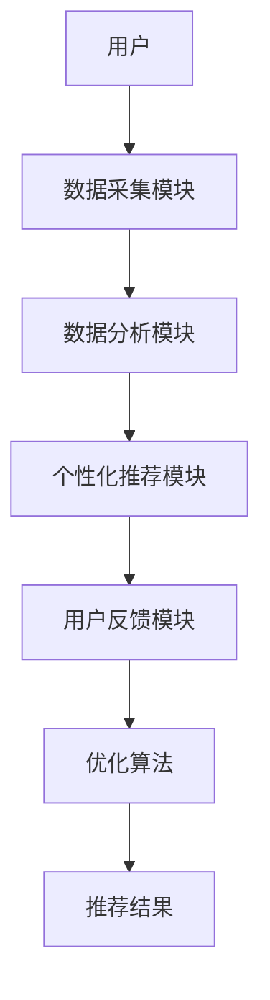

                 


# 智能餐盘：AI Agent的饮食平衡建议

## 关键词：AI Agent，饮食平衡，智能餐盘，推荐算法，健康饮食

## 摘要：本文探讨了AI Agent在饮食建议中的应用，介绍了智能餐盘的设计原理和实现方法，分析了推荐算法及其流程，并通过系统架构图展示了各模块的交互关系。文章内容丰富，技术性与可读性并重，帮助读者理解如何利用AI技术实现饮食均衡。

---

# 智能餐盘：AI Agent的饮食平衡建议

## 引言

现代人生活节奏快，饮食不均衡问题日益严重，导致多种健康问题。AI Agent凭借其强大的数据处理和分析能力，为解决这一问题提供了新的思路。智能餐盘通过AI技术，为用户提供个性化的饮食建议，帮助他们实现饮食均衡。本文将从背景、原理、算法、系统架构和项目实现等方面，详细探讨智能餐盘的设计与实现。

---

## 第一部分：背景介绍

### 第1章：问题背景与需求分析

#### 1.1 问题背景

- **饮食不均衡问题**：现代社会中，人们由于工作繁忙，常常忽视饮食的营养搭配，导致健康问题，如肥胖、营养缺乏等。这一问题尤其在年轻人中普遍存在。
- **AI Agent的应用**：AI Agent通过分析用户的饮食习惯、营养需求和健康状况，提供个性化的饮食建议，帮助用户实现饮食均衡。

#### 1.2 AI Agent在饮食建议中的作用

- **AI Agent的基本概念**：AI Agent是一种能够感知环境、自主决策并执行任务的智能实体。它能够通过学习和推理，为用户提供个性化的服务。
- **饮食建议的应用场景**：AI Agent可以根据用户的饮食记录、健康数据和营养需求，推荐合适的饮食方案，帮助用户实现健康饮食目标。

---

## 第二部分：核心概念与原理

### 第2章：AI Agent与饮食模型

#### 2.1 AI Agent的基本原理

- **强化学习**：AI Agent通过与环境的交互，学习最优策略，以实现目标。例如，在饮食建议中，AI Agent可以通过强化学习，优化用户的饮食选择。
- **监督学习**：AI Agent通过大量标注数据的训练，学习如何推荐合理的饮食方案。

#### 2.2 饮食模型的构建

- **营养均衡模型**：该模型基于营养学原理，分析食物的营养成分，确保用户摄入的营养均衡。
- **个性化饮食推荐模型**：该模型结合用户的饮食偏好、健康状况和营养需求，推荐个性化的饮食方案。
- **饮食偏好分析模型**：通过分析用户的历史饮食数据，识别用户的饮食偏好，从而提供更精准的建议。

---

## 第三部分：算法原理

### 第3章：推荐算法解析

#### 3.1 协同过滤推荐算法

- **基于用户的协同过滤**：通过分析用户的历史饮食数据，找到与用户饮食偏好相似的其他用户，推荐这些用户喜欢的饮食方案。
- **基于物品的协同过滤**：通过分析食物的特征，找到与用户已选择的食物相似的其他食物，推荐给用户。
- **混合推荐模型**：结合基于用户和基于物品的协同过滤，提高推荐的准确性和多样性。

#### 3.2 基于内容的推荐算法

- **食物特征提取**：通过自然语言处理技术，提取食物的营养成分、热量等特征。
- **饮食偏好的内容分析**：分析用户的饮食偏好，提取关键词和主题。
- **内容相似度计算**：通过计算食物之间的相似度，推荐相似的饮食方案。

---

## 第四部分：系统架构与设计

### 第4章：系统架构设计

#### 4.1 系统功能模块

- **数据采集模块**：负责采集用户的饮食数据，包括食物种类、摄入量、时间等。
- **数据分析模块**：对采集到的数据进行清洗、处理和分析，提取有用的特征。
- **个性化推荐模块**：基于分析结果，生成个性化的饮食建议。
- **用户反馈模块**：收集用户的反馈，优化推荐算法。

#### 4.2 系统架构图



---

## 第五部分：项目实战

### 第5章：智能餐盘系统实现

#### 5.1 环境搭建

- **安装Python环境**：建议使用Anaconda或虚拟环境。
- **安装必要库**：`pip install numpy pandas scikit-learn`

#### 5.2 核心代码实现

```python
# 示例代码：基于协同过滤的推荐算法
import numpy as np
from sklearn.metrics.pairwise import cosine_similarity

# 数据预处理
def preprocess_data(data):
    # 假设data是一个DataFrame，包含用户和食物的评分
    return data.pivot('user', 'food', 'rating').fillna(0)

# 计算相似度
def get_similarities(matrix):
    return cosine_similarity(matrix.values)

# 推荐系统
def recommend_system(similarities, user_index, top_n=5):
    scores = similarities[user_index].ravel()
    recommendations = np.argsort(-scores)
    return recommendations[:top_n]
```

---

## 结论

智能餐盘通过AI Agent的强大能力，帮助用户实现饮食均衡。本文详细探讨了智能餐盘的设计原理、推荐算法和系统架构，并通过项目实战展示了其实现过程。未来，随着AI技术的不断发展，智能餐盘将更加智能化和个性化，为用户的健康饮食提供更优质的服务。

---

## 作者：AI天才研究院 & 禅与计算机程序设计艺术

---

这篇文章详细介绍了智能餐盘的设计与实现，涵盖了背景、原理、算法、系统架构和项目实战等内容，旨在为读者提供全面的技术指导。

