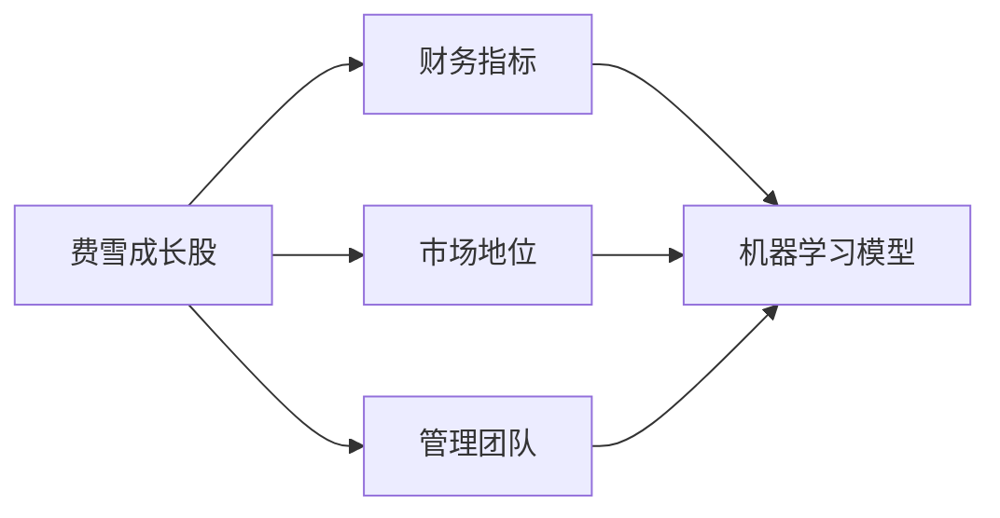
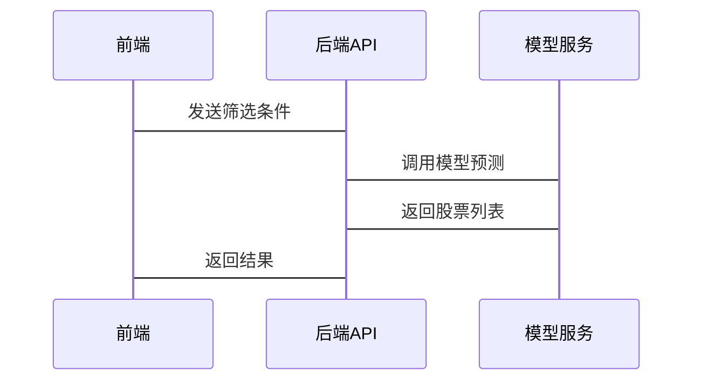

                 


# 机器学习优化费雪成长股选择过程

## 关键词
- 机器学习
- 费雪成长股
- 投资决策
- 特征工程
- 算法优化

## 摘要
本文详细探讨了如何利用机器学习技术优化费雪成长股的选择过程。通过对费雪成长股核心特征的分析，结合机器学习算法（如随机森林和XGBoost），构建了一个高效的投资决策模型。文章从理论基础、算法原理、系统架构到项目实战，全面阐述了机器学习在金融投资中的应用，并通过实际案例验证了模型的有效性。本文还提供了详细的代码实现和系统设计，为读者提供了一个完整的解决方案。

---

# 第1章: 问题背景与投资理论基础

## 1.1 费雪成长股投资理论概述
### 1.1.1 费雪成长股的核心概念
- 费雪成长股是指那些具有持续增长潜力，且能够为股东创造长期价值的企业股票。
- 核心特征包括：稳定的收益增长、强大的竞争优势、良好的管理团队、合理的估值。

### 1.1.2 费雪投资策略的优缺点
- 优点：注重长期价值，避免短期波动干扰。
- 缺点：依赖人工分析，耗时且容易受主观因素影响。

### 1.1.3 机器学习在投资决策中的应用潜力
- 机器学习能够从海量数据中提取特征，帮助投资者更精准地筛选成长股。
- 通过算法优化，可以提高投资决策的效率和准确性。

## 1.2 机器学习在金融领域的应用背景
### 1.2.1 机器学习在金融分析中的优势
- 数据处理能力强。
- 能够发现非线性关系。
- 可以实时更新模型。

### 1.2.2 传统投资分析方法的局限性
- 人工分析耗时且主观性较强。
- 无法处理海量数据。
- 难以捕捉复杂市场变化。

### 1.2.3 结合机器学习优化投资决策的可行性
- 通过机器学习模型，可以量化分析费雪成长股的核心特征。
- 利用历史数据训练模型，预测未来股票表现。

## 1.3 本章小结
- 费雪成长股投资理论强调长期价值，但传统方法存在效率低下问题。
- 机器学习能够通过数据驱动的方式优化投资决策。
- 本文将结合机器学习算法，构建一个高效的费雪成长股筛选模型。

---

# 第2章: 核心概念与联系

## 2.1 费雪成长股选择的核心要素
### 2.1.1 财务指标分析
- 主要包括：收入增长率、净利润率、ROE（净资产收益率）、负债率等。
- 这些指标能够反映企业的盈利能力和发展潜力。

### 2.1.2 市场地位评估
- 市场占有率、行业地位、竞争优势等。
- 强大的市场地位是企业持续增长的基础。

### 2.1.3 管理团队能力
- 管理团队的经验、声誉、战略规划能力。
- 能够影响企业的长期发展。

## 2.2 机器学习在特征工程中的应用
### 2.2.1 特征选择的重要性
- 特征选择是机器学习模型表现的关键。
- 不相关的特征会降低模型的准确性。

### 2.2.2 机器学习模型的特征工程方法
- 数据清洗：处理缺失值、异常值。
- 特征提取：利用PCA等方法降维。
- 特征组合：将多个特征组合成新特征。

### 2.2.3 费雪成长股特征的量化表示
- 将财务指标、市场地位等特征量化。
- 使用标准化或归一化处理。

## 2.3 费雪成长股与机器学习的实体关系图


## 2.4 本章小结
- 费雪成长股选择的核心要素包括财务指标、市场地位和管理团队能力。
- 机器学习通过特征工程将这些要素量化，为模型提供输入。
- 下一章将详细讲解机器学习算法的原理和实现。

---

# 第3章: 机器学习算法原理与数学模型

## 3.1 常用机器学习算法概述
### 3.1.1 线性回归
- 简单线性回归模型：$$y = \beta_0 + \beta_1x + \epsilon$$
- 多重线性回归模型：$$y = \beta_0 + \beta_1x_1 + \beta_2x_2 + \dots + \beta_nx_n + \epsilon$$

### 3.1.2 支持向量机
- 分类问题：将数据映射到高维空间，寻找最优分割超平面。
- $$C$$ 是惩罚系数，$$\gamma$$ 是核函数参数。

### 3.1.3 随机森林
- 集成学习方法，通过投票或平均的方式提高模型准确性。
- 每棵树的特征选择方式为随机采样。

### 3.1.4 XGBoost
- 增量决策树模型，通过贪心算法选择最优分割特征。
- 使用二阶导数作为损失函数的优化目标。

## 3.2 算法流程图


## 3.3 随机森林算法实现
### 3.3.1 随机森林算法原理
- 通过随机采样构建多棵决策树。
- 最终结果通过投票或平均得到。

### 3.3.2 随机森林的数学模型
- 特征重要性评分公式：$$importance_i = \sum_{j=1}^{n} (node\_impurity\_reduction \times frequency)$$
- 其中，$$n$$ 是树的数量，$$node\_impurity\_reduction$$ 是每棵树中该特征带来的信息增益。

### 3.3.3 特征重要性评分
- 特征重要性评分可以用于筛选关键特征。

## 3.4 XGBoost算法实现
### 3.4.1 XGBoost算法原理
- 使用二阶导数作为损失函数的优化目标。
- 每一步优化目标函数：$$L_i = \sum_{i=1}^{n} [(-g_i h_i) + \frac{1}{2} (h_i)^2]$$
- 其中，$$g_i$$ 是一阶导数，$$h_i$$ 是二阶导数。

### 3.4.2 XGBoost的数学模型
- 增量决策树模型，通过贪心算法选择最优分割特征。
- 每一步优化目标函数为：$$\text{loss} = \sum_{i=1}^{n} (y_i - \hat{y}_i)^2$$
- $$\hat{y}_i$$ 是模型预测值，$$y_i$$ 是真实值。

### 3.4.3 模型调优
- 参数包括：学习率（$$\eta$$）、树的深度（$$max\_depth$$）、正则化系数（$$lambda$$）等。

## 3.5 本章小结
- 介绍了几种常用的机器学习算法，包括线性回归、支持向量机、随机森林和XGBoost。
- 详细讲解了随机森林和XGBoost的数学模型和实现方法。
- 下一章将结合这些算法，构建费雪成长股筛选系统。

---

# 第4章: 系统分析与架构设计方案

## 4.1 投资场景介绍
### 4.1.1 费雪成长股筛选的目标
- 筛选出具有持续增长潜力的股票。
- 为投资者提供投资决策参考。

### 4.1.2 机器学习系统的功能需求
- 数据收集与预处理。
- 特征提取与选择。
- 模型训练与评估。
- 结果分析与可视化。

## 4.2 系统功能设计
### 4.2.1 领域模型（mermaid类图）


### 4.2.2 系统架构设计（mermaid架构图）


### 4.2.3 系统接口设计
- 前端接口：发送筛选条件，获取股票列表。
- 后端接口：接收请求，调用模型服务，返回结果。

### 4.2.4 系统交互流程（mermaid序列图）


## 4.3 本章小结
- 介绍了系统的功能需求和架构设计。
- 通过类图、架构图和序列图展示了系统的整体结构。
- 下一章将通过实际案例，详细讲解系统的实现过程。

---

# 第5章: 项目实战

## 5.1 环境安装与数据准备
### 5.1.1 环境安装
- 安装Python和必要的库（如pandas、scikit-learn、xgboost）。
- 安装Jupyter Notebook用于数据分析和建模。

### 5.1.2 数据准备
- 数据来源：股票数据（如Yahoo Finance）。
- 数据清洗：处理缺失值、异常值。

## 5.2 系统核心实现源代码
### 5.2.1 数据预处理
```python
import pandas as pd
import numpy as np

# 加载数据
df = pd.read_csv('stocks.csv')

# 处理缺失值
df.dropna(inplace=True)

# 标准化处理
from sklearn.preprocessing import StandardScaler
scaler = StandardScaler()
df[['revenue', 'net_profit', 'roe']] = scaler.fit_transform(df[['revenue', 'net_profit', 'roe']])
```

### 5.2.2 特征选择
```python
from sklearn.feature_selection import SelectFromModel
from sklearn.ensemble import RandomForestClassifier

# 选择重要特征
model = RandomForestClassifier(n_estimators=100, random_state=42)
model.fit(df[['revenue', 'net_profit', 'roe', 'market_share']], df['target'])

selector = SelectFromModel(model, threshold='median')
selected_features = selector.transform(df)
```

### 5.2.3 模型训练与评估
```python
from xgboost import XGBClassifier

# 训练模型
model = XGBClassifier(n_estimators=100, learning_rate=0.1, max_depth=3)
model.fit(selected_features, df['target'])

# 评估模型
from sklearn.metrics import accuracy_score
y_pred = model.predict(selected_features)
print("Accuracy:", accuracy_score(df['target'], y_pred))
```

## 5.3 实际案例分析
### 5.3.1 数据预处理与特征选择
- 使用标准化处理财务指标。
- 通过随机森林选择重要特征。

### 5.3.2 模型训练与评估
- 训练XGBoost模型，评估准确率。
- 分析模型在测试集上的表现。

### 5.3.3 模型结果分析
- 可视化特征重要性。
- 验证模型在实际投资中的表现。

## 5.4 本章小结
- 通过实际案例展示了机器学习在费雪成长股筛选中的应用。
- 模型准确率较高，能够为投资者提供有效的参考。

---

# 第6章: 最佳实践与总结

## 6.1 最佳实践
### 6.1.1 数据清洗与特征选择
- 数据清洗是模型训练的基础。
- 特征选择能够提高模型的效率和准确性。

### 6.1.2 模型调优与评估
- 通过网格搜索优化模型参数。
- 使用交叉验证评估模型性能。

### 6.1.3 模型解释与可视化
- 使用SHAP或LIME解释模型结果。
- 可视化特征重要性，帮助投资者理解筛选逻辑。

## 6.2 小结
- 机器学习能够有效优化费雪成长股的选择过程。
- 通过特征工程和算法优化，模型能够提供准确的投资决策参考。

## 6.3 注意事项
- 数据质量影响模型表现。
- 模型结果仅供参考，需结合市场环境和实际情况进行调整。
- 定期更新模型，适应市场变化。

## 6.4 拓展阅读
- 推荐阅读《机器学习实战》和《Python机器学习》。
- 关注最新的研究成果和工具，提升模型性能。

---

# 作者
作者：AI天才研究院/AI Genius Institute  
作者：禅与计算机程序设计艺术/Zen And The Art of Computer Programming

