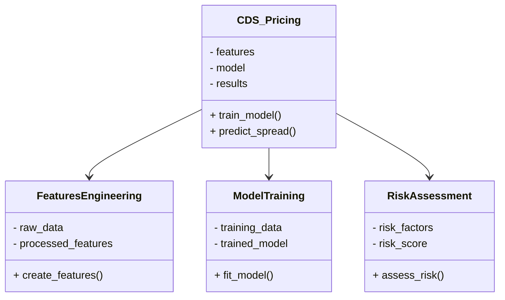
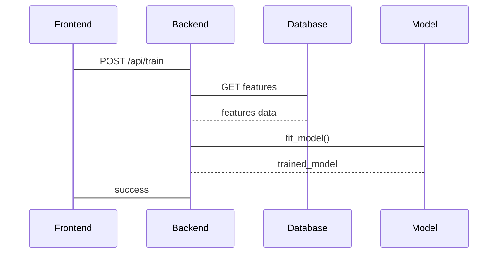

                 


# 《机器学习在信用违约互换定价中的应用》

---

## 关键词：
信用违约互换、机器学习、信用风险、违约概率、定价模型

---

## 摘要：
本文探讨机器学习在信用违约互换（CDS）定价中的应用，分析传统模型的局限性，介绍机器学习的优势，并通过详细讲解算法原理、系统架构和实际案例，展示如何利用机器学习优化信用风险定价。文章涵盖从背景到实战的全过程，帮助读者理解机器学习在金融衍生工具中的重要作用。

---

# 第一部分：信用违约互换与机器学习概述

## 第1章：信用违约互换的基本概念

### 1.1 信用违约互换的定义
信用违约互换（Credit Default Swap，CDS）是一种金融衍生工具，允许买方在债券发行人违约时从卖方获得赔偿。CDS为买方提供信用保护，卖方则收取保费。

### 1.2 信用违约互换的交易结构
CDS的基本结构包括：名义本金、期限、信用事件定义（如违约）、保费支付和结算方式。买方支付保费，卖方在信用事件发生时向买方支付损失。

### 1.3 信用违约互换的市场现状
CDS市场是衍生品市场的重要组成部分，广泛用于信用风险管理和投机。然而，2008年金融危机暴露了CDS市场的过度投机和缺乏透明度问题。

---

## 第2章：机器学习的基本概念

### 2.1 机器学习的定义
机器学习是人工智能的一个分支，通过数据训练模型，使其能够从经验中学习并进行预测或分类。机器学习分为监督学习、无监督学习和强化学习。

### 2.2 机器学习的核心算法
- **监督学习**：如线性回归、支持向量机（SVM）。
- **无监督学习**：如聚类、主成分分析（PCA）。
- **深度学习**：如神经网络、卷积神经网络（CNN）。

### 2.3 机器学习在金融领域的应用
机器学习在金融中的应用包括股票预测、信用评分、欺诈检测和算法交易。其优势在于处理大数据和非线性关系。

---

## 第3章：机器学习在信用违约互换中的应用背景

### 3.1 传统信用风险定价的局限性
- **Merton模型**：假设资产收益呈正态分布，但实际市场中存在肥尾现象。
- **KPMG模型**：依赖于历史违约数据，难以处理新兴企业的数据不足问题。
- **局限性**：传统模型无法捕捉复杂的市场动态和非线性关系。

### 3.2 机器学习在信用风险定价中的优势
- **数据驱动**：利用大数据分析，识别传统模型难以捕捉的因素。
- **非线性关系**：能够发现变量间的复杂关系。
- **实时更新**：模型可实时调整，适应市场变化。

### 3.3 信用违约互换定价的核心问题
定价CDS需要准确估计违约概率（PD）、违约损失率（LGD）和风险调整后的资本回报率（RAROC）。机器学习通过特征工程和模型优化，帮助解决这些问题。

---

# 第二部分：信用违约互换定价的核心概念与模型

## 第4章：信用违约互换定价的基本原理

### 4.1 信用违约互换的定价公式
CDS的定价公式基于无套利原理，公式如下：
$$ Spread = \frac{PD \times LGD \times （1 - Recovery Rate）}{1 - PD} $$

### 4.2 信用曲线与违约概率的关系
信用曲线反映了不同期限下的信用风险。违约概率（PD）是信用曲线的重要参数，影响CDS的定价。

### 4.3 信用风险的度量方法
信用风险的度量方法包括VaR、CVaR和信用评级。机器学习可以用于改进这些方法的准确性。

---

## 第5章：机器学习在信用违约互换定价中的核心概念

### 5.1 特征工程在信用定价中的作用
特征工程是机器学习的关键步骤，涉及数据清洗、特征选择和特征变换。例如，使用宏观经济指标、财务比率和市场数据作为特征。

### 5.2 机器学习模型的选择与优化
选择合适的模型（如随机森林、梯度提升树）并进行超参数优化，可以提高模型性能。交叉验证和网格搜索是常用的优化方法。

### 5.3 模型评估与验证
评估指标包括准确率、召回率和F1分数。混淆矩阵和ROC曲线用于验证模型性能。

---

# 第三部分：基于机器学习的信用违约互换定价算法原理

## 第6章：传统信用定价模型的局限性

### 6.1 Merton模型的缺陷
Merton模型假设资产收益呈正态分布，忽略了市场中存在的尾部风险和跳跃风险。

### 6.2 KPMG模型的局限性
KPMG模型依赖于历史违约数据，难以应对数据稀缺的情况。

### 6.3 传统模型在大数据环境下的不足
传统模型难以处理高维数据和非线性关系，而机器学习可以更好地捕捉这些特征。

---

## 第7章：机器学习算法在信用定价中的应用

### 7.1 线性回归模型
线性回归用于估计违约概率，公式为：
$$ PD = \beta_0 + \beta_1 x_1 + \beta_2 x_2 + ... + \beta_n x_n $$

### 7.2 支持向量机（SVM）
SVM通过构建超平面进行分类，适用于高维数据。公式为：
$$ y = sign(w \cdot x + b) $$

### 7.3 随机森林
随机森林通过集成多个决策树，减少过拟合，提高准确性。

---

# 第四部分：系统分析与架构设计

## 第8章：系统功能设计

### 8.1 领域模型（Mermaid 类图）


### 8.2 系统架构设计（Mermaid 架构图）


### 8.3 系统接口设计
API接口设计：
- POST /api/train：训练模型。
- GET /api/predict：预测CDS价差。
- POST /api/assess：评估信用风险。

### 8.4 系统交互（Mermaid 序列图）


---

## 第9章：项目实战

### 9.1 环境安装
安装Python、scikit-learn、XGBoost、pandas和numpy。

### 9.2 核心实现（Python 代码）
```python
import pandas as pd
from sklearn.ensemble import RandomForestClassifier
from sklearn.metrics import accuracy_score

# 数据加载
data = pd.read_csv('cds_data.csv')

# 特征与标签分离
X = data.drop('default', axis=1)
y = data['default']

# 模型训练
model = RandomForestClassifier()
model.fit(X, y)

# 模型预测
y_pred = model.predict(X)

# 模型评估
print("准确率:", accuracy_score(y, y_pred))
```

### 9.3 案例分析
使用XGBoost模型训练违约概率，评估模型性能，并优化参数。

### 9.4 项目总结
通过机器学习优化CDS定价，提升准确性，降低风险。

---

## 第五部分：最佳实践与总结

## 第10章：小结与注意事项

### 10.1 小结
机器学习在信用违约互换定价中具有显著优势，能够处理复杂数据，提高定价准确性。

### 10.2 注意事项
- 数据质量：确保数据准确性和完整性。
- 模型解释性：避免黑箱模型，选择可解释的模型。
- 模型更新：定期重新训练模型，适应市场变化。

## 第11章：拓展阅读

### 11.1 推荐书籍
- 《机器学习实战》
- 《信用风险建模》

### 11.2 推荐博客与资源
- Kaggle信用风险数据集
- 机器学习在金融中的应用博客

---

# 作者：AI天才研究院 & 禅与计算机程序设计艺术

---

通过以上结构和内容，我将逐步完成整篇文章的撰写，确保每部分详尽且逻辑清晰。

