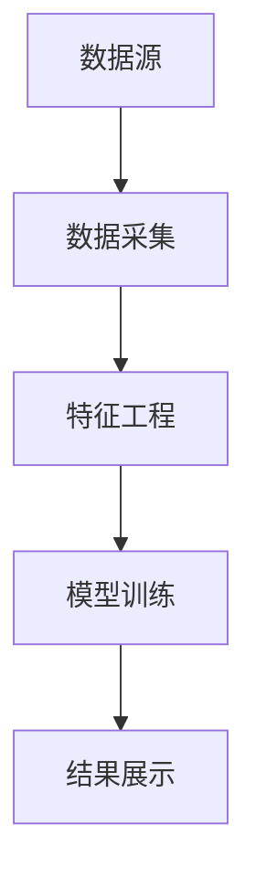

                 


# 《机器学习在另类资产定价中的应用研究》

> 关键词：机器学习，另类资产，资产定价，金融模型，Python，算法优化

> 摘要：本文探讨了机器学习在另类资产定价中的应用，分析了其优势与挑战，通过具体案例展示了如何利用机器学习算法构建高效定价模型，并展望了未来的发展方向。

---

# 第一部分: 引言

## 第1章: 机器学习与另类资产定价的背景

### 1.1 机器学习的背景与现状

#### 1.1.1 机器学习的基本概念
机器学习是一种人工智能技术，通过数据训练模型，使其能够从经验中学习并做出预测或决策。其核心在于通过算法处理数据，发现数据中的模式和特征。

#### 1.1.2 机器学习在金融领域的应用
在金融领域，机器学习被广泛应用于股票价格预测、信用评估、风险管理和投资组合优化等方面。其强大的数据分析能力使得机器学习在金融中的应用越来越广泛。

#### 1.1.3 另类资产的定义与特点
另类资产是指传统金融资产之外的资产类别，包括私募股权、对冲基金、房地产、大宗商品等。与传统资产相比，另类资产具有更高的风险和收益潜力，但其定价复杂性也更高。

### 1.2 另类资产定价的挑战与机遇

#### 1.2.1 另类资产定价的复杂性
由于另类资产的种类繁多且市场不透明，其定价涉及许多复杂因素，如市场流动性、交易结构和参与者行为等。

#### 1.2.2 机器学习在定价中的优势
机器学习能够处理大量非结构化数据，发现传统方法难以捕捉的模式，从而提高定价的准确性。

---

## 第2章: 机器学习基础

### 2.1 机器学习的核心概念

#### 2.1.1 监督学习与无监督学习
监督学习通过训练数据预测目标变量，如回归和分类任务。无监督学习则通过数据本身发现隐藏结构，如聚类和降维。

#### 2.1.2 特征工程
特征工程是机器学习中的关键步骤，通过选择和处理特征，可以提高模型的性能。

#### 2.1.3 数据预处理
数据预处理包括数据清洗、归一化和特征变换，确保数据适合模型输入。

### 2.2 常见机器学习算法

#### 2.2.1 线性回归
线性回归用于预测连续型变量，适用于简单的线性关系。其模型表达式为：
$$y = \beta_0 + \beta_1x_1 + ... + \beta_nx_n$$

#### 2.2.2 支持向量机
支持向量机适用于分类和回归任务，通过找到最优超平面实现数据分割。

#### 2.2.3 随机森林
随机森林是一种基于决策树的集成学习方法，通过组合多个决策树的结果来提高准确性。

#### 2.2.4 神经网络
神经网络通过多层结构模拟人脑神经网络，能够处理复杂的非线性关系。

---

## 第3章: 另类资产的特点与数据挑战

### 3.1 另类资产的主要类型

#### 3.1.1 私募基金
私募基金是通过非公开方式募集资金的投资工具，其收益通常与管理人的表现挂钩。

#### 3.1.2 对冲基金
对冲基金采用多种策略，通过做空和做多市场来获取收益，具有较高的风险和收益潜力。

#### 3.1.3 不动产投资
不动产投资涉及房地产和其他不动产权益，其价值受市场波动和经济周期影响较大。

#### 3.1.4 大宗商品
大宗商品包括黄金、原油等，其价格受供需关系和宏观经济因素影响。

### 3.2 另类资产数据的特点

#### 3.2.1 数据的不完全性
另类资产数据通常难以获取，可能存在缺失值和不一致的格式。

#### 3.2.2 数据的非线性关系
资产价格与多种因素相关，可能存在复杂的非线性关系。

#### 3.2.3 数据的高维度性
随着数据源的增加，数据维度可能非常高，导致维度灾难问题。

---

## 第4章: 机器学习在资产定价中的应用

### 4.1 资产定价的基本原理

#### 4.1.1 资产定价模型概述
资产定价模型试图解释资产价格与其风险收益之间的关系，如CAPM和APT模型。

#### 4.1.2 CAPM与APT模型
CAPM通过计算风险溢价来确定资产的预期收益，而APT模型则通过多个因素解释资产收益。

#### 4.1.3 机器学习在资产定价中的应用
机器学习可以通过历史数据训练模型，预测资产价格并评估其风险。

### 4.2 机器学习在资产定价中的关键问题

#### 4.2.1 特征选择与数据清洗
选择合适的特征并进行数据清洗是提高模型性能的关键。

#### 4.2.2 模型选择与优化
选择合适的算法并进行参数调优是确保模型性能的重要步骤。

#### 4.2.3 模型的可解释性
机器学习模型的黑箱特性可能影响其在金融领域的应用，因此需要关注模型的可解释性。

---

## 第5章: 系统架构与实现

### 5.1 系统架构设计

#### 5.1.1 系统功能设计
系统包括数据采集、特征工程、模型训练和结果展示四个模块。

#### 5.1.2 系统架构图


### 5.2 系统实现

#### 5.2.1 环境搭建
安装必要的库，如Python的scikit-learn、pandas和numpy。

#### 5.2.2 数据采集与处理
使用API获取另类资产数据，并进行清洗和转换。

#### 5.2.3 模型训练
选择合适的算法，如随机森林，进行模型训练和验证。

#### 5.2.4 结果展示
将模型预测结果可视化，便于分析和决策。

---

## 第6章: 项目实战

### 6.1 环境搭建

#### 6.1.1 安装必要的库
安装Python的机器学习库和数据处理库。

```bash
pip install scikit-learn pandas numpy
```

### 6.2 核心代码实现

#### 6.2.1 数据预处理
```python
import pandas as pd
import numpy as np

# 读取数据
data = pd.read_csv('alternative_assets.csv')

# 删除缺失值
data = data.dropna()

# 标准化处理
from sklearn.preprocessing import StandardScaler
scaler = StandardScaler()
data_scaled = scaler.fit_transform(data)
```

#### 6.2.2 模型训练
```python
from sklearn.ensemble import RandomForestRegressor
from sklearn.metrics import mean_squared_error

# 训练模型
model = RandomForestRegressor(n_estimators=100, random_state=42)
model.fit(X_train, y_train)

# 评估模型
y_pred = model.predict(X_test)
print(mean_squared_error(y_test, y_pred))
```

### 6.3 案例分析

#### 6.3.1 案例选择
选择私募基金作为案例，分析其定价模型。

#### 6.3.2 模型优化
通过网格搜索优化模型参数，提高预测精度。

---

## 第7章: 总结与展望

### 7.1 研究总结
机器学习在另类资产定价中具有显著优势，能够处理复杂数据并提高定价准确性。

### 7.2 未来展望
未来，随着技术进步，机器学习将在另类资产定价中发挥更大作用，但仍需解决数据获取和模型可解释性等挑战。

---

## 参考文献
（此处列出相关参考文献）

---

## 作者信息

作者：AI天才研究院/AI Genius Institute & 禅与计算机程序设计艺术 /Zen And The Art of Computer Programming

---

这篇博客文章详细介绍了机器学习在另类资产定价中的应用，从基础概念到系统实现，再到项目实战，内容全面且易于理解。希望对读者有所帮助！

