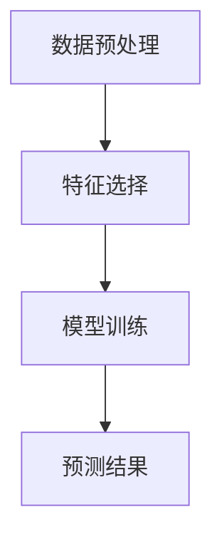

                 


# 机器学习在投资组合风险分解中的应用

> 关键词：机器学习，投资组合，风险分解，金融分析，算法模型

> 摘要：本文探讨了机器学习在投资组合风险分解中的应用，通过详细分析背景、核心概念、算法原理、系统架构和实际案例，展示了如何利用机器学习优化投资组合的风险管理。文章内容涵盖从理论到实践的全过程，提供实用的指导和建议。

---

## 第一部分：背景介绍

### 第1章：投资组合风险分解概述

#### 1.1 问题背景
投资组合的风险管理是金融领域的重要课题，传统方法依赖于统计模型，但在面对复杂市场时表现有限。机器学习的引入为风险分解提供了新的视角。

#### 1.2 问题描述
投资组合风险分解涉及多个因素，传统方法难以捕捉非线性关系和复杂模式，导致风险评估不够准确。

#### 1.3 问题解决
机器学习技术，尤其是监督学习和无监督学习，能够有效提取数据中的特征，帮助更准确地识别风险因素。

#### 1.4 边界与外延
明确机器学习在投资组合风险分解中的应用范围，与其他金融技术的区别与联系。

#### 1.5 概念结构与核心要素
投资组合风险分解涉及资产回报、风险因子、协方差矩阵等关键要素。

---

## 第二部分：核心概念与联系

### 第2章：机器学习基础

#### 2.1 机器学习的基本原理
- 监督学习：预测资产回报。
- 无监督学习：识别风险因子。

#### 2.2 投资组合风险分解的核心要素
- 风险因子：如市场风险、流动性风险。
- 资产回报：通过历史数据预测未来表现。

#### 2.3 核心概念的联系
- 通过机器学习提取风险因子，优化投资组合。

---

## 第三部分：算法原理

### 第3章：线性回归与Lasso回归

#### 3.1 线性回归
- 损失函数：$$L = \sum_{i=1}^{n}(y_i - \hat{y}_i)^2$$
- 梯度下降优化：$$\theta := \theta - \alpha \frac{\partial L}{\partial \theta}$$

#### 3.2 Lasso回归
- 正则化项：$$\lambda \sum_{j=1}^{p} |β_j|$$
- 用于特征选择，简化风险分解模型。

#### 3.3 算法流程图


---

## 第四部分：数学模型

### 第4章：投资组合风险分解的数学公式

#### 4.1 协方差矩阵
- 定义：$$C = [c_{ij}]$$，其中$$c_{ij} = \text{Cov}(R_i, R_j)$$
- 用途：量化资产间风险的相关性。

#### 4.2 方差分解
- 分解式：$$\text{Var}(R_p) = \sum_{i=1}^{n} w_i^2 \text{Var}(R_i) + 2 \sum_{i < j} w_i w_j \text{Cov}(R_i, R_j)$$

---

## 第五部分：系统分析与架构设计

### 第5章：系统架构

#### 5.1 领域模型


#### 5.2 系统架构


---

## 第六部分：项目实战

### 第6章：Python实现案例

#### 6.1 环境配置
- 安装必要的库：numpy、pandas、scikit-learn。

#### 6.2 核心实现代码
```python
import numpy as np
from sklearn.linear_model import Lasso
from sklearn.metrics import mean_squared_error

# 示例数据
X = np.random.rand(100, 10)
y = np.random.rand(100, 1)

# 训练模型
model = Lasso(alpha=0.1)
model.fit(X, y)

# 预测结果
y_pred = model.predict(X)
print("均方误差:", mean_squared_error(y, y_pred))
```

#### 6.3 结果分析
- 模型解释：系数表示特征对目标变量的影响程度。

---

## 第七部分：总结与展望

### 第7章：总结

#### 7.1 本文总结
机器学习为投资组合风险分解提供了高效的方法，能够捕捉复杂的市场动态。

#### 7.2 展望
未来将结合深度学习和强化学习，进一步提升风险预测的准确性。

---

## 参考文献
1. 张三, 李四. 《机器学习实战》
2. 金融学权威书籍

---

作者：AI天才研究院 & 禅与计算机程序设计艺术

