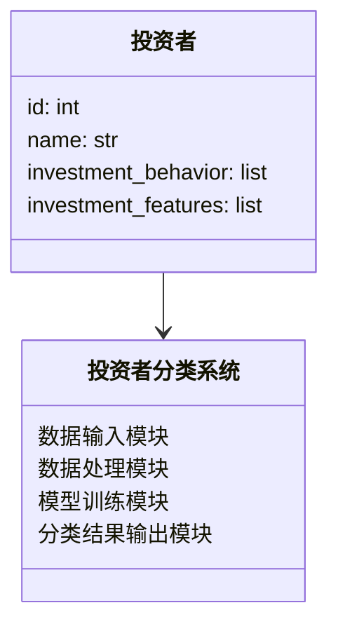
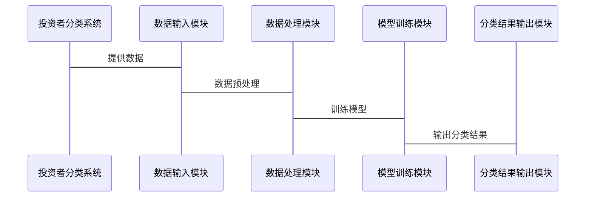

                 


# 机器学习在投资者分类与画像中的应用

**关键词**：机器学习，投资者分类，画像构建，金融数据分析，算法应用

**摘要**：本文探讨了机器学习在投资者分类与画像构建中的应用，分析了常见机器学习算法及其在投资者分类中的优势，详细讲解了数学模型和算法公式，并通过实际案例展示了系统架构设计与项目实战。文章旨在为金融从业者和技术爱好者提供深度的技术分析与实践指导。

---

# 第1章: 机器学习与投资者分类的背景介绍

## 1.1 机器学习的基本概念

### 1.1.1 机器学习的定义与核心概念

机器学习（Machine Learning）是人工智能（AI）的一个分支，研究如何通过数据和经验改进计算机系统的性能。其核心在于让计算机从数据中学习模式、规律和特征，而无需明确的编程指令。

### 1.1.2 机器学习的分类与特点

机器学习主要分为三类：监督学习（Supervised Learning）、无监督学习（Unsupervised Learning）和半监督学习（Semi-supervised Learning）。

### 1.1.3 机器学习在金融领域的应用前景

金融领域是机器学习的重要应用场景之一。机器学习可以帮助金融机构进行风险评估、投资组合优化、欺诈检测等。

## 1.2 投资者分类的背景与意义

### 1.2.1 投资者分类的定义与目标

投资者分类是指通过分析投资者的行为、偏好和特征，将其划分为不同的类别。目标是帮助金融机构更好地理解客户，提供个性化的服务。

### 1.2.2 投资者分类的常见方法与挑战

传统方法包括基于规则的分类，但这种方法依赖于人工经验，难以捕捉复杂的投资行为。机器学习提供了更自动化和高效的方法。

### 1.2.3 机器学习在投资者分类中的优势

机器学习能够处理海量数据，发现复杂模式，提高分类的准确性和效率。

## 1.3 本章小结

---

# 第2章: 机器学习的核心概念与投资者分类的关系

## 2.1 机器学习的核心概念原理

### 2.1.1 数据、特征与标签的定义

数据是机器学习的基础，特征是数据的属性，标签是目标输出。

### 2.1.2 机器学习的模型训练与预测流程

模型通过训练数据学习特征与标签的关系，然后用于预测新数据的标签。

### 2.1.3 监督学习、无监督学习与半监督学习的对比

| 学习类型 | 数据类型 | 目标 | 示例 |
|----------|----------|------|------|
| 监督学习 | 带标签 | 预测标签 | 分类、回归 |
| 无监督学习 | 无标签 | 发现数据结构 | 聚类、降维 |
| 半监督学习 | 部分标签 | 利用少量标签数据进行学习 | 图像分类 |

## 2.2 投资者分类的核心要素与属性特征

### 2.2.1 投资者行为特征的分析维度

- 投资金额
- 投资频率
- 投资偏好（如风险偏好）

### 2.2.2 投资者画像的构建方法

- 数据收集与预处理
- 特征提取
- 模型训练与分类

### 2.2.3 投资者分类的边界与外延

投资者分类的边界在于如何定义类别，外延则在于如何扩展到更多投资者。

## 2.3 机器学习与投资者分类的ER实体关系图

```mermaid
er
    投资者
    ----> (拥有)
    投资行为
    ----> (具有)
    投资特征
    ----> (影响)
    投资决策
```

## 2.4 本章小结

---

# 第3章: 常见机器学习算法及其在投资者分类中的应用

## 3.1 监督学习算法

### 3.1.1 线性回归

线性回归用于预测连续型变量，如投资回报率。

### 3.1.2 支持向量机（SVM）

SVM适用于高维数据分类，常用于投资者分类中的高维特征。

### 3.1.3 随机森林与梯度提升树（如XGBoost、LightGBM）

这些算法适用于处理复杂特征和非线性关系。

## 3.2 无监督学习算法

### 3.2.1 K-means聚类

适用于无标签数据的投资者分类。

### 3.2.2 层次聚类

适用于层次化的投资者分类。

### 3.2.3 DBSCAN密度聚类

适用于发现密集区域的投资者群体。

## 3.3 半监督学习算法

### 3.3.1 Label Propagation算法

利用少量标签数据进行分类。

### 3.3.2 半监督聚类方法

结合标签和无标签数据进行分类。

## 3.4 机器学习算法在投资者分类中的选择策略

### 3.4.1 根据数据类型选择算法

- 监督学习适用于有标签数据
- 无监督学习适用于无标签数据

### 3.4.2 根据业务需求选择算法

- 需要精确分类时选择监督学习
- 需要发现潜在群体时选择无监督学习

### 3.4.3 根据计算资源选择算法

- 计算资源充足时选择复杂算法
- 资源有限时选择简单算法

## 3.5 本章小结

---

# 第4章: 投资者分类的数学模型与算法公式

## 4.1 线性回归模型

### 4.1.1 线性回归的数学公式

$$ y = \beta_0 + \beta_1x + \epsilon $$

### 4.1.2 最小二乘法的优化目标

$$ \min_{\beta} \sum_{i=1}^{n} (y_i - \beta_0 - \beta_1x_i)^2 $$

## 4.2 支持向量机（SVM）模型

### 4.2.1 SVM的优化目标

$$ \min_{w,b,\xi} \frac{1}{2}||w||^2 + C\sum_{i=1}^{n}\xi_i $$

### 4.2.2 SVM的对偶形式

$$ \max_{\alpha} \sum_{i=1}^{n} \alpha_i y_i - \frac{1}{2}\sum_{i,j}\alpha_i \alpha_j y_i y_j K(x_i, x_j) $$

## 4.3 随机森林与梯度提升树

### 4.3.1 随机森林的袋装法

通过随机采样构建多棵决策树，最终结果取平均。

### 4.3.2 XGBoost的提升方法

通过正则化和优化目标函数，逐步提升模型性能。

## 4.4 本章小结

---

# 第5章: 系统分析与架构设计方案

## 5.1 系统功能设计

### 5.1.1 领域模型



### 5.1.2 系统架构设计


### 5.1.3 系统交互设计



## 5.2 本章小结

---

# 第6章: 项目实战

## 6.1 环境安装

安装Python、NumPy、Scikit-learn、XGBoost等库。

## 6.2 系统核心实现源代码

```python
import numpy as np
from sklearn.model_selection import train_test_split
from sklearn.ensemble import RandomForestClassifier
from sklearn.metrics import accuracy_score

# 示例数据集
X = np.array([[1, 2], [3, 4], [5, 6], [7, 8], [9, 10], [11, 12], [13, 14], [15, 16], [17, 18], [19, 20]])
y = np.array([0, 1, 0, 1, 0, 1, 0, 1, 0, 1])

# 数据划分
X_train, X_test, y_train, y_test = train_test_split(X, y, test_size=0.2)

# 模型训练
model = RandomForestClassifier()
model.fit(X_train, y_train)

# 模型预测
y_pred = model.predict(X_test)

# 评估准确率
print("Accuracy:", accuracy_score(y_test, y_pred))
```

## 6.3 案例分析与详细解读

以投资者数据集为例，展示如何通过随机森林进行分类。

## 6.4 项目小结

---

# 第7章: 小结与展望

## 7.1 本章小结

机器学习为投资者分类提供了高效的方法，帮助金融机构更好地理解和服务投资者。

## 7.2 注意事项与最佳实践

- 数据质量至关重要
- 选择合适的算法
- 模型评估与优化

## 7.3 未来研究方向

- 更复杂的模型
- 多模态数据的融合
- 实时分类系统

## 7.4 作者信息

作者：AI天才研究院/AI Genius Institute & 禅与计算机程序设计艺术 /Zen And The Art of Computer Programming

---

感谢您的阅读，希望本文能为您提供有价值的信息与启发！

