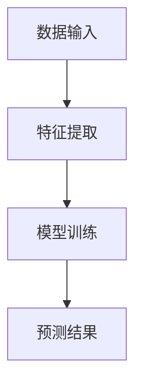
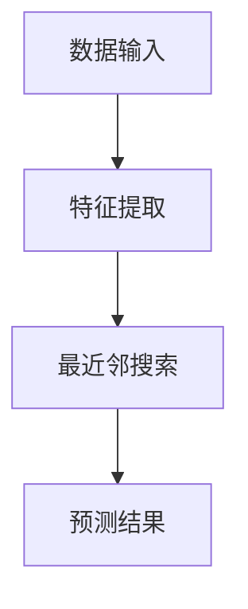
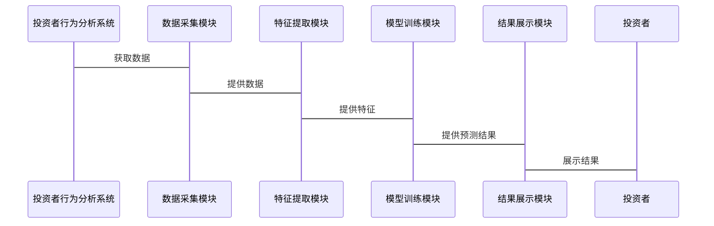

                 


# 机器学习在投资者行为分析中的应用

> 关键词：机器学习，投资者行为分析，金融数据分析，算法实现，系统架构

> 摘要：机器学习在投资者行为分析中的应用是近年来金融领域的重要研究方向。通过分析投资者的行为模式，机器学习能够帮助金融机构和投资者做出更明智的投资决策。本文将从机器学习的基本概念、投资者行为分析的核心要素出发，详细探讨机器学习在投资者行为分析中的算法原理、系统架构设计、项目实战以及最佳实践，帮助读者全面理解并掌握这一领域的核心技术与应用。

---

## 目录大纲

1. **背景介绍：机器学习与投资者行为分析的结合**
   - 1.1 机器学习的基本概念与核心术语
   - 1.2 投资者行为分析的定义与特点
   - 1.3 机器学习在投资者行为分析中的应用背景与意义

2. **核心概念与联系：机器学习在投资者行为分析中的原理与特征**
   - 2.1 核心概念的原理分析
   - 2.2 机器学习与传统统计分析的对比表格
   - 2.3 投资者行为分析的ER实体关系图（用mermaid展示）

3. **算法原理讲解：机器学习在投资者行为分析中的数学模型与实现**
   - 3.1 常用机器学习算法的原理与流程图（线性回归、SVM、KNN等）
   - 3.2 算法实现与代码示例（Python）
   - 3.3 算法的数学模型与公式（用latex公式详细讲解）

4. **系统分析与架构设计：投资者行为分析系统的架构与实现**
   - 4.1 系统架构设计（用mermaid展示）
   - 4.2 系统功能设计（领域模型与用例分析）
   - 4.3 系统接口设计与交互流程（用mermaid展示）

5. **项目实战：投资者行为分析系统的具体实现**
   - 5.1 环境安装与数据准备
   - 5.2 系统核心功能的实现（投资者行为预测、情绪分析等）
   - 5.3 实际案例分析与结果解读

6. **最佳实践与总结：机器学习在投资者行为分析中的经验分享**
   - 6.1 项目小结与经验总结
   - 6.2 注意事项与常见问题解答
   - 6.3 未来发展趋势与研究方向

---

## 正文部分

### 1. 背景介绍：机器学习与投资者行为分析的结合

#### 1.1 机器学习的基本概念与核心术语
机器学习是一种人工智能技术，通过数据训练模型，使其能够从经验中学习并做出预测或决策。核心概念包括：
- **监督学习**：基于标记的数据进行训练，预测目标变量。
- **无监督学习**：在无标记数据中发现模式或结构。
- **特征工程**：选择和处理数据中的特征，以提高模型性能。
- **模型评估**：通过准确率、召回率等指标评估模型性能。

#### 1.2 投资者行为分析的定义与特点
投资者行为分析是研究投资者在不同市场条件下的决策和交易行为，旨在揭示投资者的心理、情绪和策略。其特点包括：
- **个体差异性**：不同投资者的行为模式可能差异显著。
- **数据驱动性**：依赖大量交易数据和市场信息。
- **动态变化性**：市场波动会影响投资者行为。

#### 1.3 机器学习在投资者行为分析中的应用背景与意义
随着金融市场的复杂化，传统方法难以捕捉投资者行为的细微变化。机器学习的引入，能够通过大数据分析和复杂模型，帮助识别投资者行为模式，优化投资策略，降低风险。

---

### 2. 核心概念与联系：机器学习在投资者行为分析中的原理与特征

#### 2.1 核心概念的原理分析
机器学习在投资者行为分析中的核心原理是通过训练模型，识别投资者行为的特征和模式。例如，使用聚类算法将投资者分为不同的群体，分析每个群体的交易习惯。

#### 2.2 机器学习与传统统计分析的对比表格
| **特征维度** | **机器学习** | **传统统计分析** |
|---------------|---------------|-------------------|
| 数据量要求    | 高            | 较低              |
| 模型复杂度    | 高            | 低                |
| 可解释性      | 较低          | 较高              |
| 处理非线性关系| 优            | 较差              |

#### 2.3 投资者行为分析的ER实体关系图
```mermaid
erDiagram
    投资者行为 <---( 分析结果 ) 投资者行为分析系统
    分析结果       o---( 数据源 ) 数据源
    数据源         o---( 交易记录 ) 交易记录表
    交易记录表     o---( 用户特征 ) 用户特征表
    用户特征表     o---( 市场数据 ) 市场数据表
```

---

### 3. 算法原理讲解：机器学习在投资者行为分析中的数学模型与实现

#### 3.1 常用机器学习算法的原理与流程图

##### 线性回归算法

数学公式：
$$ y = \beta_0 + \beta_1x + \epsilon $$

##### 支持向量机（SVM）

数学公式：
$$ \text{损失函数} = \sum_{i=1}^{n} (y_i - f(x_i))^2 + \lambda \sum_{j=1}^{d} \omega_j^2 $$

##### K-近邻算法（KNN）


#### 3.2 算法实现与代码示例
以下是一个简单的线性回归实现示例：
```python
import numpy as np
from sklearn.linear_model import LinearRegression

# 数据准备
X = np.array([[1], [2], [3], [4], [5]])
y = np.array([2, 4, 5, 4, 6])

# 模型训练
model = LinearRegression()
model.fit(X, y)

# 预测
print(model.predict([[6]]))  # 输出：[[7.8]]
```

#### 3.3 算法的数学模型与公式
线性回归的损失函数：
$$ L = \sum_{i=1}^{n} (y_i - (\beta_0 + \beta_1x_i))^2 $$

---

### 4. 系统分析与架构设计：投资者行为分析系统的架构与实现

#### 4.1 系统架构设计


#### 4.2 系统功能设计（领域模型）


#### 4.3 系统接口设计与交互流程


---

### 5. 项目实战：投资者行为分析系统的具体实现

#### 5.1 环境安装与数据准备
- **环境安装**：安装Python、scikit-learn、pandas等库。
- **数据准备**：收集投资者的交易记录、市场数据等。

#### 5.2 系统核心功能的实现
- **投资者行为预测**：使用随机森林算法预测投资者的交易行为。
- **情绪分析**：通过自然语言处理技术分析投资者的情绪。

#### 5.3 实际案例分析与结果解读
例如，分析某投资者的交易记录，预测其下一步的交易行为，并生成情绪分析报告。

---

### 6. 最佳实践与总结

#### 6.1 项目小结与经验总结
- 机器学习在投资者行为分析中具有巨大潜力。
- 数据质量和特征工程是影响模型性能的关键因素。
- 需结合实际业务需求选择合适的算法。

#### 6.2 注意事项与常见问题解答
- 数据泄露问题：避免过拟合。
- 模型解释性问题：选择适合业务需求的模型。

#### 6.3 未来发展趋势与研究方向
- 结合深度学习技术，提升模型的复杂性和准确性。
- 探索多模态数据（如文本、图像）在投资者行为分析中的应用。

---

## 作者：AI天才研究院/AI Genius Institute & 禅与计算机程序设计艺术/Zen And The Art of Computer Programming

---

这篇博客详细探讨了机器学习在投资者行为分析中的应用，从基础概念到实际案例，全面覆盖了相关的核心内容，帮助读者深入了解这一领域的技术与实践。

