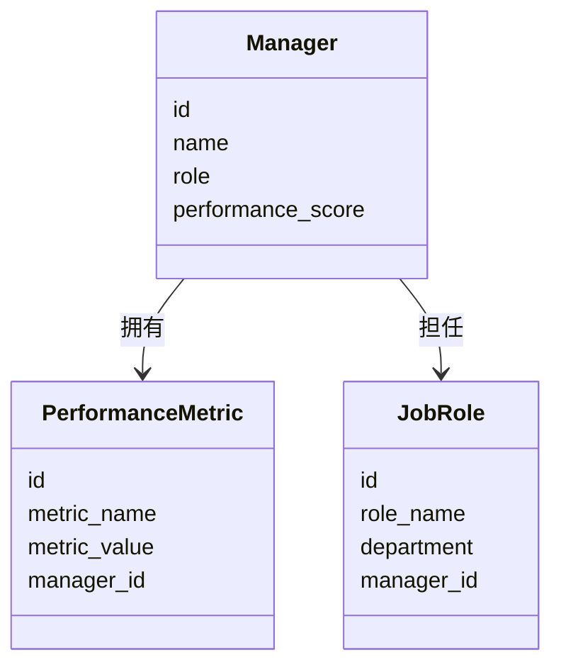
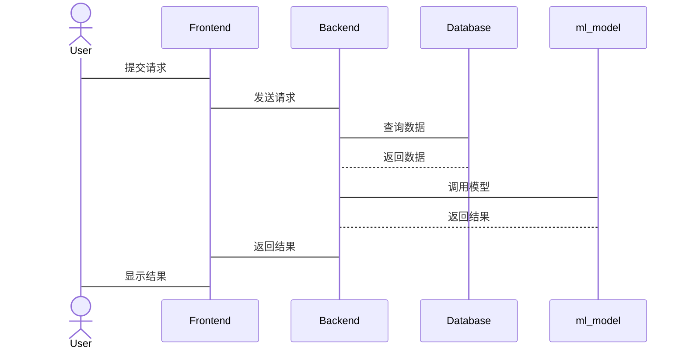

                 


# 机器学习辅助公司管理层能力评估

> **关键词**: 机器学习, 管理层能力评估, 算法原理, 系统架构, 项目实战

> **摘要**: 本文探讨了机器学习在公司管理层能力评估中的应用。通过分析管理层能力评估的背景、核心概念、算法原理、系统架构、项目实战以及最佳实践，本文为读者提供了全面的视角和深入的技术解读。文章结合理论与实践，详细讲解了如何利用机器学习技术提升公司管理层的能力评估效率和准确性。

---

## 第一部分: 机器学习辅助公司管理层能力评估的背景与核心概念

### 第1章: 机器学习与公司管理层能力评估的背景

#### 1.1 机器学习的基本概念
##### 1.1.1 机器学习的定义与核心概念
机器学习是一种人工智能技术，通过数据训练模型，使其能够从经验中学习并做出预测或决策。其核心概念包括**监督学习**、**无监督学习**、**强化学习**等。  
- **监督学习**: 基于标注数据进行模型训练，例如线性回归和决策树。  
- **无监督学习**: 从无标注数据中发现模式，例如聚类分析。  
- **强化学习**: 通过与环境交互，学习最优策略。  

##### 1.1.2 机器学习的分类与应用场景
机器学习可以分为**分类**、**回归**、**聚类**等类型。在企业管理中，机器学习常用于**员工绩效预测**、**风险评估**、**客户行为分析**等场景。

##### 1.1.3 机器学习在管理中的价值
机器学习能够从海量数据中提取有价值的信息，帮助管理者做出更科学的决策。例如，通过分析员工的历史表现数据，预测其未来的工作能力。

#### 1.2 管理层能力评估的重要性
##### 1.2.1 管理层能力评估的定义与目标
管理层能力评估是对管理者在组织中的表现进行系统性评价的过程，旨在识别其优势与不足，优化管理效率。

##### 1.2.2 管理层能力评估的传统方法与局限性
传统方法通常依赖主观评价，如领导的述职报告或下属的反馈。这种方法存在主观性强、数据分散、难以量化等问题。

##### 1.2.3 机器学习在能力评估中的优势
机器学习能够通过数据分析，提取客观指标，量化管理层的能力，例如沟通能力、决策能力和领导力。

#### 1.3 机器学习辅助能力评估的背景与趋势
##### 1.3.1 人工智能技术的发展与企业管理的结合
随着AI技术的进步，企业管理逐渐从经验驱动向数据驱动转变。机器学习成为提升管理效率的重要工具。

##### 1.3.2 数据驱动决策在现代管理中的重要性
企业通过数据驱动决策，能够更快速、更准确地做出战略选择。机器学习在数据处理和分析方面具有显著优势。

##### 1.3.3 机器学习在能力评估中的未来趋势
未来，机器学习将更加智能化，能够实时分析管理者的表现，并提供个性化建议。

---

### 第2章: 机器学习辅助管理层能力评估的核心概念与联系

#### 2.1 核心概念原理
##### 2.1.1 机器学习算法在能力评估中的应用
机器学习算法可以用于分析管理者的绩效数据，识别其能力特征。

##### 2.1.2 数据特征提取与能力评估的关系
通过提取管理者的历史销售数据、团队绩效等特征，可以构建能力评估模型。

##### 2.1.3 模型评估与优化在能力评估中的作用
模型评估指标（如准确率、召回率）可以帮助优化算法，提高评估结果的准确性。

#### 2.2 核心概念属性特征对比表格
| **算法类型** | **优点**                     | **缺点**                     |
|--------------|------------------------------|------------------------------|
| 线性回归      | 简单易实现，适合线性关系       | 无法处理非线性问题             |
| 支持向量机    | 分离能力强，适合高维数据       | 参数选择敏感                   |
| 决策树        | 易解释，适合分类问题           | � prone to overfitting           |
| 神经网络      | 适合复杂模式识别               | 需要大量数据和计算资源         |

#### 2.3 ER实体关系图架构
```mermaid
erDiagram
    manager {
        id
        name
        role
        performance_score
    }
    performance_metric {
        id
        metric_name
        metric_value
        manager_id
    }
    job_role {
        id
        role_name
        department
        manager_id
    }
    manager --> performance_metric: 拥有
    manager --> job_role: 担任
```

---

## 第二部分: 机器学习算法原理与数学模型

### 第3章: 机器学习算法原理

#### 3.1 常见机器学习算法的原理与特点
##### 3.1.1 线性回归
线性回归是一种简单回归算法，用于预测连续型变量。其数学模型为：
$$ y = \beta_0 + \beta_1x + \epsilon $$
其中，$\beta_0$是截距，$\beta_1$是斜率，$\epsilon$是误差项。

##### 3.1.2 支持向量机
支持向量机（SVM）是一种监督学习算法，适用于分类和回归问题。其核心思想是将数据映射到高维空间，并找到一个最优超平面进行分类。

##### 3.1.3 决策树与随机森林
决策树是一种基于树状结构的分类算法，随机森林则是通过集成多个决策树提高模型鲁棒性的方法。

##### 3.1.4 神经网络与深度学习
神经网络是一种模拟人脑结构的算法，深度学习则是神经网络的延伸，适用于复杂模式识别。

#### 3.2 算法选择与优化策略
##### 3.2.1 算法选择的原则与方法
选择算法时需要考虑数据类型、问题类型、数据量大小等因素。

##### 3.2.2 超参数调优与模型优化
通过交叉验证和网格搜索等方法，优化模型的超参数，提高模型性能。

##### 3.2.3 基于性能评估的算法选择
使用准确率、召回率等指标，选择性能最优的算法。

#### 3.3 机器学习算法在管理层能力评估中的应用
##### 3.3.1 分类算法
用于将管理者的能力分为优秀、良好、一般等类别。

##### 3.3.2 回归算法
用于预测管理者的绩效评分。

##### 3.3.3 聚类算法
用于将管理者分为不同的能力群体，便于针对性地制定培训计划。

---

## 第三部分: 机器学习辅助公司管理层能力评估的系统架构与实现

### 第4章: 系统分析与架构设计

#### 4.1 问题场景介绍
本文构建了一个基于机器学习的管理层能力评估系统，旨在通过数据分析优化评估过程。

#### 4.2 项目介绍
##### 4.2.1 项目目标
通过机器学习算法，实现管理者能力的自动化评估。

##### 4.2.2 项目范围
涵盖数据采集、模型训练、结果分析等环节。

##### 4.2.3 项目约束
数据隐私保护、模型解释性等。

#### 4.3 系统功能设计
##### 4.3.1 领域模型设计


##### 4.3.2 系统架构设计


#### 4.4 系统接口设计
##### 4.4.1 API接口设计
- 输入: 管理者ID
- 输出: 综合能力评分

##### 4.4.2 数据接口设计
- 数据来源: 管理者绩效数据、团队协作数据等。

#### 4.5 系统交互设计
##### 4.5.1 交互流程


---

## 第四部分: 项目实战与应用案例

### 第5章: 项目实战

#### 5.1 环境安装与数据预处理
##### 5.1.1 环境安装
安装Python、Scikit-learn、XGBoost等库。

##### 5.1.2 数据预处理
数据清洗、特征工程等步骤。

#### 5.2 系统核心实现
##### 5.2.1 核心代码实现
```python
from sklearn.model_selection import train_test_split
from sklearn.linear_model import LinearRegression
from sklearn.metrics import mean_squared_error

# 数据加载与分割
X_train, X_test, y_train, y_test = train_test_split(X, y, test_size=0.2)

# 模型训练
model = LinearRegression()
model.fit(X_train, y_train)

# 模型预测
y_pred = model.predict(X_test)

# 模型评估
mse = mean_squared_error(y_test, y_pred)
print(f"均方误差: {mse}")
```

##### 5.2.2 代码应用解读
代码实现了一个简单的线性回归模型，用于预测管理者的绩效评分。

#### 5.3 实际案例分析
##### 5.3.1 数据来源与分析
分析100名管理者的绩效数据，包括销售业绩、团队满意度等指标。

##### 5.3.2 模型训练与评估
训练模型并评估其性能，调整参数优化结果。

#### 5.4 详细讲解与剖析
模型预测结果与实际数据进行对比，分析误差来源，提出改进建议。

#### 5.5 项目小结
总结项目实施过程中的经验与教训，提出未来改进方向。

---

## 第五部分: 总结与展望

### 第6章: 总结与展望

#### 6.1 最佳实践 tips
- 数据质量是模型性能的关键。
- 模型解释性是实际应用的重要考量。
- 持续优化模型，适应业务变化。

#### 6.2 小结
机器学习为公司管理层能力评估提供了新的思路和方法，能够显著提升评估的科学性和效率。

#### 6.3 注意事项
- 数据隐私保护
- 模型的可解释性
- 持续监控与优化

#### 6.4 拓展阅读
推荐相关书籍和论文，供读者深入学习。

---

## 作者信息

**作者：** AI天才研究院/AI Genius Institute & 禅与计算机程序设计艺术/Zen And The Art of Computer Programming

