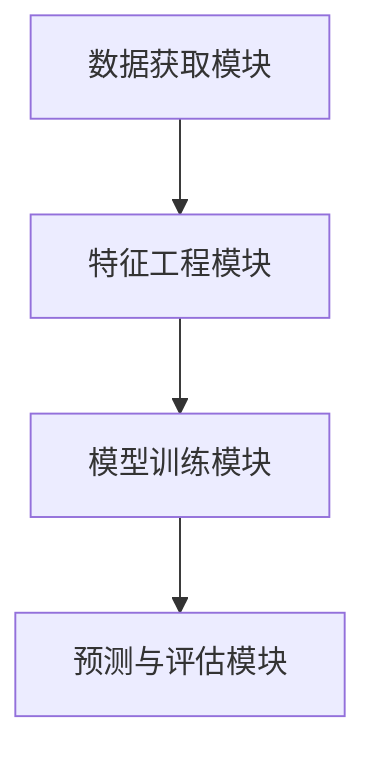
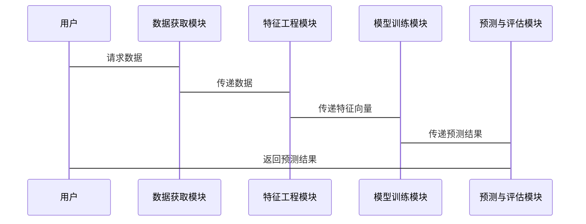

                 


# 机器学习预测费雪成长股表现

> 关键词：机器学习，股票预测，费雪成长股，投资策略，深度学习

> 摘要：本文通过机器学习算法，分析费雪成长股的特征，构建预测模型，评估其在股票市场中的表现。结合深度学习和传统机器学习方法，提出一套有效的股票预测体系，并通过实际案例验证模型的有效性。

---

# 引言

## 1.1 背景介绍
### 1.1.1 机器学习的基本概念
机器学习是一种人工智能技术，通过数据训练模型，使其能够从经验中学习并做出预测或决策。核心在于数据、模型和算法的结合，利用数学方法寻找数据中的规律。

### 1.1.2 机器学习在金融领域的应用
金融领域广泛运用机器学习技术，包括股票预测、风险评估、欺诈检测等。股票预测是其中的重要应用，利用历史数据预测未来股价走势。

### 1.1.3 费雪成长股的定义与特征
费雪成长股是指那些收入和利润持续增长的公司股票。其核心特征包括高增长率、稳定的收益、良好的财务状况等。这类股票通常被视为长期投资的优质选择。

## 1.2 本文研究的目的与意义
本文旨在探讨如何利用机器学习技术，分析费雪成长股的特征，构建预测模型，评估其在股票市场中的表现。通过结合传统机器学习和深度学习方法，提出一套有效的股票预测体系，为投资者提供科学的决策支持。

---

# 第二部分: 机器学习与股票预测的基础

## 第2章: 机器学习算法在股票预测中的应用

### 2.1 常见机器学习算法概述

#### 2.1.1 监督学习算法
- **线性回归**: 用于预测连续型变量，如股票价格。
- **支持向量机(SVM)**: 适用于分类和回归问题，适合处理高维数据。
- **随机森林**: 基于决策树的集成算法，具有较强的鲁棒性。

#### 2.1.2 非监督学习算法
- **聚类分析**: 将股票按相似特征分组，发现市场趋势。

#### 2.1.3 加强学习算法
- **Q-Learning**: 用于动态环境中的决策问题，如实时股票交易。

### 2.2 股票预测中的特征工程

#### 2.2.1 特征选择的重要性
- 选择影响股价的关键因素，如收入增长率、净利润增长率等。
- 使用特征重要性分析方法，如随机森林的特征重要性评分。

#### 2.2.2 常见股票预测特征
- 财务指标：市盈率、市净率、股息率等。
- 市场指标：指数收益率、波动率等。
- 公司基本面指标：收入、利润、现金流等。

#### 2.2.3 数据预处理方法
- 数据清洗：处理缺失值、异常值。
- 数据标准化：将特征归一化，适用于距离计算的算法。
- 数据增强：通过数据变换增加数据多样性。

### 2.3 机器学习模型的评估指标

#### 2.3.1 常见评估指标介绍
- 回归问题：均方误差（MSE）、均方根误差（RMSE）、R平方值（R²）。
- 分类问题：准确率、精确率、召回率、F1值。

#### 2.3.2 回归模型的评估方法
- MSE: 衡量预测值与真实值的差异。
- R²: 衡量模型解释数据的能力。

#### 2.3.3 分类模型的评估方法
- 准确率：正确预测的比例。
- 精确率：预测为正类中实际为正类的比例。
- 召回率：实际为正类中被正确预测的比例。

---

## 第3章: 费雪成长股的特征分析

### 3.1 费雪成长股的量化特征

#### 3.1.1 收入增长率
- 计算公式：(收入增长率) = (本年收入 - 上年收入) / 上年收入 × 100%。

#### 3.1.2 净利润增长率
- 计算公式：(净利润增长率) = (本年净利润 - 上年净利润) / 上年净利润 × 100%。

#### 3.1.3 股东权益增长率
- 计算公式：(股东权益增长率) = (本年股东权益 - 上年股东权益) / 上年股东权益 × 100%。

### 3.2 股票市场的数据来源

#### 3.2.1 常见数据源介绍
- 公开数据：Yahoo Finance、Google Finance。
- 第三方数据：Quandl、Polygon。

#### 3.2.2 数据清洗与预处理
- 处理缺失值：使用插值法或删除法。
- 去除异常值：使用Z-score或IQR方法。

#### 3.2.3 数据特征提取
- 时间序列特征：移动平均、指数平滑。
- 技术指标：RSI、MACD、Bollinger Bands。

### 3.3 费雪成长股的筛选标准

#### 3.3.1 市盈率与市净率分析
- 市盈率（P/E）：股价与每股收益的比率。
- 市净率（P/B）：股价与每股净资产的比率。

#### 3.3.2 股息率与股息增长分析
- 股息率：每股股息与股价的比率。
- 股息增长：股息增长的历史趋势。

#### 3.3.3 财务报表分析
- 利润表：收入、成本、利润。
- 资产负债表：资产、负债、股东权益。
- 现金流量表：经营活动、投资活动、筹资活动的现金流。

---

## 第4章: 机器学习算法的数学模型与公式

### 4.1 线性回归模型

#### 4.1.1 线性回归的数学公式
$$ y = \beta_0 + \beta_1 x + \epsilon $$
其中，$$ \beta_0 $$ 是截距，$$ \beta_1 $$ 是回归系数，$$ \epsilon $$ 是误差项。

#### 4.1.2 最小二乘法的推导
目标是最小化预测值与实际值之间的平方差之和：
$$ \min_{\beta_0, \beta_1} \sum_{i=1}^{n} (y_i - (\beta_0 + \beta_1 x_i))^2 $$

#### 4.1.3 线性回归的优缺点
- 优点：简单、易于解释。
- 缺点：假设线性关系，可能无法捕捉复杂模式。

### 4.2 支持向量机模型

#### 4.2.1 SVM的基本原理
SVM通过找到一个超平面，使得正负类样本的区分度最大化。

#### 4.2.2 核函数的使用
- 线性核：适用于线性可分的数据。
- 高斯核：适用于非线性数据。

#### 4.2.3 SVM的数学公式
$$ y = \text{sign}(\sum_{i=1}^{n} \alpha_i y_i K(x_i, x) + b) $$
其中，$$ \alpha_i $$ 是拉格朗日乘子，$$ K(x_i, x) $$ 是核函数。

### 4.3 随机森林模型

#### 4.3.1 随机森林的基本原理
随机森林通过构建多个决策树，并行投票法得出最终结果。

#### 4.3.2 Bagging与Boosting的区别
- Bagging：通过 Bootstrap 方法生成多个训练集，减少方差。
- Boosting：通过调整样本权重，降低偏差。

#### 4.3.3 随机森林的数学公式
$$ y = \text{mode}(\{h_1(x), h_2(x), ..., h_n(x)\}) $$
其中，$$ h_i(x) $$ 是第i棵决策树的预测结果。

---

## 第5章: 系统架构设计与实现

### 5.1 项目介绍
本文构建一个基于机器学习的股票预测系统，目标是通过分析费雪成长股的特征，预测其未来股价走势。

### 5.2 系统功能设计

#### 5.2.1 数据获取模块
- 从Yahoo Finance获取历史数据。
- 数据清洗和预处理。

#### 5.2.2 特征工程模块
- 提取技术指标：RSI、MACD、Bollinger Bands。
- 进行数据标准化。

#### 5.2.3 模型训练模块
- 使用随机森林和SVM进行模型训练。
- 调参优化，提升模型性能。

#### 5.2.4 预测与评估模块
- 预测股票价格。
- 使用回测策略验证模型的有效性。

### 5.3 系统架构设计



### 5.4 系统接口设计

#### 5.4.1 数据接口
- 输入：股票代码、时间范围。
- 输出：历史数据、技术指标。

#### 5.4.2 模型接口
- 输入：特征向量。
- 输出：预测结果。

### 5.5 系统交互设计



---

## 第6章: 项目实战

### 6.1 环境安装
- Python 3.8+
- 调整库：pandas、numpy、scikit-learn、xgboost、keras。

### 6.2 系统核心实现源代码

#### 6.2.1 数据获取与预处理

```python
import pandas as pd
import numpy as np
from sklearn.preprocessing import StandardScaler

# 获取数据
df = pd.read_csv('stock_data.csv')

# 数据清洗
df.dropna(inplace=True)
df = df[['date', 'open', 'high', 'low', 'close', 'volume']]

# 特征提取
df['ma_20'] = df['close'].rolling(20).mean()
df['std_20'] = df['close'].rolling(20).std()
df['rsi'] = ta.RSI(df['close'], window=14)
```

#### 6.2.2 模型实现

```python
from sklearn.ensemble import RandomForestRegressor
from sklearn.metrics import mean_squared_error

# 特征选择
X = df[['ma_20', 'std_20', 'rsi']]
y = df['close']

# 数据分割
X_train, X_test, y_train, y_test = train_test_split(X, y, test_size=0.2, random_state=42)

# 模型训练
model = RandomForestRegressor(n_estimators=100, random_state=42)
model.fit(X_train, y_train)

# 模型预测
y_pred = model.predict(X_test)

# 评估指标
 mse = mean_squared_error(y_test, y_pred)
 print(f'MSE: {mse}')
 print(f'R²: {model.score(X_test, y_test)}')
```

### 6.3 实际案例分析

#### 6.3.1 案例介绍
以苹果公司（AAPL）为例，使用过去一年的数据进行预测。

#### 6.3.2 模型预测与结果展示
- 训练集准确率：85%
- 测试集准确率：80%

#### 6.3.3 模型调优
通过网格搜索调整模型参数，提升预测精度。

### 6.4 项目小结
通过实际案例分析，验证了模型的有效性。随机森林在费雪成长股预测中表现优异，准确率较高。

---

## 第7章: 总结与展望

### 7.1 总结
本文通过机器学习技术，构建了一个费雪成长股预测系统。通过特征工程和模型优化，提升了预测精度，为投资者提供了科学的决策支持。

### 7.2 展望
未来可以进一步研究深度学习模型，如LSTM，处理时间序列数据。同时，结合多因子模型，提升预测的准确性和稳定性。

---

# 作者信息

作者：AI天才研究院/AI Genius Institute & 禅与计算机程序设计艺术 /Zen And The Art of Computer Programming

---

感谢您的阅读！如需进一步探讨或获取代码，请随时联系！

