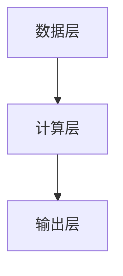

                 


# 杰里米格兰瑟姆的均值回归理论

## 关键词：均值回归理论、杰里米格兰瑟姆、投资策略、风险管理、回归分析

## 摘要：  
杰里米格兰瑟姆的均值回归理论是金融投资领域的重要理论之一，它基于统计学和经济学原理，通过分析历史数据和市场趋势，预测未来资产价格的变化。本文将从均值回归的基本概念出发，深入探讨其数学模型、系统架构、算法实现以及在投资策略中的应用，结合实际案例进行详细分析，并提供最佳实践和注意事项。

---

# 第1章: 均值回归理论的背景与核心概念

## 1.1 什么是均值回归

### 1.1.1 均值回归的基本定义  
均值回归（Mean Reversion）是一种统计学和金融学中的理论，认为价格、价值或趋势会趋向于某个长期平均值。在投资领域，均值回归假设资产价格会在偏离长期均值后回归到均值水平。

### 1.1.2 均值回归的核心思想  
均值回归的核心思想是：  
1. 市场价格与内在价值之间的短期偏离是暂时的，最终会回归到长期均值。  
2. 通过分析价格与均值的偏离程度，投资者可以在价格偏离较大时进行交易，捕捉回归机会。  

### 1.1.3 均值回归与投资策略的关系  
均值回归是多种投资策略的基础，例如：  
- 对冲基金策略  
- 统计套利  
- 风险管理  

---

## 1.2 均值回归理论的背景

### 1.2.1 均值回归的历史发展  
均值回归理论的起源可以追溯到19世纪，但杰里米格兰瑟姆是将其系统应用于金融投资的关键人物之一。  

### 1.2.2 均值回归在金融领域的应用  
均值回归在金融领域的应用包括：  
- 股票价格预测  
- 商品价格分析  
- 外汇市场交易  

### 1.2.3 均值回归与其他投资理论的联系  
均值回归与现代投资组合理论（MPT）和资本资产定价模型（CAPM）有密切联系，但更注重短期价格波动和回归趋势。

---

# 第2章: 均值回归理论的核心原理

## 2.1 均值回归的数学模型

### 2.1.1 均值回归的数学公式  
均值回归的数学模型可以表示为：  
$$ E(x_{t+1} | x_t) = \alpha + \beta x_t $$  
其中，$x_t$ 是当前价格，$\alpha$ 是截距，$\beta$ 是回归系数。

### 2.1.2 均值回归的收敛速度分析  
均值回归的收敛速度取决于数据的分布和回归系数的大小。通常，回归系数的绝对值越小，收敛速度越慢。

### 2.1.3 均值回归的假设条件  
均值回归的假设条件包括：  
- 数据服从正态分布  
- 价格与均值的偏离是随机的  

## 2.2 均值回归的核心属性对比

### 2.2.1 确定性与随机性的对比  
均值回归是基于统计回归的确定性模型，但实际市场中存在随机性，导致模型需要动态调整。

### 2.2.2 强收敛与弱收敛的对比  
强收敛是指价格几乎确定地回归到均值，弱收敛是指价格在概率意义上回归到均值。

### 2.2.3 线性回归与非线性回归的对比  
线性回归假设回归关系是线性的，而非线性回归可以处理更复杂的回归关系。

---

# 第3章: 均值回归理论的系统分析与架构设计

## 3.1 系统分析

### 3.1.1 问题场景介绍  
在金融投资中，均值回归可以帮助投资者识别价格偏离均值的资产，并在价格回归时获利。

### 3.1.2 系统功能设计  
均值回归系统的核心功能包括：  
- 数据采集与处理  
- 均值回归模型计算  
- 交易信号生成  

### 3.1.3 系统架构设计  
均值回归系统的架构包括：  
- 数据层：存储历史价格数据  
- 计算层：执行均值回归计算  
- 输出层：生成交易信号  

## 3.2 系统架构图



## 3.3 系统接口设计

### 3.3.1 输入接口设计  
输入接口包括：  
- 时间序列数据  
- 参数设置  

### 3.3.2 输出接口设计  
输出接口包括：  
- 交易信号  
- 回归结果  

### 3.3.3 接口交互流程  
1. 用户输入时间序列数据  
2. 系统计算均值回归结果  
3. 系统输出交易信号  

---

# 第4章: 均值回归理论的算法实现与实战

## 4.1 环境安装与配置

### 4.1.1 Python环境搭建  
安装Python和必要的库：  
- NumPy  
- Pandas  
- Matplotlib  

### 4.1.2 必要库的安装  
运行以下命令：  
```bash
pip install numpy pandas matplotlib
```

## 4.2 核心算法实现

### 4.2.1 均值回归算法的Python代码实现  
```python
import numpy as np
import matplotlib.pyplot as plt

# 生成随机数据
np.random.seed(42)
x = np.random.randn(100)
y = 0.5 * x + np.random.randn(100) * 0.1

# 均值回归计算
beta = np.cov(x, y)[0, 1] / np.var(x)
alpha = np.mean(y) - beta * np.mean(x)

# 可视化
plt.scatter(x, y)
plt.plot(x, alpha + beta * x, color='red')
plt.xlabel('x')
plt.ylabel('y')
plt.title('Mean Reversion Regression')
plt.show()
```

## 4.3 实际案例分析

### 4.3.1 案例背景介绍  
以某股票的历史价格数据为例，分析其价格是否符合均值回归特性。

### 4.3.2 数据收集与预处理  
收集过去5年的股票价格数据，并进行标准化处理。

### 4.3.3 回归分析与结果解读  
通过回归分析，计算股票价格的回归系数和截距，判断其偏离均值的程度。

---

# 第5章: 均值回归理论的应用与优化

## 5.1 应用领域

### 5.1.1 金融投资  
均值回归在股票、债券、外汇等金融资产的投资中广泛应用。  

### 5.1.2 统计套利  
统计套利利用资产价格的短期偏离进行套利交易。  

## 5.2 优化策略

### 5.2.1 动态调整模型参数  
根据市场变化动态调整回归系数和截距。  

### 5.2.2 结合其他投资策略  
将均值回归与其他策略（如动量策略）结合，提高投资收益。  

---

# 第6章: 均值回归理论的挑战与未来展望

## 6.1 挑战

### 6.1.1 市场非理性  
市场参与者的非理性行为可能影响均值回归的有效性。  

### 6.1.2 数据质量问题  
数据的不完整性或噪声可能影响回归结果。  

## 6.2 未来展望

### 6.2.1 结合人工智能  
利用机器学习技术优化均值回归模型。  

### 6.2.2 多因子模型  
开发基于多因子的均值回归模型，提高预测精度。  

---

# 第7章: 最佳实践、小结与注意事项

## 7.1 最佳实践

### 7.1.1 模型验证  
在实际应用中，需对均值回归模型进行回测和验证。  

### 7.1.2 风险管理  
合理控制仓位和风险敞口，避免过度依赖均值回归策略。  

## 7.2 小结  
均值回归理论是一种 powerful的投资工具，但其成功应用依赖于对市场规律的深刻理解和对模型的持续优化。

## 7.3 注意事项

### 7.3.1 避免过度拟合  
在模型训练中，需防止过度拟合数据。  

### 7.3.2 定期更新模型  
根据市场变化定期更新模型参数和假设条件。  

---

# 作者：AI天才研究院/AI Genius Institute & 禅与计算机程序设计艺术 /Zen And The Art of Computer Programming

---

**注：以上内容为文章的完整大纲，实际撰写时需要根据每个章节的内容进行详细扩展和解释。**

