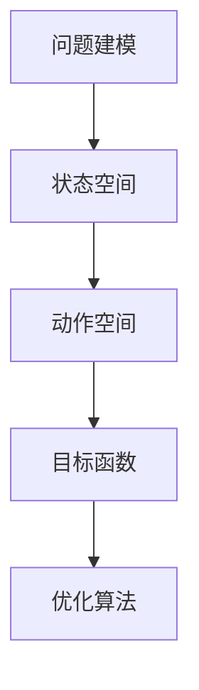
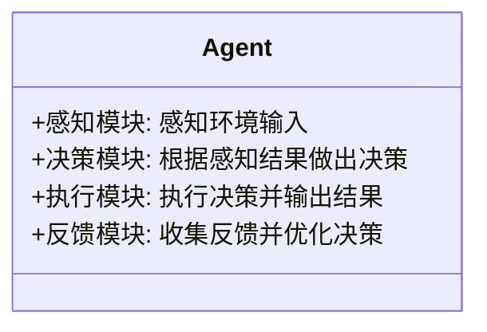
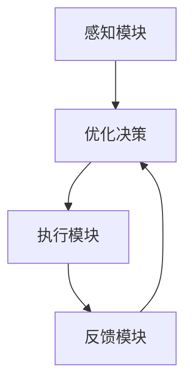
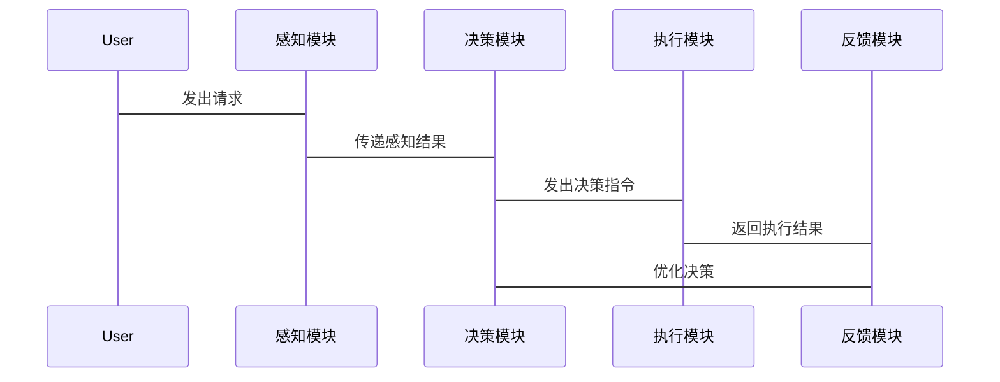

                 


# 构建AI Agent常见挑战及解决方案

---

## 关键词

- AI Agent
- 人工智能
- 算法原理
- 系统架构
- 项目实战
- 挑战与解决方案

---

## 摘要

构建AI Agent是一个复杂但充满潜力的过程，涉及多方面的技术挑战。本文将从AI Agent的基本概念出发，分析其核心挑战，并提供相应的解决方案。通过详细讲解算法原理、系统架构设计、项目实战以及最佳实践，帮助读者全面理解AI Agent的构建过程，并掌握解决常见问题的方法。

---

# 第一部分: AI Agent 基础与挑战

## 第1章: AI Agent 概念与背景

### 1.1 AI Agent 的定义与核心概念

AI Agent（人工智能代理）是指能够感知环境、自主决策并执行任务的智能实体。它具备以下核心特征：

1. **自主性**：能够在没有外部干预的情况下独立运行。
2. **反应性**：能够实时感知环境并做出反应。
3. **目标导向**：具有明确的目标，并通过行动来实现目标。
4. **学习能力**：能够通过经验改进自身的性能。

AI Agent可以分为以下几类：

- **简单反射型Agent**：基于当前感知做出反应，不涉及复杂推理。
- **基于模型的反射型Agent**：利用内部模型进行推理和规划。
- **目标驱动型Agent**：以目标为导向，主动采取行动。
- **实用驱动型Agent**：通过优化效用函数来实现最优决策。

---

### 1.2 AI Agent 的问题背景

当前，AI Agent在各个领域得到了广泛应用，但也面临诸多挑战：

- **环境复杂性**：真实世界中的环境通常是动态且不可预测的。
- **决策不确定性**：在复杂环境中，决策往往涉及概率和不确定性。
- **资源限制**：计算资源和时间限制可能导致Agent无法进行复杂的推理。

解决这些问题的关键在于：

1. **高效的问题建模**：准确地将问题转化为数学模型。
2. **智能的算法设计**：开发高效的算法来处理复杂问题。
3. **实时的反馈机制**：通过反馈不断优化Agent的行为。

---

### 1.3 AI Agent 的边界与外延

AI Agent的边界是指其能力的范围和限制。以下是AI Agent的边界定义：

- **知识边界**：Agent的知识有限，无法处理超出其知识范围的问题。
- **能力边界**：Agent的能力受限于硬件和算法的限制。
- **环境边界**：Agent只能在其设计的环境中运行。

与相关概念的对比：

| 概念         | 描述                                                                 |
|--------------|----------------------------------------------------------------------|
| AI Agent     | 具备自主性和目标导向的智能实体                                         |
| AI Model     | 用于特定任务的数学模型，不具有自主性                                   |
| AI System    | 包含多个AI组件的系统，可能包含Agent                                     |

---

# 第二部分: AI Agent 算法原理

## 第2章: AI Agent 算法实现

### 2.1 问题建模与求解

以下是问题建模的流程图：



### 2.2 常见算法实现

以下是几种常见的AI Agent算法：

- **A*搜索算法**：用于路径规划问题，通过评估节点的优先级进行搜索。
- **Q-Learning算法**：基于强化学习，通过试错学习来优化策略。
- **贪心算法**：在每一步选择当前状态下最优的行动，不考虑全局最优。

### 2.3 算法实现代码示例

以下是Q-Learning算法的Python实现：

```python
import numpy as np

class QLearning:
    def __init__(self, state_space, action_space, learning_rate=0.1, gamma=0.9):
        self.state_space = state_space
        self.action_space = action_space
        self.learning_rate = learning_rate
        self.gamma = gamma
        self.q_table = np.zeros((state_space, action_space))
    
    def choose_action(self, state, epsilon=0.1):
        if np.random.random() < epsilon:
            return np.random.randint(self.action_space)
        return np.argmax(self.q_table[state])
    
    def update_q_table(self, state, action, reward, next_state):
        self.q_table[state][action] = self.q_table[state][action] * (1 - self.learning_rate) + \
            self.learning_rate * (reward + self.gamma * np.max(self.q_table[next_state]))
```

### 2.4 算法原理的数学模型

目标函数：

$$ J = \sum_{t=1}^{T} \gamma^{t-1} r_t $$

优化算法：

$$ \theta = \theta + \alpha \nabla J $$

---

# 第三部分: AI Agent 系统分析与设计

## 第3章: 系统架构设计

### 3.1 问题场景介绍

假设我们正在开发一个智能助手Agent，用于帮助用户完成日程管理任务。

### 3.2 系统功能设计

以下是系统功能模块的类图：



### 3.3 系统架构设计

以下是系统的架构图：



### 3.4 系统接口设计

以下是模块之间的接口：

- **感知模块**：接收环境输入，输出感知结果。
- **决策模块**：接收感知结果，输出决策动作。
- **执行模块**：接收决策动作，输出执行结果。
- **反馈模块**：接收执行结果，输出反馈信息。

### 3.5 系统交互流程

以下是系统交互的流程图：



---

# 第四部分: AI Agent 项目实战

## 第4章: 项目实战与实现

### 4.1 环境安装

安装所需的依赖库：

```bash
pip install numpy matplotlib scikit-learn
```

### 4.2 核心代码实现

以下是项目的核心代码：

```python
import numpy as np
import matplotlib.pyplot as plt

def main():
    # 初始化环境
    env = Environment()
    agent = Agent(env.state_space, env.action_space)
    
    # 开始训练
    for episode in range(1000):
        state = env.reset()
        while not done:
            action = agent.choose_action(state)
            next_state, reward, done = env.step(action)
            agent.update_q_table(state, action, reward, next_state)
            state = next_state
    
    # 测试性能
    test_episode = 100
    total_reward = 0
    for _ in range(test_episode):
        state = env.reset()
        while not done:
            action = agent.choose_action(state, epsilon=0)
            next_state, reward, done = env.step(action)
            total_reward += reward
            state = next_state
    print(f"平均奖励: {total_reward / test_episode}")

if __name__ == "__main__":
    main()
```

### 4.3 实际案例分析

通过上述代码实现一个智能助手Agent，用于管理用户日程安排。通过训练，Agent能够根据用户的输入做出合理的安排。

---

# 第五部分: 最佳实践与总结

## 第5章: 总结与展望

### 5.1 最佳实践

- **模块化设计**：将系统划分为独立的模块，便于维护和扩展。
- **持续优化**：通过反馈不断优化Agent的行为。
- **测试的重要性**：在开发过程中，进行全面的测试以确保系统的稳定性和可靠性。

### 5.2 总结与回顾

构建AI Agent是一个复杂但 rewarding 的过程。通过本文的讲解，读者可以全面理解AI Agent的核心概念、算法原理和系统架构设计，并掌握解决常见挑战的方法。

### 5.3 展望未来

随着人工智能技术的不断发展，AI Agent将具备更强的智能性和适应性，能够在更多领域发挥重要作用。

---

# 参考文献

1. Russell, S., & Norvig, P. (2010). Artificial Intelligence: A Modern Approach.
2. Sutton, R. S., & Barto, A. G. (2018). Reinforcement Learning: An Introduction.

---

# 作者

作者：AI天才研究院 & 禅与计算机程序设计艺术

