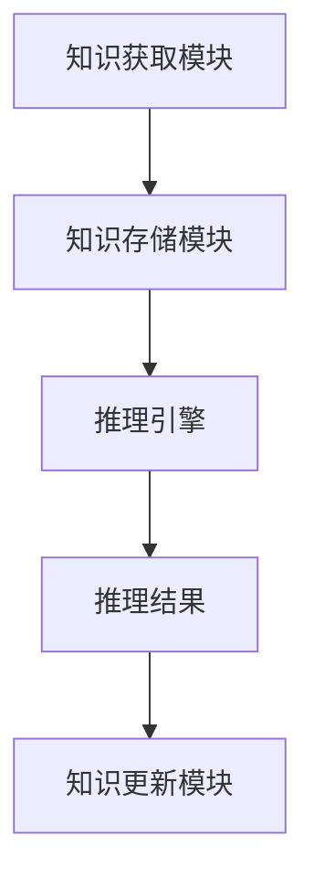
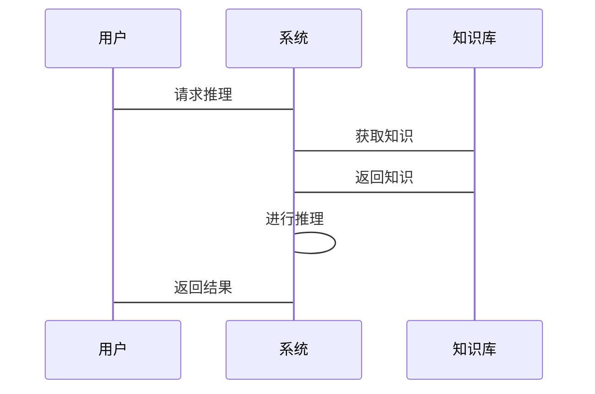

                 


# 《构建AI Agent的动态知识推理系统》

---

## 关键词：AI Agent、动态知识推理、知识表示、推理算法、系统架构

---

## 摘要

AI Agent（人工智能代理）作为一类能够自主决策和执行任务的智能体，其核心能力在于动态知识的推理与应用。动态知识推理系统是AI Agent实现复杂任务的关键技术，它能够实时更新和处理知识，以适应动态变化的环境。本文将从AI Agent的基本概念出发，深入探讨动态知识推理系统的原理、算法实现、系统架构设计以及实际应用案例，为读者提供全面的技术指导。

---

# 第一部分：AI Agent与动态知识推理系统背景

## 第1章：AI Agent的基本概念

### 1.1 AI Agent的定义与特点

AI Agent是一种能够感知环境、自主决策并执行任务的智能体。它具备以下核心特点：
- **自主性**：无需外部干预，自主完成任务。
- **反应性**：能够实时感知环境变化并做出响应。
- **目标导向性**：具备明确的目标，并根据目标调整行为。
- **社会能力**：能够与其他智能体或人类进行交互与协作。

AI Agent与传统AI的区别在于其动态性和自主性。传统AI通常依赖于固定的规则和数据，而AI Agent能够根据环境动态调整其行为。

### 1.2 动态知识推理的必要性

动态知识推理是AI Agent的核心能力之一，它能够帮助AI Agent在复杂多变的环境中做出合理决策。以下是动态知识推理的必要性：
- **实时更新**：环境中的信息不断变化，AI Agent需要实时更新其知识库。
- **复杂推理**：动态环境中存在不确定性，AI Agent需要通过推理来处理复杂问题。
- **自适应性**：动态知识推理能够使AI Agent具备更强的适应能力，以应对环境的变化。

---

## 第2章：动态知识推理系统的背景与应用

### 2.1 动态知识推理系统的背景

动态知识推理系统是一种能够实时更新和处理知识的系统。它的核心在于知识的动态表示与推理机制。以下是动态知识推理系统的关键背景：
- **知识表示**：动态知识推理系统需要能够表示复杂且不断变化的知识。
- **推理机制**：系统需要具备多种推理方法，以应对不同场景下的推理需求。
- **动态更新**：系统能够实时获取新信息并更新知识库。

### 2.2 动态知识推理系统的应用案例

动态知识推理系统在多个领域都有广泛应用，以下是几个典型的应用案例：
- **智能问答系统**：通过动态推理回答用户的问题。
- **自动驾驶**：实时推理环境信息以做出驾驶决策。
- **智能推荐系统**：根据用户行为动态推理推荐内容。

---

# 第二部分：动态知识推理系统的原理

## 第3章：知识表示与推理基础

### 3.1 知识表示方法

知识表示是动态知识推理系统的核心之一。以下是几种常见的知识表示方法：
- **符号表示**：使用符号（如概念、规则）表示知识。
- **图论表示**：通过图结构（如知识图谱）表示知识。
- **概率表示**：通过概率模型表示知识。

### 3.2 推理机制

推理机制是动态知识推理系统的关键部分。以下是几种常见的推理方法：
- **合取推理**：基于逻辑规则进行推理。
- **贝叶斯推理**：基于概率模型进行推理。
- **类比推理**：基于相似性进行推理。

---

## 第4章：动态知识更新与推理

### 4.1 动态知识的获取与存储

动态知识的获取与存储是动态知识推理系统的重要环节。以下是动态知识获取与存储的关键点：
- **多源异构数据**：动态知识推理系统需要处理多种来源和格式的数据。
- **知识存储结构**：通过结构化存储实现知识的高效检索与更新。

### 4.2 动态知识推理的核心算法

动态知识推理的核心算法包括：
- **逻辑推理算法**：基于逻辑规则的推理。
- **概率推理算法**：基于概率模型的推理。
- **动态更新算法**：实时更新知识库的算法。

---

# 第三部分：动态知识推理系统的算法实现

## 第5章：动态知识推理算法的数学模型

### 5.1 逻辑推理算法

逻辑推理算法基于逻辑规则进行推理。其数学模型如下：
$$
\text{如果 } P \rightarrow Q \text{ 且 } P \text{ 为真，则 } Q \text{ 为真。}
$$

### 5.2 贝叶斯推理算法

贝叶斯推理算法基于概率模型进行推理。其数学模型如下：
$$
P(A|B) = \frac{P(B|A) \cdot P(A)}{P(B)}
$$

## 第6章：动态知识推理算法的实现

### 6.1 逻辑推理算法的实现

以下是逻辑推理算法的Python实现示例：
```python
def logical_inference(rules, facts):
    inferred_facts = set(facts)
    while True:
        new_inferred = set()
        for rule in rules:
            antecedent, consequent = rule
            if all(fact in inferred_facts for fact in antecedent):
                if consequent not in inferred_facts:
                    new_inferred.add(consequent)
        if not new_inferred:
            break
        inferred_facts.update(new_inferred)
    return inferred_facts
```

### 6.2 贝叶斯推理算法的实现

以下是贝叶斯推理算法的Python实现示例：
```python
from collections import defaultdict

def bayesian_inference(prior, likelihood, evidence):
    posterior = {}
    total = defaultdict(float)
    for h in prior:
        total[h] = prior[h]
        for d in evidence:
            total[h] *= likelihood.get((h, d), 1.0)
    for h in prior:
        posterior[h] = prior[h]
        for d in evidence:
            posterior[h] *= likelihood.get((h, d), 1.0)
        if total['total'] != 0:
            posterior[h] /= total[h]
    return posterior
```

---

# 第四部分：动态知识推理系统的系统架构设计

## 第7章：系统功能设计

### 7.1 系统功能概述

动态知识推理系统的主要功能包括：
- **知识获取**：从多种来源获取知识。
- **知识存储**：存储和管理知识。
- **知识推理**：基于知识进行推理。
- **知识更新**：实时更新知识库。

### 7.2 系统架构设计

以下是动态知识推理系统的架构图：



## 第8章：系统接口设计

### 8.1 系统接口概述

动态知识推理系统的接口设计包括：
- **知识获取接口**：从外部数据源获取知识。
- **知识存储接口**：存储知识到知识库。
- **推理接口**：根据知识进行推理。

### 8.2 系统交互流程

以下是系统交互流程图：



---

# 第五部分：动态知识推理系统的项目实战

## 第9章：项目环境安装

### 9.1 环境要求

动态知识推理系统的运行环境包括：
- Python 3.6+
- 必要的Python库（如numpy、pandas、networkx等）

### 9.2 安装步骤

安装必要的Python库：
```bash
pip install numpy pandas networkx
```

## 第10章：系统核心实现

### 10.1 核心代码实现

以下是动态知识推理系统的Python实现示例：
```python
import networkx as nx

def dynamic_knowledge_reasoning(G, query):
    # 初始化推理结果
    result = []
    # 遍历图中的节点
    for node in G.nodes():
        if G.nodes[node].get('is_fact') and node == query:
            result.append(node)
    return result
```

### 10.2 代码解读与分析

上述代码实现了动态知识推理系统的核心功能。通过图结构表示知识，并根据查询进行推理。

## 第11章：案例分析

### 11.1 案例背景

假设我们有一个智能问答系统，用户提出问题，系统需要动态推理出答案。

### 11.2 案例分析

以下是案例分析的详细步骤：
1. **知识获取**：获取用户问题相关的知识。
2. **知识存储**：将知识存储到知识库中。
3. **知识推理**：基于知识推理出答案。
4. **知识更新**：更新知识库以备后续推理。

## 第12章：项目小结

通过上述项目的实现，我们可以看到动态知识推理系统的强大功能。它能够实时更新和处理知识，以适应动态变化的环境。

---

# 第六部分：动态知识推理系统的最佳实践

## 第13章：最佳实践

### 13.1 实践建议

以下是动态知识推理系统的最佳实践建议：
- **知识表示**：选择合适的知识表示方法。
- **推理算法**：根据需求选择合适的推理算法。
- **系统架构**：设计合理的系统架构以保证系统的高效性。

## 第14章：小结

动态知识推理系统是AI Agent的核心技术之一。通过本文的讲解，读者可以深入了解动态知识推理系统的原理、算法实现以及系统架构设计。

## 第15章：注意事项

在实际应用中，需要注意以下几点：
- **数据质量**：确保知识来源的准确性。
- **系统性能**：优化系统的推理效率。
- **安全性**：保证系统的安全性。

## 第16章：拓展阅读

以下是拓展阅读的推荐书籍和论文：
- 《Pattern Recognition and Machine Learning》
- 《Dynamic Knowledge Representation and Reasoning》

---

# 作者：AI天才研究院 & 禅与计算机程序设计艺术

---

通过以上目录大纲和内容，您可以开始撰写完整的文章。如果有任何问题或需要进一步的帮助，请随时告诉我！

