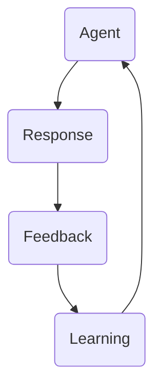
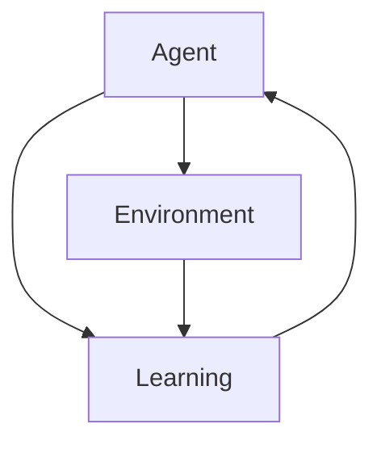

                 


# 构建AI Agent的反馈学习机制

> 关键词：AI Agent，反馈学习机制，强化学习，监督学习，系统架构，项目实战

> 摘要：  
本文详细探讨了AI Agent的反馈学习机制，从理论基础到实际应用，结合算法原理和系统架构设计，帮助读者全面理解如何构建高效、智能的AI Agent。通过实例分析和代码实现，深入剖析反馈学习的核心概念与实现技巧。

---

## 第一部分: AI Agent与反馈学习机制的背景介绍

### 1.1 反馈学习机制的核心概念

#### 1.1.1 问题背景与问题描述
AI Agent（智能体）是指能够感知环境并采取行动以实现目标的实体。与传统的被动程序不同，AI Agent具备自主决策和学习的能力，能够根据反馈不断优化自身的行为。

反馈学习机制是AI Agent的核心能力之一。它通过接收来自环境的反馈信息，调整自身的决策策略，以实现长期目标的最优达成。例如，在游戏中，AI Agent需要根据对手的反馈调整策略；在推荐系统中，AI Agent需要根据用户的反馈调整推荐内容。

#### 1.1.2 AI Agent的定义与特点
- **定义**：AI Agent是指能够感知环境、采取行动并根据反馈调整行为的智能实体。
- **特点**：
  - 自主性：能够在没有外部干预的情况下自主决策。
  - 反应性：能够根据环境反馈实时调整行为。
  - 学习性：能够通过反馈不断优化自身的决策策略。
  - 社会性：能够与其他Agent或人类交互协作。

#### 1.1.3 反馈学习机制的应用场景
反馈学习机制广泛应用于以下场景：
- **强化学习**：通过奖惩机制（反馈）优化决策策略。
- **监督学习**：通过标注数据（反馈）调整模型参数。
- **推荐系统**：根据用户反馈调整推荐内容。
- **对话系统**：根据用户反馈优化对话策略。

---

## 第二部分: 反馈学习机制的核心概念与联系

### 2.1 反馈机制的原理与数学模型

#### 2.1.1 反馈机制的原理
反馈机制的核心在于将环境对AI Agent行为的评价（反馈）传递给学习系统，以调整决策策略。例如，在强化学习中，AI Agent通过接收奖励或惩罚（反馈）来优化动作选择。

#### 2.1.2 反馈机制的数学模型
- **Q-learning算法**：
  - 状态-动作值函数：$Q(s, a)$ 表示在状态 $s$ 下采取动作 $a$ 的价值。
  - 更新公式：$$Q(s, a) = Q(s, a) + \alpha [r + \gamma \max Q(s', a') - Q(s, a)]$$
  其中，$\alpha$ 是学习率，$\gamma$ 是折扣因子，$r$ 是奖励。

- **策略迭代**：
  - 动作选择：根据当前策略 $\pi$ 选择动作 $a$。
  - 反馈更新：根据反馈信息调整策略。

### 2.2 反馈机制与AI Agent的实体关系图



---

## 第三部分: 反馈学习机制的算法原理

### 3.1 强化学习中的反馈机制

#### 3.1.1 强化学习的基本原理
- **马尔可夫决策过程**：定义了状态、动作、奖励和转移概率。
- **Q-learning算法**：
  - 状态转移：$s' = P(s, a)$
  - 奖励更新：$Q(s, a) = r + \gamma \max Q(s', a')$

#### 3.1.2 强化学习的代码实现

```python
class AI-Agent:
    def __init__(self, state_space, action_space):
        self.state_space = state_space
        self.action_space = action_space
        self.Q = defaultdict(lambda: np.zeros(len(action_space)))

    def choose_action(self, state):
        if np.random.random() < self.epsilon:
            return np.random.randint(len(self.action_space))
        else:
            return np.argmax(self.Q[state])

    def update_Q(self, state, action, reward, next_state):
        target = reward + self.gamma * np.max(self.Q[next_state])
        self.Q[state][action] = target

    def decay_epsilon(self):
        self.epsilon = max(0.01, self.epsilon * 0.99)
```

---

## 第四部分: 系统分析与架构设计方案

### 4.1 系统功能设计

#### 4.1.1 领域模型（类图）

```mermaid
classDiagram
    class Agent:
        + state: S
        + action: A
        + Q: map(S, A, R)
        - update_Q(s, a, r, s')
        - choose_action(s)
    class Environment:
        + state: S
        + reward_model: R
        - get_reward(s, a, s')
    class Learning:
        + Q: map(S, A, R)
        - update_Q(s, a, r, s')
```

#### 4.1.2 系统架构设计



---

## 第五部分: 项目实战

### 5.1 环境安装

```bash
pip install gym numpy
```

### 5.2 核心实现代码

```python
import numpy as np
from collections import defaultdict
import gym

class AI-Agent:
    def __init__(self, env):
        self.env = env
        self.Q = defaultdict(lambda: np.zeros(self.env.action_space.n))
        self.epsilon = 1.0
        self.gamma = 0.99

    def choose_action(self, state):
        if np.random.random() < self.epsilon:
            return self.env.action_space.sample()
        else:
            return np.argmax(self.Q[state])

    def update_Q(self, state, action, reward, next_state):
        target = reward + self.gamma * np.max(self.Q[next_state])
        self.Q[state][action] = target

    def decay_epsilon(self):
        self.epsilon = max(0.01, self.epsilon * 0.99)

def train(agent):
    env = gym.make('CartPole-v0')
    for episode in range(1000):
        state = env.reset()
        total_reward = 0
        while True:
            action = agent.choose_action(state)
            next_state, reward, done, _ = env.step(action)
            agent.update_Q(state, action, reward, next_state)
            total_reward += reward
            if done:
                break
            state = next_state
        agent.decay_epsilon()

if __name__ == "__main__":
    agent = AI-Agent(gym.make('CartPole-v0'))
    train(agent)
```

---

## 第六部分: 最佳实践与总结

### 6.1 最佳实践 Tips
- **反馈延迟**：尽量减少反馈的延迟，以提高学习效率。
- **奖励设计**：设计合理的奖励机制，避免误导性反馈。
- **探索与利用**：平衡探索新策略和利用已知好策略的关系。

### 6.2 小结
本文详细介绍了AI Agent的反馈学习机制，从理论到实践，结合Q-learning算法和系统架构设计，帮助读者理解如何构建高效的AI Agent。通过代码实现和案例分析，进一步巩固了反馈学习机制的核心概念与实现技巧。

### 6.3 注意事项
- 反馈机制的设计需要结合具体场景，避免一刀切。
- 在实际应用中，需要考虑环境的不确定性和动态变化。

### 6.4 拓展阅读
- 《Reinforcement Learning: Theory and Algorithms》
- 《Deep Learning for AI Agents》

---

作者：AI天才研究院/AI Genius Institute & 禅与计算机程序设计艺术 /Zen And The Art of Computer Programming

