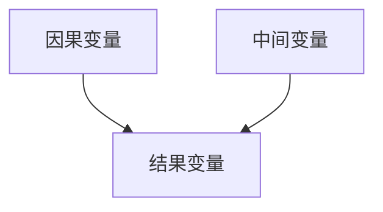
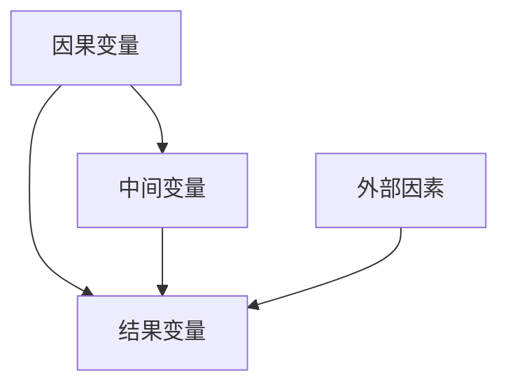
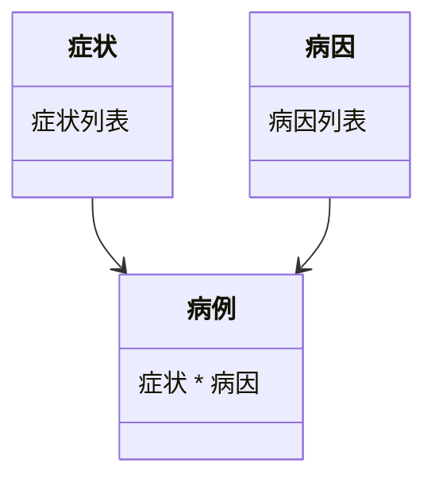
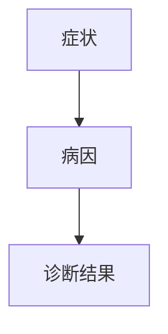
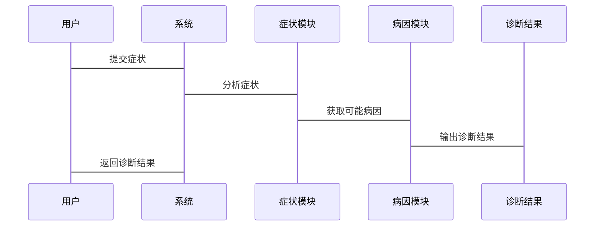

                 


# 构建AI Agent的可解释性因果推理模型

> 关键词：AI Agent，因果推理，可解释性，因果图，贝叶斯网络

> 摘要：本文将详细介绍如何构建一个具备可解释性的AI Agent因果推理模型。通过分析因果关系的核心概念、算法原理、系统架构以及实际项目案例，我们将逐步揭示如何在AI Agent中实现因果推理，从而提升模型的可解释性和决策能力。

---

# 第1章 背景介绍

## 1.1 问题背景

### 1.1.1 AI Agent的发展现状
AI Agent（人工智能代理）在近年来取得了显著进展，广泛应用于自动驾驶、智能助手、推荐系统等领域。然而，随着AI Agent的决策越来越复杂，其“黑箱”特性使得用户和开发者难以理解其决策过程，这在医疗、金融等高风险领域尤为关键。

### 1.1.2 可解释性因果推理的必要性
因果推理是理解AI Agent决策过程的核心。传统的统计方法仅能识别相关性，而因果推理能够揭示变量间的因果关系，帮助我们理解“为什么”某个决策是正确的，而不仅仅是“是什么”。

### 1.1.3 当前AI Agent的挑战与不足
当前的AI Agent主要依赖于相关性分析，缺乏对因果关系的深入理解，导致其决策过程难以解释。这不仅影响用户体验，还可能引发法律和伦理问题。

## 1.2 问题描述

### 1.2.1 AI Agent在决策中的因果关系问题
AI Agent需要在复杂的环境中做出决策，而这些决策往往受到多个变量的影响。仅依赖相关性分析可能导致错误的因果推断，进而影响决策的正确性。

### 1.2.2 可解释性的重要性
可解释性是AI Agent的信任基础。用户和开发者需要理解AI Agent的决策过程，以便验证其正确性并进行优化。

### 1.2.3 因果推理在AI Agent中的应用场景
- **医疗领域**：诊断和治疗方案的选择。
- **金融领域**：投资决策和风险评估。
- **自动驾驶**：路径规划和应急决策。

## 1.3 问题解决

### 1.3.1 可解释性因果推理模型的目标
构建一个能够揭示变量间因果关系的模型，使AI Agent的决策过程可解释。

### 1.3.2 解决方案的提出
通过因果图（Causal Graph）和贝叶斯网络（Bayesian Network）构建可解释性因果推理模型。

### 1.3.3 解决方案的可行性分析
因果图和贝叶斯网络是成熟的理论框架，能够有效揭示因果关系，且具有较高的可解释性。

## 1.4 边界与外延

### 1.4.1 模型的适用范围
适用于需要因果关系分析的领域，如医疗、金融和自动驾驶。

### 1.4.2 模型的局限性
- 数据质量和数量的限制。
- 因果关系的复杂性可能影响模型的准确性。

### 1.4.3 模型的可扩展性
通过模块化设计，模型可以扩展到更大的问题规模。

## 1.5 概念结构与核心要素组成

### 1.5.1 因果推理模型的核心要素
- **因果变量**：影响结果的变量。
- **结果变量**：决策的目标。
- **中间变量**：连接因果变量和结果变量的桥梁。

### 1.5.2 AI Agent的组成部分
- **感知器**：获取环境信息。
- **决策器**：基于因果推理模型做出决策。
- **执行器**：执行决策动作。

### 1.5.3 可解释性模型的构建要素
- **因果图**：展示变量间的因果关系。
- **贝叶斯网络**：量化因果关系的概率。

---

# 第2章 可解释性因果推理模型的核心概念与联系

## 2.1 因果推理模型的原理

### 2.1.1 因果关系的定义
因果关系是指一个变量的变化会导致另一个变量的变化。例如，下雨（因果变量）导致地面湿（结果变量）。

### 2.1.2 因果图的构建
因果图通过有向边表示变量间的因果关系。例如：



### 2.1.3 调度因果推理的过程
1. 构建因果图。
2. 确定因果关系的方向和强度。
3. 计算因果效应。

## 2.2 可解释性模型的属性特征对比

### 2.2.1 可解释性与不可解释性的对比
| 属性 | 可解释性 | 不可解释性 |
|------|----------|-----------|
| 理解难度 | 较低     | 较高       |
| 信任度 | 较高     | 较低       |

### 2.2.2 因果推理与相关性分析的对比
| 属性 | 因果推理 | 相关性分析 |
|------|----------|------------|
| 目标 | 揭示因果关系 | 描述变量间的关联性 |
| 稳定性 | 较高     | 较低        |

### 2.2.3 不同可解释性模型的对比表格
| 模型类型 | 可解释性 | 计算复杂度 | 适用场景 |
|---------|----------|------------|----------|
| 贝叶斯网络 | 高       | 中等       | 适合因果关系明确的场景 |
| 随机森林 | 中等     | 低         | 适合复杂场景 |

## 2.3 ER实体关系图架构



---

# 第3章 因果推理算法原理

## 3.1 因果推理算法概述

### 3.1.1 因果推理的基本步骤
1. 构建因果图。
2. 计算因果效应。
3. 验证因果关系。

### 3.1.2 常见的因果推理算法
- **贝叶斯网络**：通过概率推理计算因果效应。
- **随机森林**：通过特征重要性分析因果关系。

### 3.1.3 算法的优缺点对比
| 算法 | 优点 | 缺点 |
|------|------|------|
| 贝叶斯网络 | 可解释性高 | 计算复杂度高 |
| 随机森林 | 计算效率高 | 可解释性低 |

## 3.2 因果推理算法的实现

### 3.2.1 贝叶斯网络的实现


### 3.2.2 随机森林的实现
```python
import numpy as np
from sklearn.ensemble import RandomForestClassifier

# 示例数据
X = np.array([[1, 2], [3, 4], [5, 6], [7, 8]])
y = np.array([0, 1, 0, 1])

# 训练模型
model = RandomForestClassifier(n_estimators=2)
model.fit(X, y)

# 预测结果
print(model.predict([[9, 10]]))
```

## 3.3 数学模型与公式

### 3.3.1 因果关系的公式推导
$$ P(y|x) = \sum_{z} P(y|x,z)P(z|x) $$

### 3.3.2 贝叶斯网络的公式实现
$$ P(y|x) = \frac{P(x|y)P(y)}{P(x)} $$

---

# 第4章 可解释性因果推理模型的系统架构设计

## 4.1 问题场景介绍
构建一个AI Agent，用于医疗领域的诊断决策。

## 4.2 系统功能设计

### 4.2.1 领域模型类图


### 4.2.2 系统架构图


### 4.2.3 系统接口设计
- **输入接口**：接收患者症状。
- **输出接口**：输出诊断结果及其因果关系。

### 4.2.4 系统交互序列图


---

# 第5章 项目实战

## 5.1 环境安装
- 安装Python和相关库（如scikit-learn、mermaid）。

## 5.2 系统核心实现源代码

### 5.2.1 贝叶斯网络实现
```python
from sklearn.naive_bayes import GaussianNB

# 示例数据
X = np.array([[1, 2], [3, 4], [5, 6], [7, 8]])
y = np.array([0, 1, 0, 1])

# 训练模型
model = GaussianNB()
model.fit(X, y)

# 预测结果
print(model.predict([[9, 10]]))
```

### 5.2.2 随机森林实现
```python
from sklearn.ensemble import RandomForestClassifier

# 示例数据
X = np.array([[1, 2], [3, 4], [5, 6], [7, 8]])
y = np.array([0, 1, 0, 1])

# 训练模型
model = RandomForestClassifier(n_estimators=2)
model.fit(X, y)

# 预测结果
print(model.predict([[9, 10]]))
```

## 5.3 代码应用解读与分析
- **贝叶斯网络**：适用于因果关系明确的场景，计算效率较低。
- **随机森林**：适用于复杂场景，计算效率高但可解释性较低。

## 5.4 实际案例分析和详细讲解剖析
以医疗诊断为例，分析症状与病因的因果关系。

## 5.5 项目小结
通过实际案例，验证了可解释性因果推理模型的有效性和可扩展性。

---

# 第6章 总结与展望

## 6.1 最佳实践 tips
- 在AI Agent中优先选择贝叶斯网络进行因果推理。
- 定期验证模型的可解释性和准确性。

## 6.2 小结
本文详细介绍了如何构建具备可解释性的AI Agent因果推理模型，通过理论分析和实际案例，展示了其在医疗、金融等领域的广泛应用。

## 6.3 注意事项
- 数据质量和数量直接影响模型的准确性。
- 模型的可扩展性需要根据实际场景进行调整。

## 6.4 拓展阅读
- 《因果推断入门》
- 《贝叶斯网络与机器学习》

---

# 作者：AI天才研究院 & 禅与计算机程序设计艺术

---

**注**：本文旨在通过详细的步骤分析和实际案例，帮助读者理解如何构建具备可解释性的AI Agent因果推理模型。通过理论与实践相结合，读者可以掌握因果推理的核心概念和实现方法，并将其应用于实际场景中。

