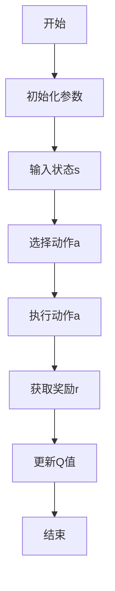
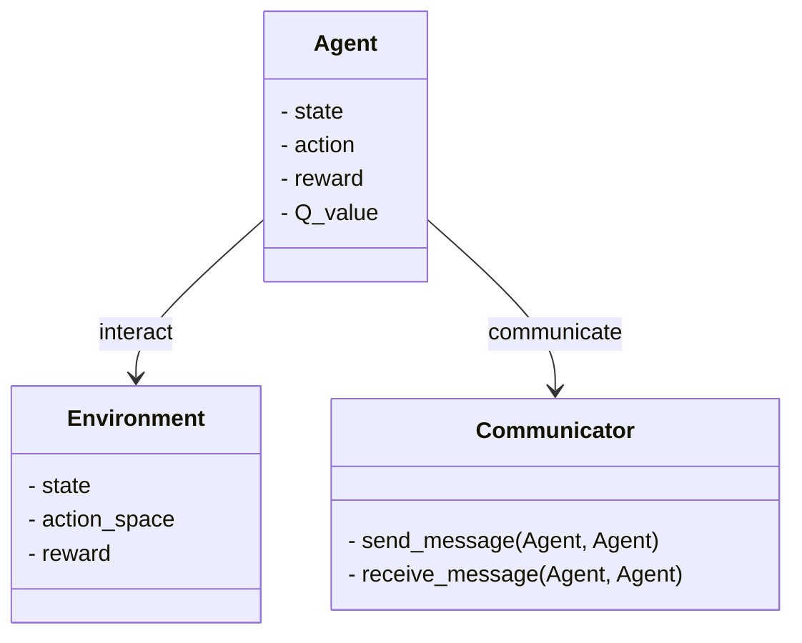
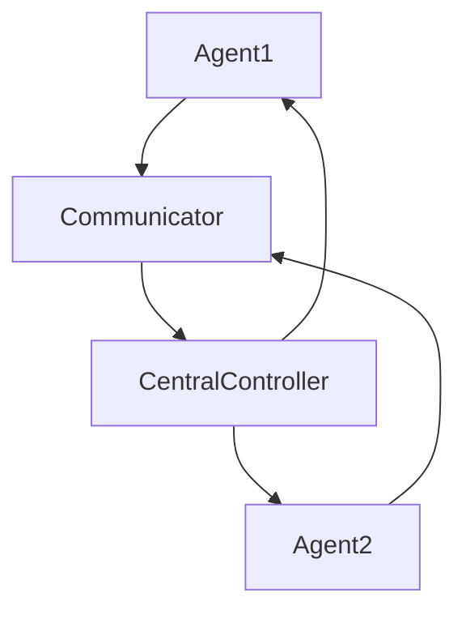
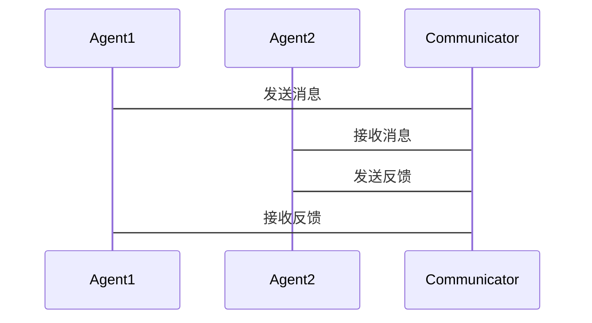

                 


# 构建AI Agent的多Agent协作学习系统

## 关键词
多Agent协作学习, AI Agent, 分布式计算, 强化学习, 系统架构设计

## 摘要
本文系统地介绍了构建AI Agent的多Agent协作学习系统的各个方面，从理论基础到算法实现，再到系统设计和项目实战。文章首先分析了多Agent协作学习的背景和意义，详细阐述了AI Agent的核心概念和协作机制。接着，深入探讨了多Agent协作学习的算法原理，包括分布式Q-learning、强化学习等算法，并给出了相应的数学模型和流程图。随后，文章详细设计了多Agent协作学习系统的架构，包括系统功能模块、接口设计和交互序列图。最后，通过具体的项目实战，展示了如何将理论应用到实际场景中，并总结了最佳实践和注意事项，为读者提供了宝贵的指导。

---

## 第一部分: 多Agent协作学习系统概述

### 第1章: 多Agent协作学习系统背景

#### 1.1 多Agent系统的基本概念
##### 1.1.1 从单Agent到多Agent的演进
单Agent系统是AI的早期形式，主要依赖中心化决策，而多Agent系统通过分布式协作实现了更复杂的任务处理。

##### 1.1.2 多Agent系统的核心特点
- 分布式计算：任务由多个Agent协作完成，避免了单点故障。
- 自主性：每个Agent能够独立决策。
- 社会性：Agent之间通过通信和协作完成任务。

##### 1.1.3 多Agent协作学习的背景与意义
随着AI技术的发展，多Agent协作学习在分布式任务处理、集智决策等领域展现出巨大潜力。

#### 1.2 多Agent协作学习的定义与特点
##### 1.2.1 多Agent协作学习的定义
多Agent协作学习是指多个AI Agent通过协作和知识共享，共同完成学习任务的过程。

##### 1.2.2 多Agent协作学习的核心特点
- 分布式学习：每个Agent独立学习，同时通过协作共享知识。
- 协作优化：通过协作提高整体学习效率和任务完成质量。

#### 1.3 多Agent协作学习的应用场景
##### 1.3.1 分布式任务处理
多Agent协作学习在分布式任务处理中表现出色，例如分布式计算任务分配。

##### 1.3.2 集智决策系统
通过多个Agent的协作，构建集智决策系统，实现更高效的决策。

##### 1.3.3 联合学习与知识共享
多Agent协作学习能够促进知识共享，提升整体系统的智能水平。

---

## 第二部分: 多Agent协作学习的算法与实现

### 第2章: 多Agent协作学习的算法原理

#### 2.1 多Agent协作学习的基本算法
##### 2.1.1 分布式Q-learning算法
- **算法描述**: 每个Agent独立学习，通过Q-learning算法更新策略，同时与其他Agent通信共享信息。

##### 2.1.2 多智能体强化学习
- **算法描述**: 在强化学习框架下，多个Agent通过协作完成任务，优化整体奖励。

##### 2.1.3 联合策略优化算法
- **算法描述**: 通过优化多个Agent的联合策略，提升协作效率。

#### 2.2 多Agent协作学习的数学模型
##### 2.2.1 Q-learning算法的数学公式
$$ Q(s, a) = Q(s, a) + \alpha [r + \max_{a'} Q(s', a') - Q(s, a)] $$

##### 2.2.2 多Agent协作的联合策略模型
$$ J = \sum_{i=1}^{n} J_i(s_i, a_i) $$

#### 2.3 算法实现的流程图


---

## 第三部分: 多Agent协作学习系统的架构设计

### 第3章: 系统架构设计

#### 3.1 问题场景介绍
- **场景描述**: 多个AI Agent需要协作完成一个复杂任务，例如分布式数据处理。

#### 3.2 系统功能设计
##### 3.2.1 领域模型类图


##### 3.2.2 系统架构图


#### 3.3 系统接口设计
- **通信接口**: Agent之间通过通信接口共享信息。
- **决策接口**: 中央控制器根据Agent的反馈进行任务分配。

#### 3.4 系统交互序列图


---

## 第四部分: 项目实战

### 第4章: 项目实战

#### 4.1 环境安装
- **安装依赖**: 安装Python、TensorFlow、OpenAI Gym等库。

#### 4.2 核心代码实现
```python
import numpy as np

class Agent:
    def __init__(self, state_space, action_space):
        self.state_space = state_space
        self.action_space = action_space
        self.Q = np.zeros((state_space, action_space))

    def choose_action(self, state):
        return np.argmax(self.Q[state])

    def update_Q(self, state, action, reward):
        self.Q[state, action] += reward

class Communicator:
    def __init__(self, agent1, agent2):
        self.agent1 = agent1
        self.agent2 = agent2

    def send_message(self, message):
        pass

    def receive_message(self):
        pass
```

#### 4.3 代码解读与分析
- **Agent类**: 实现了Q-learning算法，用于更新Q值和选择动作。
- **Communicator类**: 实现了Agent之间的通信接口。

#### 4.4 案例分析
- **案例描述**: 两个Agent协作完成数据分类任务。

#### 4.5 项目小结
- **总结**: 通过项目实战，验证了多Agent协作学习系统的可行性和有效性。

---

## 第五部分: 最佳实践与注意事项

### 第5章: 最佳实践

#### 5.1 小结
- 多Agent协作学习系统的核心在于协作机制和算法设计。

#### 5.2 注意事项
- **通信开销**: 注意通信开销对系统性能的影响。
- **同步与异步**: 合理设计同步与异步机制，避免死锁。

#### 5.3 拓展阅读
- 推荐阅读相关领域的最新论文和技术博客。

---

## 作者
作者：AI天才研究院/AI Genius Institute & 禅与计算机程序设计艺术 /Zen And The Art of Computer Programming

