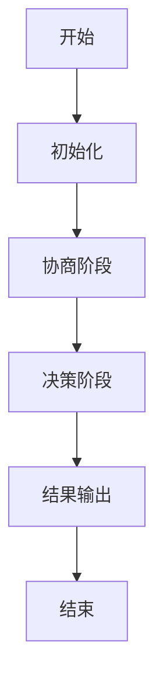
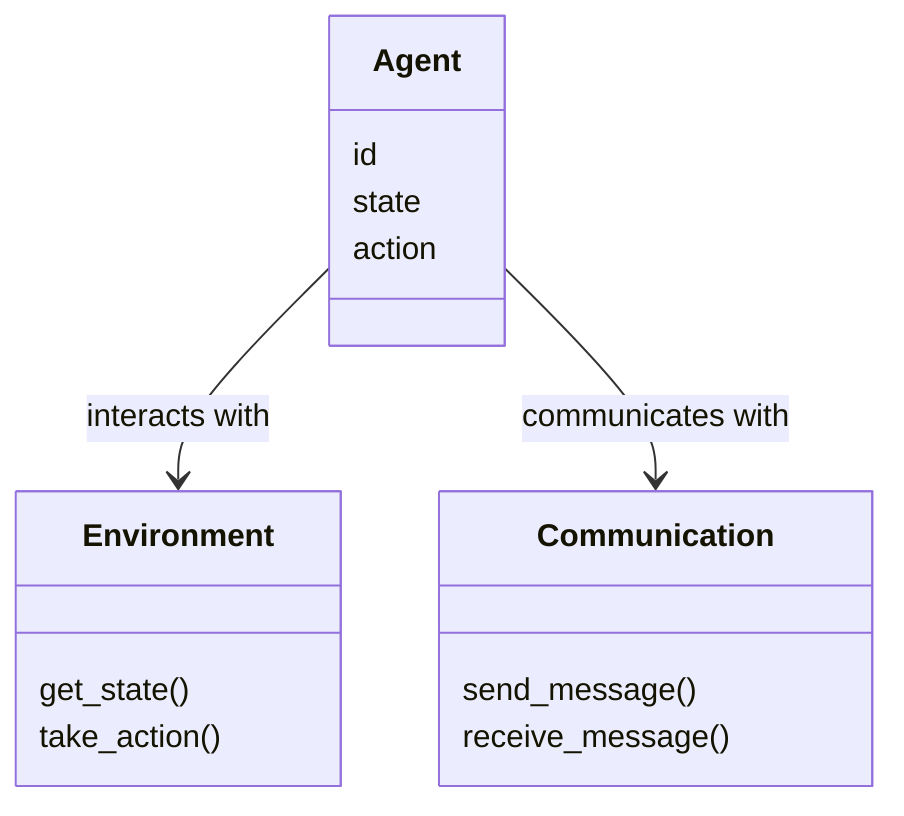
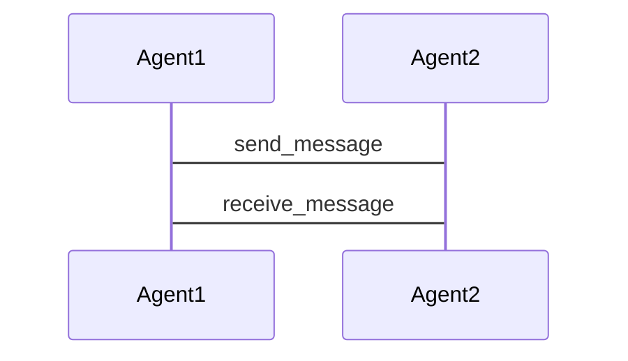
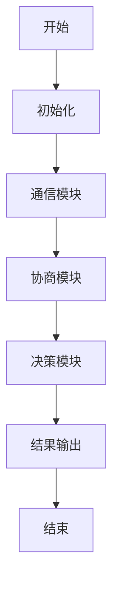

                 


# 构建AI Agent的多Agent协商与决策系统

> 关键词：AI Agent，多Agent系统，协商与决策，系统设计，数学模型

> 摘要：本文详细探讨了构建AI Agent的多Agent协商与决策系统的各个方面。从基础概念到算法原理，再到系统架构设计和项目实战，全面解析了多Agent系统的核心机制和实现方法。通过丰富的图表和数学公式，结合实际案例，深入分析了系统设计中的关键问题，并给出了可行的解决方案和最佳实践。

---

## 第一部分: AI Agent与多Agent系统基础

### 第1章: AI Agent的基本概念与背景

#### 1.1 问题背景

在人工智能领域，单Agent系统已经取得了显著的成果，例如智能音箱、推荐系统等。然而，随着应用场景的复杂化，单Agent系统在处理多个目标、多个参与者的问题时显得力不从心。例如，在自动驾驶中，一辆车需要与其他车辆、行人以及交通规则进行实时交互，这需要多个Agent协同工作。

多Agent系统的优势在于能够处理复杂的分布式问题。通过多个Agent协同工作，系统能够更好地适应动态变化的环境，并提高整体的决策效率。当前，AI Agent技术正在快速发展，多Agent系统在智能交通、智能制造、智能电网等领域得到了广泛应用。

#### 1.2 问题描述

在多Agent系统中，核心问题是多个Agent如何进行有效的协商与决策。具体来说，我们需要解决以下问题：

1. **协商机制**：多个Agent如何通过通信达成一致。
2. **决策过程**：在协商的基础上，如何做出最优决策。
3. **系统架构**：如何设计高效的系统架构以支持多Agent协作。

多Agent系统的核心要素包括Agent、通信机制、协商算法和决策模型。这些要素共同构成了一个多Agent协商与决策系统的框架。

#### 1.3 问题解决

AI Agent的核心概念包括智能体模型、通信机制和决策算法。多Agent系统中的角色与职责分配需要明确每个Agent的属性和功能。协商与决策的基本原则包括一致性、最优性和效率性。

通过定义AI Agent和多Agent系统的核心概念，我们可以更好地理解它们的联系和区别。AI Agent具有智能性、反应性和社会性，而多Agent系统则强调分布性、协作性和动态性。

#### 1.4 概念结构与核心要素

AI Agent的定义可以分为三类：简单反射型、基于模型的反射型和目标驱动型。多Agent系统的组成结构包括Agent、通信渠道和决策机制。核心要素包括Agent的智能性、通信的效率性和决策的正确性。

### 第2章: 多Agent系统的核心概念与联系

#### 2.1 核心概念原理

AI Agent的智能体模型包括感知、推理和行动三个部分。多Agent系统中的通信机制需要支持Agent之间的信息交换。协商与决策的算法原理包括基于协商、博弈论和分布式计算的方法。

通过对比单Agent和多Agent系统的性能特征，我们可以看到多Agent系统在处理复杂问题时具有更高的灵活性和适应性。多Agent系统中的角色属性包括任务分配、信息共享和协作决策。

#### 2.2 概念属性特征对比

以下是单Agent与多Agent系统的对比：

| 特性       | 单Agent系统             | 多Agent系统             |
|------------|--------------------------|--------------------------|
| 系统结构     | 单一智能体               | 多个智能体               |
| 任务处理     | 独立处理任务             | 协作处理任务             |
| 通信机制     | 内部处理                 | 外部通信                 |
| 并行性       | 串行处理                 | 并行处理                 |

多Agent系统的ER实体关系图如下：

```mermaid
er
    actor: 用户
    agent: AI Agent
    communication: 通信渠道
    decision: 决策结果
    role: 角色
    action: 行动
    constraint: 约束条件
    relationship: 关系
```

## 第3章: 多Agent协商与决策算法原理

### 3.1 协商与决策算法概述

协商与决策算法包括基于协商、博弈论和分布式计算的方法。基于协商的决策算法通过Agent之间的通信达成一致。基于博弈论的决策算法通过模拟竞争环境做出决策。基于分布式计算的决策算法通过分解任务提高效率。

协商与决策的算法流程如下：

1. 初始化：设置初始状态。
2. 协商阶段：Agent之间进行通信和协商。
3. 决策阶段：基于协商结果做出决策。
4. 输出结果：返回最终决策结果。

### 3.2 算法流程图

协商与决策的流程图如下：



### 3.3 Python核心代码实现

以下是协商与决策算法的Python代码实现：

```python
def agent_decision(agent, state):
    # 协商阶段
    for other_agent in agents:
        if other_agent != agent:
            negotiate(agent, other_agent, state)
    # 决策阶段
    return decision(agent, state)
```

## 第4章: 数学模型与公式

### 4.1 协商模型

谈判问题的数学模型如下：

$$ V = \max_{a} \sum_{i=1}^{n} w_i x_i $$

其中，$V$ 是价值函数，$w_i$ 是权重，$x_i$ 是决策变量。约束条件为：

$$ \text{约束条件} = \{ x | x \in X, \forall i, x_i \leq c_i \} $$

### 4.2 决策模型

基于Q-learning的决策模型如下：

$$ Q(s, a) = Q(s, a) + \alpha [r + \gamma \max Q(s', a') - Q(s, a)] $$

其中，$Q(s, a)$ 是Q值，$\alpha$ 是学习率，$r$ 是奖励，$\gamma$ 是折扣因子，$s'$ 是下一个状态，$a'$ 是下一个动作。

## 第5章: 系统分析与架构设计方案

### 5.1 系统架构设计

系统架构设计包括领域模型、架构图、接口设计和交互图。领域模型如下：



系统架构图如下：

```mermaid
container 容器1 {
    组件1
    组件2
    组件3
}
```

接口设计包括Agent与环境的接口、Agent与通信渠道的接口。交互图如下：



## 第6章: 项目实战

### 6.1 项目介绍

项目目标是实现一个多Agent协商与决策系统。项目背景包括智能交通和智能制造。项目需求包括Agent通信、协商和决策功能。

### 6.2 系统功能设计

系统功能模块包括通信模块、协商模块和决策模块。功能流程图如下：



### 6.3 系统核心实现

以下是核心代码实现：

```python
class Agent:
    def __init__(self, id):
        self.id = id
        self.state = None
        self.action = None

    def negotiate(self, other_agent, state):
        # 具体协商逻辑
        pass

    def decide(self, state):
        # 具体决策逻辑
        pass
```

### 6.4 实际案例分析

以智能交通为例，多个Agent协同工作，实时协商和决策交通信号灯的状态。通过实际运行，系统能够提高交通效率。

## 第7章: 最佳实践与总结

### 7.1 最佳实践

在设计多Agent系统时，需要考虑通信效率、决策算法的正确性以及系统的可扩展性。可以通过以下方式提高系统的性能：

1. 使用高效的通信协议。
2. 优化协商算法。
3. 增强系统的容错能力。

### 7.2 小结

本文详细探讨了构建AI Agent的多Agent协商与决策系统的各个方面，包括基础概念、算法原理、系统架构设计和项目实战。通过实际案例分析，我们展示了系统的实现过程和应用价值。

### 7.3 注意事项

在实际应用中，需要注意系统的实时性和安全性。同时，需要定期更新系统以适应环境的变化。

### 7.4 拓展阅读

推荐以下资源以进一步学习：

1. 《Multi-Agent Systems: Algorithmic, Complexity Theoretic, and Economic Theoretic Issues》
2. 《An Introduction to Multi-Agent Systems》
3. 《Multi-Agent Machine Learning: A Rough Guide》

## 作者

作者：AI天才研究院/AI Genius Institute & 禅与计算机程序设计艺术 /Zen And The Art of Computer Programming

---

通过以上思考过程，我们逐步完成了从问题背景到系统设计的详细分析，并通过实际案例展示了多Agent协商与决策系统的实现过程。希望这篇文章能够为读者提供有价值的见解和实践指导。

