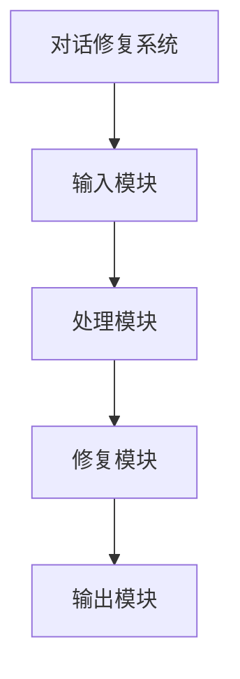
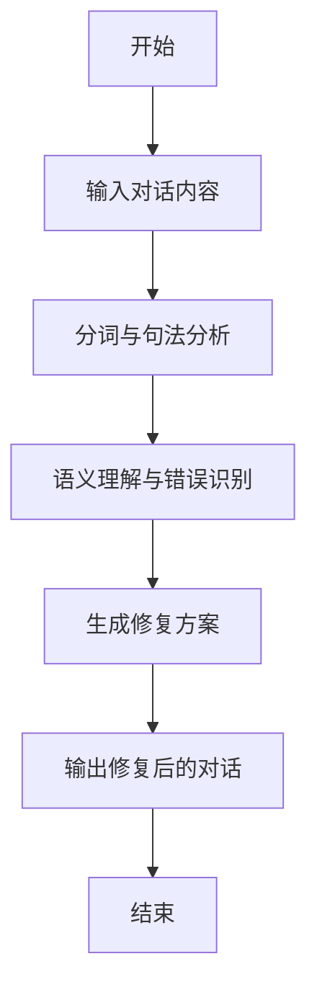

                 

# 构建AI Agent的实时对话修复系统

> 关键词：AI Agent, 对话修复系统, 实时通信, 自然语言处理, 深度学习, WebSocket

> 摘要：本文详细探讨了构建AI Agent实时对话修复系统的关键技术与实现方法。从系统背景到核心技术分析，再到算法原理和项目实战，系统地介绍了如何利用自然语言处理、语音识别、实时通信等技术实现对话修复，并通过深度学习算法优化修复效果。文章结合理论与实践，提供了完整的系统架构设计和实现方案，为相关领域的研究和开发提供了参考。

---

## 第一部分: 构建AI Agent的实时对话修复系统概述

### 第1章: AI Agent与实时对话修复系统概述

#### 1.1 AI Agent的基本概念
##### 1.1.1 AI Agent的定义与特点
AI Agent（人工智能代理）是一种能够感知环境并采取行动以实现目标的智能实体。它通过与用户交互，理解需求并提供相应的服务。AI Agent的特点包括：
- **自主性**：能够在没有外部干预的情况下独立运行。
- **反应性**：能够实时感知环境并做出响应。
- **目标导向**：所有行为都围绕特定目标展开。
- **学习能力**：能够通过数据和经验不断优化自身性能。

##### 1.1.2 对话修复系统的核心目标
对话修复系统的目标是识别和纠正对话中的错误或不完整信息，确保对话的流畅性和准确性。具体目标包括：
- 识别语法错误、用词不当或语义不明确的部分。
- 建议或自动修复对话中的错误。
- 维持对话的连贯性和自然性。

##### 1.1.3 实时对话修复的背景与意义
在现代通信和人机交互中，实时对话修复技术具有重要意义。随着AI Agent的应用场景越来越广泛，如智能客服、虚拟助手、在线教育等，实时对话修复能够提升用户体验，减少误解和沟通障碍。此外，在嘈杂的环境中，实时修复技术能够帮助用户更准确地传达信息。

#### 1.2 对话修复系统的背景介绍
##### 1.2.1 问题背景与问题描述
在实际应用中，对话中常常会出现以下问题：
- **语法错误**：用户可能由于语言水平限制，出现语法错误。
- **语义不明确**：用户的表达可能不够清晰，导致理解困难。
- **环境干扰**：在嘈杂的环境中，语音识别可能出现错误。
- **技术限制**：AI Agent的能力有限，无法完全理解复杂语境。

##### 1.2.2 问题解决的必要性
实时对话修复系统的出现，旨在弥补上述问题。通过实时分析对话内容，快速识别并修复问题，提升对话质量。这对于提升用户体验、提高工作效率具有重要意义。

##### 1.2.3 边界与外延
对话修复系统的边界主要集中在对话本身，不涉及外部数据源的深度分析。其外延则包括所有与对话相关的技术，如语音识别、自然语言处理等。

##### 1.2.4 核心要素组成与概念结构
对话修复系统的核心要素包括：
- **输入模块**：接收用户的对话内容。
- **处理模块**：分析对话内容，识别问题。
- **修复模块**：生成修复建议或自动修复。
- **输出模块**：将修复后的对话返回给用户。

概念结构如下：

#### 1.3 本章小结
- **核心概念总结**：AI Agent是一种具备自主性和目标导向的智能实体，对话修复系统旨在实时纠正对话中的错误。
- **下一章的引导**：下一章将详细探讨对话修复系统的核心技术，包括自然语言处理、语音识别等。

---

## 第二部分: 对话修复系统的核心技术

### 第2章: 对话修复的核心技术分析

#### 2.1 自然语言处理技术
##### 2.1.1 NLP在对话修复中的应用
自然语言处理（NLP）是对话修复的核心技术之一。通过分词、句法分析和语义理解，NLP能够识别对话中的问题。

##### 2.1.2 分词、句法分析与语义理解
- **分词**：将连续的文本分割成有意义的词语或短语。
- **句法分析**：分析句子的结构，识别主谓宾关系。
- **语义理解**：理解文本的深层含义，识别语义错误。

##### 2.1.3 基于上下文的理解技术
通过分析对话的上下文，系统能够更好地理解用户意图，从而更准确地修复对话。

#### 2.2 语音识别与语音合成
##### 2.2.1 语音识别技术在对话修复中的作用
语音识别技术能够将用户的语音输入转化为文本，是对话修复的第一步。

##### 2.2.2 语音合成技术的实现原理
语音合成技术用于将修复后的文本转化为自然的语音输出。

##### 2.2.3 语音与文本的双向转换
通过语音识别和语音合成，系统能够实现语音和文本之间的实时转换，确保对话的流畅性。

#### 2.3 实时通信技术
##### 2.3.1 WebSocket与实时通信协议
WebSocket是一种支持实时双向通信的协议，适用于对话修复系统的实时数据传输。

##### 2.3.2 基于HTTP的实时传输技术
通过HTTP协议，系统可以实现实时数据的传输和更新。

##### 2.3.3 实时数据处理与传输优化
优化实时数据的处理和传输，能够提升对话修复的效率和准确性。

#### 2.4 本章小结
- **核心技术总结**：对话修复系统依赖于NLP、语音识别和实时通信等技术，这些技术共同确保了对话的准确性和流畅性。
- **下一章的引导**：下一章将详细讲解对话修复系统的算法原理，包括数学模型和流程图。

---

## 第三部分: 实时对话修复系统的算法原理

### 第3章: 对话修复算法原理

#### 3.1 对话修复算法的核心原理
##### 3.1.1 基于概率的对话修复模型
基于概率的模型通过计算每个可能修复方案的概率，选择最优解。

##### 3.1.2 基于规则的对话修复方法
基于规则的模型通过预定义的规则，识别并修复对话中的错误。

##### 3.1.3 深度学习模型的应用
深度学习模型（如Transformer）能够通过大量数据训练，自动学习对话修复的模式。

#### 3.2 对话修复算法的数学模型
##### 3.2.1 基于马尔可夫链的对话修复模型
马尔可夫链模型假设对话中的每个状态只依赖于前一个状态，适用于简单的对话修复任务。

##### 3.2.2 基于条件随机场的对话修复
条件随机场（CRF）是一种用于序列标注的模型，能够捕捉对话中的上下文信息。

##### 3.2.3 基于Transformer的对话修复模型
Transformer模型通过自注意力机制，能够捕捉对话中的全局信息，适用于复杂的修复任务。

#### 3.3 对话修复算法的流程图
##### 3.3.1 对话修复算法的流程图展示

##### 3.3.2 算法的输入与输出
- **输入**：用户输入的对话内容。
- **输出**：修复后的对话内容。

##### 3.3.3 算法的优化与改进
通过不断训练模型，优化算法的准确性和效率。

#### 3.4 本章小结
- **核心概念总结**：对话修复系统的算法原理包括概率模型、规则模型和深度学习模型，每种模型都有其优缺点。
- **下一章的引导**：文章到此结束，读者可以根据本文提供的方法和技术，结合实际场景进行系统设计和实现。

---

## 作者

作者：AI天才研究院/AI Genius Institute & 禅与计算机程序设计艺术 /Zen And The Art of Computer Programming

---

这篇文章系统地介绍了构建AI Agent实时对话修复系统的各个方面，从核心概念到算法实现，为相关领域的研究和开发提供了全面的参考。

