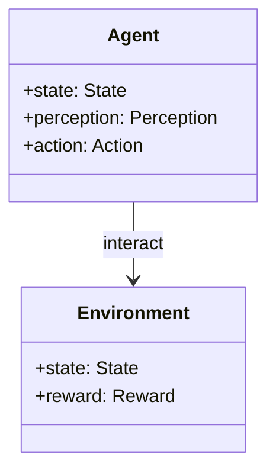
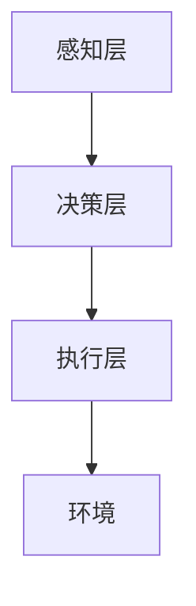

                 

# 构建AI Agent的开源工具与框架

## 关键词
AI Agent, 开源工具, 框架, 强化学习, 自然语言处理, 多智能体协作

## 摘要
本文深入探讨构建AI Agent所需的开源工具与框架，涵盖从基础概念到实际应用的全过程。通过分析主流框架的原理、系统架构设计和项目实战，读者将掌握构建高效AI Agent的方法与技巧，同时了解未来的发展趋势。

---

# 第1章 AI Agent 的背景与概念

## 1.1 AI Agent 的基本概念

### 1.1.1 什么是AI Agent
- AI Agent的定义与特点
- AI Agent的核心目标：感知环境、自主决策、执行任务
- AI Agent的应用场景：自动驾驶、智能助手、机器人控制等

### 1.1.2 AI Agent 的核心特点
- 智能性：基于环境反馈做出决策
- 自主性：无需外部干预自主运行
- 社会性：与其他Agent或人类进行协作

### 1.1.3 AI Agent 的应用场景
- 智能助手（如Siri、Alexa）
- 自动驾驶（如特斯拉）
- 游戏AI（如AlphaGo）

## 1.2 AI Agent 的分类与层次结构

### 1.2.1 基于智能水平的分类
- 简单反射式Agent：基于当前感知直接反应
- 基于模型的反射式Agent：使用内部模型进行推理
- 目标驱动式Agent：基于目标进行规划与执行
- 深度驱动式Agent：结合深度学习进行复杂决策

### 1.2.2 基于功能的分类
- 感知型Agent：处理环境中的感知数据
- 决策型Agent：制定决策策略
- 执行型Agent：执行具体动作

### 1.2.3 层次化结构模型
- 分层结构：感知层、决策层、执行层
- 功能模块：传感器接口、决策引擎、执行器接口

## 1.3 AI Agent 的核心要素与概念结构

### 1.3.1 核心概念属性对比表
| 概念 | 描述 | 示例 |
|------|------|------|
| 状态 (State) | 当前环境的感知 | 传感器数据 |
| 行为 (Action) | Agent的执行动作 | 移动、抓取 |
| 奖励 (Reward) | 行为的结果反馈 | 分数增加 |

### 1.3.2 实体关系图（ER图）

---

# 第2章 开源工具与框架的原理

## 2.1 强化学习框架的核心原理

### 2.1.1 强化学习的基本原理
- 环境与Agent的交互：通过动作获得奖励
- 状态-动作-奖励模型：$S, A, R$

### 2.1.2 Q-learning算法的数学模型
- Q-learning公式：$$ Q(s, a) = r + \gamma \max_{a'} Q(s', a') $$
- 探索与利用策略：$\epsilon$-贪心算法

### 2.1.3 深度Q网络的结构
- 网络结构：输入层（状态）→ 隐藏层 → 输出层（动作值）
- 优势：处理高维状态空间

## 2.2 自然语言处理框架的核心原理

### 2.2.1 Transformer模型的结构
- 基本组件：编码器和解码器
- 自注意力机制：$$ \text{Attention}(Q, K, V) = \text{softmax}(\frac{QK^T}{\sqrt{d_k}})V $$

### 2.2.2 注意力机制的应用
- 用于理解上下文：帮助Agent理解对话历史

### 2.2.3 BERT模型的应用
- 预训练语言模型：用于自然语言理解任务

## 2.3 多智能体协作框架的核心原理

### 2.3.1 多智能体系统的基本结构
- 多智能体协作：多个Agent协同完成任务

### 2.3.2 联合动作策略的数学模型
- 联合策略：$$ P(a_i|s_i) = \prod_{i=1}^n \pi_i(a_i|s_i) $$

---

# 第3章 系统分析与架构设计

## 3.1 系统功能设计

### 3.1.1 领域模型设计（Mermaid 类图）

### 3.1.2 功能模块划分
- 感知模块：处理环境数据
- 决策模块：制定行动计划
- 执行模块：执行具体动作

## 3.2 系统架构设计

### 3.2.1 分层架构（Mermaid 架构图）

### 3.2.2 组件交互关系
- 感知层与环境的交互：获取感知数据
- 决策层与感知层的交互：基于数据制定策略
- 执行层与决策层的交互：执行决策动作

---

# 第4章 项目实战

## 4.1 环境安装与配置

### 4.1.1 安装Python与依赖库
- 安装Python：使用anaconda或虚拟环境
- 安装库：numpy、pandas、tensorflow、pytorch等

### 4.1.2 安装AI框架：TensorFlow/PyTorch
- TensorFlow安装：`pip install tensorflow`
- PyTorch安装：`pip install torch`

## 4.2 系统核心实现

### 4.2.1 强化学习Agent的实现
- 环境接口：编写 Gym 环境
- 网络结构：定义神经网络模型
- 训练过程：实现训练循环

### 4.2.2 自然语言处理模块的实现
- 数据预处理：文本清洗与分词
- 模型训练：训练语言模型
- 接口调用：与Agent交互

## 4.3 项目小结

### 4.3.1 项目实现的关键点
- 框架选择：TensorFlow vs PyTorch
- 环境设计：可复用性与扩展性
- 训练策略：探索与利用平衡

### 4.3.2 项目经验总结
- 代码结构的重要性
- 调参与优化的必要性
- 模型评估与改进

---

# 第5章 总结与展望

## 5.1 总结
- AI Agent的核心概念
- 开源工具与框架的作用
- 系统设计的关键点

## 5.2 未来展望
- 多模态Agent的发展
- 自适应学习的提升
- 人机协作的深化

## 5.3 最佳实践 tips
- 选择合适的框架
- 注重系统架构设计
- 持续优化与迭代

## 5.4 小结
- AI Agent的构建需要综合运用多种技术
- 开源工具的选择与应用是关键
- 持续学习与实践是掌握技术的核心

## 5.5 注意事项
- 避免过度复杂的架构
- 注重代码的可读性与维护性
- 定期进行性能评估与优化

## 5.6 拓展阅读
- 推荐书籍：《深度学习》
- 推荐博客：知名技术博客链接
- 推荐课程：在线课程资源

---

# 作者

作者：AI天才研究院/AI Genius Institute & 禅与计算机程序设计艺术 /Zen And The Art of Computer Programming

---

本文详细介绍了构建AI Agent的开源工具与框架，从基础概念到实际应用，为读者提供了全面的技术指导。

